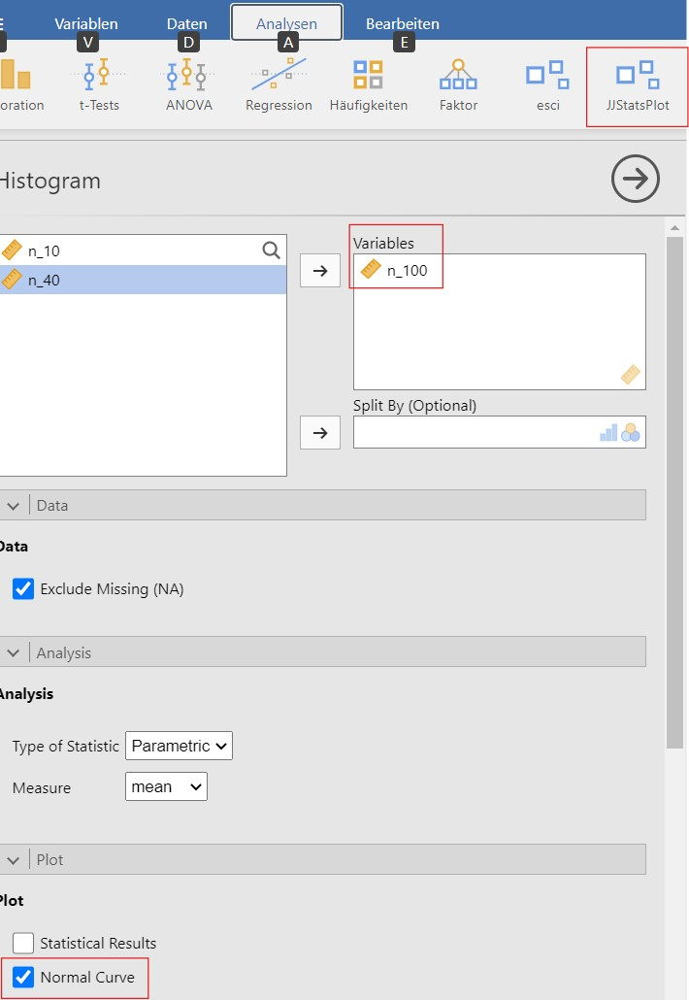
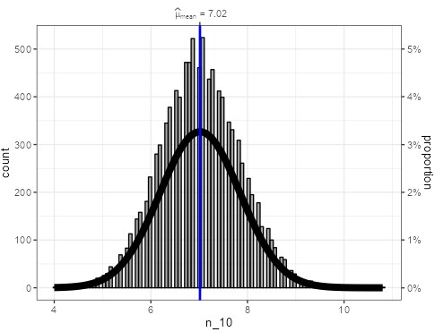
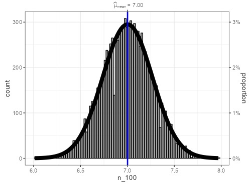
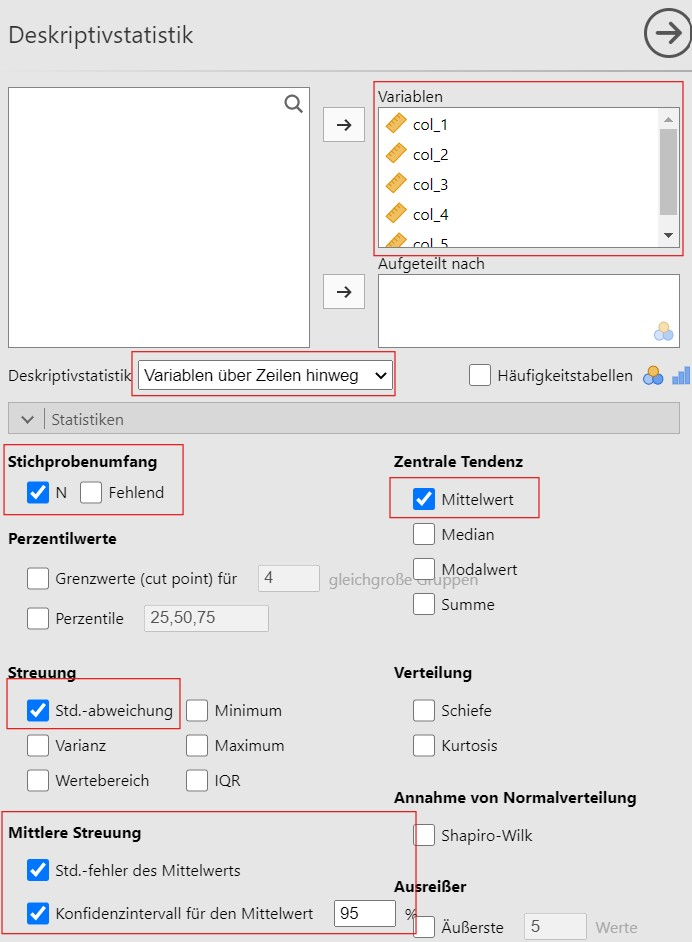

# Vorwort {-#vorwort}

Dieses Buch ist im Rahmen meiner Lehrtätigkeit an der FHNW entstanden und frei verfügbar.

```{r load_packages, include=FALSE}
knitr::opts_chunk$set(echo = FALSE)
library(gridExtra)
source('src/r/bag_sampling.R')
knitr::write_bib(c(
  .packages(), 'bookdown', 'knitr', 'rmarkdown', 'jmv'
), 'packages.bib')

combine_words <- function(x){
  knitr::combine_words(x, and = " und ", oxford_comma = FALSE)
}
```

<!--chapter:end:index.Rmd-->

# Einleitung {#einleitung}

## Worum geht es?

## Inhaltlicher Aufbau {#inhaltlicher-aufbau}

Dieses Buch umfasst die untenstehenden Inhalte. Die Inhalte wurden hier nach Zwecken sortiert angeordnet:

Stichprobe beschreiben (__deskriptive Statistik__):

-	Arithmetisches Mittel
-	Median
-	Quantile
-	Anteil
-	Odds Ratio
-	Relatives Risiko

Population beschreiben (__Wahrscheinlichkeitslehre__):

-	Zufallsvariable
-	Erwartungswert
-	Standardabweichung
-	Varianz
-	Wahrscheinlichkeitsdichte
-	Wahrscheinlichkeitsverteilung
-	Verteilungen

Populationsparameter aus Stichproben schätzen (__Konfidenzintervalle__ + Stichprobengrösse):

-	Mittelwert
-	Standardabweichung
-	Anteil
-	Berichten
-	Darstellen


Aussagen auf die Population aufgrund von Stichproben machen (Test-Theorie):

-	Effektstärke
-	Berichten
-	T-Test (1 Stichprobe)
-	T-Test (2 Stichproben), Welch-Test
-	Welch Test
-	U-Test
-	Korrelation absichern gegen 0
-	Vierfelder/Mehrfeldertest

Zusammenhänge beschreiben (Zusammenhangsmasse):

-	Pearsons r
-	Spearmans rho
-	Vierfelderkorrelation / Phi
-	Punktbiseriale Korrelation
-	Kontingenzkoeffizient
-	Cramérs V

Die Inhalte nach Zweck zu gruppieren ist eine Option, die andere ist die Verfahren der Skalierung der Variablen folgend aufzubauen. Bei dieser Gruppierung ist der Zweck nicht direkt ersichtlich, dafür ist einfacher zu begreifen welches Verfahren für welche Ausgangslage geeignet ist. Diese Gruppierung wurde für die Präsentation der Inhalte in diesem Buch gewählt.

## Wie soll ich dieses Buch lesen? {#buch-lesen}

Dieses Buch enthält zu jedem Thema eine kurze Beschreibung der Theorie, Beispiele und Übungen. Das selbstständige Lösen der Übungen ist unerlässlich für das Verständnis und die Emanzipation im korrekten Umgang mit Daten. Ohne Übungen fehlt die Auseinandersetzung mit dem Unterrichtsstoff und ohne diese fällt es den allermeisten schwer sogar einfachste Zusammenhänge zu begreifen. Es wird deshalb empfohlen, dass die Übungen zum jeweiligen Thema zeitnah zur Theorie gelöst werden. Damit überprüft werden kann, ob die Übungen richtig gelöst wurden, ist zu jeder Übung eine kurze Lösung hinterlegt. Wer beim ersten selbstständigen Versuch der Übungslösung scheitert - was garantiert den meisten Lesenden hier ein oder mehrmals passieren wird -, kann die Übung mit Hilfe der Lösung lösen und zu einem späteren Zeitpunkt die Übung selbstständig nochmal machen ohne Lösung. Für die Statistik ist es also *nicht* genug den Stoff einmal auswendig zu lernen, Übung ist unerlässlich.

## Formeln {#formeln}

Die Statistik bedient sich der universellen Sprache der Formeln. Es ist deshalb unerlässlich einige Formeln zu verstehen. Das Verständnis von Formeln ist für ungeübte Lesende verwirrend und schwierig. Deshalb wird dieses Verständnis in diesem Buch nach und nach aufgebaut. Dazu werden Teilformeln isoliert und erklärt und die Einflüsse der verschiedenen Kenngrössen in der Formel exploriert.

## Software {#software}

Für die Lösung der Übungen wird oft die freie Software Jamovi verwendet. Dem Leser wird deshalb empfohlen diese Software zu installieren. Für die Erstellung dieses Buches wurden ferner die folgenden Softwareprodukte verwendet:

- Jamovi software (Version 2.3.21.0)
- Jamovi R-package [@R-jmv]
- R [@R-base]
- Tidyverse [@tidyverse2019]
- Bookdown [@bookdown2016]


<!--chapter:end:src/01-einleitung.Rmd-->

# (PART) Eine intervallskaliertes Merkmal {-}

# Intervallskalierte Merkmale {#intervallskalierte-merkmale}

## Was ist ein intervallskaliertes Merkmal? {#intervallskalierte-merkmale-definition}

[Ein Merkmal ist dann **intervallskaliert**, wenn die einzelnen Beobachtungen in eine natürliche Reihenfolge gebracht werden können und zwischen dem tiefsten und höchsten möglichen Wert, alle erdenklichen Zwischenwerte möglich sind.]{.customdef #customdef-intervallskaliert} 

:::{.example #ducktemp name="Körpertemperatur Enten"}
Ein Beispiel für ein intervallskaliertes Merkmal ist die Körpertemperatur. Beobachtungen der Körpertemperatur einer lebenden Person sind Werte zwischen ungefähr 10°C und 42°C. Es ist möglich zu sagen, dass eine Person mit 40°C Körpertemperatur eine höhere Temperatur hat als eine mit 38°C Körpertemperatur. Ausserdem sind alle erdenklichen Zwischenwerte möglich, so auch dass bei einer Person eine Körpertemperatur von 37.821239°C gemessen wird. 
:::

:::{.example #iq name="Intelligenzquotient"}
Ein weiteres Beispiel für ein intervallskaliertes Merkmal ist der Intelligenzquotient _IQ_. Der IQ bewegt sich normalerweise zwischen 50 und 150, eine Person mit einem IQ von 105 hat einen höheren IQ als eine Person mit einem IQ von 103. Ausserdem sind IQ-Werte von 103.12 oder 118.9182 durchaus möglich.
:::

<details>
  <summary>Klicke hier, falls dir verhältnisskalierte Merkmale bekannt sind</summary>
    Die folgende Diskussion ist auch auf verhältnisskalierte Merkmale anwendbar. Letztere sind intervallskalierte Merkmale, welche einen absoluten Nullpunkt aufweisen.
</details> 


## Wie kann ein intervallskaliertes Merkmal beschrieben werden? {#intervallskalierte-merkmale-beschreibung}


```{r exm-ducktemp, echo=FALSE}
gen_exm_ducktemp <- function(){
  set.seed(11242)
  n <- 40
  x <- round(rnorm(n, 41.1+(42.2-41.1)/2, (42.2-41.1)/4), 2)
  sorted_x <- sort(x)
  tab <- tibble(temperatur = x)
  data_path <-  'data/02-exm-ducktemp.sav'
  tab %>% 
    haven::write_sav(data_path)
  
  hist <- tab %>% 
    ggplot()+
    geom_histogram(aes(x=temperatur, colour = 'blue'),
                   binwidth=0.2)+
    labs(title = "Histogramm Körpertemperatur Enten", 
         y= "Häufigkeit", 
         x = "Temperatur")+
    theme(legend.position = "none")+
    scale_y_continuous(breaks=c(0:17))
  
  counts_x <- table(x)
  mode_x <- counts_x[counts_x == max(counts_x)]
  return(mget(ls()))
}

exm_ducktemp <- gen_exm_ducktemp()
```

Eine Veterinärin möchte herausfinden, welche Körpertemperatur Enten aufweisen. Dazu untersucht sie `r exm_ducktemp$n` Enten und misst die Körpertemperaturen `r combine_words(exm_ducktemp$x)`.

Für einen Menschen ist es schwierig direkt aus der Sichtung dieser Zahlen zu begreifen, welche Körpertemperatur Enten haben. Ein Mensch kann sich jedoch helfen, indem er die Zahlen zusammenfasst.

### Verteilung {#verteilung}

Um die Zahlen zusammenzufassen, kann die Veterinärin zum Beispiel Temperaturabschnitte von $0.2$°C betrachten und zählen wie viele Beobachtungen sie in den jeweiligen Abschnitten gemacht hat. Diese Zähldaten können tabellarisch oder grafisch mit einem Balkendiagramm dargestellt werden. Letzteres wird ein __Histogramm__ genannt.

```{r enten_histogramm}
exm_ducktemp$hist
```

Aufgrund dieser Darstellung kann die Veterinärin nun sehen, wie häufig welche Körpertemperaturen sind. Dies wird die __Verteilung__ des Merkmals genannt. Sie bemerkt zum Beispiel, dass Beobachtungen der Körpertemperatur rund um 41.6°C am häufigsten sind und tiefere und höhere Temperaturen seltener vorkommen. Auf einen Blick sieht sie auch, dass die Temperatur aller Enten zwischen 41°C und 42.2°C war.

Die Verteilung eines Merkmals zu kennen ist hilfreich, jedoch in vielen Situationen (z. B. in der Kommunikation) noch zu komplex. Einfacher ist es die Komplexität einer Verteilung auf zwei Faktoren herunterzubrechen: Die Zentralität und die Variabilität eines Merkmals. 

### Zentralität {#zentralitaet}

Mit der Zentralität ist ein Wert gemeint, welcher die zentrale Tendenz des Merkmals abbildet. Um die Zentralität zu messen, gibt es drei Möglichkeiten:

- [Der __Modus__ ist der am häufigsten vorkommende Wert.]{.customdef #customdef-modus} Im Beispiel ist das der Wert `r names(exm_ducktemp$mode_x)`, welcher `r unname(exm_ducktemp$mode_x)` mal und damit am häufigsten vorkommt.
- [Wenn die Werte des Merkmals aufsteigend sortiert werden und der Wert betrachtet wird, welcher die Beobachtungen in eine tiefere und eine höhere Hälfte teilt, dann wird dieser Wert als __Median__ (abgekürzt _Mdn_, Symbol $\tilde{x}$) bezeichnet.]{.customdef #customdef-median} Bei einer geraden Anzahl Beobachtungen, wird in der Regel der Durchschnittswert der beiden mittigsten Beobachtungen verwendet. Im Beispiel haben wir `r exm_ducktemp[['n']]` Beobachtungen. Der Median entspricht also dem Durchschnittswert zwischen dem 20. und dem 21. der aufsteigend sortierten Werte `r combine_words(exm_ducktemp$sorted_x)`, also `r median(exm_ducktemp$x)`.
- [Das __arithmetische Mittel__ (abgekürzt _M_, Symbol $\bar{x}$) bezeichnet, was gemeinhin mit Durchschnitt gemeint ist.]{.customdef #customdef-arithmetisches-mittel} Wenn wir die erste von insgesamt $n$ Beobachtung mit $x_1$ und die letzte Beobachtung mit $x_n$ bezeichnen, so ist das arithmetische Mittel

\begin{equation}
\bar{x} = \frac{1}{n}\sum^n_{i=1} x_i
(\#eq:mean)
\end{equation}

Im Beispiel ist das arithmetische Mittel der Körpertemperaturen `r mean(exm_ducktemp$x)`. 

:::: {.caution  data-latex=""}

::: {.remark}

_Erklärung der Formel_: Hier wird zum ersten Mal eine Formel verwendet. $\sum$ steht für die Summe von allen Beobachtungen $x_i$, wenn der Index $i$ in $1$-Schritten von der Zahl unter dem Summenzeichen $i=1$ bis zu der Zahl oben am Summenzeichen $i=n$ läuft. In unserem Beispiel ist $n=`r exm_ducktemp[['n']]`$, also ist $i = 1, 2, 3, 4, \ldots, `r exm_ducktemp[['n']]-1`, `r exm_ducktemp[['n']]`$. Der Teil $\sum^n_{i=1} x_i$ bedeutet also nichts anderes als $x_1 + x_2 + \ldots + x_{`r exm_ducktemp[['n']]-1`} + x_{`r exm_ducktemp[['n']]`}$, also die Summe aller Beobachtungen. $\frac{1}{n}$ bedeutet, dass wir diese Summe jetzt noch durch die Anzahl Beobachtungen teilen. 

_Welchen Einfluss haben die verschiedenen Einflussgrössen_: Dies wird in Übung \@ref(exr:theorie-mdn-mean) erklärt.
:::

::::

Jedes dieser Masse für die Zentralität hat Vor- und Nachteile und sie werden dementsprechend in unterschiedlichen Situationen eingesetzt, siehe Übungen.

### Variabilität {#variabilitaet}


- [Die __Spannweite__ (abgekürzt $R$ aus dem englisch _range_) ist der höchste beobachtete Wert minus der kleinste beobachtete Wert]{.customdef #customdef-spannweite}. Im Beispiel ist der höchste beobachtet Wert $`r max(exm_ducktemp$x)`° C$ und der kleinste Beobachtete Wert $`r min(exm_ducktemp$x)`° C$. Also ist die Spannweite $`r max(exm_ducktemp$x)` - `r min(exm_ducktemp$x)` = `r max(exm_ducktemp$x) - min(exm_ducktemp$x)`° C$. Achtung die Spannweite wird in Jamovi mit `Wertebereich` bezeichnet.
- [Wenn die Werte des Merkmals aufsteigend sortiert werden und der Wert betrachtet wird, welcher die Beobachtungen in eine $P\%$ tiefere und $(100\% - P\%)$ höhere Hälfte teilt, dann wird dieser Wert als __Perzentil__ bezeichnet.]{.customdef #customdef-perzentil} Das $5\%$-Perzentil zum Beispiel teilt die beobachteten Werte in $5\%$ kleinere und $95\%$ grössere Werte. Im Beispiel haben wir `r exm_ducktemp[['n']]` Beobachtungen. $5\%$ davon sind demnach $2$ Beobachtungen die tiefer sind als das $5\%$ Perzentil und $95\%$ also $38$ Beobachtungen die höher sind als das $5\%$ Perzentil. Das $5\%$ Perzentil liegt also zwischen $`r exm_ducktemp$sorted_x[2]`° C$ und $`r exm_ducktemp$sorted_x[3]`° C$. In diesem Fall wird ein Mittelwert der beiden nächsten Werte verwendet, hier $(`r exm_ducktemp$sorted_x[2]` + `r exm_ducktemp$sorted_x[3]`)/2=`r round((exm_ducktemp$sorted_x[2] + exm_ducktemp$sorted_x[3])/2,2)`° C$. Ein Perzentil alleine gibt noch keinen Hinweis auf die Streuung der Werte. Werden aber zwei Perzentile zusammen betrachtet, z. B. das $5\%$ und das $95\%$ Perzentil, dann geben diese Werte und der Abstand dazwischen einen Hinweis auf die Streuung der Beobachtungen. Im Beispiel ist das $5\%$ Perzentil bei $`r round((exm_ducktemp$sorted_x[2] + exm_ducktemp$sorted_x[3])/2,2)`° C$ und das $95\%$-Perzentil bei $`r round((exm_ducktemp$sorted_x[38] + exm_ducktemp$sorted_x[39])/2,2)`° C$. Hier befinden sich also $90\%$ aller Beobachtungen zwischen diesen Werten. [Weitere beliebte Werte sind das $25\%$ und das $75\%$-Perzentil (auch __Quartile__ genannt, da sie die beobachteten Werte vierteln), im Beispiel bei $`r round((exm_ducktemp$sorted_x[10] + exm_ducktemp$sorted_x[11])/2,2)`° C$ und $`r round((exm_ducktemp$sorted_x[30] + exm_ducktemp$sorted_x[31])/2,2)`° C$ respektive.]{.customdef #customdef-quartile} [Die Differenz dieser Perzentile wird als __Interquartilabstand__ (abkürzung IQR von interquartile range) bezeichnet und ist im Beispiel $`r round((exm_ducktemp$sorted_x[30] + exm_ducktemp$sorted_x[31])/2,2) - round((exm_ducktemp$sorted_x[10] + exm_ducktemp$sorted_x[11])/2,2)`° C$.]{.customdef #customdef-iqr}
- [Die __Standardabweichung__ (abgekürzt _SD_, Symbol $s$) ist die durchschnittliche Abweichung jeder Beobachtung vom arithmetischen Mittel.]{.customdef #customdef-std} Wenn wir die erste von insgesamt $n$ Beobachtung mit $x_1$ und die letzte Beobachtung mit $x_n$ bezeichnen, so ist das arithmetische Mittel

\begin{equation}
s = \sqrt{\frac{1}{n-1}\sum^n_{i=1} (x_i-\bar{x})^2}
(\#eq:sd)
\end{equation}

Im Beispiel ist die Standardabweichung der Körpertemperaturen $`r round(sd(exm_ducktemp$x),3)`° C$.

::::{.caution}
::: {.remark}

_Erklärung der Formel_: $(x_i-\bar{x})$ bezeichnet den Abstand von jeder Beobachtung zum arithmetischen Mittel. Dieser Abstand kann positiv (wenn $x_i$ grösser ist als $\bar{x}$) oder negativ (wenn $x_i$ kleiner ist als $\bar{x}$) ausfallen. Damit diese positiven  und negativen Abstände sich in der Summe nicht ausgleichen und eine Standardabweichung von 0 entsteht, werden diese Abstände quadriert $(x_i-\bar{x})^2$ bevor sie summiert werden. Anschliessend wird diese Summe durch $n-1$ geteilt, um den durchschnittlichen Abstand pro Beobachtung zu ermitteln. Intuitiv würde man hier durch $n$ teilen. Statistiker:innen haben jedoch herausgefunden, dass es einige Vorteile hat, wenn durch $n-1$ statt $n$ geteilt wird. Das Quadrat wird nach der Aufsummierung wieder aufgehoben indem die Quadratwurzel gezogen wird.
:::
::::

## Übungen  {#intervallskaliertes-merkmal-uebungen}

::: {.exercise  #enten-hist-mean-sd}
  (a) Versuch selbst ein Histogramm der Daten oben (`r exm_ducktemp$data_path`) mit Jamovi zu erstellen und begründe, weshalb es nicht gleich aussieht wie das Histogramm oben. 
  (b) Berechne zusätzlich das arithmetische Mittel und die Standardabweichung des Merkmals.
:::

:::{.solution}
  ```{r enten-hist-mean-sd, echo=FALSE, fig.cap="Links: Jamovi-Anleitung zur Erstellung des Histogramms; rechts: Histogramm der Temperatur.", fig.show="hold", out.width="50%"}
  
  knitr::include_graphics("figures/Enten_n40.png")
  ```
  (a) Das Histogramm, siehe Abbildung \@ref(fig:enten-hist-mean-sd) sieht nicht gleich aus, da Jamovi die Temperaturabschnitte kürzer gewählt hat nämlich bei 0.125°C statt 0.2°C wie oben im Text. In Jamovi gibt es aktuell keine Möglichkeit die Abschnittsweite anzupassen. Ein Histogramm sieht immer anders aus je nach ausgewählter Abschnittsweite. 
  
  (b) TODO
:::


::: {.exercise #theorie-mdn-mean}
In einem psychologischen Test machen $5$ Probandinnen die Werte $18, 21, 20, 19, 22$. Um mit einer Zahl zu sagen, wo die Testresultate liegen, wird ein zentraler Wert berechnet.

  (a) Wie gross ist das arithmetische Mittel und der Median dieser Werte?
  (b) Nehme an, der Testleiter hat den Wert der ersten Probandin falsch in seine Tabelle übertragen - statt $18$ hat er $81$ geschrieben. Wie gross ist das arithmetische Mittel und der Median dieser Werte in diesem Fall?
  (c) Was sagt dies über den Median und das arithmetische Mittel aus?
:::

:::{.solution}
Die Aufgabe kann im Kopf gelöst werden, oder mithilfe eines Taschenrechners, oder indem die Zahlen manuell bei Jamovi eingegeben werden.

  (a) Wir haben hier $n=5$ Beobachtungen, nämlich $x_1 = 18, x_2 = 21, x_3 = 20, x_4 = 19, x_5=22$. Wird dies in die Formel \@ref(eq:mean) eingesetzt, so gibt dies das arithmetische Mittel
  $$\bar{x} = \frac{1}{n}\sum^n_{i=1} x_i = \frac{1}{n}(x_1 + x_2 + x_3 + x_4 + x_5) =  \frac{1}{5}(18+ 21+ 20+ 19+ 22) = 20.$$
 Um den Median zu berechnen, werden die Werte zuerst aufsteigend sortiert $18, 19, 20, 21, 22$. Der Wert, welcher die Werte in eine grössere und eine kleinere Hälfte teilt, ist hier $20$, was dem Median entspricht.
  (b) Die Beobachtungen sind jetzt $x_1 = 81, x_2 = 21, x_3 = 20, x_4 = 19, x_5=22$. Analog wie in (a) kann demnach das arithmetische Mittel als $\bar{x} = `r mean(c(81, 19, 20, 21, 22))`$ bestimmt werden. Die aufsteigend sortierten Beobachtungen sind nun $19, 20, 21, 22, 81$. Der Median ist also $21$.
  (c) Durch die fälschliche Übertragung eines Wertes, ist das arithmetische Mittel sehr stark und der Median fast gar nicht beeinflusst worden. Wenn die Daten wenige fehlerhafte Beobachtungen enthalten, ist der Median das bessere Mass für den zentralen Wert als das arithmetische Mittel. Wenn die Daten keine Fehler enthalten, ist das arithmetische Mittel gleich gut geeignet wie der Median.


:::

<!--chapter:end:src/02-1-was_ist_eine_intervallskalierte_variable.Rmd-->

# Stichprobenziehung {#stichprobenziehung}


```{r 3-prep_example, include=FALSE}
set.seed(12452)
n <- 30
ex_angst_mean <- 43.2
ex_angst_sd <- 7.8
x <- rnorm(n, ex_angst_mean, ex_angst_sd)
```

:::{.example #angst name="Angst"}
Forschende haben ein Messinstrument STAI (State-Trait Anxiety Inentory), welches Angst misst [@spielberger1983manual]. Sie unterscheiden dabei zwischen Zustandesangst und dem Persönlichkeitszug Ängslichkeit. Hier interessiert uns nur die Zustandesangst, welche fortan Angst genannt wird und misst wie grosse Angst man aktuell empfindet. Die so gemessene Angst enstpricht einem Wert zwischen $20$ und $80$. A priori haben die Forschenden keine Ahnung, wie viel Angst eine Person im Durchschnitt hat und ob die ganze Skala der Werte genutzt wird. Die Forschenden machen deshalb eine kleine Befragung mit $n =`r n`$ zufällig ausgewählten Studierenden. Die Forschenden finden die zusammenfassenden Werte $M=`r round(mean(x), 2)`, s = `r round(sd(x),2)`, n = `r n`$ für die Angst in ihren Beobachtungen.
:::

[Zufällig ausgewählte Beobachtungen eines Merkmals werden als __Stichprobe__ bezeichnet.]{.customdef #customdef-stichprobe} [Nach der Auswahl der Stichprobe ist die __Stichprobenziehung__.]{.customdef #customdef-stichprobenziehung} Ist mit diesen Beobachtungen die Aussage beschränkt auf die Stichprobe oder kann damit auch eine Aussage zur Angst für alle Personen getroffen werden? [Alle Personen, oder generell alle möglichen Beobachtungen eines Merkmals, werden als __Population__]{.customdef #customdef-population} [oder __Grundgesamtheit__ bezeichnet]{.customdef #customdef-grundgesamtheit}. [Eine Stichprobe ist für viele Analyseverfahren repräsentativ für eine Population, wenn sie zufällig aus dieser Population gezogen. Ist dies gegeben, wird die Stichprobe auch als __Zufallsstichprobe__ bezeichnet.]{.customdef #customdef-zufallsstichprobe} 

::::{.caution}

:::{.remark}
Viele Studien basieren auf Testresultaten von Studierenden, weil diese nahe am Forschungsbetrieb sind und damit über Studien informiert sind oder für wenig Geld oder Bildungsanerkennung an Studien teilnehmen. Einige dieser Studien generalisieren ihre Forschungsresultate nachher auf alle Personen. Dies ist in der Regel falsch, da Studierende nicht repräsentativ für die Gesamtbevölkerung sind (Altersstruktur, Geschlechtsverteilung, Vermögen, usw.). Die Frage, wie eine repräsentative Stichprobe würde den Rahmen dieses Buches sprengen.
:::

::::

## Was ist das Problem der Stichprobenziehung? {#stichprobenziehung-problem}

Es wird angenommen, dass sich alle Personen der Population in einem Zimmer befinden. In Abbildung \@ref(fig:srs-intervall-nocol) ist dieses Zimmer aus der Vogelperspektive dargestellt, wobei jeder Punkt im schwarzen Kasten einer Person der Population. Die Personen im Zimmer, respektive die Beobachtungen in der Population sind normalerweise nicht sichtbar. Aus diesem Zimmer wurden also `r n` Personen geholt und befragt also sichtbar gemacht, was der Zufallsstichprobe entspricht. Die Zufallsstichprobe ist gekennzeichnet durch die Punkte über dem Zimmer, oberhalb des Pfeils. Die Farben der Punkte sind jetzt bekannt und entsprechen der jeweiligen Zustandesangst der beobachteten Personen.


```{r srs-intervall-nocol, echo = FALSE, fig.cap="Population mit unbekannter Angst."}
plot_ball_bag(
  scores_bag = c(20, 80, rnorm(198, ex_angst_mean, ex_angst_sd)),
  scores_hover = x,
  score_name = "Angst",
  bag_color = "grey90",
  seed = 123,
  color_bag_balls = FALSE
)
```

Da die Stichprobe nun eben zufällig gezogen wurde, das heisst zufällig Personen aus dem Zimmer geholt wurden, kann es nun sein, dass die Stichprobe einer Population wie in Abbildung \@ref(fig:srs-intervall-high-p) entstammt.


```{r srs-intervall-high-p, fig.cap="Population mit ähnlichen Angst-Werten wie in der Stichprobe.", echo = FALSE}
scores_bag_high_p <- c(20, 80, rnorm(198, ex_angst_mean, ex_angst_sd))
plot_ball_bag(
  scores_bag = scores_bag_high_p,
  scores_hover = x,
  score_name = "Angst",
  seed = 123
)
```

Es könnte aber auch sein, dass die Stichprobe einer Population mit viel höherer Zusatandsangst, wie in Abbildung \@ref(fig:srs-intervall-low-p) dargestellt, entstammt. Dies wird zwar weniger häufig vorkommen als der Fall oben, aber ist trotzdem möglich.

```{r srs-intervall-low-p, fig.cap="Population mit höheren Angst-Werten als in der Stichprobe.", echo = FALSE}
scores_bag_low_p <-  c(20, 80, rnorm(198, 52, ex_angst_sd))
plot_ball_bag(
  scores_bag = scores_bag_low_p,
  scores_hover = x,
  score_name = "Angst",
  seed = 123
)
```

Das Problem der zufälligen Stichprobenziehung ist also, dass nie ganz klar ist, wie die darunterliegende Population aussieht. Sind die Werte der Stichprobe tief, weil zufällig gerade Studierende mit tiefer Angst beobachtet wurden, oder haben tatsächlich die meisten Studierenden eine tiefe Angst?

## Wie kann man Aussagen über die Grundgesamtheit machen? {#stichprobenziehung-loesung}

Die Lösung dieses Problems funktioniert intuitiv wie folgt: Man stellt sich vor, die Stichprobenziehung würde erneut gemacht, und dann nochmal und dann nochmal. So oft, bis man einen guten Eindruck davon hat, wie häufig eine Stichprobe mit eher tiefen Angst-Werten wie bei der Stichprobe im Beispiel vorkommt. Im Szenario, in welchem in der Population tatsächlich tiefe Werte häufig vorkommen, kann dies aussehen wie in Abbildung \@ref(fig:srs-intervall-high-p-many). Stichproben mit eher tiefen Angst-Werten kommen hier häufig vor.

```{r srs-intervall-high-p-many, fig.cap="TODO.", echo = FALSE}
plots <- list()
for (i in 1:6) {
  set.seed(i * 5 + 789)
  scores_hover <- rnorm(n, ex_angst_mean, ex_angst_sd)
  plots[[i]] <- plot_ball_bag(
    scores_bag = scores_bag_high_p,
    scores_hover = scores_hover,
    score_name = "Angst",
    seed = 123,
    no_legend = TRUE
  )
}
do.call(grid.arrange, c(plots, ncol = 3))
```

Im Szenario, in welchem in der Population tatsächlich höhere Werte häufig vorkommen, kann dies aussehen wie in Abbildung \@ref(fig:srs-intervall-low-p-many). Stichproben mit eher tiefen Angst-Werten kommen hier selten oder gar nicht vor.

```{r srs-intervall-low-p-many, fig.cap="TODO.", echo = FALSE}
plots <- list()
for(i in 1:6){
  set.seed(i*5+789)
  scores_hover <- rnorm(n, 52, ex_angst_sd)
  plots[[i]] <-plot_ball_bag(
  scores_bag = scores_bag_low_p,
  scores_hover = scores_hover,
  score_name = "Angst",
  seed = 123, 
  no_legend = TRUE)
}
do.call(grid.arrange, c(plots, ncol = 3))
```

Es kann also zusammenfassend gesagt werden, dass die gezogene Stichprobe wohl eher aus einer Population mit tiefen Angst-Werten gezogen wurde als aus einer Population mit eher höheren Angst-Werten. Ganz sicher kann man jedoch nie sein, da die Werte in der Population eigentlich unbekannt sind. Eine genaue Quantifizierung dieser Unsicherheit kann mit Hilfe der Statistik erreicht werden und wird in den folgenden Kapiteln dieses Buches erläutert.

## Übungen

<!--chapter:end:src/03-1-stichprobenziehung.Rmd-->

# Durchschnitt und Standardabweichung schätzen

```{r 4-prep_example, include=FALSE}
library(kableExtra)
set.seed(1928)
m <- 1000
means <- map_dbl(1:m, ~ mean(rnorm(n, ex_angst_mean, ex_angst_sd)))
sds <- map_dbl(1:m, ~ sd(rnorm(n, ex_angst_mean, ex_angst_sd)))
lb <- round(unname(quantile(means, 0.025)), 1)
ub <- round(unname(quantile(means, 0.975)), 1)
m_means <- mean(x)
s_means <- sqrt(sd(x) / n)
lb_t <- m_means - qt(0.975, n - 1) * s_means
ub_t <- m_means + qt(0.975, n - 1) * s_means

a <- 1
b <- 7
n1 <- 100
x1 <- runif(n1, a, b)
means1 <- map_dbl(1:m, ~ mean(runif(n1, a, b)))
sds1 <- map_dbl(1:m, ~ sd(runif(n1, a, b)))
lb1 <- round(unname(quantile(means1, 0.025)), 1)
ub1 <- round(unname(quantile(means1, 0.975)), 1)
m_means1 <- a+(b - a) / 2
s_means1 <- sqrt(((b - a) ^ 2 / 12) / n1)
lb1_t <- m_means1 - qt(0.975, n1 - 1) * s_means1
ub1_t <- m_means1 + qt(0.975, n1 - 1) * s_means1


plot_hist_means <- function(x, lb, ub, binwidth, xlab) {
  tibble(x = x) %>%
    mutate(color = if_else(x < lb | x > ub, "green", "red")) %>%
    ggplot(aes(x = x, fill = color)) +
    geom_histogram(binwidth = binwidth) +
    geom_vline(xintercept = c(lb, ub)) +
    labs(y = 'Häufigkeit', x = xlab) +
    theme(legend.position = "none")
}
plot_hist_denstiy_expected_value <- function(means, mu, sigma, n, xlab, binwidth){
  sigma_g <- sigma / sqrt(n)
  x_range <- seq(min(means), max(means), by = 0.01)
  bell_curve = tibble(
    x = x_range,
    y = dnorm(x, mu, sigma_g)
   )
  t_curve = tibble(
      x = x_range,
     y = dt((x - mu) / sigma_g, n - 1) / sigma_g
     )
  tibble(x = means) %>%
    ggplot() +
    geom_histogram(aes(x = x, 
                       y = after_stat(density)), 
                   binwidth = binwidth) +
    geom_line(
      data = bell_curve,
      aes(x = x, y = y),
      colour = "#f12489",
      linewidth = 2
    ) +
    geom_line(
      data = t_curve,
      aes(x = x, y = y),
      colour = "#038992",
      linetype = "dashed",
      linewidth = 2
    ) +
    labs(y = 'Wahrscheinlichkeitsdichte', x = xlab) +
    theme(legend.position = "none")
}
```

Wie die in Abschnitt \@ref(stichprobenziehung-loesung) skizzierte Lösung für das Problem der zufälligen Stichprobe konkret umgesetzt wird, hängt von der Problemstellung ab. Im folgenden wird ein Verfahren zur Generalisierung der Schätzung der zentralen Tendenz und eines für die Schätzung der Variabilität basierend auf einer Stichprobe präsentiert.

## Wo liegt der Durchschnitt der Grundgesamtheit?

Ein Parameter über welchen wir gerne eine Aussage treffen würden ist die zentrale Tendenz in der Grundgesamtheit. [Diese wird **Erwartungswert** (Symbol $\mu$ [gr.: mü]) genannt.]{.customdef #customdef-erwartungswert} Wenn das arithmetische Mittel der Stichprobe berechnet wird, ergibt dies auch ein Schätzwert für besagten Erwartungswert. Aufgrund der zufälligen Stichprobenziehung ist jedoch auch klar, dass dieser Schätzwert nie genau dem wahren Erwartungswert entspricht. 

In Beispiel \@ref(exm:angst) liegt das arithmetische Mittel in der Stichprobe der Studierenden bei $M=`r ex_angst_mean`$. Dieser Wert entspricht nun auch der Schätzung des Erwartungswertes, also der geschätzten durchschnittlichen Angst aller Menschen. Die Folgefrage ist also wie genau unsere Schätzung ist. Um dies zu quantifizieren, wiederholen wir die Stichprobenziehung und berechnen das arithmetische Mittel dieser zweiten Stichprobe. Dann wiederholen wir diesen Prozess, zum Beispiel $`r m`$ mal.

```{r exm-angst-hist-means, echo = FALSE, fig.cap = paste("Verteilung der arithmetischen Mittel von", m, "zufällig gezogenen Stichproben der Angst.")}
tibble(x = means) %>% 
  ggplot(aes(x=x))+
  geom_histogram(binwidth = 0.5)+
  labs(y = 'Häufigkeit', x = 'Angst')
```

Die Häufigkeitsverteilung der berechneten arithmetischen Mittel in Abbildung \@ref(fig:exm-angst-hist-means) lässt nun Aussage über die Häufigkeit und damit über die Wahrscheinlichkeit von gewissen Werten als Erwartungswert zu. Ein Durchschnittswert der Zustandesangst um die 30 ist hier am wahrscheinlichsten und ein Wert tiefer als $27$ oder höher $33$ eher selten. Um diese Aussage präziser zu gestalten, werden konventionell die $95$% häufigsten Werte (die höchsten Balken im Histogramm) als wahrscheinlich betrachtet. Die $5$% verbleibenden Werte, verteilt auf das untere und obere Extrem, werden als unwahrscheinlich betrachtet. Das $2.5$% Perzentil trennt die $2.5$% tiefsten arithmetischen Mittel ab und liegt im Beispiel bei $`r lb`$. Das $97.5$%-Perzentil trennt die höchsten $2.5$% (oder eben die tiefsten $97.5$%) arthmetischen Mittel ab und liegt bei $`r ub`$. Dies ist in Abbildung \@ref(fig:exm-angst-hist-means-emp-ci) ersichtlich.


```{r exm-angst-hist-means-emp-ci, fig.cap = paste0("Verteilung der arithmetischen Mittel von ",m," zufällig gezogenen Stichproben der Angst.")}
plot_hist_means(means, lb, ub, 0.5, 'Angst')
```

:::{.example #agreableness name="Verträglichkeit"}
Einer der Big-5 Persönlichkeitszüge ist die Verträglichkeit. Eine einfache Art die Big-5 zu messen ist mit den 10 Fragen aus dem ten-item personality inventory (TIPI) [@gosling2003]. Für die Verträglichkeit müssen zwei Items (Item 1: Critical, quarrelsome; Item 2: Sympathetic, warm) auf einer Likert-Skala von 1 bis 7 eingeordnet werden. Anschliessend werden die Antworten gemittelt. Ein Student möchte herausfinden, ob mit diesem Messinstrument die durchschnittliche Verträglichkeit aller Menschen mittig also bei $4$ liegt. Dafür befragt er $n = `r n1`$ Personen und findet die Werte $M=`r round(mean(x1), 2)`, s = `r round(sd(x1),2)`$.
:::

```{r exm-agreableness-hist, fig.cap = paste("Verteilung der", n1, "beobachteten Verträglichkeitswerte einer zufällig gezogenen Stichprobe.")}
tibble(x = x1) %>% 
  ggplot(aes(x=x))+
  geom_histogram(binwidth = 0.5)+
  labs(y = 'Häufigkeit', x = 'Verträglichkeit')
```

Die Verteilung der Beobachtungen, siehe Abbildung \@ref(fig:exm-agreableness-hist), zeigt, dass alle Werte zwischen 1 und 7 vorkommen, aber keine zentrale Tendenz greifbar ist. Um herauszufinden wie zutreffend die Schätzung des Erwartungswertes der Verträglichkeit von $M=`r round(mean(x1), 2)`$ ist, stelle man sich wieder vor, dass der Student `r m`-mal die Stichprobenziehung wiederholt und jedes mal das arithmetische Mittel $M$ von neuem Berechnet. Die Verteilung der arithmetischen Mittel dieser Stichproben ist in Abbildung \@ref(fig:exm-agreableness-hist-means) dargestellt. Bei dieser Verteilung kann erneut links und rechts 2.5% der Werte abgeschnitten werden, um zum Schluss zu gelangen, dass das arithmetische Mittel in 95% der Fälle zwischen $`r lb1`$ und $`r ub1`$ zu liegen kommt.

```{r exm-agreableness-hist-means, fig.cap = paste0("Verteilung der arithmetischen Mittel von ",m," zufällig gezogenen Stichproben der Verträglichkeit.")}
plot_hist_means(means1, lb1, ub1, 0.05, "Verträglichkeit")
```

Das Problem mit diesem Vorgehen ist, dass es aus finanziellen oder technischen Gründen selten möglich ist mehrere Stichproben aus derselben Population zu ziehen. Glücklicherweise haben Statistiker:innen herausgefunden, dass die Häufigkeitsverteilungen wie in Abbildungen \@ref(fig:exm-angst-hist-means-emp-ci) und \@ref(fig:exm-agreableness-hist-means) immer dieselbe Verteilung haben und dies unabhängig davon wie die ursprüngliche Verteilung des Merkmals aussah. [Diese Verteilung ist eine sogenannte **Normalverteilung**]{.customdef #customdef-normalverteilung}. 

Die Normalverteilung sieht eine Glocke ähnlich. Deshalb wird sie auch Gausssche Glockenkurve nach Carl F. Gauss (1777-1855) benannt. Die Normalverteilung kann mit nur zwei Parametern beschrieben werden. 

- $\mu_g$ gibt an, wo auf der x-Achse der höchste Punkt der Glocke liegt
- $\sigma_g$ gibt an, wie flach die Glockenform ist (ein grosser Wert entspricht einer flachen Glockenform, ein tiefer Wert einer steilen Glockenform).

Auf [seeing-theory.brown.edu > Continuous > Normal](https://seeing-theory.brown.edu/probability-distributions/index.html#section2) kann der Einfluss von $\mu$ und $\sigma$ auf die Normalverteilung erfahren werden. 

[Diese Tatsache, dass die Durchschnitte aller Merkmale normalverteilt sind, ist so zentral für die Statistik, dass sie **Zentraler Grenzwertsatz** genannt wurde.]{.customdef #customdef-zentraler-grenzwertsatz} Der zentrale Grenzwertsatz besagt geneauer, dass bei einem Merkmal mit Erwartungswert $\mu$ und Standardabweichung $\sigma$, der Durchschnitt aller Stichprobenwerte einer Normalverteilung mit $\mu_g = \mu$ und $\sigma_g = \frac{\sigma}{\sqrt{n}}$ entspricht, wobei $n$ die Stichprobengrösse bezeichnet.

:::{.remark}
- $\mu_g = \mu$ bedeutet, dass der Wert, welcher unter der normalverteilung am wahrscheinlichsten ist, genau dem Erwartungswert des untersuchten Merkmales entspricht.
- $\sigma_g = \frac{\sigma}{\sqrt{n}}$ hat zwei Implikationen:
  - je grösser die Streuung des Merkmals (grosses $\sigma$) desto breiter ist auch die Streuung der arithmetischen Mittel (grosses $\sigma_g$). Dies bedeutet, je weniger Streuung das Merkmal aufweist, desto genauer ist die Bestimmung des Erwartungswertes des Merkmales.
  - je grösser die Anzahl Beobachtungen $n$, desto kleiner die Streuung der arithmetischen Mittel (kleines $\sigma_g$). Dies bedeutet, je grösser die Stichprobe ist, desto genauer ist die Bestimmung des Erwartungswertes des Merkmales.
:::

Die Abbildungen \@ref(fig:exm-angst-normal-approx) und \@ref(fig:exm-agreableness-normal-approx) illustrieren den zentralen Grenzwertsatz für Beispiel \@ref(exm:angst) und \@ref(exm:agreableness) respektive, wobei die Normalverteilung der roten Linie entspricht. Dabei wird einstweilen angenommen, dass $\mu$ und $\sigma$ bekannt sind. Diese Annahme wird später aufgelöst und dient hier lediglich der Illustration.

```{r exm-angst-normal-approx, fig.cap = paste0("Die arithmetischen Mittel sind Normalverteilt mit Parametern $\\mu_g = ",round(mean(x),2),"$ und $\\sigma_g = ",round(sd(x),2)," / \\sqrt{",n,"}$.")}
plot_hist_denstiy_expected_value(means, ex_angst_mean, ex_angst_sd, n, "Angst", 0.5)
```

```{r exm-agreableness-normal-approx, fig.cap = paste0("Die arithmetischen Mittel sind Normalverteilt mit Parametern $\\mu_g = ",round(mean(x1),2),"$ und $\\sigma_g = ",round(sd(x1),2)," / \\sqrt{",n1,"}$.")}
plot_hist_denstiy_expected_value(means1, 4, sqrt((b - a) ^ 2 / 12), n1, "Verträglichkeit", 0.05)
```

Die Erkenntnis des zentralen Grenzwertsatz macht also das wiederholte ziehen von Stichproben unnötig. Die Normalverteilung ist theoretisch konstruiert und ihr 2.5%- und 97.5%-Perzentil können theoretisch hergeleitet werden. Tabelle \@ref(tab:quantiles-norm) wird kann beobachtet werden, dass für unsere zwei Beispiele die Perzentile der Stichprobe und der Normalverteilung sehr ähnlich, wenn auch nicht exakt gleich sind. Die Ungenauigkeit rührt daher, dass der zentrale Grenzwertsatz nur dann exakt funktioniert, wenn die Anzahl Beobachtungen (unendlich) gross ist.


```{r quantiles-norm}
(tibble(
  Beispiel = c("Angst", "Vertraeglichkeit"),
  "2.5%-Perzentil (sample)" = c(lb, lb1),
  "97.5%-Perzentil  (sample)" = c(ub, ub1),
  "2.5%-Perzentil norm" = c(qnorm(0.025, m_means, s_means), 
                            qnorm(0.025, m_means1, s_means1)),
  "97.5%-Perzentil norm" = c(qnorm(0.975, m_means, s_means), 
                               qnorm(0.975, m_means1, s_means1)),
  "2.5%-Perzentil t" = c(lb_t, lb1_t),
  "97.5%-Perzentil t" = c(ub_t, ub1_t)
) %>%
  kableExtra::kbl(
    booktabs = TRUE,
    col.names = c("Beispiel","2.5%", "97.5%", "2.5%", "97.5%", "2.5%", "97.5%"),
    digits = 2,
    align = c("c", "r", "r", "r", "r"),
    caption = "Vergleich Perzentile der Stichprobe und der theoretischen Verteilung."
  )) %>%
  kable_styling(
    bootstrap_options = c("striped", "hover", "condensed"),
    full_width = FALSE
  ) %>% 
  add_header_above(c(" " = 1, 
                     "Stichprobe" = 2, 
                     "Normalverteilung" = 2, 
                     "t-Verteilung" = 2))

```


Einstweilen wurde hier angenommen, dass die Streuung des Merkmals $\sigma$ bekannt ist. Dies ist in der Realität nie der Fall. [Wenn $\sigma$ also auch aus der Stichprobe geschätzt werden muss, ist die Ännäherung der Verteilung der arithmetischen Mittel besser gegeben mit einer **Student-$t$-Verteilung** oder kurz $t$-Verteilung.]{.customdef #customdef-student-verteilung} Die grüne Linie in Abbildungen \@ref(fig:exm-angst-normal-approx) und \@ref(fig:exm-agreableness-normal-approx) entspricht der $t$-Verteilung im jeweiligen Beispiel. 

Der Unterschied zwischen der Normalverteilung und der $t$-Verteilung ist nur sichtbar, wenn $n$ klein ist. In Beispiel \@ref(exm:angst) mit $n = `r n`$ ist ein kleiner Unterschied, in Beispiel \@ref(exm:agreableness) mit $n = `r n1`$ ist kein Unterschied zwischen der Normalverteilung und der $t$-Verteilung sichtbar. Tatsächlich wird die $t$-Verteilung mit einem Parameter charaktisiert, welcher Freiheitsgrade [eng. degrees of freedom, $df$] genannt wird. In Abbildung \@ref(fig:t-distribution) wird die $t$-Verteilung mit verschiedenen Freiheitsgraden mit der Normalverteilung verglichen. Bei der $t$-Verteilung mit den kleinsten Freiheitsgraden sind extremere Werte wahrscheinlicher als $t$-Verteilungen mit grösseren Freiheitsgraden. 

```{r t-distribution, fig.cap="Student-t-Verteilungen mit 1, 4 und 9 Freiheitsgraden im Vergleich zu der Normalverteilung."}
tibble(x = seq(-4, 4, by = 0.1),
       Normalverteilung = dnorm(x),
       t_1 = dt(x, 2-1),
       t_4 = dt(x, 5-1),
       t_9 = dt(x, 10-1)) %>%
  pivot_longer(cols = 2:5, names_to = "Verteilung", values_to="Wahrscheinlichkeitsdichte") %>% 
  ggplot(aes(x=x))+
  geom_line(aes(y=Wahrscheinlichkeitsdichte, color = Verteilung))+
  labs(x="")
```

Die Freiheitsgrade der $t$-Verteilung in der Annäherung oben entsprechen der Anzahl Beobachtungen minus 1, also $df = n-1$. Die höhere Wahrscheinlichkeit von extremeren Werten bei kleinen Freiheitsgraden spiegelt die grössere Unsicherheit der Schätzung des Erwartungswertes wieder, wenn die Standardabweichung unbekannt und damit auch geschätzt werden muss. Je kleiner $n$ ist, desto stärker fällt diese Unsicherheit aus.

Die arithmetischen Mittel bei unbekannter Standardabweichung sind bei wiederholter Stichprobenziehung genau $t$-verteilt. Um die Genauigkeit der Schätzung des Erwartungswertes zu bestimmen genügt es folglich, das 2.5% und das 97.5% Perzentil der $t$-Verteilung mit $n-1$ Freiheitsgraden zu bestimmen. Diese Perzentile können mit 

$$ \bar{x} - \frac{s}{\sqrt{n}} \cdot t_{97.5\%, n-1} < \mu < \bar{x} + \frac{s}{\sqrt{n}} \cdot t_{97.5\%, n-1}$$

berechnet werden, wobei $\bar{x}$ das arithmetische Mittel, $s$ die Standardabweichung und $t_{97.5\%, n-1}$ dem Wert des 97.5%-Perzentil einer auf 0 zentrierten $t$-Verteilung mit $n-1$ Freiheitsgraden entspricht. Letzere Perzentile der $t$-Verteilung können bei Bedarf in entsprechenden Tabellen nachgeschlagen werden. Als Gedankenstütze kann für $t_{97.5\%, n-1}$ immer $2$ gedacht werden, da dies ungefähr dem wahren Wert entspricht, wenn $n$ grösser als $50$ ist.

Das 2.5% und das 97.5% Perzentil der Verteilung der arithmetischen Mittel ergeben nun die untere respektive obere Schranke eines [**Intervalles**. Ein Intervall bezeichnet durch die Symbolik $[$untere Schranke, obere Schranke$]$ beinhaltet alle Zahlen zwischen der unteren und der oberen Schranke.]{.customdef #customdef-interval} [Ein Intervall mit den oben beschriebenen Perzentilen als Schranken wurde so berechnet, dass bei wiederhohlter Stichprobenziehung der wahre Erwarungswert in 95% der Fälle umschlossen wird. Grob übersetzt bedeutet dies, dass wir zu 95% sicher oder _konfident_ sind, dass der Erwarungswert in diesem Intervall liegt. Dieses Intervall wird deshalb als 95%-**Konfidenzintervall** (symbol KI) bezeichnet.]{.customdef #customdef-confidence-interval}

In Beispiel \@ref(exm:angst), kann aus der Tabelle \@ref(tab:quantiles-norm) entnommen werden, dass die Angst in der Population bei $M = `r round(mean(x),2)`$ $95\%$-KI $[`r round(lb_t,2)`,`r round(ub_t,2)`]$ liegt. In Beispiel \@ref(exm:agreableness), kann aus der Tabelle \@ref(tab:quantiles-norm) entnommen werden, dass die Verträglichkeit in der Population bei $M = `r round(mean(x1), 2)`$ $95\%$-KI $[`r round(lb1_t,2)`,`r round(ub1_t,2)`]$ liegt.

Es ist nun spannend zu explorieren, wie sich die Stichprobengrösse $n$ oder die geschätzte Standardabweichung $s$ auf die Länge des Konfidenzintervalls auswirkt. Dies kann in den Übungen \@ref(exr:ki-mean-n-vary) und \@ref(exr:ki-mean-s-vary) selbst erforscht werden.

<!-- ## Wo liegt die Standardabweichung? -->


<!-- This is probably wrong. Skip the chapter? -->
<!-- ```{r} -->

<!-- x_range <- seq(min(sds^2), max(sds^2), by = 0.1) -->
<!-- chisq_curve = tibble( -->
<!--   x = x_range, -->
<!--   y = dchisq(x/((ex_angst_sd^2)/(n-1)), n - 1) * (m) -->
<!-- ) -->

<!-- tibble(x = sds^2) %>% -->
<!--   ggplot(aes(x = x))+ -->
<!--   geom_histogram(binwidth = 2) + -->
<!--   geom_line( -->
<!--       data = chisq_curve, -->
<!--       aes(x = x, y = y), -->
<!--       colour = "#f12489", -->
<!--       linewidth = 1 -->
<!--     ) -->
<!-- ``` -->

<!-- ```{r} -->
<!-- x_range <- seq(min(sds1^2), max(sds1^2), by = 0.05) -->
<!-- ex_agreableness_sd <- sqrt((b-a)^2 / 12) -->

<!-- chisq_curve = tibble( -->
<!--   x = x_range, -->
<!--   y = dchisq(x * (n1-1) / (ex_agreableness_sd^2), n1 - 1) * (n1-1) / (ex_agreableness_sd^2) -->
<!-- ) -->

<!-- tibble(x = sds1^2) %>% -->
<!--   ggplot(aes(x = x))+ -->
<!--   geom_histogram(binwidth = bw, aes(y = after_stat(density))) + -->
<!--   geom_line( -->
<!--       data = chisq_curve, -->
<!--       aes(x = x, y = y), -->
<!--       colour = "#f12489", -->
<!--       linewidth = 1 -->
<!--     ) -->
<!-- ``` -->

## Übungen

::: {.exercise #interpret-report1}
TODO
```{r exr-interpret-report1}
print('hi')
```

:::

:::{.solution}
TODO
:::

::: {.exercise #interpret-report2}
TODO
```{r exr-interpret-report2}
print('hi')
```

:::

:::{.solution}
TODO
:::


::: {.exercise #ki-approx-normal}

```{r ki-approx-normal}
gen_exr_ki_approx_normal <- function(n){
  seed <- 1928
  set.seed(1928)
  m <- 10000
  lambda <- 7
  x <- rpois(n, lambda)
  x_samples <- map(1:m, ~ rpois(n, lambda))
  means <- x_samples %>% map_dbl(mean)
  sds <- x_samples %>% map_dbl(sd)
  lb <- unname(quantile(means, 0.025))
  ub <- unname(quantile(means, 0.975))
  m_means <- mean(x)
  s_means <- sqrt(sd(x) / n)
  lb_t <- lambda - qt(0.975, n - 1) * s_means
  ub_t <- lambda + qt(0.975, n - 1) * s_means
  return(mget(ls()))
}

ns <- c(10, 40, 100)
list_experiments <- map(ns, ~ gen_exr_ki_approx_normal(.x))
tibble(!!!setNames(
    map(list_experiments,~c(.x$means)),
    paste0("n_", ns)
)) %>%
    haven::write_sav('data/04-exr-zentraler-grenzwertsatz.sav')
```

Für ein Experiment werden in drei Runden jeweils $`r list_experiments[[1]]$m`$ Zufallsstichproben erhoben mit respektive $10$, $40$ und $100$ Beobachtungen pro Zufallsstichprobe. Die Verteilung der jeweils ersten Zufallsstichprobe für eine Stichprobengrösse ist in Abbildung \@ref(fig:ki-approx-normal1) dargestellt. Die Daten sind nicht normalverteilt, weil keine Glockenkurve wie oben beschrieben das Histogramm gut abdecken würde.

```{r ki-approx-normal1, fig.cap="TODO."}
map_dfr(c(1:3),
        ~tibble(x = list_experiments[[.x]]$x_samples[[1]],
       n = list_experiments[[.x]]$n)) %>% 
  ggplot() +
  geom_histogram(aes(x=x), binwidth = 1)+
  facet_wrap(~n,labeller = label_both)+
  labs(x="Wert", y = 'Häufigkeit')
```

Die arithmetischen Mittel der 10'000 Stichproben sind im Datensatz `04-exr-zentraler-grenzwertsatz.sav` festgehalten. In der Spalte `n_10` zum Beispiel steht jede Zeile für das arithmetische Mittel eine Zufallstichprobe mit 10 Beobachtungen. Der zentrale Grenzwertsatz besagt, dass diese arithmetischen Mittel normalverteilt sind mit zunehmender Stichprobengrösse $n$. Erstellen Sie ein Histogramm mit der Erweiterung `JJStatsPlot` und zeichnen Sie eine Normalverteilung darüber. Interpretieren Sie das Resultat.

:::

:::{.solution}

Die Übereinanderlegung des jeweiligen Histograms und der Wahrscheinlichkeitsdichte der Normalverteilung wird in Abbildung \@ref(fig:sol-ki-approx-normal) gezeigt. Es ist deutlich zu sehen, dass die Linie nur bei $n=100$ die Häufigkeitsverteilung der arithmetischen Mittel gut nachbilden kann. Bei $n=10$ und $n=50$ ist ein grosser Unterschied zwischen Häufigkeitsverteilung und Linie sichtbar. Das genaue $n$ ab welchem eine Häufigkeitsverteilung gut durch die Normalverteilung angenähert wird hängt von der ursprünglichen Verteilung der Daten ab, d.h. der Verteilung in Abbildung \@ref(fig:ki-approx-normal1). Es kann deshalb nicht generell gesagt werden, dass ab $n=100$ die Annäherung immer gut sei, so wie in diesem Beispiel. Der zentrale Grenzwertsatz besagt demnach auch lediglich, dass man immer ein grosses $n$ wählen kann, so dass die Annäherung gut ist. Er besagt nichts darüber, wie gross $n$ sein muss.

```{r sol-ki-approx-normal, fig.cap="TODO", fig.show="hold", out.width="50%"}


knitr::include_graphics("figures/04-exr-ki-approx-normal-jmv-output2.jpg")

```

:::

::: {.exercise #ki-mean-n-vary}

```{r exr-ki-mean-n-vary}
gen_exr_ki_mean_n_vary <- function(){
  seed <- 1029
  set.seed(seed)
  sample_sizes <- c(5, 20, 50, 100, 1000)
  samples <- sample_sizes %>%
    map(~rexp(.x,4))
  ki_table <- tibble(x = samples,
         n = sample_sizes) %>%
    mutate(
      means = x %>% map_dbl(mean),
           sds = x %>% map_dbl(sd),
           lb = means - qt(0.975, n-1) * sds / sqrt(n),
           ub = means + qt(0.975, n-1) * sds / sqrt(n),
           il = ub - lb)
  tibble(!!!setNames(
      map(ki_table$x, ~c(.x, rep(NA, 1000 - length(.x)))),
      paste0("col_", seq_along(ki_table$x))
  )) %>%
    haven::write_sav('data/04-exr-stichprobengroesse.sav')
  return(mget(ls()))
}

exr_ki_mean_n_vary <- gen_exr_ki_mean_n_vary()
```

Eine Mensa will herausfinden, wie lange die Leute um 12h durchschnittlich anstehen müssen. Dazu befragt sie `r exr_ki_mean_n_vary$ki_table$n[1]` Kund:innen. Das Resultat der Untersuchung ist, dass die Kund:innen im Durchschnitt $0.4$ Stunden anstehen müssen. Leider ist das Konfidenzintervall sehr gross. Da die Mensa nicht weiss, wie viele Leute befragt werden müssen, um ein kleineres Konfidenzintervall zu erhalten befragt sie in 4 weiteren Runden jeweils `r knitr::combine_words(exr_ki_mean_n_vary$ki_table$n[-c(1)], and = " und ", oxford_comma = FALSE)` Kund:innen. Die Daten aller 5 Untersuchungen sind unter `04-exr-stichprobengroesse.sav` abgelegt. Für jede der 5 Stichproben:

  a. Was ist die Schätzung des Erwartungswertes der Wartezeit?
  b. Wie gross ist die Standardabweichung der Wartezeit?
  c. Wie gross ist die Standardabweichung der arithmetischen Mittel?
  d. Bestimmen Sie die 95%-Konfidenzintervalle.
  e. Berechnen Sie die Länge jedes Konfidenzintervalls.

Vergleichen Sie die Resultate der Berechnungen für jede Stichprobe:

  f. Weshalb ist die Schätzung für den Erwartungswert für jede Stichprobe unterschiedlich?
  g. Was lässt sich über den Zusammenhang zwischen Stichprobengrösse und der Länge des Konfidenzintervalls sagen?

:::

:::{.solution}

Abbildung \@ref(fig:sol-ki-mean-n-vary) zeigt die Berechnunganweisungen für Jamovi und die resultierende Tabelle daraus.

```{r sol-ki-mean-n-vary, fig.cap="Links: Jamovi-Anleitung zur Erstellung der Tabelle mit den relevanten Kenngrössen; rechts: Tabelle mit relevanten Kenngrössen.", fig.show="hold", out.width="50%"}
  
  knitr::include_graphics("figures/04-exr-stichprobengroesse-jmv-output.jpg")
```

  a. Der Erwartungswert der Wartezeiten (das heisst der Populationmittelwerte der Wartezeiten) wird mit dem arithmetischen Mittel der Stichprobe geschätzt und kann in der Tabelle bei `Mittelwert` abgelesen werden. Der Erwartungswert der Wartezeiten beträgt bei allen Stichproben ausser bei der ersten ungefähr 0.22 Stunden, also ein bisschen weniger als eine Viertelstunde.
  b. Der Standardabweichung der Wartezeiten der Stichprobe sind in der Tabelle bei `Std.-abw.` abzulesen. Die Standardabweichungen sind für alle Stichproben ausser der ersten ungefähr bei 0.23.
  c. Die Standardabweichung der arithmetischen Mittel liegt bei $s/\sqrt{n}$. Für die erste Stichprobe ist dies $0.157 / \sqrt{5} = `r 0.157/sqrt(5)`$. Diese Werte werden auch als Standardfehler bezeichnet und sind in der Tabelle bei `Std.-fehler` ablesbar.
  d. Die untere und obere Schranke der 95%-Konfidenzintervalle sind bei `Untere` und `Obere` respektive abzulesen.  
  e. Die Länge des Konfidenzintervalls entspricht jeweils dem höheren Wert minus dem tieferen Wert. Für die erste Stichprobe ist dies 0.597 - 0.208 = `r (0.597 - 0.208)`, für die anderen `r knitr::combine_words(map_dbl(exr_ki_mean_n_vary$ki_table$il[-c(1)], ~ round(.x, 2)), and = " und ", oxford_comma = FALSE)`.
  f. Die Schätzung des Erwartungswertes ist das arithmetische Mittel der Stichprobe. Da jedesmal eine neue Zufallsstichprobe gezogen wurde und diese nicht dieselben Beobachtungen enthalten, ergeben sich auch jedesmal andere Stichprobenmittelewerte.
  g. Je grösser $n$, desto kleiner ist das Konfidenzintervall. Wenn man also ein kleines Konfidenzintervall erreichen will, braucht man eine grössere Stichprobe.
:::


::: {.exercise #ki-mean-s-vary}
TODO
```{r exr-ki-mean-s-vary}
print('hi')
```

:::

:::{.solution}
TODO
:::


<!--chapter:end:src/04-1-durchschnitt_und_standardabweichung_schaetzen.Rmd-->

# Durchschnitt testen

## Entspricht der Durchschnitt der Grundgesamtheit einem gewissen Wert?

## Weicht der gefundene Durchschnitt stark vom hypothetischen Wert ab?

## Übungen

<!--chapter:end:src/05-1-durchschnitt_testen.Rmd-->

# (PART) Gruppenvergleich einer intervallskalierten Variable {-}

# Gruppenvergleich einer intervallskalierten Variable

## Zwei Gruppen vergleichen 

## Was ist das Problem der Stichprobenziehung?

## Wie kann man Aussagen über die Grundgesamtheit machen?

## Übungen

<!--chapter:end:src/06-2-gruppenvergleich_intervallskalierte_variablen.Rmd-->

# Welch-Test

## Zwei Gruppen vergleichen 

## Sind die Durchschnitte der beiden Gruppen in der Grundgesamtheit gleich?

## Wie stark unterscheiden sich die Durchschnitte?

## Übungen

<!--chapter:end:src/07-2-welch_test.Rmd-->

# Begriffsverzeichnis {-}

- [Erwartungswert](#customdef-erwartungswert)
- [Grundgesamtheit](#customdef-grundgesamtheit)
- [Interquartilabstand](#customdef-iqr)
- [Intervalles](#customdef-interval)
- [Konfidenzintervall](#customdef-confidence-interval)
- [Median](#customdef-median)
- [Modus](#customdef-modus)
- [Normalverteilung](#customdef-normalverteilung)
- [Perzentil](#customdef-perzentil)
- [Population](#customdef-population)
- [Spannweite](#customdef-spannweite)
- [Standardabweichung](#customdef-std)
- [Stichprobe](#customdef-stichprobe)
- [Stichprobenziehung](#customdef-stichprobenziehung)
- [Student-$t$-Verteilung](#customdef-student-verteilung)
- [Zentraler Grenzwertsatz](#customdef-zentraler-grenzwertsatz)
- [Zufallsstichprobe](#customdef-zufallsstichprobe)
- [arithmetische Mittel](#customdef-arithmetisches-mittel)
- [intervallskaliert](#customdef-intervallskaliert)

<!--chapter:end:src/98-glossary.Rmd-->

