# Vorwort {-#vorwort}

Dieses Buch ist im Rahmen meiner Lehrtätigkeit an der FHNW entstanden und frei verfügbar.

```{r load_packages, include=FALSE}
knitr::opts_chunk$set(echo = FALSE)
knitr::opts_chunk$set(fig.align = "center")

library(gridExtra)
library(jmv)
library(kableExtra)
library(DiagrammeR)
source('src/r/bag_sampling.R')
source('src/r/plots.R')
source('src/r/effect_size.R')
source('src/r/u_test.R')
source('src/r/absichern.R')
source('src/r/generate_random.R')
options(scipen=999)

knitr::write_bib(c(
  .packages(), 'bookdown', 'knitr', 'rmarkdown', 'jmv'
), 'packages.bib')

combine_words <- function(x){
  knitr::combine_words(x, and = " und ", oxford_comma = FALSE)
}
inline_code <- function(x) {
  paste0("``", x, "``")
}

path_data <- 'data/'
write_sav <- function(x, file_name){
  x %>% 
    haven::write_sav(paste0(path_data, file_name))
}

clean_jmv_colnames <- function(dd){
  dd %>% 
    rename_with(~.x %>% 
                  str_replace_all("\\.|]", "") %>% 
                  str_replace_all("\\[","_")) %>% 
    return()
}

crop <- function(x, x_min, x_max){
    x[which(x < x_min)] <- x_min
    x[which(x > x_max)] <- x_max
    return(x)
}
```

<!--chapter:end:index.Rmd-->

# Einleitung {#einleitung}

## Worum geht es?

## Inhaltlicher Aufbau {#inhaltlicher-aufbau}

Dieses Buch umfasst die untenstehenden Inhalte. Die Inhalte wurden hier nach Zwecken sortiert angeordnet:

Stichprobe beschreiben (__deskriptive Statistik__):

-	Arithmetisches Mittel
-	Median
-	Quantile
-	Anteil
-	Odds Ratio
-	Relatives Risiko

Population beschreiben (__Wahrscheinlichkeitslehre__):

-	Zufallsvariable
-	Erwartungswert
-	Standardabweichung
-	Varianz
-	Wahrscheinlichkeitsdichte
-	Wahrscheinlichkeitsverteilung
-	Verteilungen

Populationsparameter aus Stichproben schätzen (__Konfidenzintervalle__ + Stichprobengrösse):

-	Mittelwert
-	Standardabweichung
-	Anteil
-	Berichten
-	Darstellen


Aussagen auf die Population aufgrund von Stichproben machen (Test-Theorie):

-	Effektstärke
-	Berichten
-	T-Test (1 Stichprobe)
-	T-Test (2 Stichproben), Welch-Test
-	Welch Test
-	U-Test
-	Korrelation absichern gegen 0
-	Vierfelder/Mehrfeldertest

Zusammenhänge beschreiben (Zusammenhangsmasse):

-	Pearsons r
-	Spearmans rho
-	Vierfelderkorrelation / Phi
-	Punktbiseriale Korrelation
-	Kontingenzkoeffizient
-	Cramérs V

Die Inhalte nach Zweck zu gruppieren ist eine Option, die andere ist die Verfahren der Skalierung der Variablen folgend aufzubauen. Bei dieser Gruppierung ist der Zweck nicht direkt ersichtlich, dafür ist einfacher zu begreifen welches Verfahren für welche Ausgangslage geeignet ist. Diese Gruppierung wurde für die Präsentation der Inhalte in diesem Buch gewählt.

## Wie soll ich dieses Buch lesen? {#buch-lesen}

Dieses Buch enthält zu jedem Thema eine kurze Beschreibung der Theorie, Beispiele und Übungen. Das selbstständige Lösen der Übungen ist unerlässlich für das Verständnis und die Emanzipation im korrekten Umgang mit Daten. Ohne Übungen fehlt die Auseinandersetzung mit dem Unterrichtsstoff und ohne diese fällt es den allermeisten schwer sogar einfachste Zusammenhänge zu begreifen. Es wird deshalb empfohlen, dass die Übungen zum jeweiligen Thema zeitnah zur Theorie gelöst werden. Damit überprüft werden kann, ob die Übungen richtig gelöst wurden, ist zu jeder Übung eine kurze Lösung hinterlegt. Wer beim ersten selbstständigen Versuch der Übungslösung scheitert - was garantiert den meisten Lesenden hier ein oder mehrmals passieren wird -, kann die Übung mit Hilfe der Lösung lösen und zu einem späteren Zeitpunkt die Übung selbstständig nochmal machen ohne Lösung. Für die Statistik ist es also *nicht* genug den Stoff einmal auswendig zu lernen, Übung ist unerlässlich. Übungen oder Teilaufgaben welche mit einem $\star$ gekennzeichnet sind, dienen zwar dem tieferen Verständnis der Materie, sind aber für den Kurs nicht absolut notwendig.

Weiter sind Testaufgaben, analog zu einem Multiple-Choice-Test verfügbar, welche zur Überprüfung des Wissens und der Emulation einer Prüfungssituation dienen sollen. Auch diese Fragen werden am besten mehrmals wiederholt bis die Lösung selbstständig korrekt erarbeitet werden kann.

## Formeln, Symbole und Zahlen {#formeln}

Die Statistik bedient sich der universellen Sprache der Formeln. Es ist deshalb unerlässlich einige Formeln zu verstehen. Das Verständnis von Formeln ist für ungeübte Lesende verwirrend und schwierig. Deshalb wird dieses Verständnis in diesem Buch nach und nach aufgebaut. Dazu werden Teilformeln isoliert und erklärt und die Einflüsse der verschiedenen Kenngrössen in der Formel exploriert. 

Es gibt eine vielzahl von Möglichkeiten Formeln und Zahlen in einem Manuskript niederzuschreiben. Um die Formeln, Symbole und Zahlen verständlich und vergleichbar zu halten wurden verschiedene Standards definiert. In diesem Buch wird der Standard Richtlinien zur Manuskriptgestaltung der Deutschen Gesellschaft für Psychologie verwendet [@dgp2019]. Dieser ist wiederum stark an den Standard der American psychological assiciation angelehnt.   

## Software {#software}

Für die Lösung der Übungen wird oft die freie Software `Jamovi` verwendet. Den Lesenden wird deshalb empfohlen `Jamovi` zu installieren. Für die Erstellung dieses Buches wurden ferner die folgenden Softwareprodukte verwendet:

- Jamovi software (Version 2.3.21.0)
- Jamovi R-package [@R-jmv]
- R [@R-base]
- Tidyverse [@tidyverse2019]
- Bookdown [@bookdown2016]


<!--chapter:end:src/01-einleitung.Rmd-->

# (PART) Eine intervallskaliertes Merkmal {-}

# Intervallskalierte Merkmale {#intervallskalierte-merkmale}

## Was ist ein intervallskaliertes Merkmal? {#intervallskalierte-merkmale-definition}

[Ein Merkmal ist dann **intervallskaliert**, wenn die einzelnen Beobachtungen in eine natürliche Reihenfolge gebracht werden können und zwischen dem tiefsten und höchsten möglichen Wert, alle erdenklichen Zwischenwerte möglich sind.]{.customdef #customdef-intervallskaliert} 

:::{.example #humtemp name="Körpertemperatur"}
Ein Beispiel für ein intervallskaliertes Merkmal ist die Körpertemperatur. Beobachtungen der Körpertemperatur einer lebenden Person sind Werte zwischen ungefähr 10°C und 42°C. Es ist möglich zu sagen, dass eine Person mit 40°C Körpertemperatur eine höhere Temperatur hat als eine mit 38°C Körpertemperatur. Ausserdem sind alle erdenklichen Zwischenwerte möglich, so auch dass bei einer Person eine Körpertemperatur von 37.821239°C gemessen wird. 
:::

:::{.example #iq name="Intelligenzquotient"}
Ein weiteres Beispiel für ein intervallskaliertes Merkmal ist der Intelligenzquotient _IQ_. Der IQ bewegt sich normalerweise zwischen 50 und 150, eine Person mit einem IQ von 105 hat einen höheren IQ als eine Person mit einem IQ von 103. Ausserdem sind IQ-Werte von 103.12 oder 118.9182 durchaus möglich.
:::

<details>
  <summary>Klicke hier, falls dir verhältnisskalierte Merkmale bekannt sind</summary>
    Die folgende Diskussion ist auch auf verhältnisskalierte Merkmale anwendbar. Letztere sind intervallskalierte Merkmale, welche einen absoluten Nullpunkt aufweisen.
</details> 


## Wie kann ein intervallskaliertes Merkmal beschrieben werden? {#intervallskalierte-merkmale-beschreibung}


```{r exm-ducktemp}
gen_exm_ducktemp <- function(){
  set.seed(11242)
  n <- 40
  x <- round(rnorm(n, 41.1+(42.2-41.1)/2, (42.2-41.1)/4), 2)
  sorted_x <- sort(x)
  tab <- tibble(temperatur = x)
  file_name <- '02-exm-ducktemp.sav'
  tab %>% 
    haven::write_sav(paste0(path_data, file_name))
  
  hist <- tab %>% 
    ggplot()+
    geom_histogram(aes(x = temperatur, 
                       colour = 'blue'),
                   binwidth=0.2)+
    labs(y= "Häufigkeit", 
         x = "Temperatur")+
    theme(legend.position = "none")+
    scale_y_continuous(breaks=c(0:17))
  
  counts_x <- table(x)
  mode_x <- counts_x[counts_x == max(counts_x)]
  return(mget(ls()))
}

exm_ducktemp <- gen_exm_ducktemp()
```

:::{.example #ducktemp name="Körpertemperatur Enten"}
Eine Veterinärin möchte herausfinden, welche Körpertemperatur Enten aufweisen. Dazu untersucht sie `r exm_ducktemp$n` Enten und misst die Körpertemperaturen `r combine_words(exm_ducktemp$x)`.
:::

Für einen Menschen ist es schwierig direkt aus der Sichtung dieser Zahlen zu begreifen, welche Körpertemperatur Enten haben. Ein Mensch kann sich jedoch helfen, indem er die Zahlen zusammenfasst.

### Verteilung {#verteilung}

Um die Zahlen zusammenzufassen, kann die Veterinärin zum Beispiel Temperaturabschnitte von $0.2$°C betrachten und zählen wie viele Beobachtungen sie in den jeweiligen Abschnitten gemacht hat. Diese Zähldaten können tabellarisch oder grafisch mit einem Balkendiagramm dargestellt werden. Letzteres wird ein __Histogramm__ genannt.

```{r exm-ducktemp-histogramm, fig.cap="Histogramm Körpertemperatur Enten."}
exm_ducktemp$hist
```

Aufgrund dieser Darstellung kann die Veterinärin nun sehen, wie häufig welche Körpertemperaturen sind. Dies wird die __Verteilung__ des Merkmals genannt. Sie bemerkt zum Beispiel, dass Beobachtungen der Körpertemperatur rund um 41.6°C am häufigsten sind und tiefere und höhere Temperaturen seltener vorkommen. Auf einen Blick sieht sie auch, dass die Temperatur aller Enten zwischen 41°C und 42.2°C war.

Die Verteilung eines Merkmals zu kennen ist hilfreich, jedoch in vielen Situationen (z. B. in der Kommunikation) noch zu komplex. Einfacher ist es die Komplexität einer Verteilung auf zwei Faktoren herunterzubrechen: Die Zentralität und die Variabilität eines Merkmals. 

### Zentralität {#zentralitaet}

Mit der Zentralität ist ein Wert gemeint, welcher die zentrale Tendenz des Merkmals abbildet. Um die Zentralität zu messen, gibt es drei Möglichkeiten:

- [Der __Modus__ ist der am häufigsten vorkommende Wert.]{.customdef #customdef-modus} Im Beispiel ist das der Wert `r names(exm_ducktemp$mode_x)`, welcher `r unname(exm_ducktemp$mode_x)` mal und damit am häufigsten vorkommt. In Jamovi wird der Modus mit `Modalwert` bezeichnet.
- [Wenn die Werte des Merkmals aufsteigend sortiert werden und der Wert betrachtet wird, welcher die Beobachtungen in eine tiefere und eine höhere Hälfte teilt, dann wird dieser Wert als __Median__ (abgekürzt _Mdn_, Symbol $\tilde{x}$) bezeichnet.]{.customdef #customdef-median} Bei einer geraden Anzahl Beobachtungen, wird in der Regel der Durchschnittswert der beiden mittigsten Beobachtungen verwendet. Im Beispiel haben wir `r exm_ducktemp[['n']]` Beobachtungen. Der Median entspricht also dem Durchschnittswert zwischen dem 20. und dem 21. der aufsteigend sortierten Werte `r combine_words(exm_ducktemp$sorted_x)`, also `r median(exm_ducktemp$x)`. In Jamovi wird der Median mit `Median` bezeichnet.
- [Das __arithmetische Mittel__ (abgekürzt _M_, Symbol $\bar{x}$) bezeichnet, was gemeinhin mit Durchschnitt gemeint ist.]{.customdef #customdef-arithmetisches-mittel} Wenn wir die erste von insgesamt $n$ Beobachtung mit $x_1$ und die letzte Beobachtung mit $x_n$ bezeichnen, so ist das arithmetische Mittel
\begin{equation}
\bar{x} = \frac{1}{n}\sum^n_{i=1} x_i
(\#eq:mean)
\end{equation}
Im Beispiel ist das arithmetische Mittel der Körpertemperaturen `r mean(exm_ducktemp$x)`. In Jamovi wird das arithmetische Mittel als `Mittelwert` bezeichnet.

:::: {.caution  data-latex=""}

::: {.remark}

_Erklärung der Formel_: Hier wird zum ersten Mal eine Formel verwendet. $\sum$ steht für die Summe von allen Beobachtungen $x_i$, wenn der Index $i$ in $1$-Schritten von der Zahl unter dem Summenzeichen $i=1$ bis zu der Zahl oben am Summenzeichen $i=n$ läuft. In unserem Beispiel ist $n=`r exm_ducktemp[['n']]`$, also ist $i = 1, 2, 3, 4, \ldots, `r exm_ducktemp[['n']]-1`, `r exm_ducktemp[['n']]`$. Der Teil $\sum^n_{i=1} x_i$ bedeutet also nichts anderes als $x_1 + x_2 + \ldots + x_{`r exm_ducktemp[['n']]-1`} + x_{`r exm_ducktemp[['n']]`}$, also die Summe aller Beobachtungen. $\frac{1}{n}$ bedeutet, dass wir diese Summe jetzt noch durch die Anzahl Beobachtungen teilen. 

_Welchen Einfluss haben die verschiedenen Einflussgrössen_: Dies wird in Übung \@ref(exr:theorie-mdn-mean) erklärt.
:::

::::

Jedes dieser Masse für die Zentralität hat Vor- und Nachteile und sie werden dementsprechend in unterschiedlichen Situationen eingesetzt, siehe Übungen.

### Variabilität {#variabilitaet}


- [Die __Spannweite__ (abgekürzt $R$ aus dem englisch _range_) ist der höchste beobachtete Wert minus der kleinste beobachtete Wert]{.customdef #customdef-spannweite}. Im Beispiel ist der höchste beobachtet Wert $`r max(exm_ducktemp$x)`° C$ und der kleinste Beobachtete Wert $`r min(exm_ducktemp$x)`° C$. Also ist die Spannweite $`r max(exm_ducktemp$x)` - `r min(exm_ducktemp$x)` = `r max(exm_ducktemp$x) - min(exm_ducktemp$x)`° C$. Die Spannweite wird in Jamovi mit `Wertebereich` bezeichnet. 
- [Wenn die Werte des Merkmals aufsteigend sortiert werden und der Wert betrachtet wird, welcher die Beobachtungen in eine $P\%$ tiefere und $(100\% - P\%)$ höhere Hälfte teilt, dann wird dieser Wert als __Perzentil__ bezeichnet.]{.customdef #customdef-perzentil} Das $5\%$-Perzentil zum Beispiel teilt die beobachteten Werte in $5\%$ kleinere und $95\%$ grössere Werte. Im Beispiel haben wir `r exm_ducktemp[['n']]` Beobachtungen. $5\%$ davon sind demnach $2$ Beobachtungen die tiefer sind als das $5\%$ Perzentil und $95\%$ also $38$ Beobachtungen die höher sind als das $5\%$ Perzentil. Das $5\%$ Perzentil liegt also zwischen $`r exm_ducktemp$sorted_x[2]`° C$ und $`r exm_ducktemp$sorted_x[3]`° C$. In diesem Fall wird ein Mittelwert der beiden nächsten Werte verwendet, hier $(`r exm_ducktemp$sorted_x[2]` + `r exm_ducktemp$sorted_x[3]`)/2=`r round((exm_ducktemp$sorted_x[2] + exm_ducktemp$sorted_x[3])/2,2)`° C$. Das $P\%$-Perzentil kann in Jamovi bei `Perzentil` gefolgt von der Zahl `P` ermittelt werden. Ein Perzentil alleine gibt jedoch noch keinen Hinweis auf die Streuung der Werte. Werden aber zwei Perzentile zusammen betrachtet, z. B. das $5\%$ und das $95\%$ Perzentil, dann geben diese Werte und der Abstand dazwischen einen Hinweis auf die Streuung der Beobachtungen. Im Beispiel ist das $5\%$ Perzentil bei $`r round((exm_ducktemp$sorted_x[2] + exm_ducktemp$sorted_x[3])/2,2)`° C$ und das $95\%$-Perzentil bei $`r round((exm_ducktemp$sorted_x[38] + exm_ducktemp$sorted_x[39])/2,2)`° C$. Hier befinden sich also $90\%$ aller Beobachtungen zwischen diesen Werten. Mehrere Perzentile können in Jamovi  gleichzeitig angezeigt werden indem die Perzentil-Werte mit Komma getrennt werden, für die Perzentile hier im Beispiel `0.05, 0.95`. [Weitere beliebte Werte sind das $25\%$ und das $75\%$-Perzentil (auch __Quartile__ genannt, da sie die beobachteten Werte vierteln), im Beispiel bei $`r round((exm_ducktemp$sorted_x[10] + exm_ducktemp$sorted_x[11])/2,2)`° C$ und $`r round((exm_ducktemp$sorted_x[30] + exm_ducktemp$sorted_x[31])/2,2)`° C$ respektive.]{.customdef #customdef-quartile} [Die Differenz dieser Perzentile wird als __Interquartilabstand__ (abkürzung IQR von interquartile range) bezeichnet und ist im Beispiel $`r round((exm_ducktemp$sorted_x[30] + exm_ducktemp$sorted_x[31])/2,2) - round((exm_ducktemp$sorted_x[10] + exm_ducktemp$sorted_x[11])/2,2)`° C$.]{.customdef #customdef-iqr}. Der Interquartilabstand wird in Jamovi mit `IQR` bezeichnet. 
- [Die __Standardabweichung__ (abgekürzt _SD_, Symbol $s$) ist die durchschnittliche Abweichung jeder Beobachtung vom arithmetischen Mittel.]{.customdef #customdef-std} Wenn wir die erste von insgesamt $n$ Beobachtung mit $x_1$ und die letzte Beobachtung mit $x_n$ bezeichnen, so ist die Standardabweichung
\begin{equation}
s = \sqrt{\frac{1}{n-1}\sum^n_{i=1} (x_i-\bar{x})^2}
(\#eq:sd)
\end{equation}
Im Beispiel ist die Standardabweichung der Körpertemperaturen $`r round(sd(exm_ducktemp$x),3)`° C$. In Jamovi wird die Standardabweichung mit `Std.-abweichung` bezeichnet.

::::{.caution data-latex=""}
::: {.remark}

_Erklärung der Formel_: $(x_i-\bar{x})$ bezeichnet den Abstand von jeder Beobachtung zum arithmetischen Mittel. Dieser Abstand kann positiv (wenn $x_i$ grösser ist als $\bar{x}$) oder negativ (wenn $x_i$ kleiner ist als $\bar{x}$) ausfallen. Damit diese positiven  und negativen Abstände sich in der Summe nicht ausgleichen und eine Standardabweichung von 0 entsteht, werden diese Abstände quadriert $(x_i-\bar{x})^2$ bevor sie summiert werden. Anschliessend wird diese Summe durch $n-1$ geteilt, um den durchschnittlichen Abstand pro Beobachtung zu ermitteln. Intuitiv würde man hier durch $n$ teilen. Statistiker:innen haben jedoch herausgefunden, dass es einige Vorteile hat, wenn durch $n-1$ statt $n$ geteilt wird. Das Quadrat wird nach der Aufsummierung wieder aufgehoben indem die Quadratwurzel gezogen wird.
:::
::::

## Übungen  {#intervallskaliertes-merkmal-uebungen}

::: {.exercise  #enten-hist-mean-sd}
<!-- 
Ziel: 
- Erste Berechnung
- Jamovi funktioniert
-->
Mit den Daten `r inline_code(exm_ducktemp$file_name)` aus Beispiel \@ref(exm:ducktemp):

  (a) Erstellen Sie selbst ein Histogramm  mit Jamovi und begründen Sie, weshalb es nicht gleich aussieht wie das Histogramm in Abbildung \@ref(fig:exm-ducktemp-histogramm). 
  (b) Berechnen Sie Modus, Median und arithmetisches Mittel der Körpertemperaturen der Enten mit `Jamovi` und berichten Sie diese mit der angemessenen Symbolik.
  (c) ($\star$) Reproduzieren Sie das Histogramm in Abbildung \@ref(fig:exm-ducktemp-histogramm) genau mithilfe der Histogramm-Funktion des `Jamovi`-Moduls `JJStatsPlot`  [@jjstatsplot2025]. 
  (d) Berechnen Sie IQR, $25\%$- und $75\%$-Perzentil, sowie $2.5\%$- und $97.5\%$-Perzentil, sowie die Spannweite und die Standardabweichung der Körpertemperaturen der Enten mit `Jamovi` und berichten Sie diese mit der angemessenen Symbolik.
:::

:::{.solution}
  ```{r enten-hist-mean-sd1, echo=FALSE, fig.cap="Links: Jamovi-Anleitung zur Erstellung des Histogramms; rechts: Histogramm der Temperatur.", fig.show="hold", out.width="50%"}
  knitr::include_graphics("figures/Enten_n40_instr_histogramm.jpg")
  knitr::include_graphics("figures/Enten_n40.png")
  ```
  (a) Das Histogramm, siehe Abbildung \@ref(fig:enten-hist-mean-sd1) sieht nicht gleich aus, da Jamovi die Temperaturabschnitte mit Korbbreite $0.125$°C kürzer gewählt hat als die in Abbildung Abbildung \@ref(fig:exm-ducktemp-histogramm) dargestellte Korbbreite von $0.2$°C. Ein Histogramm sieht immer anders aus je nach ausgewählter Abschnittsweite.
  
```{r enten-hist-mean-sd2, echo=FALSE, fig.cap="Links: Jamovi-Anleitung zur Berechnung der gewünschten Parameter; rechts: Parameterwerte.", fig.show="hold", out.width="50%"}
  knitr::include_graphics("figures/02-exr-enten-hist-mean-sd-input.jpg")
  knitr::include_graphics("figures/02-exr-enten-hist-mean-sd-output.jpg")
```
  
  (b) Eine Anleitung zur Berechnung in `Jamovi` sowie die berechneten Werte können in Abbildung  \@ref(fig:enten-hist-mean-sd2) abgelesen und sind Modus $= 41.5$°C, Median $Mdn = 41.7$ und arithmetisches Mittel $M=41.7$.
  (c) Im Modul `JJStatsPlot` kann die Korbgrösse mit `Change Bin Width` angepasst werden. In Abbildung Abbildung \@ref(fig:exm-ducktemp-histogramm) kann beobachtet werden, dass die Balken und also auch die Körbe $0.2$ Einheiten breit sind. Dies wird so eingestellt, siehe Abbildung \@ref(fig:enten-hist-binwidth).
  
```{r enten-hist-binwidth, echo=FALSE, fig.cap="Links: Jamovi-Anleitung zur Berechnung des gewünschten Histogramms; rechts: Jamovi-Ausgabe.", fig.show="hold", out.width="50%"}
  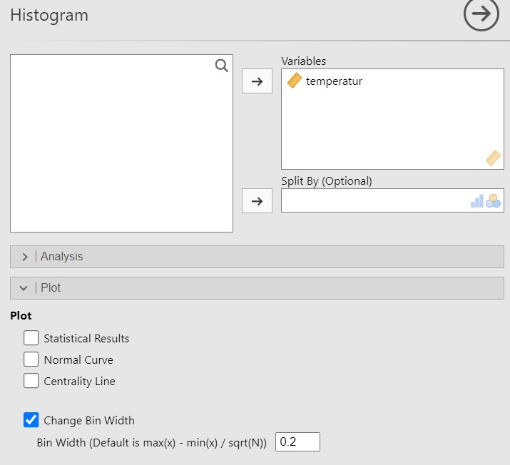
  knitr::include_graphics("figures/02-exr-enten-hist-binwidth-jmv-output.jpg")
```

Es entsteht dabei glücklicherweise genau die gewünschte Darstellung. Es wäre auch möglich gewesen, dass die Körbe auf der $x$-Achse verschoben sind, zum Beispiel ein Korb $41.2$ bis $41.4$. Diese Verschiebung könnte nicht mit `JJStatsPlot` behoben werden und müsste mit einer anderen Statistiksoftware bearbeitet werden.
  (d) Eine Anleitung zur Berechnung in `Jamovi` sowie die berechneten Werte können in Abbildung  \@ref(fig:enten-hist-mean-sd2) abgelesen und sind Interquartilabstand $IQR= 0.3$°C, $25\%$-Perzentil $=41.5$, $75\%$-Perzentil $=41.8$, $2.5\%$-Perzentil $=41.3$, $97.5\%$-Perzentil $= 42.1$, Spannweite $R=1.11$ und die Standardabweichung $SD = 0.233$.
:::

::: {.exercise #temptag-pvai8hwv}
<!-- 
Ziel: 
- Berechnung mit Jamovi festigen
- Output-interpretation
-->
TODO: Exercise body
:::

:::{.solution}
TODO: solution body
:::


::: {.exercise #theorie-mdn-mean}
<!-- 
Ziel: 
- Computeranweisung mit Verfahrensberechnung verknüpfen.
- Vor/Nachteile Mean/median kennen.
-->
In einem psychologischen Test machen $5$ Probandinnen die Werte $18, 21, 20, 19, 22$. Um mit einer Zahl zu sagen, wo die Testresultate liegen, wird ein zentraler Wert berechnet.

  (a) Wie gross ist das arithmetische Mittel und der Median dieser Werte? Rechnen Sie im Kopf oder mit einem Taschenrechner.
  (b) Nehme an, der Testleiter hat den Wert der ersten Probandin falsch in seine Tabelle übertragen - statt $18$ hat er $81$ geschrieben. Wie gross ist das arithmetische Mittel und der Median dieser Werte in diesem Fall?
  (c) Gleich wie (a), aber führen Sie die Berechnungen aus indem die Zahlen manuell bei `Jamovi` eingegeben. Tipp: Die Messskala muss manuell auf kontinuierlich gestellt werden.
  (d) Gleich wie (b), aber führen Sie die Berechnungen aus indem die Zahlen manuell bei `Jamovi` eingegeben.
  (e) Was sagt dies über den Median und das arithmetische Mittel aus?
:::

:::{.solution}
 
  (a) Wir haben hier $n=5$ Beobachtungen, nämlich $x_1 = 18, x_2 = 21, x_3 = 20, x_4 = 19, x_5=22$. Wird dies in die Formel \@ref(eq:mean) eingesetzt, so gibt dies das arithmetische Mittel
  $$\bar{x} = \frac{1}{n}\sum^n_{i=1} x_i = \frac{1}{n}(x_1 + x_2 + x_3 + x_4 + x_5) =  \frac{1}{5}(18+ 21+ 20+ 19+ 22) = 20.$$
 Um den Median zu berechnen, werden die Werte zuerst aufsteigend sortiert $18, 19, 20, 21, 22$. Der Wert, welcher die Werte in eine grössere und eine kleinere Hälfte teilt, ist hier $20$, was dem Median entspricht.
  (b) Die Beobachtungen sind jetzt $x_1 = 81, x_2 = 21, x_3 = 20, x_4 = 19, x_5=22$. Analog wie in (a) kann demnach das arithmetische Mittel als $\bar{x} = `r mean(c(81, 19, 20, 21, 22))`$ bestimmt werden. Die aufsteigend sortierten Beobachtungen sind nun $19, 20, 21, 22, 81$. Der Median ist also $21$.
  
  Für c und d wird der Datensatz bei `Jamovi` eingegeben, siehe Abbildung \@ref(fig:sol-theorie-mdn-mean-data), und die Analyseparameter werden gesetzt, siehe Abbildung \@ref(fig:sol-theorie-mdn-mean-input). 

```{r sol-theorie-mdn-mean-data, out.width='33%', fig.show="hold", fig.cap='Jamovi Dateneingabe.'}
c("figures/02-exr-theorie-mdn-mean-data-input.jpg",
  "figures/02-exr-theorie-mdn-mean-data-mod.jpg",
  "figures/02-exr-theorie-mdn-mean-data-clean.jpg") %>% 
  knitr::include_graphics()
```

```{r sol-theorie-mdn-mean-input, out.width='100%', fig.cap='Jamovi setzen der Analyseparameter.'}
knitr::include_graphics("figures/02-exr-theorie-mdn-mean-jmv-input.jpg")
```

Dies produziert das Analyseergebnis in Abbildung \@ref(fig:sol-theorie-mdn-mean-output).

```{r sol-theorie-mdn-mean-output, out.width='100%', fig.cap='Jamovi Ausgabe.'}

```

Damit können die beiden nächsten Teilfragen beantwortet werden.

  (c) Das Resultat in `Jamovi` ist genau gleich wie das händisch berechnete.
  (d) Das Resultat in `Jamovi` ist genau gleich wie das händisch berechnete.
  (e) Durch die fälschliche Übertragung eines Wertes, ist das arithmetische Mittel sehr stark und der Median fast gar nicht beeinflusst werden. Wenn die Daten wenige fehlerhafte Beobachtungen enthalten, ist der Median das bessere Mass für den zentralen Wert als das arithmetische Mittel. Wenn die Daten keine Fehler enthalten, ist das arithmetische Mittel gleich gut geeignet wie der Median.

:::

::: {.exercise #theorie-variabilitaet}
<!-- 
Ziel: 
- Computeranweisung mit Verfahrensberechnung verknüpfen.
- Vor/Nachteile IQR/SD kennen.
-->
In einem psychologischen Test machen $5$ Probandinnen die Werte $18, 21, 20, 19, 22$. Um mit einer Zahl zu sagen, wie stark die Testresultate streuen, wird die Variabilität berechnet.

  (a) Wie gross ist die Spannweite und die Standardabweichung dieser Werte? Rechnen Sie im Kopf oder mit einem Taschenrechner.
  (b) Nehme an, der Testleiter hat den Wert der ersten Probandin falsch in seine Tabelle übertragen - statt $18$ hat er $81$ geschrieben. Wie gross ist die Spannweite und die Standardabweichung dieser Werte jetzt? Rechnen Sie im Kopf oder mit einem Taschenrechner.
  (c) Gleich wie (a), aber führen Sie die Berechnungen aus indem die Zahlen manuell bei `Jamovi` eingegeben. Tipp: Die Messskala muss manuell auf kontinuierlich gestellt werden.
  (d) Gleich wie (b), aber führen Sie die Berechnungen aus indem die Zahlen manuell bei `Jamovi` eingegeben.
  (e) Vergewissern Sie sich, dass der Interquartilabstand in jedem Fall dem Abstand zwischen dem $25\%$ und dem $75\%$-Perzentil entspricht. Vergewissern Sie sich zusätzlich, dass in jedem Fall der Median dem $50\%$-Perzentil entspricht.
  (f) Schliessen Sie aus dieser Übung auf das Verhalten der verschiedenen Variabilitätsmasse bei fehlerhaften Daten?
:::

:::{.solution}
 
  (a) Die Spannweite entspricht dem höchsten minus dem kleinsten beobachteten Wert, also $R = 22- 18 = 4$. Wir haben hier $n=5$ Beobachtungen, nämlich $x_1 = 18, x_2 = 21, x_3 = 20, x_4 = 19, x_5=22$. Wird dies in die Formel \@ref(eq:sd) eingesetzt, so gibt dies die Standardabweichung
  \begin{align}
    s &= \sqrt{\frac{1}{n-1}\sum^n_{i=1} (x_i-\bar{x})^2} \\
    &= \sqrt{\frac{1}{n-1} \left( (x_1-\bar{x})^2+(x_2-\bar{x})^2+(x_3-\bar{x})^2+(x_4-\bar{x})^2+(x_5-\bar{x})^2\right)} \\
    &=  \sqrt{\frac{1}{5-1} \left( (18-20)^2+(21-20)^2+(20-20)^2+(19-20)^2+(22-20)^2\right)} \\
    &=     \sqrt{\frac{1}{4} \left( 4+1+0+1+4\right)}\\
    &=1.58.
  \end{align}
  (b) Wir haben hier $n=5$ neue Beobachtungen, nämlich $x_1 = 81, x_2 = 21, x_3 = 20, x_4 = 19, x_5=22$. Die Spannweite entspricht dem höchsten minus dem kleinsten beobachteten Wert, also $R = 81 - 19 = 62$. Wird dies in die Formel \@ref(eq:sd) eingesetzt, so gibt dies die Standardabweichung
  \begin{align}
    s &= \sqrt{\frac{1}{n-1}\sum^n_{i=1} (x_i-\bar{x})^2} \\
    &= \sqrt{\frac{1}{n-1} \left( (x_1-\bar{x})^2+(x_2-\bar{x})^2+(x_3-\bar{x})^2+(x_4-\bar{x})^2+(x_5-\bar{x})^2\right)} \\
    &=  \sqrt{\frac{1}{5-1} \left( (81-32.6)^2+(21-32.6)^2+(20-32.6)^2+(19-32.6)^2+(22-32.6)^2\right)} \\
    &=     \sqrt{\frac{1}{4} \left( 2342.56+134.56+158.76+184.96+112.36\right)}\\
    &=27.08.
  \end{align}
  Je nach Rundungsverfahren können hier kleinere Werteunterschiede im Nachkommabereich resultieren.
  
  Für c und d wird der Datensatz bei `Jamovi` eingegeben. Die Variablen werden bearbeitet wie in \@ref(exr:theorie-mdn-mean) beschrieben. Die Analyseparameter werden gesetzt, siehe Abbildung \@ref(fig:sol-theorie-variabilitaet-input). 


```{r sol-theorie-variabilitaet-input, out.width='100%', fig.cap='Jamovi setzen der Analyseparameter.'}
knitr::include_graphics("figures/02-exr-theorie-variabilitaet-jmv-input.jpg")
```

Dies produziert das Analyseergebnis in Abbildung \@ref(fig:sol-theorie-variabilitaet-output).

```{r sol-theorie-variabilitaet-output, out.width='100%', fig.cap='Jamovi Ausgabe.'}
knitr::include_graphics("figures/02-exr-theorie-variabilitaet-jmv-output.jpg")
```

Damit können die beiden nächsten Teilfragen beantwortet werden.

  (c) Tatsächlich ist die Spannweite gemäss Jamovi auch $R=4$ (siehe `Wertebereich`) und die Standardabweichung ist $SD=1.58$.
  (d) Tatsächlich ist die Spannweite gemäss Jamovi auch $R=62$ (siehe `Wertebereich`) und die Standardabweichung ist $SD=27.08$.
  (e) Tatsächlich ist der $IQR = 2$ in beiden Beispielen. Dies entspricht genau den Perzentildifferenzen $21-19$ für den original und $22-20$ für den fehlerhaften Datensatz. Dass zweimal genau derselbe Wert resultiert ist Zufall. In beiden Fällen entspricht der Median dem $50\%$-Perzentil. Dies sollte immer der Fall sein, da sowohl der Median, wie auch das $50\%$-Perzentil die Beobachtungen in eine höhere und eine tiefere Hälfte teilen.
  (f) Diese Übung zeigt, dass die Standardabweichung und die Spannweite durch fehlerhafte Beobachtungen stark beeinflusst werden. Der Interquartilabstand ist hingegen relativ stabil, solange nicht viele Beobachtungen fehlerhaft sind.
:::

::: {.exercise #koerpergroesse}
<!-- 
Ziel: 
- Berechnung mit Jamovi festigen
- Output-interpretation
- Berichten
-->
```{r exr-koerpergroesse-sex}
gen_exr_koerpergroesse_sex <- function() {
  n <- 163
  set.seed(1298)
  file_name <- '02-exr-koerpergroesse-sex.sav'
  tab <- tibble(
    koerpergroesse = c(rnorm(n, 167, 8), 
                       rnorm(n, 180, 10)),
    geschlecht = c(rep("w", n), rep("m", n))
  )
  tab %>%
    write_sav(file_name)
  return(mget(ls()))
}
exr_koerpergroesse_sex <- gen_exr_koerpergroesse_sex()
```
Bei einer Befragung wurden die Körpergrösse und das Geschlecht im Datensatz `r inline_code(exr_koerpergroesse_sex$file_name)` festgehalten.

(a) Stellen Sie die Körpergrösse in einem Histogramm dar und berechnen sie alle bekannten Zentralitäts- und Variabilitätsmasse und berichten Sie mit dem korrekten Symbol. 
(b) Wiederholen Sie die Übung aber teilen Sie die Daten nach Geschlecht auf. Was fällt auf?
(c) Was bedeutet der Kommentar _Es gibt mehr als einen Modalwert, nur der erste wird berichtet_ und welche Bedeutung hat er für die Interpretation des Modus?
:::

:::{.solution}
(a) Der Datensatz wird bei `Jamovi` eingelesen und die  Analyseparameter wie in Abbildung \@ref(fig:sol-koerpergroesse-sex-input-a) gesetzt.


```{r sol-koerpergroesse-sex-input-a, out.width='100%', fig.cap='Jamovi setzen der Analyseparameter.'}
knitr::include_graphics("figures/02-exr-koerpergroesse-sex-jmv-input-a.jpg")
```

Dies produziert das Analyseergebnis in Abbildung \@ref(fig:sol-koerpergroesse-sex-output-a).

```{r sol-koerpergroesse-sex-output-a, out.width='100%', fig.cap='Jamovi Ausgabe.'}

```

Die Körpergrösse ist demnach $N=326$ mal beobachtet worden. Die Zentralitätmasse sind $M=173.13$ cm, $Mdn=172$ (Rundung nach 2 Kommastellen), Modus $144.77$. Die Variabilitätsmasse sind $SD=12.09$ cm, $IQR=17.11$ und $R=57.78$. Auf dem Histogramm ist ausserdem ersichtlich, dass die meisten Leute zwischen $160$ und $180$ cm gross sind und dass nur weniger unter $155$ oder über $200$ cm gross sind.

(b) Die Analyse wird mit Gruppierungsvariable Geschlecht wiederholt wie in Abbildung \@ref(fig:sol-koerpergroesse-sex-input-b)


```{r sol-koerpergroesse-sex-input-b, out.width='100%', fig.cap='Jamovi setzen der Analyseparameter.'}
knitr::include_graphics("figures/02-exr-koerpergroesse-sex-jmv-input-b.jpg")
```

Dies produziert das Analyseergebnis in Abbildung \@ref(fig:sol-koerpergroesse-sex-output-b).

```{r sol-koerpergroesse-sex-output-b, out.width='100%', fig.cap='Jamovi Ausgabe.'}
knitr::include_graphics("figures/02-exr-koerpergroesse-sex-jmv-output-b.jpg")
```

Die Körpergrösse ist demnach bei den Frauen $N=163$ mal beobachtet worden. Die Zentralitätmasse sind $M=166.00$ cm, $Mdn=166.09$, Modus $144.77$. Die Variabilitätsmasse sind $SD=8.41$ cm, $IQR=11.27$ und $R=41.45$. Die Körpergrösse ist bei den Männern auch $N=163$ mal beobachtet worden. Die Zentralitätmasse sind $M=180.27$ cm, $Mdn=180.54$, Modus $149.17$. Die Variabilitätsmasse sind $SD=10.96$ cm, $IQR=15.35$ und $R=53.39$. Auf dem Histogramm ist ausserdem ersichtlich, dass die beiden Gruppen eine Spitze rund um den Mittelwert bei der Häufigkeit aufweisen. Beobachtungen, welche von der Spitze weiter weg sind werden seltener. Diese zwei Spitzen und somit unterschiedliche Körpergrössenverteilungen nach Geschlecht war aus (a) nicht ersichtlich. Es ist immer möglich, dass bei nicht-Experimenten ein zusätzliches Merkmal (hier das Geschlecht) ganz neue Erkenntnisse bringen kann.
(c) In den Daten der Körpergrösse ist ersichtlich, dass aufgrund der detaillierten Aufzeichnung der Körpergrössen im hundertstel Millimeterbereich keine Beobachtung zweimal vorkommt. Jede Beobachtung ist somit die häufigste Beobachtung. Der Modus ist hier also bedeutungslos. Um einen sinnvolleren Wert für den Modus zu erhalten könnten die Körpergrössen vorab auf Zentimeter gerundet werden. In `Jamovi` kann dies mit der Funktion `ROUND` gemacht werden. Der Modus ist dann $165$ cm für die Frauen und $172$ für die Männer, was sich mit den Erwartungen aus dem Histogramm deckt.
:::


:::{.exercise #diverse-distrib}
<!-- 
Ziel: 
- Berechnung mit Jamovi festigen
- Vernetzung: Output-interpretation mit verschieden verteilten Merkmalen vergleichen
-->
```{r exr-diverse-distrib}
gen_exr_diverse_distrib <- function() {
  n <-  500
  set.seed(1298)
  file_name <- '02-exr-diverse-distrib.sav'
  tab <- tibble(
    IQ = rnorm(n, 100, 15),
    Aufgeschlossenheit = round(rnorm(n, 4, 1),1),
    Wartezeit_min = rexp(n, 1/5),
    Wartezeit_std = Wartezeit_min / 60,
    Geburtzeit_std_ab_mitternacht = runif(n, 0, 24),
    Geburtzeit_std_ab_mittag = (Geburtzeit_std_ab_mitternacht - 12) %%
      24,
    Punkte = rbinom(n, 20, 0.9) 
  ) %>% 
    mutate(Aufgeschlossenheit = case_when(Aufgeschlossenheit> 7 ~7,
                                          Aufgeschlossenheit <1 ~1,
                                          TRUE~ Aufgeschlossenheit))
  tab %>%
    write_sav(file_name)
  jmv_output <- tab %>%
    descriptives(vars = vars(IQ, 
                             Aufgeschlossenheit,
                             Wartezeit_std,
                             Wartezeit_min,
                             Geburtzeit_std_ab_mitternacht,
                             Geburtzeit_std_ab_mittag,
                             Punkte),
                 desc = "rows",
                 hist = TRUE,
                 mode = TRUE)
  return(mget(ls()))
}
exr_diverse_distrib <- gen_exr_diverse_distrib()
```

Für eine Studie werden Studierende gebeten eine Aufgabe zu lösen, bei welcher Sie eine gewisse Anzahl `Punkte` erzielen. Über jede Proband:in sind ausserdem folgende Eigenschaften bekannt:

- `IQ`: Intelligenzquotient
- `Aufgeschlossenheit`: Likert von 1-7
- `Wartezeit_min`: Wartezeit vor beginn des Experiments in Minuten
- `Wartezeit_std`: Wartezeit vor beginn des Experiments in Stunden
- `Geburtzeit_std_ab_mitternacht`: Geburtszeit in Stunden ab Mitternacht. Wenn jemand um 13h30 auf die Welt kam, ist dieser Wert 13.5.
- `Geburtzeit_std_ab_mittag`: Geburtszeit in Stunden ab Mittag. Wenn jemand um 13h30 auf die Welt kam, ist dieser Wert 1.5.

Die Daten sind in Jamovi unter `r inline_code(exr_diverse_distrib$file_name)` verfügbar.

Analysieren Sie alle erhobenen Merkmale indem Sie ein Histogramm erstellen und die zentralen Tendenzen sowie die Variabilität analysieren.

a. Wie viele Personen nahmen an der Studie teil?
b. Vergleichen Sie Ihre Ergebnisse für die Merkmale IQ und Aufgeschlossenheit. Was für Zusammenhänge fallen auf?
c. Vergleichen Sie Ihre Ergebnisse für die Wartezeiten Merkmale. Was für Zusammenhänge fallen auf?
d. Vergleichen Sie Ihre Ergebnisse für die Merkmale Punkte und Wartezeiten. Was für Zusammenhänge fallen auf?
e. Geburtszeit. TODO.
:::

:::{.solution}
```{r sol-diverse-distrib1, out.width='100%', fig.cap='Jamovi Eingabe.', fig.show='hold'}
knitr::include_graphics("figures/02-exr-diverse-distrib-input.jpg")
```

```{r sol-diverse-distrib2, out.width='100%', fig.cap='Deskriptive Statistiken.', fig.show='hold'}

```            

```{r sol-diverse-distrib3, out.width='33%', fig.cap='Histogramme.', fig.show='hold'}
exr_diverse_distrib$jmv_output$plots
```

Die Merkmale werden mit den Befehlen in Abbildung \@ref(fig:sol-diverse-distrib1) analysiert.

a. Es gibt gemäss \@ref(fig:sol-diverse-distrib2) genau $500$ Studienteilnehmende (siehe $N$).
b. Die Histogramme für den IQ und die Aufgeschlossenheit weisen eine ähliche Form auf. Viele Beobachtungen sind um eine Mitte zentriert. Je weiter weg von der Mitte, desto seltener sind die Beobachtungen. Das Histogramm des IQ zeigt, dass die Verteilung rund um $100$ zentriert ist und ca. von $60$ bis $140$ reicht. Je weiter entfernt von $100$, desto weniger Beobachtungen wurden gemacht. Das Histogramm der Aufgeschlossenheit stellt dar, dass diese rund um 4 zentriert ist mit Werten von 1 bis 7. Je weiter die Werte von 4 entfernt sind, desto weniger häufig sind die Beobachtungen. Der vom Histogramm abgeleitete vorher genannte zentrale Wert entspricht ungefähr dem Mittelwert und dem Median für beide Merkmale. Für die Aufgeschlossenheit hat der Modalwert ebenfalls einen ähnlichen Wert. Der Modus für den IQ ist nicht belastbar, da die Fussnote besagt, dass mehrere Werte als Modus in Frage kommen. Eine genauere Durchsicht der IQ-Werte lässt folgern, dass aufgrund der vielen Nachkommastellen jeder IQ-Wert nur genau einmal vorkommt. Der angebene Modalwert des IQs entspricht also einfach einer zufälligen Beobachtung. Die Kennwerte für die Variabilität lassen ebenfalls auf Unterschiede zwischen den beiden Merkmalen schliessen. Die höheren Werte Standardabweichung, IQR und Wertebereich des IQ im Vergleich zur Aufgeschlossenheit legen nahe, dass die Streuung der Werte für den IQ viel grösser ist. Zum Beispiel ist eine durchschnittliche IQ-Beobachtung $15.5$ IQ-Werte weg vom durchschnittlichen IQ und eine durchschnittliche Aufgeschlossenheits-Beobachtung nur $1.3$ Aufgeschlossenheits-Werte weg von der duchschnittlichen Aufgeschlossenheit. Dies ist auf dem Histogramm zu erkennen, wenn die Skala der horizontalen Achse betrachtet wird. Für den IQ reicht diese von 50 bis 125 und für die Aufgeschlossenheit von $2$ bis $6$.
c. Die Wartezeiten wurden einmal in Minuten und einmal in Stunden abgespeichtert. Die resultierenden Histogramme sind deshalb genau identisch bis auf die Werte der horizontalen Achse, welche von $0$ bis $0.6$ Stunden und von $0$ bis $40$ Minuten reicht. Im Vergleich zu den Histogrammen des IQ und der Aufmerksamkeit kann für die Wartezeit und eine asymetrische Verteilung beobachtet werden. Kurze Wartezeiten werden demnach häufiger beobachtet als längere Wartezeiten. Die meisten Wartezeiten liegen unter $10$ Minuten, sehr selten kommt es zu Wartezeiten über $20$ Minuten. Die Kennzahlen für die Wartezeit in Stunden können aus den Kennzahlen der Wartezeit in Stunden hergeleitet werden indem die Werte durch $60$ geteilt werden. Es reicht deshalb die Kennzahlen für die Wartezeit in Minuten zu betrachten. Die durchschnittliche Wartezeit liegt bei $M=5.07$ Minuten, $Mdn = 3.35$. Der Modalwert ist wiederum nicht interpretierbar aus demselben Grund wie oben. Der Median bedeutet, dass $50\%$ der Wartezeiten kleiner und $50\%$ der Wartezeiten grösser waren als $3.35$ Minuten. Das arithmetische Mittel ist höher als der Median. Die einigen wenigen Beobachtungen mit sehr langen Wartezeiten haben also das arithmetische Mittel im Vergleich zum Median stärker beeinflusst.
d. TODO.
e. TODO: Zentraler Wert hier nicht identifiziertbar, Streuung auch nicht.
:::

## Test  {#intervallskaliertes-merkmal-test}

::: {.exercise}
<!-- 
Ziel: 
- Intervallskaliertes Merkmal
-->
Welche der folgenden Merkmalen sind mindestens intervallskaliert?

a) Verkaufspreise einer Kunstauktion.
b) Eine Person stimmt ja, nein oder enthält sich bei einer Abstimmung.
c) Beobachtungen des Intelligenzquotienten.
d) Reaktionszeit.
:::

:::{.solution}
a) Ja
b) Nein
c) Ja
d) Ja
:::

::: {.exercise}
<!-- 
Ziel: 
- Mittelwerte Theorie
-->
Welche der folgenden Aussagen sind wahr, welche falsch?

a) Der Median ist immer kleiner als das arithmetische Mittel.
b) Das arithmetische Mittel ist anfälliger für Messfehler als der Median.
c) Die Balkenhöhe eines Histogramms steht für die Anzahl Beobachtungen.
d) Bei einem Histogramm ist steht das beobachtete Merkmal auf der $x$-Achse.

:::

:::{.solution}
a) Falsch
b) Richtig, siehe Übung \@ref(exr:theorie-mdn-mean)
c) Richtig
d) Richtig
:::

::: {.exercise}
<!-- 
Ziel: 
- Mittelwerte mit Zahlen
-->
Von einem intervallskalierten Merkmal wurden folgende fünf Beobachtungen gemacht: $12, 23, 15, 12, 7$. Welche der folgenden Aussagen sind wahr, welche falsch?

a) Der Median liegt bei $15$.
b) Der Modus ist $12$.
c) Das arithmetische Mittel ist kleiner als der Median.
d) $\sum_{i = 1}^n x_i$ entspricht der Summe der Beobachtungen, also $69$.
:::

:::{.solution}
a) Falsch
b) Richtig
c) Falsch
d) Richtig
:::

::: {.exercise}
<!-- 
Ziel: 
- Mittelwerte mit Jamovi
-->
```{r exr-autos-haushalt}
gen_exr_autos_haushalt <- function() {
  set.seed(1298)
  file_name <- '02-exr-autos-haushalt.sav'
  tab <- tibble(anzahl_auto = rpois(92,1)) %>%
    write_sav(file_name)
  return(mget(ls()))
}
exr_autos_haushalt <- gen_exr_autos_haushalt()
```

Es wird beobachtet wie viele Autos ein Haushalt hat. Die Daten sind in `r inline_code(exr_autos_haushalt$file_name)` abgelegt. Welche der folgenden Aussagen sind wahr, welche falsch?

a) Die durchschnittliche Anzahl Autos pro Haushalt liegt bei $M=0.87$.
b) Der Modus liegt bei $1$.
c) Der Median liegt bei $M=1$.
d) Es wurden $N=92$ Personen beobachtet.
:::

:::{.solution}
a) Richtig
b) Falsch, siehe `Modalwert`.
c) Falsch, richtig wäre $Mdn=1$.
d) Falsch, es wurden Haushalte beobachtet nicht Personen.
:::

::: {.exercise}
<!-- 
Ziel: 
- Veriabilitätsmasse mit Zahlen
-->
Von einem intervallskalierten Merkmal wurden folgende fünf Beobachtungen gemacht: $12, 23, 15, 12, 7$. Welche der folgenden Aussagen sind wahr, welche falsch?

a) $SD = 5.89$.
b) $R = 5$.
c) $IQR = 3$.
d) $s = 5.89$.
:::

:::{.solution}
a) Richtig
b) Falsch
c) Richtig
d) Richtig
:::

::: {.exercise}
<!-- 
Ziel: 
- Veriabilitätsmasse mit theoretisch
-->
Welche der folgenden Aussagen sind wahr, welche falsch?

a) Die Spannweite ist immer grösser als der Interquartilabstand.
b) $50\%$ der Beobachtungen sind auf einer Distanz ausgebreitet, welche dem Interquartilabstand entspricht.
c) Der Interquartilabstand entspricht der Datenstreuung von der kleinsten Beobachtung bis zum Median.
d) Die Standardabweichung wird durch Messfehler weniger beeinflusst als der Interquartilabstand.
:::

:::{.solution}
a) Richtig
b) Richtig
c) Falsch
d) Falsch
:::


<!--chapter:end:src/02-was_ist_eine_intervallskalierte_variable.Rmd-->

# Stichprobenziehung {#stichprobenziehung}

:::{.example #angst name="Angst"}

```{r exm-angst, include=FALSE}
gen_exm_angst <- function(){
  set.seed(12452)
  n <- 30
  x_mean <- 43.2
  x_sd <- 7.8
  x <- rnorm(n, x_mean, x_sd)
  file_name <- '03-exm-angst.sav'
  tibble(angst = x) %>%
    write_sav(file_name)
  
  set.seed(1928)
  n_samples <- 1000
  x_means <- map_dbl(1:n_samples, ~ mean(rnorm(n, x_mean, x_sd)))
  x_sds <- map_dbl(1:n_samples, ~ sd(rnorm(n, x_mean, x_sd)))
  lb_means_emp <- round(unname(quantile(x_means, 0.025)), 1)
  ub_means_emp <- round(unname(quantile(x_means, 0.975)), 1)
  
  m_means <- mean(x)
  s_means <- sqrt(sd(x) / n)
  lb_means_t <- m_means - qt(0.975, n - 1) * s_means
  ub_means_t <- m_means + qt(0.975, n - 1) * s_means
  
  return(mget(ls()))
}
exm_angst <- gen_exm_angst()
```

Forschende haben das Messinstrument State-Trait Anxiety Inentory _STAI_ entwickelt, welches Angst misst [@spielberger1983manual]. Sie unterscheiden dabei zwischen Zustandesangst und dem Persönlichkeitszug Ängslichkeit. Hier interessiert uns nur die Zustandesangst, welche fortan Angst genannt wird und misst wie grosse Angst aktuell empfunden wird. Die so gemessene Angst enstpricht einem Wert zwischen $20$ und $80$. A priori haben die Forschenden keine Ahnung, wie viel Angst eine Person im Durchschnitt hat und ob die ganze Skala der Werte genutzt wird. Die Forschenden machen deshalb eine kleine Befragung mit $n =`r exm_angst$n`$ zufällig ausgewählten Studierenden. Die Forschenden finden die zusammenfassenden Werte $M=`r round(mean(exm_angst$x), 2)`, s = `r round(sd(exm_angst$x),2)`, n = `r exm_angst$n`$ für die Angst in ihren Beobachtungen.
:::

[Zufällig ausgewählte Beobachtungen eines Merkmals werden als __Stichprobe__ bezeichnet.]{.customdef #customdef-stichprobe} [Die Auswahl der Beobachtungen für die Stichprobe ist die __Stichprobenziehung__.]{.customdef #customdef-stichprobenziehung} Ist mit diesen Beobachtungen die Aussage beschränkt auf die Stichprobe oder kann damit auch eine Aussage zur Angst für alle Personen getroffen werden? [Alle Personen, oder generell alle möglichen Beobachtungen eines Merkmals, werden als __Population__]{.customdef #customdef-population} [oder __Grundgesamtheit__ bezeichnet]{.customdef #customdef-grundgesamtheit}. [Eine Stichprobe ist für viele Analyseverfahren repräsentativ für eine Population, wenn sie zufällig aus dieser Population gezogen. Ist dies gegeben, wird die Stichprobe auch als __Zufallsstichprobe__ bezeichnet.]{.customdef #customdef-zufallsstichprobe} 

::::{.caution}

:::{.remark}
Viele Studien basieren auf Testresultaten von Studierenden, weil diese nahe am Forschungsbetrieb sind und damit über Studien informiert sind oder für wenig Geld oder Bildungsanerkennung an Studien teilnehmen. Einige dieser Studien generalisieren ihre Forschungsresultate nachher auf alle Personen. Dies ist in der Regel falsch, da Studierende nicht repräsentativ für die Gesamtbevölkerung sind (Altersstruktur, Geschlechtsverteilung, Vermögen, usw.). Die Frage, wie am besten eine repräsentative Stichprobe gezogen werden kann, kann hier aus Platzgründen nicht diskutiert werden.
:::

::::

## Was ist das Problem der Stichprobenziehung? {#stichprobenziehung-problem}

Es wird angenommen, dass sich alle Personen der Population in einem Zimmer befinden. In Abbildung \@ref(fig:srs-intervall-nocol) ist dieses Zimmer aus der Vogelperspektive dargestellt, wobei jeder Punkt im schwarzen Kasten einer Person der Population entspricht. Von den Personen im Zimmer, respektive die Beobachtungen in der Population, ist die Angst nicht bekannt (Punkte in grau). Aus diesem Zimmer wurden zufällig `r exm_angst$n` Personen geholt und befragt also sichtbar gemacht, was der Zufallsstichprobe entspricht. Die Zufallsstichprobe ist gekennzeichnet durch die farbigen Punkte über dem Zimmer, oberhalb des Pfeils. Die Farben der Punkte sind jetzt bekannt und entsprechen der jeweiligen Zustandesangst der beobachteten Personen.


```{r srs-intervall-nocol, echo = FALSE, fig.cap="Population mit unbekannter Angst."}
plot_ball_bag(
  scores_bag = c(20, 80, rnorm(198, exm_angst$x_mean, exm_angst$x_sd)),
  scores_hover = exm_angst$x,
  score_name = "Angst",
  bag_color = "grey90",
  seed = 123,
  color_bag_balls = FALSE
)
```

Da die Stichprobe zufällig gezogen wurde, das heisst zufällig Personen aus dem Zimmer geholt wurden, kann es nun sein, dass die Stichprobe einer Population wie in Abbildung \@ref(fig:srs-intervall-high-p) entstammt.


```{r srs-intervall-high-p, fig.cap="Population mit ähnlichen Angst-Werten wie in der Stichprobe.", echo = FALSE}
scores_bag_high_p <- c(20, 80, rnorm(198,  exm_angst$x_mean, exm_angst$x_sd))
plot_ball_bag(
  scores_bag = scores_bag_high_p,
  scores_hover = exm_angst$x,
  score_name = "Angst",
  seed = 123
)
```

Es könnte aber auch sein, dass die Stichprobe einer Population mit viel höherer Zusatandsangst, wie in Abbildung \@ref(fig:srs-intervall-low-p) dargestellt, entstammt. Dies wird zwar weniger häufig vorkommen als der Fall oben, aber ist trotzdem möglich.

```{r srs-intervall-low-p, fig.cap="Population mit höheren Angst-Werten als in der Stichprobe.", echo = FALSE}
scores_bag_low_p <-  c(20, 80, rnorm(198, 52, exm_angst$x_sd))
plot_ball_bag(
  scores_bag = scores_bag_low_p,
  scores_hover = exm_angst$x,
  score_name = "Angst",
  seed = 123
)
```

Das Problem der zufälligen Stichprobenziehung ist also, dass nie ganz klar ist, wie die darunterliegende Population aussieht. Sind die Werte der Stichprobe tief, weil zufällig gerade Studierende mit tiefer Angst beobachtet wurden, oder haben tatsächlich die meisten Studierenden eine tiefe Angst?

## Wie kann man Aussagen über die Grundgesamtheit machen? {#stichprobenziehung-loesung}

Die Lösung dieses Problems funktioniert intuitiv wie folgt: Man stellt sich vor, die Stichprobenziehung würde erneut gemacht, und dann nochmal und dann nochmal. So oft, bis man einen guten Eindruck davon hat, wie häufig eine Stichprobe mit eher tiefen Angst-Werten wie bei der Stichprobe im Beispiel vorkommt. Im Szenario, in welchem in der Population tatsächlich tiefe Werte häufig vorkommen, kann dies aussehen wie in Abbildung \@ref(fig:srs-intervall-high-p-many). Stichproben mit eher tiefen Angst-Werten kommen hier häufig vor.

```{r srs-intervall-high-p-many, fig.cap="Wiederholte Stichprobenziehung bei gleichbleibender Population mit eher tiefen Angst-Werten.", echo = FALSE}
plots <- list()
for (i in 1:6) {
  set.seed(i * 5 + 789)
  scores_hover <- rnorm(exm_angst$n,  exm_angst$x_mean, exm_angst$x_sd)
  plots[[i]] <- plot_ball_bag(
    scores_bag = scores_bag_high_p,
    scores_hover = scores_hover,
    score_name = "Angst",
    seed = 123,
    no_legend = TRUE
  )
}
do.call(grid.arrange, c(plots, ncol = 3))
```

Im Szenario, in welchem in der Population tatsächlich höhere Werte häufig vorkommen, kann dies aussehen wie in Abbildung \@ref(fig:srs-intervall-low-p-many). Stichproben mit eher tiefen Angst-Werten kommen hier selten oder gar nicht vor.

```{r srs-intervall-low-p-many, fig.cap="Wiederholte Stichprobenziehung bei gleichbleibender Population mit eher hohen Angst-Werten.", echo = FALSE}
plots <- list()
for(i in 1:6){
  set.seed(i*5+789)
  scores_hover <- rnorm(exm_angst$n, 52, exm_angst$x_sd)
  plots[[i]] <-plot_ball_bag(
  scores_bag = scores_bag_low_p,
  scores_hover = scores_hover,
  score_name = "Angst",
  seed = 123, 
  no_legend = TRUE)
}
do.call(grid.arrange, c(plots, ncol = 3))
```

Es kann also zusammenfassend gesagt werden, dass die gezogene Stichprobe wohl eher aus einer Population mit tiefen Angst-Werten gezogen wurde als aus einer Population mit eher höheren Angst-Werten. Ganz sicher kann man jedoch nie sein, da die Werte in der Population eigentlich unbekannt sind. Eine genaue Quantifizierung dieser Unsicherheit kann mit Hilfe der Statistik erreicht werden und wird in den folgenden Kapiteln dieses Buches erläutert.

## Übungen

::: {.exercise  #redhair}
<!-- 
Ziel: 
- Begriffsklärung Stichprobe / Population / Grundgesamtheit / Zufallsstichprobe
-->
In einer Studie zum Schmerzempfinden von Personen mit dem Gen MC1R (welche meistens als rothaariger Phenotyp auftreten) werden $20$ rothaarige Studierende und $54$ Studierende mit andere Haarfarbe auf ihr Schmerzempfinden getestet. Identifizieren Sie die Population und die Stichprobe und erklären Sie ob es sich um eine Zufallsstichprobe handelt.
:::

:::{.solution}
Die Studie will eine Aussage über alle Personen mit dem Gen MC1R treffen im Vergleich zu Personen ohne das MC1R Gen. Alle Personen mit diesem Gen sind also der eine Teil der Population und alle Personen ohne das Gen sind der andere Teil der Population. Die beobachteten $20$ rothaarigen Studierenden und die $54$ anderen Studierenden sollen eine Stichprobe von dieser Population darstellen. Dies ist den Studienleitenden jedoch nicht gelungen, da bei der Auswahl der Studierenden auf ihre Haarfarbe geachtet wurde und nicht auf die Ausprägung des MC1R-Gens. Da auch blonde Personen das MC1R-Gen in sich tragen können und sich auch Personen die Haare rot färben können, ist hier nicht davon auszugehen, dass es sich um eine Stichprobe der erwünschten Population handelt. Wenn davon ausgegangen wird, dass die rothaarigen tatsächlich alle das erwünschte Gen in sich tragen und die anderen Teilnehmenden nicht, dann kann zusätzlich bemängelt werden, dass eine Aussage über alle Personen getroffen werden soll, sich aber nur Studierende in der Stichprobe befinden - also vorwiegend junge Personen mit wenig Geld. Mit dieser Stichprobe kann dann also eigentlich nur eine Aussage zu allen jungen Rothaarigen und jungen Leuten mit anderer Haarfarbe getroffen werden. Zudem muss davon ausgangen werden, dass die Studierenden aus folgenden möglichen Gründen nicht zufällig ausgewählt wurden:

- Teilnehmende brauchen das Geld oder Punkte für ihr Studium
- Teilnehmende tendieren dazu zusammen mit Freunden an Studien teilzunehmen
- Teilnhemende müssen Zeit haben, sind also tendenziell weniger durch Erwerbstätigkeit oder Care-Arbeit blockiert als andere
- etc.
:::

::: {.exercise  #armwrestling}
<!-- 
Ziel: 
- Begriffsklärung Stichprobe / Population / Grundgesamtheit / Zufallsstichprobe
-->
Anna und Isabel wollen mit einmaligem Armdrücken herauszufinden, wer die stärkere Person ist. Identifizieren Sie Population und Stichprobe. Isabel gewinnt. Können Anna und Isabel nachher mit Gewissheit sagen, dass Isabel stärker ist? Wie könnte mehr Sicherheit erlangt werden?
:::

:::{.solution}
Die Population beinhaltet in diesem Fall alle hypothetischen je gemachten oder noch durchzuführende Armdrücken zwischen Anna und Isabel. Die Stichprobe ist das jetzt durchgeführte Armdrücken, bei welchem Isabel gewonnen hat. Anna könnte zu recht behaupten, dass nur weil Isabel einmal gewonnen hat, dies relativ wenig aussagekräftig ist für die Population also für die Frage, ob Isabel stärker ist. Vielleicht hatte Isabel einfach einen sehr starken Tag und Anna ist aber normalerweise eigentlich stärker. Um diese zufälligen Effekte zu minimieren, könnten Anna und Isabel das Armdrücken regelmässig wiederholen.
:::

## Test

::: {.exercise  #tagname-apwioev}
<!-- 
Ziel: 
- Verständnis Problem/chance der zufallsstichprobe
-->
Eine Aktiengesellschaft hat die Addressen aller ihrer $10000$ Aktionär:innen. Mit einer Umfrage soll herausgefunden werden, ob die Aktionär:innen den neuen umweltfreundlichen Unternehmenskurs begrüssen. Dazu werden per losverfahren $100$ Aktionär:innen bestimmt und an der Generalversammlung kurz um eine Stellungnahme gebeten. Welche der folgenden Aussagen sind wahr, welche falsch?

a) Die Stichprobengrösse ist $10000$.
b) Die Grundgesamtheit sind alle Aktionär:innen.
c) Es handelt sich um eine Zufallsstichprobe.
d) Die Population umfasst $100$ Aktionär:innen.
:::

:::{.solution}
a) Falsch
b) Richtig
c) Richtig
d) Falsch
:::


<!--chapter:end:src/03-stichprobenziehung.Rmd-->

# Durchschnitt und Standardabweichung schätzen

Wie die in Abschnitt \@ref(stichprobenziehung-loesung) skizzierte Lösung für das Problem der zufälligen Stichprobe konkret umgesetzt wird, hängt von der Problemstellung ab. Im Folgenden wird ein Verfahren zur Generalisierung der Schätzung der zentralen Tendenz 
<!-- und eines für die Schätzung der Variabilität  -->
basierend auf einer Stichprobe präsentiert.

## Wo liegt der Durchschnitt der Grundgesamtheit?

Ein Parameter, über welchen wir gerne eine Aussage treffen würden, ist die zentrale Tendenz in der Grundgesamtheit. [Diese wird **Erwartungswert** (Symbol $\mu$ [gr.: mü]) genannt.]{.customdef #customdef-erwartungswert} Wenn das arithmetische Mittel der Stichprobe berechnet wird, ergibt dies auch ein Schätzwert für besagten Erwartungswert. Aufgrund der zufälligen Stichprobenziehung ist jedoch auch klar, dass dieser Schätzwert nie genau dem wahren Erwartungswert entspricht. 

In Beispiel \@ref(exm:angst) liegt das arithmetische Mittel in der Stichprobe der Studierenden bei $M=`r exm_angst$x_mean`$. Dieser Wert entspricht nun auch der Schätzung des Erwartungswertes, also der geschätzten durchschnittlichen Angst aller Menschen. Die Folgefrage ist also wie genau unsere Schätzung ist. Um dies zu quantifizieren, wiederholen wir die Stichprobenziehung und berechnen das arithmetische Mittel dieser zweiten Stichprobe. Dann wiederholen wir diesen Prozess, zum Beispiel $`r exm_angst$n_samples`$ mal.

```{r exm-angst-hist-means, echo = FALSE, fig.cap = paste("Verteilung der arithmetischen Mittel von", exm_angst$n_samples, "zufällig gezogenen Stichproben der Angst.")}
tibble(x = exm_angst$x_means) %>% 
  ggplot(aes(x=x))+
  geom_histogram(binwidth = 0.5)+
  labs(y = 'Häufigkeit', x = 'Angst')
```

Die Häufigkeitsverteilung der berechneten arithmetischen Mittel in Abbildung \@ref(fig:exm-angst-hist-means) lässt nun eine Aussage über die Häufigkeit und damit über die Wahrscheinlichkeit von gewissen Werten als Erwartungswert zu. Ein Durchschnittswert der Zustandesangst um die $`r round(mean(exm_angst$x_means))`$ ist hier am wahrscheinlichsten und ein Wert tiefer als $`r round(quantile(exm_angst$x_means, 0.05)) %>% unname()`$ oder höher $`r round(quantile(exm_angst$x_means, 0.95)) %>% unname()`$ eher selten. Um diese Aussage präziser zu gestalten, werden konventionell die $95$% häufigsten Werte (die höchsten Balken im Histogramm) als wahrscheinlich betrachtet. Die $5$% verbleibenden Werte, verteilt auf das untere und obere Extrem, werden als unwahrscheinlich betrachtet. Das $2.5$% Perzentil trennt die $2.5$% tiefsten arithmetischen Mittel ab und liegt im Beispiel bei $`r  exm_angst$lb_means_emp`$. Das $97.5$%-Perzentil trennt die höchsten $2.5$% (oder eben die tiefsten $97.5$%) arithmetischen Mittel ab und liegt bei $`r exm_angst$ub_means_emp`$. Dies ist in Abbildung \@ref(fig:exm-angst-hist-means-emp-ci) ersichtlich.


```{r exm-angst-hist-means-emp-ci, fig.cap = paste0("Verteilung der arithmetischen Mittel von ",exm_angst$n_samples," zufällig gezogenen Stichproben der Angst.")}
plot_hist_means(exm_angst$x_means, exm_angst$lb_means_emp,  exm_angst$ub_means_emp, 0.5, 'Angst')
```

:::{.example #agreableness name="Verträglichkeit"}

```{r 4-exm-vertraeglichkeit, include=FALSE}
gen_exm_vertraeglichkeit <- function(){
  m <- 1000L
  a <- 1
  b <- 7
  n <- 100
  x <- runif(n, a, b)
  file_name <- '03-exm-vertraeglichkeit.sav'
  tab <- tibble(vertraeglichkeit = x) 
  tab %>%
    write_sav(file_name)
  means <- map_dbl(1:m, ~ mean(runif(n, a, b)))
  sds <- map_dbl(1:m, ~ sd(runif(n, a, b)))
  lb <- round(unname(quantile(means, 0.025)), 1)
  ub <- round(unname(quantile(means, 0.975)), 1)
  m_means <- a+(b - a) / 2
  s_means <- sqrt(((b - a) ^ 2 / 12) / n)
  lb_t <- m_means - qt(0.975, n - 1) * s_means
  ub_t <- m_means + qt(0.975, n - 1) * s_means
  
  return(mget(ls()))
}
exm_vertraeglichkeit <- gen_exm_vertraeglichkeit()
```

Einer der Big-5 Persönlichkeitszüge ist die Verträglichkeit. Eine einfache Art die Big-5 zu messen ist mit den 10 Fragen aus dem ten-item personality inventory _TIPI_ [@gosling2003]. Für die Verträglichkeit müssen zwei Items (Item 1: Critical, quarrelsome; Item 2: Sympathetic, warm) auf einer Likert-Skala von 1 bis 7 eingeordnet werden. Anschliessend werden die Antworten gemittelt. Ein Student möchte herausfinden, ob mit diesem Messinstrument die durchschnittliche Verträglichkeit aller Menschen mittig also bei $4$ liegt. Dafür befragt er $n = `r exm_vertraeglichkeit$n`$ Personen und findet die Werte $M=`r round(mean(exm_vertraeglichkeit$x), 2)`, s = `r round(sd(exm_vertraeglichkeit$x),2)`$.
:::

```{r exm-agreableness-hist, fig.cap = paste("Verteilung der", exm_vertraeglichkeit$n, "beobachteten Verträglichkeitswerte einer zufällig gezogenen Stichprobe.")}
exm_vertraeglichkeit$tab %>% 
  ggplot(aes(x=vertraeglichkeit))+
  geom_histogram(binwidth = 0.5)+
  labs(y = 'Häufigkeit', x = 'Verträglichkeit')
```

Die Verteilung der Beobachtungen, siehe Abbildung \@ref(fig:exm-agreableness-hist), zeigt, dass alle Werte zwischen $1$ und $7$ vorkommen, aber keine zentrale Tendenz greifbar ist. Um herauszufinden wie zutreffend die Schätzung des Erwartungswertes der Verträglichkeit von $M=`r round(mean(exm_vertraeglichkeit$x), 2)`$ ist, stelle man sich wieder vor, dass der Student $`r exm_vertraeglichkeit$m`$-mal die Stichprobenziehung wiederholt und jedes Mal das arithmetische Mittel $M$ von neuem berechnet. Die Verteilung der arithmetischen Mittel dieser Stichproben ist in Abbildung \@ref(fig:exm-agreableness-hist-means) dargestellt. Bei dieser Verteilung kann erneut links und rechts $2.5\%$ der Werte abgeschnitten werden, um zum Schluss zu gelangen, dass das arithmetische Mittel in $95\%$ der Fälle zwischen $`r exm_vertraeglichkeit$lb`$ und $`r exm_vertraeglichkeit$ub`$ zu liegen kommt.

```{r exm-agreableness-hist-means, fig.cap = paste0("Verteilung der arithmetischen Mittel von ",exm_vertraeglichkeit$m," zufällig gezogenen Stichproben der Verträglichkeit.")}
with(exm_vertraeglichkeit,
     plot_hist_means(means, lb, ub, 0.05, "Verträglichkeit"))
```

Das Problem mit diesem Vorgehen ist, dass es aus finanziellen oder technischen Gründen selten möglich ist mehrere Stichproben aus derselben Population zu ziehen. Glücklicherweise haben Statistiker:innen herausgefunden, dass die Häufigkeitsverteilungen wie in Abbildungen \@ref(fig:exm-angst-hist-means-emp-ci) und \@ref(fig:exm-agreableness-hist-means) immer dieselbe Verteilung haben und dies unabhängig davon wie die ursprüngliche Verteilung des Merkmals aussah. [Diese Verteilung ist eine sogenannte **Normalverteilung**]{.customdef #customdef-normalverteilung}. 

Die Normalverteilung sieht eine Glocke ähnlich. Deshalb wird sie auch Gausssche Glockenkurve nach Carl F. Gauss (1777-1855) benannt. Die Normalverteilung kann mit nur zwei Parametern beschrieben werden. 

- $\mu_g$ gibt an, wo auf der x-Achse der höchste Punkt der Glocke liegt
- $\sigma_g$ gibt an, wie flach die Glockenform ist (ein grosser Wert entspricht einer flachen Glockenform, ein tiefer Wert einer steilen Glockenform).

Auf [seeing-theory.brown.edu > Continuous > Normal](https://seeing-theory.brown.edu/probability-distributions/index.html#section2) kann der Einfluss von $\mu_g$ und $\sigma_g$ auf die Normalverteilung erfahren werden. 

[Diese Tatsache, dass die Durchschnitte aller Merkmale normalverteilt sind, ist so zentral für die Statistik, dass sie **Zentraler Grenzwertsatz** genannt wurde.]{.customdef #customdef-zentraler-grenzwertsatz} Der zentrale Grenzwertsatz besagt genauer, dass bei einem Merkmal mit Erwartungswert $\mu$ und Standardabweichung $\sigma$, der Durchschnitt aller Stichprobenwerte einer Normalverteilung mit $\mu_g = \mu$ und $\sigma_g = \frac{\sigma}{\sqrt{n}}$ entspricht, wobei $n$ die Stichprobengrösse und $\sigma$ die Standardabweichung des Merkmals in der Population bezeichnet.

::::{.caution data-latex=""}
:::{.remark}

- $\mu_g = \mu$ bedeutet, dass der Wert, welcher unter der Normalverteilung am wahrscheinlichsten ist, genau dem Erwartungswert des untersuchten Merkmales entspricht.
- $\sigma_g = \frac{\sigma}{\sqrt{n}}$ hat zwei Implikationen:
  - je grösser die Streuung des Merkmals (grosses $\sigma$) desto breiter ist auch die Streuung der arithmetischen Mittel (grosses $\sigma_g$). Dies bedeutet, je weniger Streuung das Merkmal aufweist, desto genauer ist die Bestimmung des Erwartungswertes des Merkmales.
  - je grösser die Anzahl Beobachtungen $n$, desto kleiner die Streuung der arithmetischen Mittel (kleines $\sigma_g$). Dies bedeutet, je grösser die Stichprobe ist, desto genauer ist die Bestimmung des Erwartungswertes des Merkmales.
:::
::::

Die Abbildungen \@ref(fig:exm-angst-normal-approx) und \@ref(fig:exm-agreableness-normal-approx) illustrieren den zentralen Grenzwertsatz für Beispiel \@ref(exm:angst) und \@ref(exm:agreableness) respektive, wobei die Normalverteilung der roten Linie entspricht. Dabei wird einstweilen angenommen, dass $\mu$ und $\sigma$ bekannt sind. Diese Annahme wird später aufgelöst und dient hier lediglich der Illustration.

```{r exm-angst-normal-approx, fig.cap = paste0("Die arithmetischen Mittel sind Normalverteilt mit Parametern $\\mu_g = ",round(mean(exm_angst$x),2),"$ und $\\sigma_g = ",round(sd(exm_angst$x),2)," / \\sqrt{",exm_angst$n,"}$.")}
with(exm_angst,
     plot_hist_denstiy_expected_value(x_means, x_mean, x_sd, n, "Angst", 0.5))
```

```{r exm-agreableness-normal-approx, fig.cap = paste0("Die arithmetischen Mittel sind Normalverteilt mit Parametern $\\mu_g = ",round(mean(exm_vertraeglichkeit$x),2),"$ und $\\sigma_g = ",round(sd(exm_vertraeglichkeit$x),2)," / \\sqrt{",exm_vertraeglichkeit$n,"}$.")}
with(exm_vertraeglichkeit,
     plot_hist_denstiy_expected_value(means, 4, sqrt((b - a) ^ 2 / 12), n, "Verträglichkeit", 0.05))
```

Die Erkenntnis des zentralen Grenzwertsatz macht also das wiederholte Ziehen von Stichproben unnötig. Die Normalverteilung ist theoretisch konstruiert und ihr $2.5\%$- und $97.5\%$-Perzentil können theoretisch hergeleitet werden. Tabelle \@ref(tab:quantiles-norm) wird kann beobachtet werden, dass für unsere zwei Beispiele die Perzentile der Stichprobe und der Normalverteilung sehr ähnlich, wenn auch nicht exakt gleich sind. Die Ungenauigkeit rührt daher, dass der zentrale Grenzwertsatz nur dann exakt funktioniert, wenn die Anzahl Beobachtungen (unendlich) gross ist.


```{r quantiles-norm}
(tibble(
  Beispiel = c("Angst", "Vertraeglichkeit"),
  "2.5%-Perzentil (sample)" = c(exm_angst$lb_means_emp, exm_vertraeglichkeit$lb),
  "97.5%-Perzentil  (sample)" = c(exm_angst$ub_means_emp, exm_vertraeglichkeit$ub),
  "2.5%-Perzentil norm" = c(qnorm(0.025, exm_angst$m_means, exm_angst$s_means), 
                            qnorm(0.025, exm_vertraeglichkeit$m_means, exm_vertraeglichkeit$s_means)),
  "97.5%-Perzentil norm" = c(qnorm(0.975, exm_angst$m_means, exm_angst$s_means), 
                               qnorm(0.975, exm_vertraeglichkeit$m_means, exm_vertraeglichkeit$s_means)),
  "2.5%-Perzentil t" = c(exm_angst$lb_means_t, exm_vertraeglichkeit$lb_t),
  "97.5%-Perzentil t" = c(exm_angst$ub_means_t, exm_vertraeglichkeit$ub_t)
) %>%
  kableExtra::kbl(
    booktabs = TRUE,
    col.names = c("Beispiel","2.5%", "97.5%", "2.5%", "97.5%", "2.5%", "97.5%"),
    digits = 2,
    align = c("c", "r", "r", "r", "r"),
    caption = "Vergleich Perzentile der Stichprobe und der theoretischen Verteilung."
  )) %>%
  kable_styling(
    bootstrap_options = c("striped", "hover", "condensed"),
    full_width = FALSE
  ) %>% 
  add_header_above(c(" " = 1, 
                     "Stichprobe" = 2, 
                     "Normalverteilung" = 2, 
                     "t-Verteilung" = 2))

```


Einstweilen wurde hier angenommen, dass die Streuung des Merkmals $\sigma$ bekannt ist. Dies ist in der Realität nie der Fall und eine weitere, wenn auch weniger grosse Ungenauigkeitsquelle. [Wenn $\sigma$ also auch aus der Stichprobe geschätzt werden muss, ist die Annäherung der Verteilung der arithmetischen Mittel besser gegeben mit einer **Student-$t$-Verteilung** oder kurz $t$-Verteilung.]{.customdef #customdef-student-verteilung} Die grüne gestrichelte Linie in den Abbildungen \@ref(fig:exm-angst-normal-approx) und \@ref(fig:exm-agreableness-normal-approx) entspricht der $t$-Verteilung im jeweiligen Beispiel. 

Der Unterschied zwischen der Normalverteilung und der $t$-Verteilung ist nur sichtbar, wenn $n$ klein ist. In Beispiel \@ref(exm:angst) mit $n = `r exm_angst$n`$ ist ein kleiner Unterschied, in Beispiel \@ref(exm:agreableness) mit $n = `r exm_vertraeglichkeit$n`$ ist kein Unterschied zwischen der Normalverteilung und der $t$-Verteilung sichtbar. [Tatsächlich wird die $t$-Verteilung mit einem Parameter charakterisiert, welcher __Freiheitsgrade__ (eng. degrees of freedom, $df$) genannt wird.]{.customdef #customdef-freiheitsgrade} In Abbildung \@ref(fig:t-distribution) wird die $t$-Verteilung mit verschiedenen Freiheitsgraden mit der Normalverteilung verglichen. Bei der $t$-Verteilung mit den kleinsten Freiheitsgraden sind extremere Werte wahrscheinlicher als $t$-Verteilungen mit grösseren Freiheitsgraden. 

```{r t-distribution, fig.cap="Student-t-Verteilungen mit 1, 4 und 9 Freiheitsgraden im Vergleich zu der Normalverteilung."}
tibble(x = seq(-4, 4, by = 0.1),
       Normalverteilung = dnorm(x),
       t_1 = dt(x, 2-1),
       t_4 = dt(x, 5-1),
       t_9 = dt(x, 10-1)) %>%
  pivot_longer(cols = 2:5, names_to = "Verteilung", values_to="Wahrscheinlichkeitsdichte") %>% 
  ggplot(aes(x=x))+
  geom_line(aes(y=Wahrscheinlichkeitsdichte, color = Verteilung))+
  labs(x="")
```

Die Freiheitsgrade der $t$-Verteilung in der Annäherung oben entsprechen der Anzahl Beobachtungen minus 1, also $df = n-1$. Die höhere Wahrscheinlichkeit von extremeren Werten bei kleinen Freiheitsgraden spiegelt die grössere Unsicherheit der Schätzung des Erwartungswertes wider, wenn die Standardabweichung unbekannt und damit auch geschätzt werden muss. Je kleiner $n$ ist, desto stärker fällt diese Unsicherheit aus.

Die arithmetischen Mittel bei unbekannter Standardabweichung sind bei wiederholter Stichprobenziehung genau $t$-verteilt. Um die Genauigkeit der Schätzung des Erwartungswertes zu bestimmen, genügt es folglich, das 2.5% und das 97.5% Perzentil der $t$-Verteilung mit $n-1$ Freiheitsgraden zu bestimmen. Diese Perzentile können mit 

\begin{equation}
\bar{x} - \frac{s}{\sqrt{n}} \cdot t_{97.5\%, n-1} < \mu < \bar{x} + \frac{s}{\sqrt{n}} \cdot t_{97.5\%, n-1}(\#eq:ki-mean)
\end{equation}

berechnet werden, wobei $\bar{x}$ das arithmetische Mittel, $s$ die Standardabweichung und $t_{97.5\%, n-1}$ dem Wert des 97.5%-Perzentil einer auf 0 zentrierten $t$-Verteilung mit $n-1$ Freiheitsgraden entspricht. Letzere Perzentile der $t$-Verteilung können bei Bedarf in entsprechenden Tabellen nachgeschlagen werden. Als Gedankenstütze kann für $t_{97.5\%, n-1}$ immer $2$ gedacht werden, da dies ungefähr dem wahren Wert entspricht, wenn $n$ grösser als $50$ ist.

Das $2.5\%$ und das $97.5\%$ Perzentil der Verteilung der arithmetischen Mittel ergeben nun die untere respektive obere Schranke eines [**Intervalls**. Ein Intervall bezeichnet durch die Symbolik $[$untere Schranke, obere Schranke$]$ beinhaltet alle Zahlen zwischen der unteren und der oberen Schranke.]{.customdef #customdef-interval} [Ein Intervall mit den oben beschriebenen Perzentilen als Schranken wurde so berechnet, dass bei wiederholter Stichprobenziehung der wahre Erwartungswert in $95\%$ der Fälle umschlossen wird. Grob übersetzt bedeutet dies, dass wir zu $95\%$ sicher oder _konfident_ sind, dass der Erwarungswert in diesem Intervall liegt. Dieses Intervall wird deshalb als $95\%$-**Konfidenzintervall** (Symbol KI) bezeichnet.]{.customdef #customdef-confidence-interval}
[Als Sicherheit wird konventionell oft $95\%$ gewählt, andere Sicherheitswerte sind aber ebenfalls möglich und sinnvoll. Diese Werte heissen **Vertrauenswahrscheinlichkeit**. Ein $95\%$-Konfidenzintervall ist also ein Konfidenzintervall mit $95\%$ Vertrauenswahrscheinlichkeit.]{.customdef #customdef-confidence-level} [Andersherum betrachtet kann auch festgestellt werden, dass bei einem $95\%$-Konfidenzintervall die Wahrscheinlichkeit sich zu irren bei $5\%$ liegt. Irren bedeutet hier, dass der wahre Erwartungswert bei wiederholter Stichprobenziehung von $5\%$ der Konfidenzintervallen nicht überdeckt wird. Dieser Wert wird demnach **Irrtumswahrscheinlichkeit** genannt und mit $\alpha$ bezeichnet]{.customdef #customdef-erring-level}. Es ist demnach äquivalent von einem $99\%$ Konfidenzintervall oder von einem Konfidenzintervall mit $1\%$ Irrtumswahrscheinlichkeit zu sprechen.

In Beispiel \@ref(exm:angst), kann aus der Tabelle \@ref(tab:quantiles-norm) entnommen werden, dass die Angst in der Population bei $M = `r round(mean(exm_angst$x),2)`$ $95\%$ KI $[`r round(exm_angst$lb_means_t,2)`,`r round(exm_angst$ub_means_t,2)`]$ liegt. In Beispiel \@ref(exm:agreableness), kann aus der Tabelle \@ref(tab:quantiles-norm) entnommen werden, dass die Verträglichkeit in der Population bei $M = `r round(mean(exm_vertraeglichkeit$x), 2)`$ $95\%$ KI $[`r round(exm_vertraeglichkeit$lb_t,2)`,`r round(exm_vertraeglichkeit$ub_t,2)`]$ liegt. Wann immer eine Schätzung eines zentralen Wertes berichtet wird, soll dies ab jetzt in der soeben gezeigten Darstellung inklusive Angabe des Konfidenzintervalls erfolgen. Damit wird der Leserin aufgezeigt, wo der Schätzwert der zentralen Tendenz liegt und gleichzeitig wird intuitiv vermittelt, wie genau die Schätzung ist.

Es ist nun spannend zu explorieren, wie sich die Stichprobengrösse $n$ oder die geschätzte Standardabweichung $s$ auf die Länge des Konfidenzintervalls auswirkt. Dies kann in den Übungen \@ref(exr:ki-mean-n-vary) und \@ref(exr:biologietest) selbst erforscht werden.

<!-- ## Wo liegt die Standardabweichung? -->


<!-- This is probably wrong. Skip the chapter? -->
<!-- ```{r} -->

<!-- x_range <- seq(min(sds^2), max(sds^2), by = 0.1) -->
<!-- chisq_curve = tibble( -->
<!--   x = x_range, -->
<!--   y = dchisq(x/((ex_angst_sd^2)/(n-1)), n - 1) * (m) -->
<!-- ) -->

<!-- tibble(x = sds^2) %>% -->
<!--   ggplot(aes(x = x))+ -->
<!--   geom_histogram(binwidth = 2) + -->
<!--   geom_line( -->
<!--       data = chisq_curve, -->
<!--       aes(x = x, y = y), -->
<!--       colour = "#f12489", -->
<!--       linewidth = 1 -->
<!--     ) -->
<!-- ``` -->

<!-- ```{r} -->
<!-- x_range <- seq(min(sds1^2), max(sds1^2), by = 0.05) -->
<!-- ex_agreableness_sd <- sqrt((b-a)^2 / 12) -->

<!-- chisq_curve = tibble( -->
<!--   x = x_range, -->
<!--   y = dchisq(x * (n1-1) / (ex_agreableness_sd^2), n1 - 1) * (n1-1) / (ex_agreableness_sd^2) -->
<!-- ) -->

<!-- tibble(x = sds1^2) %>% -->
<!--   ggplot(aes(x = x))+ -->
<!--   geom_histogram(binwidth = bw, aes(y = after_stat(density))) + -->
<!--   geom_line( -->
<!--       data = chisq_curve, -->
<!--       aes(x = x, y = y), -->
<!--       colour = "#f12489", -->
<!--       linewidth = 1 -->
<!--     ) -->
<!-- ``` -->

## Übungen

::: {.exercise #marktpreisanalyse}
<!-- 
Ziel: 
- Konfidenzintervall mit Jamovi berechnen und berichten
-->
```{r exr-marktpreisanalyse}
gen_exr_marktpreisanalyse <- function(){
  set.seed(234)
  n <- 70
  tab <- tibble(preis = rchisq(n, 10)*30)
  file_name <- '04-exr-marktpreisanalyse.sav'
  tab %>%
    write_sav(file_name)
  return(mget(ls()))
} 
exr_marktpreisanalyse <- gen_exr_marktpreisanalyse()
```

Die Firma Pear bringt ein neues Smartphone das F42 der Reihe Supernova X auf den Markt. Das Smartphone ist für Jugendliche im Alter von $15-20$ Jahre konzipiert. Um herauszufinden, welcher Marktpreis für das F42 verlangt werden kann, erfragt Pear bei $`r exr_marktpreisanalyse$n`$ Jugendlichen die Zahlbereitschaft. Die Daten stehen unter `r inline_code(exr_marktpreisanalyse$file_name)` zur Verfügung. Wie gross ist die durchschnittliche Zahlbereitschaft der Jugendlichen? Berichten Sie die Ergebnisse der Marktanalyse mit einem $95\%$-Konfidenzintervall.
:::

:::{.solution}
Der Datensatz wird bei `Jamovi` eingelesen und die  Analyseparameter wie in Abbildung \@ref(fig:sol-marktpreisanalyse-input) gesetzt. Die Nachkommastellen können im Menu oben rechts bei den drei vertikalen Punkten eingestellt werden.


```{r sol-marktpreisanalyse-input, out.width='100%', fig.cap='Jamovi setzen der Analyseparameter.'}

```

Dies produziert das Analyseergebnis in Abbildung \@ref(fig:sol-marktpreisanalyse-output).

```{r sol-marktpreisanalyse-output, out.width='100%', fig.cap='Jamovi Ausgabe.'}
knitr::include_graphics("figures/04-exr-marktpreisanalyse-jmv-output.jpg")
```

Die Marktanalyse mit $N = 70$ Befragten hat ergeben, dass Jugendliche im Alter von $15-20$ Jahren bereit sind durchschnittlich $M = 288.34$ CHF $95\%$-KI $[260.92,315.76]$ auszugeben für das neue Supernova X F42 von Pear.
:::

::: {.exercise #stranger}
<!-- 
Ziel: 
- Konfidenzintervall mit Jamovi berechnen, interpretieren und berichten
-->
```{r exr-stranger}
gen_exr_stranger <- function(){
  set.seed(234)
  n <- 421
  s <- 0.21
  tab <- tibble(vorher = rnorm(n, 3.78, s),
         nachher = rnorm(n, 3.34, s))
  file_name <- '04-exr-stranger.sav'
  tab %>%
    write_sav(file_name)
  return(mget(ls()))
} 
exr_stranger <- gen_exr_stranger()
```

In einer Studie werden $`r exr_stranger$n`$ Probandinnen über eine Woche lang beauftragt immer wieder fremde Personen anzusprechen. Dabei wird unter anderem am Anfang und am Ende der Woche gemessen, wie unangenehm auf einer Skala von $1$ bis $5$ dies für die Probandinnen ist. Die Daten stehen unter `r inline_code(exr_stranger$file_name)` zur Verfügung. Verwenden Sie für drei Nachkommastellen in `Jamovi` für die folgenden Teilaufgaben.

(a) Berechnen Sie das $95\%$-Konfidenzintervall für die durchschnittliche Unangenehmheit in der Grundgesamtheit für die Situation am Anfang und am Ende der Studie und berichten und interpretieren Sie das Resultat. Denken Sie die Intervention hat die Unangenehmheit, welche durch das Ansprechen von Fremden entsteht, in der Grundgesamtheit durchschnittlich gesenkt? 
(b) Vergleichen Sie die Längen der errechneten Konfidenzintervalle. 
(c) Wiederholen Sie die Aufgabe und berechnen Sie jetzt das $90\%$ und das $99\%$-Konfidenzintervall. Wie verhält sich die Länge des Konfidenzintervalls bei unterschiedlichen Vertrauenswahrscheinlichkeiten?

Diese Aufgabe ist angelehnt an @sandstrom2022.
:::

:::{.solution}
Der Datensatz wird bei `Jamovi` eingelesen und die  Analyseparameter wie in Abbildung \@ref(fig:sol-stranger-input) gesetzt. Die Nachkommastellen können im Menu oben rechts bei den drei vertikalen Punkten eingestellt werden.


```{r sol-stranger-input, out.width='100%', fig.cap='Jamovi setzen der Analyseparameter.'}

```

Dies produziert das Analyseergebnis in Abbildung \@ref(fig:sol-stranger-output).

```{r sol-stranger-output, out.width='100%', fig.cap='Jamovi Ausgabe.'}

```

(a) Die durchschnittliche Unangenehmheit lag am Anfang der Woche bei $M=3.784, 95\%$ KI $[3.764, 3.803]$ Punkten und am Ende der Woche bei $M=3.328, 95\%$ KI $[3.309, 3.348]$ Punkten. Wenn die Studie $100$ mal wiederholt wird und jedes Mal ein $95\%$ Konfidenzintervall für den Erwartungswert der Unangenehmheit berechnet wird, so wird der tatsächliche Erwartungswert in $95\%$ der Fälle also ungefähr $95$ mal vom Konfidenzintervall überdeckt. Da die Konfidenzintervalle weit auseinander liegen, kann davon ausgegangen werden, dass die Unangenehmheit durchschnittlich tatsächlich nach dem Versuch tiefer liegt als vor dem Versuch. Die Unangenehmheit kann also durch Training vermindert werden.
(b) Die Länge der Konfidenzintervalle betragen am Anfang der Woche $3.803-3.764=0.039$ und am Ende der Woche $3.348-3.309= 0.039$. 
(c) Um das $90\%$ Konfidenzintervall zu berechnen kann in der in Abbildung \@ref(fig:sol-stranger-input) dargestellten Maske der Wert für `Konfidenzintervall für den Mittelwert` auf $90$ gesetzt werden. Die durchschnittliche Unangenehmheit lag am Anfang der Woche bei $M=3.784, 90\%$ KI $[3.767, 3.800]$ Punkten und am Ende der Woche bei $M=3.328, 90\%$ KI $[3.312, 3.345]$ Punkten. Die durchschnittliche Unangenehmheit lag am Anfang der Woche bei $M=3.784, 99\%$ KI $[3.758, 3.809]$ Punkten und am Ende der Woche bei $M=3.328, 99\%$ KI $[3.303, 3.354]$ Punkten. Die Länge der $90\%$ Konfidenzintervalle ist $3.800-3.767=0.033$ und $3.345-3.312=0.033$. Die Länge der $99\%$ Konfidenzintervalle ist $3.809-3.758=0.051$ und $3.354-3.303=0.051$. Es kann also hier empirisch festgestellt werden, dass das Konfidenzintervall grösser wird, je höher die Vertrauenswahrscheinlichkeit sein soll. 
:::


::: {.exercise #ki-approx-normal}
<!-- 
Ziel: 
- Erleben, dass Mittelwerte normalverteilt sind.
-->

```{r ki-approx-normal}
gen_exr_ki_approx_normal <- function(n){
  seed <- 1928
  set.seed(1928)
  m <- 10000
  lambda <- 7
  x <- rpois(n, lambda)
  x_samples <- map(1:m, ~ rpois(n, lambda))
  means <- x_samples %>% map_dbl(mean)
  sds <- x_samples %>% map_dbl(sd)
  lb <- unname(quantile(means, 0.025))
  ub <- unname(quantile(means, 0.975))
  m_means <- mean(x)
  s_means <- sqrt(sd(x) / n)
  lb_t <- lambda - qt(0.975, n - 1) * s_means
  ub_t <- lambda + qt(0.975, n - 1) * s_means
  return(mget(ls()))
}

ns <- c(10, 40, 100)
list_experiments <- map(ns, ~ gen_exr_ki_approx_normal(.x))
tibble(!!!setNames(
    map(list_experiments,~c(.x$means)),
    paste0("n_", ns)
)) %>%
    haven::write_sav('data/04-exr-zentraler-grenzwertsatz.sav')
```

(TODO, Achtung: Diese Augabe funktioniert je nach Version von Jamovi und JJStatsPlot nicht. Wenn die Normalverteilungskurve trotz Anwählen nicht angezeigt wird, kann die Lösung der Aufgabe nachgelesen werden. Diese Aufgabe ist wichtig für das Verständnis, nicht aber zur Nachahmung an der Prüfung.) Für ein Experiment werden in drei Runden jeweils $`r list_experiments[[1]]$m`$ Zufallsstichproben erhoben mit respektive $10$, $40$ und $100$ Beobachtungen pro Zufallsstichprobe. Die Verteilung der jeweils ersten Zufallsstichprobe für eine Stichprobengrösse ist in Abbildung \@ref(fig:ki-approx-normal1) dargestellt. Die Daten sind nicht normalverteilt, weil keine Glockenkurve wie oben beschrieben das Histogramm gut abdecken würde.

```{r ki-approx-normal1, fig.cap="Verteilung der Werte einer Stichprobe. (Achtung es handelt sich hierbei nicht um Mittelwerte, sondern die Effektiv gemessenen Beobachtungen einer Stichprobe.)"}
map_dfr(c(1:3),
        ~tibble(x = list_experiments[[.x]]$x_samples[[1]],
       n = list_experiments[[.x]]$n)) %>% 
  ggplot() +
  geom_histogram(aes(x=x), binwidth = 1)+
  facet_wrap(~n,labeller = label_both)+
  labs(x="Wert", y = 'Häufigkeit')
```

Die arithmetischen Mittel der $10'000$ Stichproben sind im Datensatz `04-exr-zentraler-grenzwertsatz.sav` festgehalten. In der Spalte `n_10` zum Beispiel steht jede Zeile für das arithmetische Mittel eine Zufallsstichprobe mit $10$ Beobachtungen. Der zentrale Grenzwertsatz besagt, dass diese arithmetischen Mittel normalverteilt sind mit zunehmender Stichprobengrösse $n$. Erstellen Sie ein Histogramm mit der Erweiterung `JJStatsPlot` und zeichnen Sie eine Normalverteilung darüber. Interpretieren Sie das Resultat.

:::

:::{.solution}

Das Übereinanderlegen des jeweiligen Histogramms und der Wahrscheinlichkeitsdichte der Normalverteilung wird in Abbildung \@ref(fig:sol-ki-approx-normal) gezeigt. Es ist deutlich zu sehen, dass die Linie nur bei $n=100$ die Häufigkeitsverteilung der arithmetischen Mittel gut nachbilden kann. Bei $n=10$ und $n=50$ ist ein grosser Unterschied zwischen Häufigkeitsverteilung und Linie sichtbar. Das genaue $n$ ab welchem eine Häufigkeitsverteilung gut durch die Normalverteilung angenähert wird hängt von der ursprünglichen Verteilung der Daten ab, d.h. der Verteilung in Abbildung \@ref(fig:ki-approx-normal1). Es kann deshalb nicht generell gesagt werden, dass ab $n=100$ die Annäherung immer gut sei, so wie in diesem Beispiel. Der zentrale Grenzwertsatz besagt demnach auch lediglich, dass man immer ein grosses $n$ wählen kann, so dass die Annäherung gut ist. Er besagt nichts darüber, wie gross $n$ sein muss.

```{r sol-ki-approx-normal, fig.cap="Jamovi-Eingabeeinstellungen und die Histogramme der Mittelwerte für die Stichprobengrössen 10, 40 und 100.", fig.show="hold", out.width="50%"}
knitr::include_graphics("figures/04-exr-ki-approx-normal-jmv-input.jpg")
knitr::include_graphics("figures/04-exr-ki-approx-normal-jmv-output1.jpg")
knitr::include_graphics("figures/04-exr-ki-approx-normal-jmv-output2.jpg")

```

:::

::: {.exercise #ki-mean-n-vary}
<!-- 
Ziel: 
- 
-->

```{r exr-ki-mean-n-vary}
gen_exr_ki_mean_n_vary <- function(){
  seed <- 1029
  set.seed(seed)
  sample_sizes <- c(5, 20, 50, 100, 1000)
  samples <- sample_sizes %>%
    map(~rexp(.x,4))
  ki_table <- tibble(x = samples,
         n = sample_sizes) %>%
    mutate(
      means = x %>% map_dbl(mean),
           sds = x %>% map_dbl(sd),
           lb = means - qt(0.975, n-1) * sds / sqrt(n),
           ub = means + qt(0.975, n-1) * sds / sqrt(n),
           il = ub - lb)
  tibble(!!!setNames(
      map(ki_table$x, ~c(.x, rep(NA, 1000 - length(.x)))),
      paste0("col_", seq_along(ki_table$x))
  )) %>%
    haven::write_sav('data/04-exr-stichprobengroesse.sav')
  return(mget(ls()))
}

exr_ki_mean_n_vary <- gen_exr_ki_mean_n_vary()
```

Eine Mensa will herausfinden, wie lange die Leute um 12h durchschnittlich anstehen müssen. Dazu befragt sie `r exr_ki_mean_n_vary$ki_table$n[1]` Kund:innen. Das Resultat der Untersuchung ist, dass die Kund:innen im Durchschnitt $0.4$ Stunden anstehen müssen. Leider ist das Konfidenzintervall sehr gross. Da die Mensa nicht weiss, wie viele Leute befragt werden müssen, um ein kleineres Konfidenzintervall zu erhalten befragt sie in 4 weiteren Runden jeweils `r knitr::combine_words(exr_ki_mean_n_vary$ki_table$n[-c(1)], and = " und ", oxford_comma = FALSE)` Kund:innen. Die Daten aller 5 Untersuchungen sind unter `04-exr-stichprobengroesse.sav` abgelegt. Für jede der 5 Stichproben:

  a. Was ist die Schätzung des Erwartungswertes der Wartezeit?
  b. Wie gross ist die Standardabweichung der Wartezeit?
  c. Wie gross ist die Standardabweichung der arithmetischen Mittel?
  d. Bestimmen Sie die 95%-Konfidenzintervalle.
  e. Berechnen Sie die Länge jedes Konfidenzintervalls.

Vergleichen Sie die Resultate der Berechnungen für jede Stichprobe:

  f. Weshalb ist die Schätzung für den Erwartungswert für jede Stichprobe unterschiedlich?
  g. Was lässt sich über den Zusammenhang zwischen Stichprobengrösse und der Länge des Konfidenzintervalls sagen?

:::

:::{.solution}

Abbildung \@ref(fig:sol-ki-mean-n-vary) zeigt die Berechnungsanweisungen für Jamovi und die resultierende Tabelle daraus.

```{r sol-ki-mean-n-vary, fig.cap="Links: Jamovi-Anleitung zur Erstellung der Tabelle mit den relevanten Kenngrössen; rechts: Tabelle mit relevanten Kenngrössen.", fig.show="hold", out.width="50%"}
  
  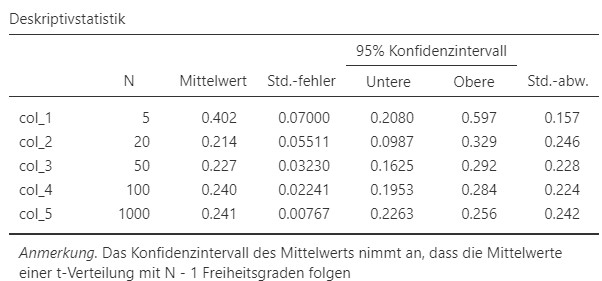
```

  a. Der Erwartungswert der Wartezeiten (das heisst der Populationsmittelwert der Wartezeiten) wird mit dem arithmetischen Mittel der Stichprobe geschätzt und kann in der Tabelle bei `Mittelwert` abgelesen werden. Der Erwartungswert der Wartezeiten beträgt bei allen Stichproben ausser bei der ersten ungefähr 0.22 Stunden, also ein bisschen weniger als eine Viertelstunde.
  b. Der Standardabweichung der Wartezeiten der Stichprobe sind in der Tabelle bei `Std.-abw.` abzulesen. Die Standardabweichungen sind für alle Stichproben ausser der ersten ungefähr bei 0.23.
  c. Die Standardabweichung der arithmetischen Mittel liegt bei $s/\sqrt{n}$. Für die erste Stichprobe ist dies $0.157 / \sqrt{5} = `r 0.157/sqrt(5)`$. Diese Werte werden auch als Standardfehler bezeichnet und sind in der Tabelle bei `Std.-fehler` ablesbar.
  d. Die untere und obere Schranke der 95%-Konfidenzintervalle sind bei `Untere` und `Obere` respektive abzulesen.  
  e. Die Länge des Konfidenzintervalls entspricht jeweils dem höheren Wert minus dem tieferen Wert. Für die erste Stichprobe ist dies $0.597 - 0.208 = `r (0.597 - 0.208)`$, für die anderen `r knitr::combine_words(map_dbl(exr_ki_mean_n_vary$ki_table$il[-c(1)], ~ round(.x, 2)), and = " und ", oxford_comma = FALSE)`.
  f. Die Schätzung des Erwartungswertes ist das arithmetische Mittel der Stichprobe. Da jedes Mal eine neue Zufallsstichprobe gezogen wurde und diese nicht dieselben Beobachtungen enthalten, ergeben sich auch jedes Mal andere Stichprobenmittelwerte.
  g. Je grösser $n$, desto kleiner ist das Konfidenzintervall. Wenn man also ein kleines Konfidenzintervall erreichen will, braucht man eine grössere Stichprobe.
:::


::: {.exercise #biologietest}
<!-- 
Ziel: 
- Einfluss der Standardabweichung auf das Konfidenzintervall erforschen.
-->
```{r exr-biologietest}
gen_exr_biologietest <- function(){
  set.seed(234)
  n <- 20
  tab <- tibble(test1 = rnorm(20, 15, 5),
                test2 = rnorm(20, 15, 2))
  file_name <- '04-exr-biologietest.sav'
  tab %>%
    write_sav(file_name)
  return(mget(ls()))
} 
exr_biologietest <- gen_exr_biologietest()
```

Eine Klasse bringt bei einem Biologietest eine durchwachsene Leistung. Die Lehrkraft entscheidet sich die genau gleichen Test zu wiederholen. Berichten Sie das durchschnittliche Resultat der beiden Tests und schätzen Sie den Einfluss der Standardabweichung auf die Länge des Konfidenzintervalls ein.
:::

:::{.solution}
Der Datensatz wird bei `Jamovi` eingelesen und die  Analyseparameter wie in Abbildung \@ref(fig:sol-biologietest-input) gesetzt. Die Nachkommastellen können im Menu oben rechts bei den drei vertikalen Punkten eingestellt werden.


```{r sol-biologietest-input, out.width='100%', fig.cap='Jamovi setzen der Analyseparameter.'}
knitr::include_graphics("figures/04-exr-biologietest-jmv-input.jpg")
```

Dies produziert das Analyseergebnis in Abbildung \@ref(fig:sol-biologietest-output).

```{r sol-biologietest-output, out.width='100%', fig.cap='Jamovi Ausgabe.'}
knitr::include_graphics("figures/04-exr-biologietest-jmv-output.jpg")
```

Die Klasse mit $N=20$ Lernenden hat beim ersten Biologietest eine durchschnittliche Punktzahl von $M=14.6$ Punkten $95\%$ KI $[11.9,17.3]$ erzielt. Bei der Wiederholung des Tests wurde eine durchschnittliche Punktzahl von $M=14.8$ Punkten $95\%$ KI $[14.0,15.6]$ erzielt. Die Standardabweichung des Testergebnisses war beim ersten Mal $SD=5.8$ Punkte und bei der Wiederholung $SD=1.7$ Punkte. Die Länge des Konfidenzintervalls war bei der ersten Durchführung mit $17.3-11.9=5.4$ Punkten bedeutend grösser als bei der zweiten Durchführung mit $15.6-14.0=1.6$. Eine grössere Standardabweichung führt also zu einer grösseren Länge des Konfidenzintervalls. Dies kann auch durch Durchprobieren von Testwerten in Gleichung \@ref(eq:ki-mean) festgestellt werden.
:::

## Test

::: {.exercise  #ki-theory}
Welche der folgenden Aussagen zum Konfidenzintervall des Erwartungswertes sind wahr, welche falsch?

a) Je mehr Personen befragt werden, desto grösser wird das Konfidenzintervall.
b) Je grösser die Standardabweichung des Merkmals, desto grösser wird das Konfidenzintervall.
c) Um ein kleineres Konfidenzintervall zu erreichen, können mehr Beobachtungen gemacht werden.
d) Je grösser die Irrtumswahrscheinlichkeit, desto grösser das Konfidenzintervall.
:::

:::{.solution}
a) Falsch
b) Richtig
c) Richtig
d) Falsch
:::

::: {.exercise  #ki-praxis}
Im Datensatz `r inline_code(exr_koerpergroesse_sex$file_name)` wurden Körpergrössen von Versuchsteilnehmenden erfasst. Welche der folgenden Aussagen sind wahr, welche falsch?

a) Die durchschnittliche Körpergrösse der Frauen liegt bei $M = 166.0$ cm $90\%$ KI $[164.7, 167.3]$.
b) Die durchschnittliche Körpergrösse der Männer liegt bei $M = 180.3$ cm $95\%$ KI $[178.6, 182.0]$.
c) Es wurden $N= 163$ Frauen beobachtet.
d) Die durchschnittliche Körpergrösse der Männer und Frauen liegt bei $M = 173.1$ cm $99\%$ KI $[171.4, 174.9]$.
:::

:::{.solution}
a) Falsch
b) Richtig
c) Richtig
d) Richtig
:::


<!--chapter:end:src/04-durchschnitt_und_standardabweichung_schaetzen.Rmd-->

# Zentrale Tendenz testen {#zentrale-tendenz-testen}

Eine andere Fragestellung, welche mit Daten beantwortet werden soll, ist, ob eine gewisse Aussage wahr ist oder falsch. [Eine solche Aussage wird **Hypothese** (Symbol: $H$) genannt.]{.customdef #customdef-hypothese} Eine Hypothese könnte zum Beispiel sein: 

> $H:$ Es regnet. 

Ist die Hypothese einmal gefunden, können Daten gesammelt werden, um diese Hypothese zu bestätigen oder zu falsifizieren. Das heisst man geht nach raus ins Feld. Spürt man Regen auf der Haut bedeutet dies, dass $H$ wahr ist. Spürt man keinen Regen, so ist $H$ falsch.

Wenn eine Hypothese wahr ist, dann ist das Gegenteil der Hypothese falsch. Weil oft über die Hypothese und ihr Gegenteil debattiert wird, ist es nützlich die beiden auch terminologisch auseinanderhalten zu können. [Die Hypothese, welche den bisherigen Informationsstand reflektiert wird **Nullhypothese** (Symbol $H_0$) genannt.]{.customdef #customdef-nullhypothese} War es draussen bei der letzten Messung vor einer Stunde schönes Wetter, dann ist die Nullhypothese

> $H_0:$ Es regnet nicht. 

[Das Gegenteil der Nullhypothese wird **Alternativhypothese** (Symbol $H_1$) genannt.]{.customdef #customdef-alternativhypothese} Im Beispiel ist die Alternativhypothese 

> $H_1:$ Es regnet.

Die Nullhypothese bleibt der Stand der Wahrheit, bis sie durch Daten widerlegt wurde. Wenn man noch drinnen ist, kann keine Aussage über die Wahrheit von $H_0$ und $H_1$ gemacht werden, da die Daten fehlen. In diesem Fall wird angenommen, dass $H_0$ weiterhin wahr ist. Wenn man draussen Regen auf der Haut spürt, deutet dieser Datenpunkt darauf hin, dass $H_0$ nicht länger wahr ist und jetzt wahrscheinlich $H_1$ wahr ist. In diesem Fall spricht man davon, dass $H_0$ **abgelehnt** und $H_1$ **angenommen** wird.

## Entspricht der Erwartungswert einem gewissen Wert?

Um eine Hypothese mit Daten überprüfbar zu machen, muss diese in eine Form gebracht werden, welche Daten einbezieht. Eine einfache Form einer solchen überprüfbaren Hypothese ist 

> $H:$ Das durchschnittliche Vermögen einer in der Schweiz lebenden Person beträgt $100'000$ CHF. 

Wenn die Population alle in der Schweiz lebenden Personen sind, dann entspricht dies also der Nullhypothese

> $H_0:\mu = 100'000$. 

Abstrahiert, soll bei dieser Problemstellung herausgefunden werden, ob der Erwartungswert einer Population einem gewissen Wert entspricht. Das Gegenteil dieser Nullhypothese ist die Alternativhypothese 

> $H_1: \mu \neq 100'000$. 

Dies bedeutet, dass das durchschnittliche Vermögen der Population nicht bei $100'000$ CHF liegt. [Weil die Alternativhypothese hier zwei Ausgänge zulässt, nämlich kleiner oder grösser als $100'000$ CHF wird diese Art der Hypothesenstellung als **zweiseitige Hypothese** bezeichnet.]{.customdef #customdef-zweiseitige-hypothese}

Eine weitere Form der Hypothese wäre 

> $H:$ Das durchschnittliche Vermögen einer in der Schweiz lebenden Person beträgt weniger als oder genau $100'000$ CHF. 

In Formelsprache übersetzt entspricht dies 

> $H_0: \mu \leq 100'000$. 

Das Gegenteil davon ist, wenn das durchschnittliche Vermögen grösser und ungleich 100'000 CHF ist, also 

> $H_1: \mu > 100'000$. 

[Weil die Alternativhypothese hier nur einen Ausgang zulässt, nämlich grösser als $100'000$ CHF wird dies als **einseitige Hypothese** bezeichnet. Eine einseitige Hypothese kann auf beide Seiten formuliert sein: $H_0:\mu \leq 100'000$ und $H_1: \mu > 100'000$, wie eben erwähnt oder auch $H_0:\mu \geq 100'000$ und $H_1: \mu < 100'000$.]{.customdef #customdef-einseitige-hypothese}


::::{.caution data-latex=""}
::: {.remark}
Die verwendeten Zeichen in den Formeln sind

- $=$: Gleichheit, sprich "gleich". Beispiele: 
    - $3 = 3$ ($3$ gleich $3$) ist eine wahre Aussage. 
    - $3 = 4$ ($3$ gleich $4$) ist eine falsche Aussage.
- $\neq$: Ungleichheit, sprich "ungleich" oder "nicht gleich". Beispiele: 
    - $3 \neq 3$ ($3$ ist nicht gleich $3$) ist eine falsche Aussage. 
    - $3 \neq 4$ ($3$ ist nicht gleich $4$) ist eine wahre Aussage.
- $<$: Kleiner, sprich "kleiner". Beispiele: 
    - $4 < 3$ ($4$ ist kleiner als $3$) ist eine falsche Aussage. 
    - $3 < 3$ ($3$ ist kleiner als $3$) ist eine falsche Aussage. 
    - $3 < 4$ ($3$ ist kleiner als $4$) ist eine wahre Aussage.
- $\leq$: Kleiner gleich, sprich "kleiner gleich". Beispiele: 
    - $4 \leq 3$ ($4$ ist kleiner oder gleich wie $3$) ist eine falsche Aussage.
    - $3 \leq 3$ ($3$ ist kleiner oder gleich wie $3$) ist eine wahre Aussage. 
    - $3 \leq 4$ ($3$ ist kleiner oder gleich wie $4$) ist eine wahre Aussage.
- $>$: Grösser, sprich "grösser". Beispiele: 
    - $4 > 3$ ($4$ ist grösser als $3$) ist eine wahre Aussage. 
    - $3 > 3$ ($3$ ist grösser als $3$) ist eine falsche Aussage. 
    - $3 > 4$ ($3$ ist grösser als $4$) ist eine falsche Aussage.
- $\geq$: Grösser gleich, sprich "grösser gleich". Beispiele: 
    - $4 \geq 3$ ($4$ ist grösser oder gleich wie $3$) ist eine wahre Aussage. 
    - $3 \geq 3$ ($3$ ist grösser oder gleich wie $3$) ist eine wahre Aussage. 
    - $3 \geq 4$ ($3$ ist grösser oder gleich wie $4$) ist eine falsche Aussage.
    
:::
::::


:::{.example #vermoegen name="Vermögen"}

```{r exm-vermoegen}
gen_exm_vermoegen <- function(){
  # x ~ chisq(df)
  # a * x ~ a chisq(df)
  # E(a*x) ~ a E(chisq(df)) = a df
  # Var(a*x) ~ a^2 Var(x) = a^2 2k / n
  df <- 3L
  mu0 <- 100000
  scale_factor <- mu0/df
  
  n <- 20L
  set.seed(61)
  x <- scale_factor * rchisq(n, df)
  scores_hover <- x / 1000 # hovering with K CHF in scale
  x_mean <- x %>% mean()
  x_sd <- x %>% sd()
  t_emp <- (x_mean - mu0)/(x_sd/sqrt(n))
  p_value_the <- 1-pt((x_mean - 100000)/ (x_sd / sqrt(n)), n-1)
  effect_size <- (x_mean - mu0) / x_sd

  
  file_name <- '05-exm-vermoegen.sav'
  tibble(vermoegen = x) %>% write_sav(file_name)
  
  # distribution if H_0 were true
  n_samples <- 3000L
  x_means <- 1:n_samples %>% 
    map_dbl(~ mean(scale_factor*rchisq(n, df)))
  q95_x_means <- x_means %>% quantile(c(0.95)) %>% unlist() %>% unname()
  p_value_emp <- mean(x_means > x_mean)
  
  # plot sampling bag
  n_bag <- 200L
  scores_bag <- list(40*rchisq(n_bag,df),
                   # 60*rchisq(n_bag,df)
                   45*rchisq(n_bag,df)
                   )
  plots <- list()
  for (i in 1:length(scores_bag)) {
    plots[[i]] <- plot_ball_bag(
      scores_bag = scores_bag[[i]],
      scores_hover = scores_hover,
      score_name = "1000 CHF",
      seed = 123+i,
      no_legend = c(TRUE, FALSE)[i],
      limit_scores = c(0, 400)
    )
  }
  
  # plot histogram of sample means
  plot_hist_density <- plot_hist_denstiy_expected_value(
    x_means, 
    scale_factor*df, 
    sqrt((scale_factor)^2*2*df), 
    n,
    "Vermögen CHF",
    5000)
  
  line_xlim <- xlim(c(40000, 180000))
  sigma_g <- x_sd / sqrt(n)
  x_range_bounds <- c(mu0-3*sigma_g, mu0+3*sigma_g)
  x_range <- seq(x_range_bounds[1], x_range_bounds[2], length.out = 1000)
  create_text_data <- function(x,y,z){
    plot_attr_reja_pval$create_text_data(10000*c(6,13),x,y,z)
  }
  # Create data for histograms
  histogram_data <- tibble(
    x = rep(x_means, 2),
    plot_type = rep(c("Histogram p-Wert", 
                      "Histogram Ablehnungsbereich"), 
                    each = length(x_means))
  ) %>%
    plot_attr_reja_pval$add_colors(side = "right", upper = q95_x_means, test_stat = x_mean)
  
  # Create data for density plots
  density_data <- tibble(
    x = rep(x_range, 2),
    y = dt((x - mu0) / sigma_g, n - 1) / sigma_g,
    plot_type = rep(c("Verteilung p-Wert", 
                      "Verteilung Ablehnungsbereich"), 
                    each = length(x_range))
  )  %>%
    plot_attr_reja_pval$add_colors(side = "right", upper = q95_x_means, test_stat = x_mean)
  
  # Create text data for all plots
  text_sign <- c('95%', '5%')
  text_data_all <- bind_rows(
    create_text_data(
      round(100 *c(1 - p_value_emp, p_value_emp),1) %>% 
        str_c('%'),
      200,
      "Histogram p-Wert"
    ),
    create_text_data(
      text_sign, 
      200,
      "Histogram Ablehnungsbereich"
    ),
    create_text_data(
      round(100 *c(1-p_value_the, p_value_the),1) %>% 
        str_c('%'),
      0.000015, 
      "Verteilung p-Wert"
    ),
    create_text_data(
      text_sign, 
      0.000015,
      "Verteilung Ablehnungsbereich"
    )
  )
  
  
  
  plot_hist_curve_pval_reja <- ggplot() +
    geom_histogram(data = histogram_data,
                   aes(x = x, fill = color),
                   binwidth = 4300) +
    geom_area(data = density_data,
              aes(x = x, y = y, fill = color),
            stat = "identity") +
    geom_vline(xintercept = x_mean) +
    geom_text(data = text_data_all,
              mapping = aes(x = x, y = y, label = label, colour = color)) +
    facet_wrap(~ plot_type, nrow = 2, scales = "free_y", 
               strip.position = "top",
               labeller = plot_attr_reja_pval$custom_labeller) +
    line_xlim +
    plot_attr_reja_pval$theme +
    labs(x = "Vermögen", y = "W.-dichte                              Häufigkeit")

  return(mget(ls()))
}
exm_vermoegen <- gen_exm_vermoegen()
```

<!-- ```{r} -->
<!-- 1-pnorm(mean(exm_vermoegen$x), 100000, sd(exm_vermoegen$x_means)) -->
<!-- 1-pnorm(mean(exm_vermoegen$x), 100000, sd(exm_vermoegen$x) / sqrt(exm_vermoegen$n)) -->

<!-- 1-pt((mean(exm_vermoegen$x) - 100000)/ sd(exm_vermoegen$x_means), exm_vermoegen$n-1) -->
<!-- 1-pt((mean(exm_vermoegen$x) - 100000)/ (sd(exm_vermoegen$x) / sqrt(exm_vermoegen$n)), exm_vermoegen$n-1) -->
<!-- ``` -->

Eine Sozialpolitikberatungsfirma will herausfinden, ob das durchschnittliche Vermögen der in der Schweiz lebenden Personen im letzten Jahr gestiegen ist. Sie stellen dazu basierend auf dem aktuellen Wissensstand die Nullhypothese auf, dass das durchschnittliche Vermögen nicht gestiegen ist, und die Alternativhypothese, dass das durchschnittliche Vermögen gestiegen ist:

> $H_0: \mu \leq 100'000$ CHF

> $H_1: \mu > 100'000$ CHF

Um die Hypothesen auf einer Datengrundlage zu evaluieren, erfragt es das Vermögen von $n=`r exm_vermoegen$n`$ zufällig ausgewählten Personen und findet ein durchschnittliches Vermögen von $M=`r round(mean(exm_vermoegen$x))`$ CHF.

:::

Es kann nun schnell gesagt werden, dass das durchschnittliche Vermögen in der Population gestiegen ist, weil $`r round(mean(exm_vermoegen$x))`$ CHF grösser ist als $100'000$ CHF. Dies so zu behaupten wäre jedoch falsch, weil nicht alle Personen in der Population befragt wurden, sondern lediglich eine Zufallsstichprobe. Wie in Kapitel \@ref(stichprobenziehung) muss hier für eine Generalisierung der Stichprobe auf die Population der Effekt der zufälligen Stichprobenziehung miteinbezogen werden. 

Aufgrund der Zufallsstichprobe ist es unmöglich zu sagen, ob unsere Stichprobe eine eher seltene Stichprobenziehung aus einer Population mit unverändertem durchschnittlichen Vermögen von $100'000$ CHF ist (Abbildung \@ref(fig:exm-vermoegen-sampling-plot) links) oder ob es eine eher häufig vorkommende Stichprobenziehung aus einer Population mit höherem durchschnittlichen Vermögen ist (Abbildung \@ref(fig:exm-vermoegen-sampling-plot) rechts). 

```{r exm-vermoegen-sampling-plot, fig.cap="Vorgestellte Zufallsstichprobenziehung. Links: Nullhypothese ist wahr. Rechts: Nullhypothese ist falsch. Die grauen Punkte entsprechen Vermögen über 400'000 CHF.", echo = FALSE}
do.call(grid.arrange, c(exm_vermoegen$plots, ncol = 2))
```

Es kann jedoch ausgesagt werden, mit welcher Wahrscheinlichkeit der gefundene Stichprobenmittelwert realisiert wird, gegeben dass die Nullhypothese wahr ist. Hier wird also angenommen, dass eine Population mit Erwartungswert $\mu = 100'000$ CHF vorliegt und dass anschliessend zum Beispiel $`r exm_vermoegen$n_samples`$ Stichproben an je $`r exm_vermoegen$n`$ Beobachtungen pro Stichprobe gezogen werden. Von jeder dieser Stichproben wird das arithmetische Mittel berechnet. In der Verteilung dieser Mittelwerte, siehe Abbildung \@ref(fig:exm-vermoegen-histogram-plot), wird nun der tatsächliche Mittelwert der Stichprobe $\bar{x} = `r round(exm_vermoegen$x %>% mean())`$ verortet. 

```{r exm-vermoegen-histogram-plot, fig.cap="TODO.", echo = FALSE}
exm_vermoegen$plot_hist_density + 
  geom_vline(xintercept = exm_vermoegen$x %>% mean())+
  scale_x_continuous(n.breaks = 10)
```

Der beobachtete Mittelwert ist zwar nicht genau bei $100'000$ CHF, aber trotzdem noch einigermassen plausibel, wenn die Nullhypothese stimmt. Um diesen Gedanken zu formalisieren, gibt es zwei Denkweisen, welche nun vorgestellt werden.

Die eine Denkweise wurde von [Ronald Fisher](https://en.wikipedia.org/wiki/Ronald_Fisher) propagierte. Sie stellt die Frage nach der Wahrscheinlichkeit, dass zufällig der beobachtete Wert oder ein noch extremerer Wert in Richtung der Alternativhypothese resultiert, gegeben die Nullhypothese ist wahr. Im Beispiel entspricht dies der Wahrscheinlichkeit den Wert $`r round(exm_vermoegen$x %>% mean())`$ oder einen grösseren Wert zu beobachten, wenn der Erwartungswert tatsächlich bei $100'000$ CHF liegt. Um diese Wahrscheinlichkeit zu bestimmen, kann einfach gezählt werden, welcher Anteil der Stichprobenmittelwerte grösser oder gleich $`r round(exm_vermoegen$x %>% mean())`$ CHF ist. Im Beispiel sind dies $`r round(exm_vermoegen$p_value_emp,3)` = `r round(exm_vermoegen$p_value_emp*100,1)`\%$. [Dieser Wert wird, abgeleitet vom englischen _probability_, **$p$-Wert** (Symbol: $p$) genannt. Beim Berichten des $p$-Werts wird normalerweise die führende $0$ nicht geschrieben, also $p = `r round(exm_vermoegen$p_value_emp,3) %>% str_sub(2)`$.]{.customdef #customdef-pwert} 

[Bei der anderen von Neyman und Pearson propagierten Denkweise muss noch vor der Datenerhebung ein sogenanntes **Signifikanzniveau** (Symbol $\alpha$, sprich 'alpha')  bestimmt werden. Dieser Wert entspricht der Wahrscheinlichkeit, dass der statistische Test die Nullhypothese verwirft, obwohl diese wahr gewesen wäre. Normalerweise wird $\alpha = 5\%$ gesetzt.]{.customdef #customdef-signifikanzniveau} Es wird also akzeptiert, dass ein statistischer Test in $5\%$ der Fälle gegen die Nullhypothese entscheidet, obwohl diese wahr wäre. [In einem zweiten Schritt wird bestimmt, welches die $5\%$ unwahrscheinlichsten Werte sind, wenn die Nullhypothese wahr ist. Diese Werte werden **Ablehnungsbereich** genannt.]{.customdef #customdef-ablehnungsbereich} Im Beispiel sind dies die $5\%$ höchsten Werte, nämlich Vermögen von $`r round(exm_vermoegen$q95_x_means)`$ CHF und grössere Vermögen. Nun wird bestimmt, ob der tatsächliche beobachtete Wert im Ablehnungsbereich liegt oder nicht. [Im Beispiel liegt der Stichprobenmittelwert $`r round(exm_vermoegen$x_mean)`$ CHF nicht im Ablehnungsbereich. In diesem Fall wird die Nullhypothese nicht verworfen und das Testresultat erhält das Prädikat **nicht signifikant**. Läge der Stichprobenmittelwert im Ablehnungsbereich, so wäre das Testresultat als **signifikant** einzustufen.]{.customdef #customdef-signifikanz}

::::{.caution data-latex=""}
::: {.remark}
Ein signifikanter Unterschied bedeutet im allgemeinen Sprachgebrauch ein _bedeutsamer, substanzieller_ Unterschied. Im statistischen Kontext bedeutet ein _signifikanter Unterschied_, wie oben beschrieben, dass ein Unterschied bis auf eine gewisse Irrtumswahrscheinlichkeit (angegeben durch das Signifikanzniveau) _nicht zufällig_ zustande gekommen ist. Ein _nicht signifikanter Unterschied_ bedeutet dagegen, dass die Beobachtung _zufällig_ zustande gekommen sein könnte. Für letzteres gibt es zwei Erklärungen: (1) $H_0$ ist tatsächlich wahr. (2) $H_0$ ist zwar falsch, aber die Stichprobenziehung hat zufällig zu einem ähnlichen Resultat geführt, wie wenn $H_0$ wahr wäre. Ist ein Testresultat nicht signifikant, so kann also nicht genau gesagt werden, ob $H_0$ wahr ist oder nicht. Ist das Testresultat signifikant, so ist $H_0$ eher unwahrscheinlich.

In manchen Texten werden allgemeine und auch statistische Fragen bearbeitet. Hier empfiehlt sich für den allgemeinen Sprachgebrauch _substanziell_ und für die statischen Aussagen _statistisch signifikant_ zu verwenden.

Es wird ausserdem empfohlen, das Wort signifikant immer nur als Prädikat für eine Qualifizierung der Nullhypothese zu verwenden. Im Beispiel war $H_0: \mu \leq 100'000$CHF. Korrekte Aussage sind: 
- Das durchschnittliche Vermögen ist im letzten Jahr nicht signifikant gewachsen.
- Das durchschnittliche Vermögen ist in diesem Jahr nicht signifikant grösser als $100'000$ CHF.

:::
::::

Die beiden Denkarten entsprechen sich insofern, als ein $p$-Wert kleiner als $5\%$ ein signifikantes Resultat bei Signifikanzniveau $\alpha = 5\%$ bedeutet. In der Praxis werden beide Methoden verwendet. Im Beispiel liegt der $p$-Wert bei $p = `r round(exm_vermoegen$p_value_emp,3) %>% str_sub(2)`$. Dies bedeutet, dass die Wahrscheinlichkeit zufällig den realisierten Stichprobenmittelwert zu erhalten, gegeben, dass die Nullhypothese stimmt, grösser als $5\%$ ist und demnach auch der Unterschied nicht signifikant ist.

Ein noch zu lösendes Problem ist, dass normalerweise Geld, Zeit und Nerven fehlen, um eine Stichprobenziehung $`r exm_vermoegen$n_samples`$-mal zu wiederholen. Hier hilft es wieder zu beobachten, dass die Verteilung der Werte des Histogramms in Abbildung \@ref(fig:exm-vermoegen-histogram-plot) wieder mit zunehmender Stichprobengrösse immer genauer einer Normalverteilung folgen. Tatsächlich trifft es aufgrund des [zentralen Grenzwertsatzes](#customdef-zentraler-grenzwertsatz) immer zu, dass wenn ein Merkmal mit $N$ Beobachtungen, Erwartungswert $\mu$ und Standardabweichung $\sigma$ hat, der Wert

$$z = \frac{\bar{x}-\mu}{\frac{\sigma}{\sqrt{n}}}$$
normalverteilt ist, wobei $\mu$ hier dem Wert der Nullhypothese entspricht, also $100'000$ CHF. Dies entspricht der roten Linie in Abbildung \@ref(fig:exm-vermoegen-histogram-plot). Ist die Standardabweichung des Merkmals $\sigma$ in der Population unbekannt, so wird diese mit der Standardabweichung in der Stichprobe $s$ geschätzt. Diese zusätzliche Unsicherheit führt dazu, dass
\begin{equation}
t = \frac{\bar{x}-\mu}{\frac{s}{\sqrt{n}}}
(\#eq:t-emp-onesample)
\end{equation}
<!-- TODO: Discuss: I don't give the numerical values for t because they do not correspond to the distribution in the figure below because of the scaling and would therefore confuse the reader. -->
nicht mehr normal-, sondern $t$-verteilt ist bei $n-1$ Freiheitsgraden (grüne Linie, Abbildung \@ref(fig:exm-vermoegen-histogram-plot)). Die $t$-Verteilung mit allen Freiheitsgraden ist in `Jamovi` hinterlegt und es kann der Software überlassen werden den $p$-Wert und den Ablehnungsbereich genau zu bestimmen. In Abbildung \@ref(fig:exm-vermoegen-plots-sampling-theorie) wurde nochmal illustriert, dass es bei vielen Beobachtungen der theoretische $p$-Wert (Kurve) mit dem empirischen $p$-Wert der Simulationen (Histogramm) übereinstimmt respektive der Ablehnungsbereich der $t$-Verteilung (Kurve) gleich ist, wie der simulierte Ablehnungsbereich (Histogramm).

<!-- TODO: Discuss  -->
<!-- - why p-Wert does not correspond exactly to empirical p-Wert? -->
<!-- - what is that uncertainty w.r.t. the rejection area? -->

```{r exm-vermoegen-plots-sampling-theorie, fig.cap="Oben: Histogramm der simulierten Verteilung; unten: theoretische t-Verteilung; links: Illustration p-Wert; rechts: Illustration Ablehnungsbereich. Die Linie entspricht dem beobachteten Stichprobenmittelwert."}
exm_vermoegen$plot_hist_curve_pval_reja
```

[Die Berechnung des für den Test relevanten Wertes, hier des $t$-Wertes wird **Teststatistik** (oder auch _Prüfgrösse_ oder nur _Statistik_) genannt.]{.customdef #customdef-teststatistik} Eine Teststatistik hat normalerweise eine bekannte theoretische Verteilung, welcher die Teststatistik folgt, wenn die Nullhypothese wahr ist. [Aufgrund der theoretischen $t$-Verteilung der vorliegenden Statistik und der einen Stichprobe (vgl. nächstes Kapitel) wird dieser Test **Einstichproben-$t$-Test** genannt.]{.customdef #customdef-t-test}

Das oben gefundene Resultat wird in der folgenden Form berichtet:

> Ein Einstichproben-$t$-Test ergibt, dass das durchschnittliche Vermögen ($M = `r round(exm_vermoegen$x_mean)`$ CHF, $SD = `r round(exm_vermoegen$x_sd)`$, $N = `r round(exm_vermoegen$n)`$) in diesem Jahr nicht signifikant grösser als $100'000$ CHF ist, $t(`r round(exm_vermoegen$n-1)`) = `r round(exm_vermoegen$t_emp,3)`$, $p = `r round(exm_vermoegen$p_value_the,3) %>% str_sub(start = 2L)`$.

::::{.caution data-latex=""}
::: {.remark}
Folgende Begriffe und Zahlen werden dabei verwendet:

- Das _durchschnittliche_ Vermögen (fehlt durchschnittlich ist die Aussage falsch).
- $M$, $SD$, $N$ entsprechen dem arithmetischen Mittel, der geschätzten Standardabweichung und der Anzahl Beobachtungen in der Stichprobe. Die Einheit muss nicht wiederholt werden.
- Signifikanz (siehe letzter Hinweis)
- grösser als $100'000$ CHF ist die Referenz zur Alternativhypothese
- $t(`r round(exm_vermoegen$n-1)`)$ bedeutet, dass die Teststatistik $t$-verteilt ist mit $`r round(exm_vermoegen$n-1)`$ Freiheitsgraden.
- $`r round(exm_vermoegen$t_emp,3)`$ ist der Wert der Teststatistik berechnet mit Formel \@ref(eq:t-emp-onesample) aus der Stichprobe. Dieser Wert ist skaliert und muss im Kontext der standardisierten $t$-Verteilung wie in Abbildung \@ref(fig:t-distribution) interpretiert werden.
- $p = `r round(exm_vermoegen$p_value_the,3) %>% str_sub(start = 2L)`$ entspricht dem $p$-Wert. Es wird normalerweise die führende $0$ weggelassen (also nicht $`r round(exm_vermoegen$p_value_the,3)`)$, da es sich um eine Zahl handelt, welche nie kleiner als $0$ oder grösser als $1$ sein kann.
:::
::::


:::{.example #alexithymie name="Alexithymie"}

```{r exm-alexithymie}
gen_exm_alexithymie <- function(){
  set.seed(1982)
  mu0 <- 100
  x_min <- 37
  x_max <- 185
  n <- 391
  
  x <- rnorm(n, 96, 25) 
  x <- crop(x, x_min, x_max)
  x[which(x < x_min)] <- x_min
  x[which(x > x_max)] <- x_max
  # x %>% summary()
  # x %>% t.test(alternative = 'two.sided',
  #              mu = 100)
  x_mean <- x %>% mean()
  x_mean_sym <- mu0 + (mu0 - x_mean)
  x_sd <- x %>% sd()
  t_emp <- (x_mean - mu0)/(x_sd/sqrt(n))
  p_value_the <- 2*pt((x_mean - mu0)/ (x_sd / sqrt(n)), n-1)
  effect_size <- (x_mean - mu0) / x_sd
  
  file_name <- '05-exm-alexithymie.sav'
  tibble(alexithymie = x) %>% write_sav(file_name)
  
  # distribution if H_0 were true
  n_samples <- 4000L
  x_means <- 1:n_samples %>% 
    map_dbl(~ mean(rnorm(n, mu0, 25)))
  q975_x_means <- x_means %>% quantile(c(0.975)) %>% unlist() %>% unname()
  q025_x_means <- x_means %>% quantile(c(0.025)) %>% unlist() %>% unname()
  p_value_emp <- mean(x_means < x_mean | x_means > mu0 + (mu0 - x_mean))
  
  # plot histogram of sample means
  plot_hist_density <- plot_hist_denstiy_expected_value(
    x_means, 
    mu0, 
    x_sd, 
    n,
    "Alexithymie CHF",
    0.25)
  
  line_xlim <- xlim(c(95, 105))
  sigma_g <- x_sd / sqrt(n)
  x_range <- seq(mu0-3*sigma_g, mu0+3*sigma_g, length.out = 1000)
  create_text_data <- function(x,y,z){
    plot_attr_reja_pval$create_text_data(c(98, 102),x,y,z)
  }
  # Create data for histograms
  histogram_data <- tibble(
    x = rep(x_means, 2),
    plot_type = rep(c("Histogram p-Wert", 
                      "Histogram Ablehnungsbereich"), 
                    each = length(x_means))
  ) %>%
    plot_attr_reja_pval$add_colors(side = "both", upper = q975_x_means, lower = q025_x_means, test_stat = x_mean, mu0 = mu0)
  
  # Create data for density plots
  density_data <- tibble(
    x = rep(x_range, 2),
    y = dt((x - mu0) / sigma_g, n - 1) / sigma_g,
    plot_type = rep(c("Verteilung p-Wert", 
                      "Verteilung Ablehnungsbereich"), 
                    each = length(x_range))
  ) %>%
    plot_attr_reja_pval$add_colors(side = "both", upper = q975_x_means, lower = q025_x_means, test_stat = x_mean, mu0 = mu0)
  
  # Create text data for all plots
  text_pval <- str_c(round(100 * c(1 - p_value_emp, p_value_emp), 1), '%')
  text_sign <- c('95%', '5%')
  text_data_all <- bind_rows(
    create_text_data(
      text_pval,
      200,
      "Histogram p-Wert"
    ),
    create_text_data(
      text_sign, 
      200,
      "Histogram Ablehnungsbereich"
    ),
    create_text_data(
      round(100 *c(1-p_value_the,p_value_the),1) %>% 
        str_c('%'),
      0.25, 
      "Verteilung p-Wert"
    ),
    create_text_data(
      text_sign, 
      0.25,
      "Verteilung Ablehnungsbereich"
    )
  )
  
  plot_hist_curve_pval_reja <- ggplot() +
    geom_histogram(data = histogram_data,
                   aes(x = x, fill = color),
                   binwidth = 0.25) +
    
    geom_area(data = density_data,
              aes(x = x, y = y, fill = color),
            stat = "identity") +
    geom_vline(xintercept = x_mean) +
    geom_text(data = text_data_all,
              mapping = aes(x = x, y = y, label = label, colour = color)) +
    facet_wrap(~ plot_type, nrow = 2, scales = "free_y", 
               strip.position = "top",
               labeller = plot_attr_reja_pval$custom_labeller) +
    line_xlim +
    plot_attr_reja_pval$theme +
    labs(x = "Alexithymie", y = "W.-dichte                              Häufigkeit")

  return(mget(ls()))
}
exm_alexithymie <- gen_exm_alexithymie()
```

Mit Gefühlsblindheit oder _Alexithymie_ (griechisch: a = ohne, lexis= lesen, sprechen, thymie = Gefühle) werden Einschränkungen bei der Fähigkeit Emotionen wahrzunehmen, zu erkennen und zu beschreiben bezeichnet. Es gibt ein online [Messinstrument](https://www.alexithymie.com/de/), welches die Alexithymie auf einer Skala von $`r exm_alexithymie$x_min`$ Punkten (kleine Gefühlsblindheit) bis $`r exm_alexithymie$x_max`$ (grosse Gefühlsblindheit) misst. Die Skala wurde so gewählt, dass die durchschnittliche Alexithymie aller Menschen bei $`r exm_alexithymie$mu0`$ liegt. Eine Psychologin interessiert sich nun dafür, ob junge Menschen unter $25$ durchschnittlich andere Alexithymie-Werte aufweisen als die Gesamtbevölkerung. Um dies zu testen, befragt sie $N = `r exm_alexithymie$n`$ unter $25$-jährige mit besagtem Messinstrument. In dieser Gruppe wurde eine durchschnittliche Alexithymie von $M = `r round(exm_alexithymie$x_mean,1)`$ Punkten festgestellt.
:::

<!-- Discuss: Was könnten gründe sein für eine tiefere, höhrere Alexithymie? -->
<!-- Es kann festgestellt werden, dass das wahrnehmen, erkennen und beschreiben von Emotionen in den letzten Jahrzehnten vermehrt in den Fokus der Früherziehung gerückt ist. -->
<!-- Discuss: Wieso ist hier ein Test nötig? -->

Der erste Schritt ist auch hier die Null- und Alternativhypothesen aufzustellen. Die Psychologin stellt die Frage, ob sich die durchschnittliche Alexithymie in der Grundgesamtheit, in der Folge mit $\mu$ bezeichnet, von $100$ unterscheidet oder nicht. Es ist zu beobachten, dass sie keine Annahme über die Richtung der Abweichung trifft (eine höhere oder eine tiefere Alexithymie wären denkbar) und es sich deshalb um eine zweiseitige Hypothesenstellung handelt. 

Die Nullhypothese beschreibt den bisherigen Informationsstand, also dass die durchschnittliche Alexithymie der Population bei $100$ Punkten liegt, oder kurz

> $H_0:\mu = 100$ Punkte. 

Die Alternativhypothese besagt das Gegenteil davon, also hier, dass die durchschnittliche Alexithymie nicht mehr bei $100$ Punkten liegt, oder kurz

> $H_1: \mu \neq 100$ Punkte. 

Um die Wahrscheinlichkeit des beobachteten arithmetischen Mittels der Stichprobe von $M = `r round(exm_alexithymie$x_mean,1)`$ Punkten zu ermitteln, gegeben, dass die Nullhypothese wahr ist, kann erneut auf den Gedanken der wiederholten Stichprobenziehung zurückgegriffen werden. Bei diesem Gedankenexperiment wird angenommen, dass Nullhypothese wahr ist und dass das die Untersuchung $`r exm_alexithymie$n_samples`$-mal wiederholt wurde mit jeweils $`r exm_alexithymie$n`$ Beobachtungen. Von jeder dieser Stichproben kann wiederum das arithmetische Mittel berechnet werden. Die Verteilung dieser arithmetischen Mittel ist in Abbildung \@ref(fig:exm-alexithymie-plot) oben dargestellt.

```{r exm-alexithymie-plot, fig.cap="Oben: Histogramm der simulierten Verteilung der Alexithymie-Mittelwerte; unten: theoretische t-Verteilung; links: Illustration p-Wert; rechts: Illustration Ablehnungsbereich. Die Linie entspricht dem beobachteten Stichprobenmittelwert."}
exm_alexithymie$plot_hist_curve_pval_reja
```

Der $p$-Wert, also die Wahrscheinlichkeit, dass der beobachtete Wert oder ein noch extremerer Wert in Richtung der Alternativhypothese resultiert, wird hier aufgrund der zweiseitigen Hypothesenstellung auch zweiseitig ausgelegt. Extremer in Richtung der Alternativhypothese meint hier alle Werte, die weiter weg als der beobachtete Durchschnittswert $`r round(exm_alexithymie$x_mean,1)`$ vom hypothetischen Erwartungswert $\mu = `r exm_alexithymie$mu0`$ sind. Konkret sind dies alle Werte, welche kleiner als $`r round(exm_alexithymie$x_mean,1)`$, und alle Werte, welche grösser als $`r round(exm_alexithymie$x_mean_sym,1)`$ sind (roter Bereich in Abbildung \@ref(fig:exm-alexithymie-plot) oben rechts). Der Anteil der Werte, welche diese Bedingung erfüllen liegt bei $p = `r round(100*exm_alexithymie$p_value_emp,1)`\%$. Es ist demnach recht unwahrscheinlich, dass die Nullhypothese stimmt und zufällig ein Stichprobendurchschnittswert von $`r round(exm_alexithymie$x_mean,1)`$ Alexithymie-Punkten herauskommt.

Aufgrund der zweiseitigen Hypothesenstellung beinhaltet auch der Ablehnungsbereich sowohl die tiefsten $2.5\%$ und höchsten $2.5\%$, also insgesamt die $5\%$ extremen Durchschnittswerte. Dies sind alle Werte tiefer als  $`r round(exm_alexithymie$q025_x_means,2)`$ und alle Werte höher als $`r round(exm_alexithymie$q975_x_means,2)`$ (roter Bereich in Abbildung \@ref(fig:exm-alexithymie-plot) oben links). Da das arithmetische Mittel der Stichprobe $`r round(exm_alexithymie$x_mean,1)`$ im Ablehnungsbereich liegt, liegt hier ein signifikantes Resultat vor bei Signifikanzniveau $5\%$.

Auch in diesem Fall kann die Verteilung der Stichprobenmittelwerte mit dem zentralen Grenzwertsatz angenähert werden. Es ergeben sich annähernd dieselben Resultate für den $p$-Wert (roter Bereich in Abbildung \@ref(fig:exm-alexithymie-plot) unten rechts) und für den Ablehnungsbereich (roter Bereich in Abbildung \@ref(fig:exm-alexithymie-plot) unten links).

Die Psychologin kann nun wie folgt berichten:

> Ein Einstichproben-$t$-Test ergibt, dass die durchschnittliche Alexithymie ($M = `r round(exm_alexithymie$x_mean,1)`$ Punkte, $SD = `r round(exm_alexithymie$x_sd,1)`$, $N = `r round(exm_alexithymie$n)`$) sich bei den unter 25-jährigen signifikant vom Populationsdurchschnitt von $100$ Punkten unterscheidet, $t(`r round(exm_alexithymie$n-1)`) = `r round(exm_alexithymie$t_emp,3)`$, $p = `r round(exm_alexithymie$p_value_the,3) %>% str_sub(start = 2L)`$.


## Weicht der gefundene Durchschnitt stark vom hypothetischen Wert ab?

<!-- Discuss: Probleme (grosses n -> immer signifikant, je nach Einheit ist Erwartungswertunterschied ganz anders). -->

In einem so berichteten Testresultat sind essenziell zwei Informationen enthalten: (1) was sind die getesteten Hypothesen und (2) wie wahrscheinlich es ist, dass das gefundene Resultat eine Folge der Zufallsstichprobenziehung ist. Was hier noch fehlt ist eine Angabe darüber, wie gross die praktische Relevanz dieses Testresultates ist.

Um eine solche Relevanz zu messen wurde der Begriff der Effektstärke eingeführt. Eine Effektstärke ist eine Zahl ohne Einheit (Meter, Franken, ...), welche unabhängig von der Stichprobengrösse ist und nahe bei null liegt, wenn die Nullhypothese nicht abgelehnt wurde.

Wird im Vermögensbeispiel \@ref(exm:vermoegen) die Differenz zwischen geschätztem Erwartungswert und hypothetischem Erwartungswert 
$$\bar{x} - \mu = `r round(exm_vermoegen$x_mean)` \text{CHF} - `r exm_vermoegen$mu0` \text{CHF}  = `r round(exm_vermoegen$x_mean)-exm_vermoegen$mu0`$$
betrachtet, so fällt auf, dass dieser Wert bereits zwei der oben genannten Eigenschaften aufweist. Tatsächlich ist dieser Wert unabhängig von der Stichprobengrösse und er liegt nahe bei $0$, wenn das Testresultat nicht signifikant war. Letzteres kann beobachtet werde indem in der Formel \@ref(eq:t-emp-onesample) verschiedene Differenzen eingesetzt werden und mit der Abbildung  \@ref(fig:t-distribution) verglichen werden. 

<!-- Discuss: how? -->

Wenn jetzt ein anderer Sozialpsychologe die Auswertung wiederholen würde, aber statt in CHF in Rappen Rp rechnet, dann erhält er den Wert
$$\bar{x} - \mu = `r 100*round(exm_vermoegen$x_mean)` \text{Rp} - `r exm_vermoegen$mu0*100` \text{Rp}  = `r (round(exm_vermoegen$x_mean)-exm_vermoegen$mu0)*100`.$$
Dass mit den gleichen Zahlen je nach Einheit eine andere Effektstärke gefunden wird, ist unpraktisch für den Vergleich der Testresultate. Die Lösung in diesem Fall ist diese Differenz durch die geschätzte Standardabweichung zu rechnen. Dies ergibt

- in CHF: $d = \frac{\bar{x} - \mu}{s} = \frac{`r round(exm_vermoegen$x_mean)` \text{CHF} - `r exm_vermoegen$mu0` \text{CHF}}{`r round(exm_vermoegen$x_sd)`\text{CHF}}  = `r round((round(exm_vermoegen$x_mean)-exm_vermoegen$mu0)/round(exm_vermoegen$x_sd),2)`$
- in Rp: $d = \frac{\bar{x} - \mu}{s} = \frac{`r 100*round(exm_vermoegen$x_mean)` \text{Rp} - `r exm_vermoegen$mu0*100` \text{Rp}}{`r 100*round(exm_vermoegen$x_sd)`\text{Rp}}  = `r round((round(exm_vermoegen$x_mean)-exm_vermoegen$mu0)/round(exm_vermoegen$x_sd),2)` .$

Mit dieser Formel werden für beide Einheiten derselbe Wert berechnet. Effektiv dient jetzt als Einheit die Standardabweichung: Eine grosse Differenz bei einer grossen Standardabweichung des Merkmals führt zur selben Effektstärke wie eine kleine Differenz bei kleiner Standardabweichung eines Merkmals. Da Menschen sich nicht gewohnt sind Zahlen als Standardabweichungen zu interpretieren hat [@cohen1988] folgende Richtwerte entwickelt:

- $|d| \approx 0.3$: schwacher Effekt
- $|d| \approx 0.5$: mittlerer Effekt
- $|d| \approx 0.8$: starker Effekt

<!-- Discuss: 0.5 bedeutet die Differenz ist eine halbe standardabweichung gross. -->

Cohen selbst hat davor gewarnt diese Werte als absolut darzustellen. Vielmehr sollte die Interpretation der Effektstärke vom Forschungsgebiet und dem Messinstrument abhängen. Um im Unterricht eine beurteilbare Praxis zu etablieren, sollen folgende Regeln gelten:

- $0 < |d| \leq 0.4$: schwacher Effekt
- $0.4 < |d| \leq 0.65$: mittlerer Effekt
- $0.65 < |d|$: starker Effekt

<!-- Discuss absoluter Wert -->

Das Berichten der Testresultate wird mit der Effektstärke ergänzt:

> Ein Einstichproben-$t$-Test ergibt, dass das durchschnittliche Vermögen ($M = `r round(exm_vermoegen$x_mean)`$ CHF, $SD = `r round(exm_vermoegen$x_sd)`$, $N = `r round(exm_vermoegen$n)`$) in diesem Jahr nicht signifikant grösser als $100'000$ CHF ist, $t(`r round(exm_vermoegen$n-1)`) = `r round(exm_vermoegen$t_emp,3)`$, $p = `r round(exm_vermoegen$p_value_the,3) %>% str_sub(start = 2L)`, d = `r round(exm_vermoegen$effect_size,2)`$.

> Ein Einstichproben-$t$-Test ergibt, dass die durchschnittliche Alexithymie ($M = `r round(exm_alexithymie$x_mean,1)`$ Punkte, $SD = `r round(exm_alexithymie$x_sd,1)`$, $N = `r round(exm_alexithymie$n)`$) sich bei den unter 25-jährigen signifikant vom Populationsdurchschnitt von $100$ Punkten unterscheidet, $t(`r round(exm_alexithymie$n-1)`) = `r round(exm_alexithymie$t_emp,3)`$, $p = `r round(exm_alexithymie$p_value_the,3) %>% str_sub(start = 2L)`, d = `r round(exm_alexithymie$effect_size,2)`$.

In beiden Fällen liegt ein schwacher Effekt vor. Der Effekt bei der Alexithymie ist schwächer als der Effekt bei der Vermögensstudie. Der $p$-Wert sagt aber aus, dass der Effekt beim Vermögen durch die Zufallsstichprobe zustande gekommen ist, während es bei der Alexithymie unwahrscheinlich ist, dass der Effekt durch die Zufallsstichprobe zustande gekommen ist.

## Testvoraussetzungen

Damit der Einstichproben-$t$-Test durchgeführt werden dürfen, müssen einige Voraussetzungen eingehalten werden.

1. Das Merkmal muss intervallskaliert sein.
2. Die Beobachtungen müssen einer Zufallsstichprobe der Population entsprechen.
3. Die Beobachtungen müssen einer Normalverteilung entstammen oder die Anzahl der Beobachtungen muss gross genug sein. Häufig wird die Faustregel mehr als $30$ Beobachtungen verwendet.

## Übungen

::: {.exercise  #vermoegen}
<!-- 
Ziel: 
- Zahlen aus den Vermögen-Beispiel mit Jamovi verknüpfen.
-->
Reproduziere das Beispiel Vermögen \@ref(exm:vermoegen) mit `Jamovi` indem folgende Teilschritte durchgeführt werden:

- Datensatz `r inline_code(exm_vermoegen$file_name)` in `Jamovi` einladen.
- Wähle `Analysen > t-Tests > t-Test mit einer Stichprobe`.
- Definiere die Hypothese wie im Beispiel und wähle die Testoptionen so, dass du alle Zahlen des Testberichts wiederfindest.

:::

:::{.solution}
```{r sol-vermoegen-input, out.width='100%', fig.cap='Jamovi Eingabe.', fig.show='hold'}

```

```{r sol-vermoegen-output, out.width='100%', fig.cap='Testresultat Einstichproben-t-Test und deskriptive Statistiken.', fig.show='hold'}
knitr::include_graphics("figures/05-exr-vermoegen-jmv-output.jpg")
```  
:::

::: {.exercise  #alexithymie}
<!-- 
Ziel: 
- Zahlen aus den Alexithymie-Beispiel mit Jamovi verknüpfen.
-->
Reproduziere das Beispiel Alexithymie \@ref(exm:alexithymie) mit `Jamovi` indem folgende Teilschritte durchgeführt werden:

- Datensatz `r inline_code(exm_alexithymie$file_name)` in `Jamovi` einladen.
- Wähle `Analysen > t-Tests > t-Test mit einer Stichprobe`.
- Definiere die Hypothese wie im Beispiel und wähle die Testoptionen so, dass du alle Zahlen des Testberichts wiederfindest.
:::

:::{.solution}
```{r sol-alexithymie-input, out.width='100%', fig.cap='Jamovi Eingabe.', fig.show='hold'}
knitr::include_graphics("figures/05-exr-alexithymie-jmv-input.jpg")
```

```{r sol-alexithymie-output, out.width='100%', fig.cap='Testresultat Einstichproben-t-Test und deskriptive Statistiken.', fig.show='hold'}

```  
:::


::: {.exercise  #circadian}
<!-- 
Ziel: 
- Erster eigener Test selbstständig durchführen
- Zweiseitiger Test
- Signifikanz begreifen
-->

```{r exr-circadian}
gen_exr_circadian <- function(){
  set.seed(1982)
  mu0 <- 24
  n <- 57
  
  x <- rnorm(n, 24.5, 2) 
  # x %>% summary()
  # x %>% t.test(alternative = 'two.sided',
  #              mu = mu0)
  x_mean <- x %>% mean()
  x_mean_sym <- mu0 + (mu0 - x_mean)
  x_sd <- x %>% sd()
  t_emp <- (x_mean - mu0)/(x_sd/sqrt(n))
  p_value_the <- 2*(1-pt(abs((x_mean - mu0)/ (x_sd / sqrt(n))), n-1))
  effect_size <- (x_mean - mu0) / x_sd
  
  file_name <- '05-exr-circadian.sav'
  tibble(tageslaenge = x) %>% write_sav(file_name)
  
  return(mget(ls()))
}
exr_circadian <- gen_exr_circadian()
```

Es soll überprüft werden, ob der 24-stündige Tagesrhythmus, auch _zirkadianer Rhythmus_ genannt, des Menschen auch ohne Tageslicht aufrechterhalten wird. Eine solche Untersuchung wird von @czeisler1999 berichtet. Wir gehen von folgendem fiktiven Versuch aus:  Freiwillige werden für vier Tage in einer Kellerwohnung ohne jedes Tageslicht einquartiert. Jede Versuchsperson ist während der vier Tage allein, darf die Wohnung nicht verlassen und erhält keinerlei Hinweise auf die aktuelle Tageszeit. Die Person muss unmittelbar vor dem Zu-Bett-Gehen, einen Knopf betätigen, wodurch die Uhrzeit festgehalten wird. Als Variable wird die Dauer der `tageslaenge` (in Stunden) zwischen dem Zu-Bett-Gehen am dritten Versuchstag und dem Zu-Bett-Gehen am vierten Versuchstag verwendet. Die erhobenen Daten sind in `r inline_code(exr_circadian$file_name)` abgelegt.

a) Ohne einen Test durchzuführen, haben die Proband:innen einen anderen zirkadianen Rhythmus als Menschen die nicht am Experiment teilnehmen? Weshalb es hier sinnvoll ist einen statistischen Test zu verwenden?
b) Stellen Sie mit einem Einstichproben-t-Test fest, ob der zirkadiane Rhythmus durch das Tageslicht beeinflusst wird. Stellen Sie insbesondere die Hypothesen auf und berichten Sie das Testresultat adäquat.
c) Erklären Sie alle Zahlen und Symbole im Testbericht.
:::

:::{.solution}
Für diese Übung werden die Daten in `Jamovi` wie in Abbildung \@ref(fig:sol-circadian-input) analysiert. Das Resultat der Analyse ist in Abbildung \@ref(fig:sol-circadian-output) festgehalten.

```{r sol-circadian-input, out.width='100%', fig.cap='Jamovi Eingabe.'}

```

```{r sol-circadian-output, out.width='100%', fig.cap='Jamovi Ausgabe.'}

``` 

a) Die Versuchpersonen haben einen durchschnittlichen zirkadianen Rhythmus von $M = `r round(exr_circadian$x_mean,1)`$ Stunden. Dies ist länger als die regulären $24$ Stunden. Es ist unklar, ob hier gerade zufällig Personen beobachtet wurden bei welche sich der zirkadiane Rhytmus verlängert. Um die Wahrscheinlichkeit dieses Zufalls zu quantifizieren wird ein statistischer Test durchgeführt.
b) Die Nullhypothese geht vom aktuell bekannten aus, also in diesem Fall, dass sich der durchschnittliche zirkadiane Rhythmus unter den Versuchsbedinungen nicht verändert. Der normale zirkadiane Rhythmus ist Sonnenbedingt $24$ Stunden lang, also wird die Nullhypothese $H_0: \mu = 24$ Stunden aufgestellt. $\mu$ ist hier die durchschnittiche Dauer des zirkadianen Rhythmus in der Population. Im Versuch geht es darum festzustellen, ob der normale zirkadiane Rhythmus gehalten wird oder nicht. Ein nicht gehaltener zirkadianer Rhythmus würde bedeuten, dass sich die Tagesdauer verkürzt oder verlängert gegenüber der Nullhypothese. Es ist hier also eine zweiseitige Hypothesenstellung und die Alternativhypothese lautet $H_1: \mu \neq 24$ Stunden.

> Ein Einstichproben-$t$-Test ergibt, dass die durchschnittliche Tageslänge ($M = `r round(exr_circadian$x_mean,1)`$ Stunden, $SD = `r round(exr_circadian$x_sd,1)`$, $N = `r round(exr_circadian$n)`$) unter Experimentalbedingungen  sich signifikant von $24$ Stunden unterscheidet, $t(`r round(exr_circadian$n-1)`) = `r round(exr_circadian$t_emp,2)`$, $p = `r round(exr_circadian$p_value_the,3) %>% str_sub(start = 2L)`, d = `r round(exr_circadian$effect_size,3)`$.

c) $M, SD,$ und $N$ sind das arithmetische Mittel, die geschätzte Standardabweichung und die Anzahl Beobachtungen der Stichprobe. $p$ ist die Wahrscheinlichkeit, zufällig den Stichprobenmittelwert oder einen noch extremeren Wert im Sinne der Alternativehypothese zu beobachten, falls die Nullhypothese stimmt. Dieser Wert ist kleiner als $5\%$. Deswegen wird von einem signifikanten Unterschied der durchschnittlichen Tageslänge zum Erwartungswert gesprochen. $24$ Stunden ist der Vergleichswert der Nullhypothese. $t(`r round(exr_circadian$n-1)`)$ bedeutet, dass die Teststatistik $t$-verteilt ist mit `r exr_circadian$n-1` Freiheitsgraden, sofern die Nullhypothese wahr ist. Mit der aktuellen Stichprobenziehung wurde ein Wert von $`r round(exr_circadian$t_emp,2)`$ realisiert. Dieser Wert ist mit der $t$-Verteilung in Abbildung \@ref(fig:t-distribution) zu vergleichen. Der Wert entspricht einer eher unwahrscheinlichen Beobachtung dieser Verteilung. $d = `r round(exr_circadian$effect_size,3)`$, schliesslich, bezieht sich auf die Effektstärke. Das Testresultat entspricht einem mittleren Effekt.
:::

::: {.exercise  #schwimmen}
<!-- 
Ziel: 
- Gerichtete Hypothese kleiner als ein Wert
-->

```{r exr-schwimmen}
gen_exr_schwimmen <- function(){
  set.seed(1982)
  mu0 <- 1.58
  n <- 13
  
  x <- rnorm(n, 1.50, 0.8) 
  x %>% summary()
  x %>% t.test(alternative = 'less',
               mu = mu0)
  x_mean <- x %>% mean()
  x_mean_sym <- mu0 + (mu0 - x_mean)
  x_sd <- x %>% sd()
  t_emp <- (x_mean - mu0)/(x_sd/sqrt(n))
  p_value_the <- pt(t_emp, n-1)
  effect_size <- (x_mean - mu0) / x_sd
  
  file_name <- '05-exr-schwimmen.sav'
  dd <- tibble(kraul_zeit = x) 
  dd %>% write_sav(file_name)
  jmv_res <- (dd %>% 
    jmv::ttestOneS(vars = 'kraul_zeit', 
                   testValue = 1.58, 
                   hypothesis = 'lt', desc = TRUE,
                   effectSize = TRUE))
  jmv_res_test <- jmv_res$ttest$asDF %>% 
    rename_with(~ .x %>% str_remove('\\[stud\\]'))
  jmv_res_desc <- jmv_res$descriptives$asDF
  
  return(mget(ls()))
}
exr_schwimmen <- gen_exr_schwimmen()
```

Im Schwimmclub Neustadt erreichen neue Schwimmer nach einem Jahr Training eine Kraul-Schwimmzeit von durchschnittlich $`r exr_schwimmen$mu0`$ Minuten für $100$ Meter. Eine Sportstudentin will eine neue Trainingsmethode ausprobieren und herausfinden, ob die Methode bessere Ergebnisse erzielt. Dazu trainiert neue Schwimmer ein Jahr lang mit dieser Methode und misst anschliessend deren Kraul-Schwimmzeit über $100$ Meter. Die Daten sind in `r inline_code(exr_schwimmen$file_name)` abgelegt.

a) Wie viele Schwimmer hat die Sportstudentin trainiert?
b) Ist die neue Trainingsmethode besser als die bisherige? Erklären Sie die Signifikanz und Relevanz des Experimentresultats.
:::

:::{.solution}
Für diese Übung werden die Daten in `Jamovi` wie in Abbildung \@ref(fig:sol-schwimmen-input) analysiert. Das Resultat der Analyse ist in Abbildung \@ref(fig:sol-schwimmen-output) festgehalten.

```{r sol-schwimmen-input, out.width='100%', fig.cap='Jamovi Eingabe.'}

```

```{r sol-schwimmen-output, out.width='100%', fig.cap='Jamovi Ausgabe.'}
knitr::include_graphics("figures/05-exr-schwimmen-jmv-output.jpg")
```

a) Die Sportstudentin hat $N = `r exr_schwimmen$jmv_res_desc$num`$ Schwimmer trainiert.
b) Die Forschungsfrage ist hier, ob die neue Trainingsmethode besser ist. Besser meint hier, dass die mit dieser Trainingsmethode trianierten Schwimmer nach dem Training durchschnittlich schneller schwimmen als die anderen. Die Alternativhypothese ist also $H_1: \mu < `r exr_schwimmen$mu0`$. Die Nullhypothese sagt genau das Gegenteil davon aus, nämlich, dass die durchschnittliche Schimmzeit mit der neuen Methode gleich bleibt oder sogar noch länger wird $H_0: \mu \geq `r exr_schwimmen$mu0`$. Das Testresultat lässt sich wie folgt berichten:

> Ein Einstichproben-$t$-Test ergibt, dass die durchschnittliche Schwimmzeit ($M = `r round(exr_schwimmen$jmv_res_desc$mean,2)`$ Minuten, $SD = `r round(exr_schwimmen$jmv_res_desc$sd,2)`$, $N = `r exr_schwimmen$jmv_res_desc$num`$) mit der neuen Trainingsmethode nicht signifikant tiefer als $`r exr_schwimmen$mu0`$ Minuten ist, $t(`r exr_schwimmen$jmv_res_test$df`) = `r round(exr_schwimmen$jmv_res_test$stat,2)`$, $p = `r round(exr_schwimmen$jmv_res_test$p,3) %>% str_sub(start = 2L)`, d = `r round(exr_schwimmen$jmv_res_test$es,3)`$.

Das Testresultat ist nicht signifikant, da der $p$-Wert grösser als $5\%$ ist. Tatsächlich bedeutet $p = `r round(exr_schwimmen$jmv_res_test$p,3) %>% str_sub(start = 2L)`$, dass, wenn die Nullhypothese wahr ist, das gefundene Testresultat oder dass die Schwimmer noch schneller sind in $`r round(100*exr_schwimmen$jmv_res_test$p,1)`\%$ zufällig durch die Zufallsstichprobenziehung zustande kommt. Kurz gesagt, das Resulat könnt auch Zufall sein.

Die gefundene Effektstärke ist mittel. Wenn das Resultat nicht zufällig wäre, dann würde die Trainingsmethode immerhin einen mittleren Effekt erzielen. Wenn es tatsächlich einen mittleren Effekt gibt, dann könnte die Sportstudentin das Experiment nochmal mit mehr Probanden wiederholen, um den Effekt auch als statistisch signifikan nachweisen zu können. Falls der gefundene Effekt nur zufällig zustande gekommen ist und er nicht exisitiert, wird auch eine Experimentwiederholung mit mehr Probandinnen immernoch kein signifikantes Testergebnis liefern. 
:::


::: {.exercise  #markpreisanalyse-testen}
<!-- 
Ziel: 
- Ungerichtete Hypothese 
-->

Die Firma Pear bringt ein neues Smartphone das F42 der Reihe Supernova X auf den Markt. Das Smartphone ist für Jugendliche im Alter von $15-20$ Jahre konzipiert. Das Vorgängermodell F41 wurde für durchschnittlich $300$ CHF verkauft. Um herauszufinden, ob sich die durchschnittliche Zahlbereitschaft des neuen Modells von der Zahlbereitschaft für das alte Modell abweicht, erfragt Pear bei $`r exr_marktpreisanalyse$n`$ Jugendlichen die Zahlbereitschaft. Die Daten stehen unter `r inline_code(exr_marktpreisanalyse$file_name)` zur Verfügung. 

a) Stellen Sie die oben formulierte Hypothese mit mathematischer Schreibweise dar.
b) Testen Sie die Hypothese.
c) Berichten Sie die Testergebnisse.
d) Was bedeuten die Werte Statistik, $df$, $p$ und Effektstärke.
e) Der Stichprobenmittelwert liegt tiefer als $300$ CHF. Hätte man bereits hier feststellen können, dass sich die durchschnittliche Zahlungsbereitschaft verändert hat?

:::

:::{.solution}
Für diese Übung werden die Daten in `Jamovi` wie in Abbildung \@ref(fig:sol-marktpreisanalyse-testen-input) analysiert. Das Resultat der Analyse ist in Abbildung \@ref(fig:sol-marktpreisanalyse-testen-output) festgehalten.

```{r sol-marktpreisanalyse-testen-input, out.width='100%', fig.cap='Jamovi Eingabe.'}

```

```{r sol-marktpreisanalyse-testen-output, out.width='100%', fig.cap='Jamovi Ausgabe.'}
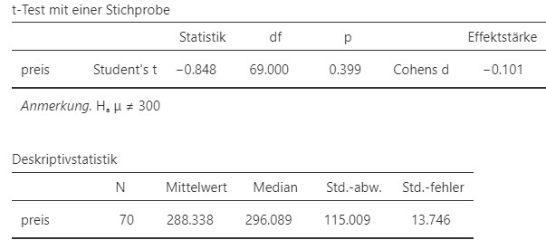
```

a) Es gibt zunächst keinen Anhaltspunkt, weshalb sich die Zahlbereitschaft geändert haben sollte. Deshalb ist die Nullhypothese $H_0: \mu = 300$ CHF, wobei $\mu$ für den Erwartungswert des Merkmals Preis ist. Pear fragt sich, ob der $\mu$ von $300$ abweicht, gibt aber keine Richtung vor. Deshalb wurde $H_0$ zweiseitig formuliert. Das Gegenteil der Nullhypothese ist die Alternativhypothese $H_1: \mu \neq 300$ CHF.
b) Das Testen erfolgt wie oben in den Bildschirmaufnahmen von `Jamovi` dargestellt.
c) Ein Einstichproben-$t$-Test ergibt, dass sich die durchschnittliche Zahlbereitschaft ($M=`r round(mean(exr_marktpreisanalyse$tab$preis),2)`$ CHF, $SD = `r round(sd(exr_marktpreisanalyse$tab$preis),2)`$, $N = `r length(exr_marktpreisanalyse$tab$preis)`$) nicht signifikant von $300$ CHF unterscheidet, $t(`r exr_marktpreisanalyse$tab$preis %>% length()-1`)= -0.848, p = .399, d = -0.101$.
d) Statistik entspricht der beobachteten Teststatistik in der Stichprobe. Der Wert kann im Vergleich zur $t$-Verteilung in Abbildung \@ref(fig:t-distribution) gelesen werden. $-0.848$ ist bei allen dargestellten Verteilungen kein seltener Wert, wenn die Nullhypothese stimmt. Dieser Wert der Statistik deutet also nicht darauf hin, dass die Nullhypothese falsch ist. Die Freiheitsgrade $df$ bestimmen die genaue Form der t-Verteilung. In Abbildung \@ref(fig:t-distribution) sind die genauen Formen für $df = 1$, $df = 4$ und $df = 9$ dargestellt. Die $t$-Verteilung, welche die Verteilung der Mittelwerte am besten abbildet ist die mit $df = n-1$, wobei $n$ die Anzahl Beobachtungen ist. Es sind $70$ Beobachtungen gemacht worden, also ist $df = 69$. Die $t$-Verteilung sieht in diesem Fall ungefähr aus wie die Normalverteilung in Abbildung \@ref(fig:t-distribution). Der $p$-Wert von $0.399$ bedeutet, dass die Wahrscheinlichkeit diesen Stichprobenmittelwert oder einen extremeren im Sinne der Alternativhypothese bei $39.9\%$ liegt und damit ziemlich wahrscheinlich ist, gegeben dass die Nullhypohthese wahr ist. Auch dies reflektiert also, dass aufgrund der Stichprobe nicht geschlossen werden kann, dass der Erwartungswert von $300$ CHF abweicht. Die Effektstärke $d= -0.101$ ist gemäss Cohen als schwach einzustufen.
e) Der Stichprobenmittelwert sagt aus, dass in dieser Stichprobe die Zahlungsbereitschaft nicht gleich war wie für das Modell F41. Diese Aussage ist jedoch limitiert auf die Stichprobe und kann nur auf die Population ausgeweitet werden, wenn ein statistischer Test durchgeführt wurde. Es könnte ja sein, dass es einen Unterschied im Populationsmittelwert gibt, dieser aber aufgrund einer seltenen Zufallsstichprobenziehung nicht offenbar wird.
:::

::: {.exercise  #aslkdfjoeiu12342}

<!-- ```{r exr-test-drink-usa} -->
<!-- gen_exr_test_drink_usa <- function(){ -->
<!--   set.seed(1982) -->
<!--   mu0 <- 3 -->
<!--   n <- 15 -->

<!--   x <- rnorm(n, 3.8, 1.4)  -->
<!--   file_name <- '05-exr-test-drink-usa.sav' -->
<!--   dd <- tibble(fluessigkeit_liter = x)  -->
<!--   dd %>% write_sav(file_name) -->
<!--   jmv_res <- (dd %>%  -->
<!--     jmv::ttestOneS(vars = 'fluessigkeit_liter',  -->
<!--                    testValue = mu0,  -->
<!--                    hypothesis = 'gt', desc = TRUE, -->
<!--                    effectSize = TRUE)) -->
<!--   jmv_res_test <- jmv_res$ttest$asDF %>%  -->
<!--     rename_with(~ .x %>% str_remove('\\[stud\\]')) -->
<!--   jmv_res_desc <- jmv_res$descriptives$asDF -->

<!--   return(mget(ls())) -->
<!-- } -->
<!-- exr_test_drink_usa <- gen_exr_test_drink_usa() -->
<!-- ``` -->

TODO
:::

:::{.solution}
TODO
:::

## Test

::: {.exercise  #test-theorie}
Welche der folgenden Aussagen zum Einstichproben-$t$-Test sind wahr, welche falsch?

a) Der Einstichproben-$t$-Test überprüft, ob der Stichprobenmittelwert einer bestimmten Zahl entspricht.
b) Beim Einstichproben-$t$-Test ist die Teststatistik $t$-verteilt mit $n-1$ Freiheitsgraden.
c) Der $p$-Wert ist immer kleiner als das Signifikanzniveau.
d) $H_1: \mu > 50$ ist eine mögliche Formulierung für die Alternativhypothese des Einstichproben-$t$-Test.
:::

:::{.solution}
a) Falsch
b) Richtig
c) Falsch
d) Richtig
:::

::: {.exercise  #test-drink-usa}

```{r exr-test-drink-usa}
gen_exr_test_drink_usa <- function(){
  set.seed(1982)
  mu0 <- 3
  n <- 15
  
  x <- rnorm(n, 3.8, 1.4) 
  file_name <- '05-exr-test-drink-usa.sav'
  dd <- tibble(fluessigkeit_liter = x) 
  dd %>% write_sav(file_name)
  jmv_res <- (dd %>% 
    jmv::ttestOneS(vars = 'fluessigkeit_liter', 
                   testValue = mu0, 
                   hypothesis = 'gt', desc = TRUE,
                   effectSize = TRUE))
  jmv_res_test <- jmv_res$ttest$asDF %>% 
    rename_with(~ .x %>% str_remove('\\[stud\\]'))
  jmv_res_desc <- jmv_res$descriptives$asDF
  
  return(mget(ls()))
}
exr_test_drink_usa <- gen_exr_test_drink_usa()
```

In der Schweiz wird empfohlen $3$ Liter Flüssigkeit pro Tag zu sich zu nehmen. Auf einer Reise in die USA fragt Karin zufällige Leute nach ihrer Flüssigkeitsaufnahme. Die Daten notiert sie im Datensatz `r inline_code("05-exr-drink-usa")`. Sie will nun testen, ob alle Leute in den USA durchschnittlich mehr Flüssigkeit pro Tag zu sich nehmen, als es in der Schweiz empfohlen ist. Testen Sie die Hypothese einem Einstichproben-$t$-Test, stellen Sie dabei `Jamovi` auf $3$ Nachkommastellenrundung ein. Welche der folgenden Aussagen sind wahr, welche falsch.

a) Die durchschnittliche Flüssigkeitsaufnahme ist in den USA signifikant grösser als in der Schweiz empfohlen.
b) Der gefundene Effekt ist gemäss Cohen als gross einzustufen.
c) Karin hat $14$ Personen befragt.
d) Die Nullhypothese lautet $H_0: \mu \leq 3$ Liter.
:::

:::{.solution}
a) Richtig
b) Falsch
c) Falsch
d) Richtig
:::

::: {.exercise  #98zvh3blbel}

<!-- ```{r exr-test-drink-usa} -->
<!-- gen_exr_test_drink_usa <- function(){ -->
<!--   set.seed(1982) -->
<!--   mu0 <- 3 -->
<!--   n <- 15 -->

<!--   x <- rnorm(n, 3.8, 1.4)  -->
<!--   file_name <- '05-exr-test-drink-usa.sav' -->
<!--   dd <- tibble(fluessigkeit_liter = x)  -->
<!--   dd %>% write_sav(file_name) -->
<!--   jmv_res <- (dd %>%  -->
<!--     jmv::ttestOneS(vars = 'fluessigkeit_liter',  -->
<!--                    testValue = mu0,  -->
<!--                    hypothesis = 'gt', desc = TRUE, -->
<!--                    effectSize = TRUE)) -->
<!--   jmv_res_test <- jmv_res$ttest$asDF %>%  -->
<!--     rename_with(~ .x %>% str_remove('\\[stud\\]')) -->
<!--   jmv_res_desc <- jmv_res$descriptives$asDF -->

<!--   return(mget(ls())) -->
<!-- } -->
<!-- exr_test_drink_usa <- gen_exr_test_drink_usa() -->
<!-- ``` -->

TODO
:::

:::{.solution}
TODO
:::

<!--chapter:end:src/05-durchschnitt_testen.Rmd-->

# (PART) Zwei Gruppen vergleichen {-}


# Gruppenmittelwertunterschied bei einem intervallskalierten und normalverteilten Merkmal

Bislang wurde versucht mithilfe _einer_ Stichprobe eine Aussage über _eine_ Population zu treffen. Dies setzt voraus, dass der Erwartungswert bereits aus früheren Untersuchungen bekannt ist oder theoretisch hergeleitet werden kann (Beispiel zirkadianer Rhythmus). In der Realität ist dies oft nicht der Fall. Es muss also gleichzeitig etwas über eine potenziell veränderte Population und über die Referenzpopulation herausgefunden werden. Im experimentellen Kontext entspricht dies dem Vergleich der Experimental- mit der Kontrollgruppe. Im observationellen Kontext wird die Referenzgruppe willkürlich bestimmt.

:::{.example #breakup name="Trennungsschmerz"}

```{r exm-breakup}
gen_exm_t_welch <- function(mu1,
                            s1,
                            n1,
                            mu2,
                            s2,
                            n2,
                            var_name,
                            x_min,
                            x_max,
                            file_name,
                            group_labels,
                            x_label_position,
                            y_label_position_hist,
                            y_label_position_dens,
                            binwidth,
                            plot_bag) {
  
  mu0 <- 0
  set.seed(61)
  x1 <- rnorm(n1, mu1, s1) %>% 
    crop(x_min, x_max)
  x2 <- rnorm(n2, mu2, s2) %>% 
    crop(x_min, x_max)
  x1_mean <- x1 %>% mean()
  x2_mean <- x2 %>% mean()
  x1_sd <- x1 %>% sd()
  x2_sd <- x2 %>% sd()
  s_p <- sqrt(weighted.mean(c(x1_sd^2, x2_sd^2), c(n1-1, n2-1)))
  s_t <- s_p * sqrt((1/n1+1/n2))
  s_w <- sqrt(x1_sd^2/n1 + x2_sd^2/n2)
  x_mean <- x1_mean - x2_mean
  df_t <- n1 + n2 - 2
  df_w <- s_w^4 / (x1_sd^4 / (n1^2* (n1-1))+x2_sd^4 / (n2^2* (n2-1)))
  p_value_the_t <- 2*(1-pt(x_mean/s_t, df_t))
  p_value_the_w <- 2*(1-pt(x_mean/s_w, df_w))

  dd <- tibble(!!var_name := c(x1,x2),
         Gruppe = c(rep(group_labels[1],n1), rep(group_labels[2], n2))) %>% 
    write_sav(file_name)

  jmv_res <- dd %>%
    jmv::ttestIS(formula = as.formula(str_c(var_name, "~Gruppe")),
                desc = TRUE,
                 welchs = TRUE, 
                 mann = TRUE, 
                 effectSize = TRUE)
  jmv_res_test <- jmv_res$ttest$asDF%>% 
    rename_with(~ .x %>% str_replace_all('\\[(stud|welc)\\]',"\\1"))
  jmv_res_desc <- jmv_res$desc$asDF%>% 
    rename_with(~ .x %>% str_replace_all('\\[(1|2)\\]',"\\1"))

  if(plot_bag){
    scores_hover1 <- rnorm(20, 3, s1) %>% 
        crop(x_min, x_max)
    scores_hover2 <- rnorm(20, 7, s1) %>% 
        crop(x_min, x_max)
    plot_ball_bag_different <- plot_ball_bag_two_samples(
      scores_bag1 = rnorm(200, 3, s1) %>% 
        crop(x_min, x_max),
      scores_bag2 = rnorm(200, 7, s2) %>% 
        crop(x_min, x_max),
      scores_hover1 = scores_hover1,
      scores_hover2 = scores_hover2,
      score_name = var_name,
      no_legend = TRUE
    )
    
    plot_ball_bag_same <- plot_ball_bag_two_samples(
      scores_bag1 = rnorm(200, 5, s1) %>% 
        crop(x_min, x_max),
      scores_bag2 = rnorm(200, 5, s2) %>% 
        crop(x_min, x_max),
      scores_hover1 = scores_hover1,
      scores_hover2 = scores_hover2,
      score_name = var_name
    )
  }
  
  # distribution if H_0 were true
  n_samples <- 3000L
  x1_means <- 1:n_samples %>%
    map_dbl(~ rnorm(n1,mean(mu1, mu2), s1) %>% 
            crop(x_min, x_max) %>% 
            mean())
  x2_means <- 1:n_samples %>%
    map_dbl(~ rnorm(n2, mean(mu1, mu2), s2) %>% 
              crop(x_min, x_max) %>% 
              mean()
    )
  means_diff <- x1_means - x2_means
  q975_x_means <- means_diff %>% quantile(c(0.975)) %>% unlist() %>% unname()
  q025_x_means <- means_diff %>% quantile(c(0.025)) %>% unlist() %>% unname()
  p_value_emp <- mean(abs(means_diff) > abs(x_mean))
  
  plot_hist <- plot_hist_denstiy_expected_value1(
    means_diff,
    str_c(var_name, "-Mittelwertdifferenz"),
    binwidth,
    list(
      "Student-t" = function(x)
        dt((x-mu0)/s_t, df_t) / s_t,
      "Welch t" = function(x)
        dt((x-mu0)/s_w, df_w) / s_w)
      )
  
  x_bounds <- 3.5*s_w*c(-1, 1)
  line_xlim <- xlim(x_bounds)
  x_range <- seq(x_bounds[1], x_bounds[2], length.out = 1000)
  
  create_text_data <- function(x,y,z){
    plot_attr_reja_pval$create_text_data(x_label_position,x,y,z)
  }
  
  histogram_data <- tibble(x = rep(means_diff, 2),
                           plot_type = rep(
                             c("Histogram p-Wert", "Histogram Ablehnungsbereich"),
                             each = length(means_diff)
                           )) %>%
    plot_attr_reja_pval$add_colors(
      side = "both",
      upper = q975_x_means,
      lower = q025_x_means,
      test_stat = x_mean,
      mu0 = mu0
    )
  
  create_density_t_data <- function(x_range, mu0, sigma_g, df, labels, x_mean) {
    tibble(
      x = rep(x_range, 2),
      y = dt((x - mu0) / sigma_g, df) / sigma_g,
      plot_type = rep(
        labels,
        each = length(x_range)
      )
    ) %>%
      plot_attr_reja_pval$add_colors(
        side = "both",
        upper = qt(0.975, df) * sigma_g,
        lower = qt(0.025, df) * sigma_g,
        test_stat = x_mean,
        mu0 = mu0
      )
  }

  density_data <- bind_rows(
    create_density_t_data(
      x_range,
      mu0,
      s_t,
      df_t,
      c("t-Test p-Wert", "t-Test Ablehnungsbereich"),
      x_mean
    ),
    create_density_t_data(
      x_range,
      mu0,
      s_w,
      df_w,
      c("Welch-Test p-Wert", "Welch-Test Ablehnungsbereich"),
      x_mean
    )
  )
 
   plot_hist_curve_pval_reja <- ggplot() +
     geom_histogram(data = histogram_data,
                   aes(x = x, fill = color),
                   binwidth = binwidth)+
    geom_area(data = density_data, 
              aes(x = x, y = y, fill = color), stat = "identity") +
    geom_vline(xintercept = x_mean) +
    geom_text(
      data = bind_rows(
        create_text_data(
           str_c(round(100 * c(1 - p_value_emp, p_value_emp), 1), '%'),
          y_label_position_hist,
          "Histogram p-Wert"
        ),
        create_text_data(
          c('95%', '5%'), 
          y_label_position_hist,
          "Histogram Ablehnungsbereich"
        ),
        create_text_data(str_c(round(
          100 * c(1 - p_value_the_t, p_value_the_t), 1
        ), '%'), y_label_position_dens, "t-Test p-Wert"),
        create_text_data(c('95%', '5%'), y_label_position_dens, "t-Test Ablehnungsbereich"),
        create_text_data(str_c(round(
          100 * c(1 - p_value_the_w, p_value_the_w), 1
        ), '%'), y_label_position_dens, "Welch-Test p-Wert"),
        create_text_data(c('95%', '5%'), y_label_position_dens, "Welch-Test Ablehnungsbereich")
      ),
      mapping = aes(
        x = x,
        y = y,
        label = label,
        colour = color
      )
    ) +
    facet_wrap(
      ~ plot_type,
      ncol = 2,
      scales = "free_y",
      strip.position = "top"
    ) +
    line_xlim +
    plot_attr_reja_pval$theme +
    labs(x = str_c(var_name, "-Mittelwertdifferenz"), 
         y = "Wahrscheinlichkeitsdichte        Häufigkeit")
  
  return(mget(ls()))
}
exm_breakup <- gen_exm_t_welch(mu1 = 6.84,
                            s1 = 2.52,
                            n1 = 2695,
                            mu2 = 6.58,
                            s2 = 2.58,
                            n2 = 1409,
                            var_name = "ER",
                            x_min = -10,
                            x_max = 100,
                            file_name = '06-exm-breakup.sav',
                            group_labels = c('male', 'female'),
                            x_label_position = 0.2*c(-1,1),
                            y_label_position_hist = 250,
                            y_label_position_dens = 4,
                            binwidth = 0.02,
                            plot_bag = TRUE)
```

@morris2015 haben untersucht, ob das Geschlecht einen Einfluss auf den Schmerz bei der Auflösung einer romantischen Beziehung hat. Die Autoren unterscheiden dabei zwischen emotionaler (Angst, Wut, Depression, Taubheit, usw.) und physischer Reaktion (Essgewohnheit, Schlaf, Gewicht, Panik, Immunsystem). Hier wird nur auf erstere fokussiert, welche mit _ER_ abgekürzt wird. Dazu wurde mit erlösfreien Online-Umfragen unter anderem erfragt, ob die Person eine Trennung erlebt hat und wie sie ihren emotionalen Trennungsschmerz von $0$ (keine Schmerzen) bis $10$ (unerträglich) einstuft. An der Studie haben $N_\text{Frau} = `r exm_breakup$n1`$ Frauen und $N_\text{Mann} = `r exm_breakup$n2`$ Männer mitgemacht, welche eine ER von $M_\text{Frau} = `r round(exm_breakup$x1_mean,2)`, SD_\text{Frau} = `r round(exm_breakup$x1_sd,2)`$  und $M_\text{Mann} = `r round(exm_breakup$x2_mean,2)`, SD_\text{Mann} = `r round(exm_breakup$x2_sd,2)`$ respektive aufwiesen. 
:::

## Was ist das Problem der Stichprobenziehung?

In der Stichprobe kann also ein kleiner geschlechterspezifischer Mittelwertunterschied der ER beobachtet werden. Dieser Mittelwertunterschied könnte nun einerseits auf einen Mittelwertunterschied in der Population zurückzuführen sein, wie in Abbildung \@ref(fig:exm-breakup-bagplot) links dargestellt. Hier gibt es zwei Populationen: Frauen-Population  mit höheren und Männer-Population  mit tieferen ER-Werten. Dies führt dazu, dass der Erwartungswert der Frauen-Population höher ist als bei Männer-Population und eine zufällige gezogene Stichprobe aus Frauen-Population auch ein höheres arithmetisches Mittel aufweist als Männer-Population.

Andererseits könnte der Mittelwertunterschied auch auf die zufällige Stichprobenziehung zurückzuführen sein, siehe Abbildung \@ref(fig:exm-breakup-bagplot) rechts. In dieser Situation haben die Frauen- und die Männer-Populationen ähnliche Werte und demnach auch einen ähnlichen Erwartungswert. Beim Ziehen der Stichproben spielt der Zufall hier so, dass aus der Frauen-Population einige Beobachtungen mehr mit hohen ER-Werten ausgewählt wurden als bei der Männer-Population. Dies führt dazu, dass in den zwei Stichproben ein Unterschied im arithmetischen Mittel der ER beobachtet werden kann. 

```{r exm-breakup-bagplot, fig.cap="Links: Zwei Stichprobenziehungen aus zwei Populationen mit unterschiedlichen Mittelwerten. Rechts: Zwei Stichprobenziehungen aus einer Population, bzw. aus zwei Populationen die sich bezüglich ihrer Werte nicht unterscheiden."}
grid.arrange(exm_breakup$plot_ball_bag_different,
             exm_breakup$plot_ball_bag_same, 
             ncol = 2)
```

<!-- Discuss: welchen zwei anderen Möglichkeiten sind hier nicht dargestellt? -->

Welche dieser Situationen zutrifft kann nicht genau herausgefunden werden, da die Population nie vollständig beobachtet werden kann.

Um trotzdem eine Aussage über die Population zu treffen, kann wie bereits mehrmals gemacht, die Stichprobenziehung oft - beispielsweise $`r exm_breakup$n_samples`$-mal - wiederholt werden. Dies wird unter der Annahme gemacht, dass es keinen ER-Erwartungswertunterschied zwischen der Frauen- und Männer-Population gibt. Die Verteilung der ER-Mittelwertdifferenzen dieser Stichproben ist in Abbildung \@ref(fig:exm-breakup-hist) dargestellt. 

```{r exm-breakup-hist, fig.cap="Verteilung simulierter ER-Mittelwertdifferenzen bei wiederholten Zufallsstichprobenziehung. Rot: Annäherung der Verteilung mit dem Student t-Test; grün: Annäherung der Verteilung durch den Welch-Test."}
exm_breakup$plot_hist
```

Das Testprinzip funktioniert genau gleich wie beim $t$-Test für eine Stichprobe wie in Kapitel \@ref(zentrale-tendenz-testen). Zunächst werden die Hypothesen aufgestellt. A priori liegt keine Vermutung darüber vor, ob Männer oder Frauen eine stärkere ER zeigen. Die Null- und Alternativhypothese sind deshalb

> $H_0: \mu_\text{Frau} = \mu_\text{Mann}$
>
> $H_1: \mu_\text{Frau} \neq \mu_\text{Mann}.$

Dies entspricht, einfacher Arithmetik folgend, 

> $H_0: \mu_\text{Frau} - \mu_\text{Mann} = 0$
>
> $H_1: \mu_\text{Frau} - \mu_\text{Mann} \neq 0.$

Es kann beobachtet werden, dass, wenn es keine Erwartungswertdifferenz gibt, die Mittelwertdifferenzen der Stichproben am häufigsten bei $0$ liegen und mit zunehmender Entfernung von $0$ unwahrscheinlicher werden. Dies kann wieder formalisiert werden indem die $5\%$ unwahrscheinlichsten Werte ($2.5\%$ links und $2.5\%$ rechts) zum Ablehnungsbereich erklärt werden und entspricht der roten Fläche in Abbildung \@ref(fig:exm-breakup-hist-pval-reja) links. Die tatsächlich beobachtete Mittelwertdifferenz (schwarze Linie) liegt im Ablehnungsbereich. Dies bedeutet dass sich die Erwartungswertdifferenz bei Signifikanzniveau $5\%$ signifikant von $0$ unterscheidet. Dies ist äquivalent zu der Aussage, dass sich die ER-Erwartungswerte der Männer und Frauen signifikant unterscheidet.

```{r exm-breakup-hist-pval-reja, fig.cap="TODO"}
exm_breakup$plot_hist_curve_pval_reja
```

<!-- Discuss: warum ist p-Wert nur rechts? Es hat keine Beobachtungen kleiner als -0.237. -->

Ebenfalls kann erneut der p-Wert berechnet werden. Dieser entspricht hier allen ER-Mittelwertdifferenzen, welche _extremer_ als die beobachtete Mittelwertdifferenz $`r round(exm_breakup$x_mean,2)`$ sind. Da die Hypothesenstellung hier zweiseitig ist, bedeutet extremer hier wieder grösser als $`r round(exm_breakup$x_mean,2)`$ oder kleiner als $`r round(-exm_breakup$x_mean,2)`$. Der $p$-Wert entspricht dem Anteil der roten Fläche in Abbildung \@ref(fig:exm-breakup-hist-pval-reja) rechts an der Gesamtfläche und beträgt $`r round(exm_breakup$p_value_emp,3)`$.

Die Verteilung der Mittelwertdifferenzen unter der Annahme, dass die Nullhypothese wahr ist, kann wieder mit einer Kurve angenähert werden. Diese Annäherung hat den Vorteil, dass der Ablehnungsbereich und der $p$-Wert abgeschätzt werden kann, ohne dass dazu das Experiment wiederholt werden muss. Für die Annäherungskurve gibt es zwei Optionen, welche dann entsprechenden Tests ihre Namen geben: der Zweistichproben-$t$-Test nach Student und der Welch Test.

### Erwartungswertunterschied Zweistichproben-$t$-Test nach Student

[Der **Zweistichproben-$t$-Test** setzt voraus, dass die beiden Populationen eine ähnliche Varianz oder äquivalent eine ähnliche Standardabweichung haben.]{.customdef #customdef-twosample-t-test} Dazu später mehr. Ist dies gegeben, so kann die Teststatistik mit

\begin{equation}
t = \frac{\bar{x_1}-\bar{x_2} - \omega_0}{\sqrt{\frac{(n_1 - 1) s_1^2+(n_2-1)s_2^2}{n_1 + n_2 - 2}}\sqrt{\frac{1}{n_1}+\frac{1}{n_2}}}
(\#eq:t-emp-twosample-t)
\end{equation}

<!-- Discuss formulas -->

berechnet werden, wobei $\omega_0 = \mu_1 - \mu_2$ der Erwartungswertdifferenz entspricht und in unserem Fall $0$ beträgt. Wenn die Nullhypothese wahr ist, so ist diese Teststatistik bei wiederholter Stichprobenziehung $t$-verteilt bei $df = n_1 + n_2 -2$ Freiheitsgraden.

Die rote Linie in Abbildung \@ref(fig:exm-breakup-hist) zeigt, dass die Annäherung durch den Zweistichproben-$t$-Test nach Student die Verteilung der Mittelwertdifferenzen ziemlich gut trifft.

<!-- Discuss, wieso ist die Verteilung gegen links verschoben. -->

### Erwartungswertunterschied Welch Test

:::{.example #emotional-stroop name="Emotionaler Stroop-Test bei posttraumatischer Belastungsstörung."}

```{r emotional-stroop}
exm_emotional_stroop <- gen_exm_t_welch(
  mu1 = 762.40,
  s1 = 232.93,
  n1 = 26,
  mu2 = 639.07,
  s2 = 94.90,
  n2 = 16,
  var_name = "RT",
  x_min = 0,
  x_max = 10000,
  file_name = '06-exm-emotional-stroop.sav',
  group_labels = c('PTSD', 'Non-PTSD'),
  x_label_position = 100*c(-1,1),
  y_label_position_hist = 250,
  y_label_position_dens = 0.005,
  binwidth = 15,
  plot_bag = FALSE
)
```

Analog zum klassischen Stroop-Test werden bei einem emotionalen Stroop-Test _EST_ Testpersonen gebeten die Farben verschiedener ausgeschriebener Wörter zu erkennen. Die Wörter sind beim emotionalen Stroop-Test entweder emotional aufgeladen (Bombe, Schweiss, Faustschlag, ...) oder neutral (Tisch, Weg, Bahn, ...) für die Testpersonen [@williams1996]. Gemessen wird dabei die Reaktionsgeschwindigkeit _RT_ in Millisekunden. In einem Versuch wollten @khanna2017 herausfinden, ob von posttraumatischer Belastungsstörung  betroffene Veteranen _PTSD_ andere EST-Resultate erzielen als nicht betroffene _non-PTSD_. Die durchschnittliche Reaktionszeit der $`r exm_emotional_stroop$n1`$ von PTSD betroffenen Veteranen lag bei $M=`r round(exm_emotional_stroop$x1_mean,1)`\text{ ms }(SD = `r round(exm_emotional_stroop$x1_sd,1)`)$ und bei den $`r exm_emotional_stroop$n2`$ nicht von PTSD betroffenen Veteranen bei $M=`r round(exm_emotional_stroop$x2_mean,1)` \text{ ms }(SD = `r round(exm_emotional_stroop$x2_sd,1)`)$.  

:::

Es wird keine Annahme über die Richtung einer eventualen Mittelwertdifferenz angenommen. Die Hypothesen sind deshalb zweiseitig formuliert und lauten

> $H_0: \mu_\text{PTSD} = \mu_\text{non-PTSD}$
>
> $H_1: \mu_\text{PTSD} \neq \mu_\text{non-PTSD}.$

In diesem Beispiel sind die Standardabweichungen und demnach auch die Varianzen der Reaktionszeiten in den beiden Gruppen sehr unterschiedlich. Wenn das Experiment wiederum wiederholt wird, kann der Verteilung der Mittelwertdifferenzen entnommen werden, dass der Zweistichproben-$t$-Test nach Student diese Verteilung nicht gut abbildet. Die rote Linie in Abbildung \@ref(fig:exm-emotional-stroop-hist) liegt mittig zu hoch und an den Enden zu tief Wird diese Annäherung in diesem Fall verwendet, dann besteht die Gefahr, dass ein signifikanter Mittelwertunterschied nicht erkannt wird.

```{r exm-emotional-stroop-hist, fig.cap="Verteilung simulierter RT-Mittelwertdifferenzen bei wiederholten Zufallsstichprobenziehung. Rot: Annäherung der Verteilung mit dem Student t-Test; grün: Annäherung der Verteilung durch den Welch-Test."}
exm_emotional_stroop$plot_hist
```

Für diesen Fall wurde von @welch1947 eine alternative Annäherung an die Verteilung der Mittelwertdifferenzen gefunden, nämlich

\begin{equation}
t = \frac{\bar{x_1}-\bar{x_2} - \omega_0}{\sqrt{\frac{s_1^2}{n_1}+\frac{s_2^2}{n_2}}}.
(\#eq:t-emp-twosample-welch)
\end{equation}

<!-- Discuss formulas -->

Die so berechnete Teststatistik $t$ ist $t$-Verteilt bei approximativ 
$$df \approx\frac{\left(\frac{s_1^2}{n_1}+\frac{s_2^2}{n_2}\right)^2}{\frac{s_1^4}{(n_1-1) n_1^2}+ \frac{s_2^4}{(n_2-1) n_2^2}}  $$

[Freiheitsgraden und ein damit durchgeführter Test wird **Welch-Test** genannt.]{.customdef #customdef-welch-test} Sie nähert die Verteilung der Mittelwertdifferenzen trotz unterschiedlicher Gruppenvarianzen gut an, siehe grüne Linie in Abbildung \@ref(fig:exm-emotional-stroop-hist). 

Der Zweistichproben-$t$-Test und der Welch-Test sind also zwei Testvarianten, um zu testen, ob der Erwartungswert in zwei Gruppen unterschiedlich ist. Dabei hat sich gezeigt, dass der Welch-Test die wahre Verteilung besser annähert als der Zweistichproben-$t$-Test, wenn die beiden Gruppen unterschiedliche Varianzen aufweisen, siehe Abbildung \@ref(fig:exm-emotional-stroop-hist). Wenn beide Varianzen ungefähr gleich sind, so geben beide Tests jedoch ähnlich gute Resultate, siehe Abbildung \@ref(fig:exm-breakup-hist). Es wird deshalb empfohlen immer den Welch-Test durchzuführen [@zimmerman2004]. Ein Vergleich der Abbildungen \@ref(fig:exm-breakup-hist-pval-reja) und \@ref(fig:exm-emotional-stroop-hist-pval-reja) zeigt auch, dass der Unterschied von Ablehnungsbereich und $p$-Wert beim im Falle der ähnlichen Varianzen gering und im Falle der unterschiedlichen Varianzen augenscheinlich wird.

<!-- Discuss: klären, Welch-Test praktisch relevant, zweistichproben-t-test historisch und als referenz wichtig. -->

```{r exm-emotional-stroop-hist-pval-reja, fig.cap="TODO"}
exm_emotional_stroop$plot_hist_curve_pval_reja
```

<!-- Discuss: rote und grüne linie auf den Histogramm plots -->

<!-- Discuss: what does it mean to have one sided hypothesis: distribution, histogram and hypothesis formulation -->

## Effektstärken

In den Formeln \@ref(eq:t-emp-twosample-t) und \@ref(eq:t-emp-twosample-welch) kann beobachtet werden, dass mit zunehmenden Stichprobengrössen der Gruppen der Nenner immer kleiner und damit die Teststatistik $t$ für eine gleichbleibende Mittelwertdifferenz immer grösser wird. Dies bedeutet, dass auch kleine Mittelwertdifferenzen bei grossen Stichprobengrösse signifikanten - also nicht auf die zufällige Stichprobenziehung zurückzuführenden - Unterschied darstellen. Beim Trennungsschmerzbeispiel ist der Mittelwertunterschied von $`r round(exm_breakup$x_mean,2)`$ gering. Dies trotz dem $p$-Wert des Welch-Test von $p=`r round(exm_breakup$p_value_the_w,3) %>% str_sub(start = 2L)`$, welcher auf einen stark signifikanten Mittelwertunterschied hindeutet. Umgekehrt bei der posttraumatischen Belastungsstörung: Hier ist der Mittelwertunterschied mit $`r round(exm_emotional_stroop$x_mean)`$ ms substanziell, aber der $p$-Wert des Welch-Test von $p=`r round(exm_emotional_stroop$p_value_the_w,3) %>% str_sub(start = 2L)`$ deutet knapp auf keine signifikante Mittelwertdifferenz hin. 

Würde die Relevanz des beobachteten Effekts mit der Mittelwertsdifferenz gemessen, dann wäre, analog zu Kapitel \@ref(zentrale-tendenz-testen), dieses Mass wieder abhängig von der Einheit. Um dies zu verhindern, wird die Mittelwertdifferenz wieder durch die Standardabweichung geteilt. Für die konkrete Berechnung der Effektstärke gibt es verschiedene Methoden, wovon drei hier vorgestellt werden:

- [Bei **Cohens $d$ für Zweistichproben-t-Test** (Symbol $d$) wird die Mittelwertdifferenz durch das gewichtete Mittel der Standardabweichungen geteilt.]{.customdef #customdef-cohens-d} 
$$d = \frac{\bar{x_1}-\bar{x_2}}{\sqrt{\frac{(n_1 - 1) s_1^2+(n_2-1)s_2^2}{n_1 + n_2 - 2}}}$$
Diese Formel entpricht dem `Cohens d` für den Zweistichproben-$t$-Test in `Jamovi`.
<!-- Discuss difference to effect size for only one sample t test. -->
- [Bei **Hedges $g$** (Symbol $g$) handelt es sich um eine um einen Faktor korrigierte Version von Cohens $d$ für den Zweistichproben-$t$-Test.]{.customdef #customdef-hedges-g} 
$$g = \left(1-\frac{3}{4(n_1+n_2)-9}\right)d$$
Hedges $g$ ist genauer als Cohens $d$ bei kleinen Stichprobengrössen und gleich wie Cohens $d$ für grosse Stichproben. Es kann daher immer Hedges $g$ verwendet werden. Diese Formel wird für den Zweistichproben-$t$-Test verwendet und ist besser geeignet als $d$ oben - ein Unterschied ist jedoch nur bei kleinen Stichproben ersichtlich. Hedges $g$ wird in `Jamovi` nicht standardmässig ausgegeben und muss händisch berechnet werden.
- [Bei **Cohens $d$ für den Welch-Test** (Symbol $d$) wird die Mittelwertdifferenz durch die mittlere Standardabweichungen geteilt.]{.customdef #customdef-welch-cohens-d} 
$$d = \frac{\bar{x_1}-\bar{x_2}}{\sqrt{\frac{s_1^2+s_2^2}{2}}}$$
Diese Formel entpricht dem `Cohens d` für den Welch-Test in `Jamovi`.
- [**Glass $\Delta$** (gr. delta, Symbol $\Delta$) wir nur bei Experimenten verwendet. Dabei wird die Mittelwertdifferenz durch die Standardabweichung der Kontrollgruppe dividiert, weil angenommen wird, dass die Kontrollgruppe repräsentativer für die Popoulation ist.]{.customdef #customdef-glass-delta}
$$\Delta = \frac{\bar{x}_\text{Experiment}-\bar{x}_\text{Kontroll}}{s_\text{Kontroll}}$$
Glass $\Delta$ wird in `Jamovi` nicht standardmässig ausgegeben und muss händisch berechnet werden. 

Da es sich bei beiden Beispielen nicht um Experimente handelt, weil weder das Geschlecht noch die posttraumatische Belastungsstörung zufällig zugeorndet wurde, ist hier Glass $\Delta$ keine sinnvolle Effektgrösse. Aus diesem Grund wird für die Effektstärkenberechnung bei beiden Beispielen Cohens $d$ für den Welch-Test verwendet. Das berichten der Testresultate kann deshalb wie folgt aussehen:

> Ein zweiseitiger Welch-Test ergibt, dass die durchschnittliche emotionale Antwort ER bei einer Trennung  bei Männern ($M = `r round(exm_breakup$jmv_res_desc$mean1,2)`$, $SD = `r round(exm_breakup$jmv_res_desc$sd1,2)`$, $N = `r exm_breakup$jmv_res_desc$num1`$) signifikant anders ist als bei Frauen ($M = `r round(exm_breakup$jmv_res_desc$mean2,2)`$, $SD = `r round(exm_breakup$jmv_res_desc$sd2,2)`$, $N = `r exm_breakup$jmv_res_desc$num2`$), $t(`r round(exm_breakup$jmv_res_test$dfwelc,1)`) = `r round(exm_breakup$jmv_res_test$statwelc,2)`$, $`r report_p(exm_breakup$jmv_res_test$pwelc)`, d = `r round(exm_breakup$jmv_res_test$eswelc,2)`$.

> Ein zweiseitiger Welch-Test ergibt, dass die durchschnittliche Reaktionszeit beim emotionalen Stroop-Test bei Veteranen ohne PTSD ($M = `r round(exm_emotional_stroop$jmv_res_desc$mean1,2)`$, $SD = `r round(exm_emotional_stroop$jmv_res_desc$sd1,2)`$, $N = `r exm_emotional_stroop$jmv_res_desc$num1`$) nicht signifikant anders ist als bei Menschen mit PTSD ($M = `r round(exm_emotional_stroop$jmv_res_desc$mean2,2)`$, $SD = `r round(exm_emotional_stroop$jmv_res_desc$sd2,2)`$, $N = `r exm_emotional_stroop$jmv_res_desc$num2`$), $t(`r round(exm_emotional_stroop$jmv_res_test$dfwelc,1)`) = `r round(exm_emotional_stroop$jmv_res_test$statwelc,2)`$, $`r report_p(exm_emotional_stroop$jmv_res_test$pwelc)`, d = `r round(exm_emotional_stroop$jmv_res_test$eswelc,3)`$.

<!-- g = `r round((1-(3/(4*(exm_emotional_stroop$n1+exm_emotional_stroop$n2)-9)))*exm_emotional_stroop$jmv_res_test$esstud,3)`. -->

<!-- mit der neuen Trainingsmethode ist nicht signifikant tiefer als $`r exr_schwimmen$mu0`$ Minuten, $t(`r exr_schwimmen$jmv_res_test$df`) = `r round(exr_schwimmen$jmv_res_test$stat,2)`$, $p = `r round(exr_schwimmen$jmv_res_test$p,3) %>% str_sub(start = 2L)`, d = `r round(exr_schwimmen$jmv_res_test$es,3)`$. -->

Beim Trennungsschmerz handelt es sich um einen schwachen, bei der Reaktionszeit auf den EST um einen mittleren Effekt.

<!-- Discuss: Interpretation. -->

::::{.caution data-latex=""}

::: {.remark}
- Die Namensgebung von diesen Berechnungsarten und insbesondere, was unter Cohens $d$ verstanden wird variiert beträchtlich und es empfiehlt sich immer die genaue Berechnungsart zu überprüfen.
<!-- Discuss: Entwirrung Enzmann 2015 -->
- In `Jamovi` wird für den Zweistichproben-$t$-Test und den Welch-Test eine unterschiedliche Effektstärke angegeben.
<!-- pooledVARSTUD <- tryNaN(((n[1]-1)*v[1]+(n[2]-1)*v[2])/(n[1]+n[2]-2)) -->
<!-- pooledVARWELC <- tryNaN((v[1] + v[2]) / 2) -->
<!-- sediffSTUD <- tryNaN(sqrt((pooledVARSTUD/n[1])+(pooledVARSTUD/n[2]))) -->
<!-- sediffWELC <- tryNaN(sqrt((v[1]/n[1])+(v[2]/n[2]))) -->

<!-- dSTUD <- (m[1]-m[2])/sqrt(pooledVARSTUD) # Cohen's d for student's t -->
<!-- dWELC <- (m[1]-m[2])/sqrt(pooledVARWELC) # Cohen's d for Welch's t -->
:::

::::

## Testvoraussetzungen

Damit der Zweistichproben-$t$-Test und der Welch Test durchgeführt werden dürfen, müssen einige Voraussetzungen eingehalten werden.

1. Das Merkmal muss intervallskaliert sein.
2. Die Beobachtungen müssen einer Zufallsstichprobe der jeweiligen Gruppe entsprechen.
3. Die Beobachtungen beider Gruppen müssen einer Normalverteilung entstammen oder die Anzahl der Beobachtungen muss gross genug sein. Häufig wird die Faustregel mehr als $30$ Beobachtungen pro Gruppe verwendet.
4. Für den Zweistichproben-$t$-Test müssen die Varianzen gleich sein. Für den Welch Test gilt diese Voraussetzung nicht.


## Übungen

::: {.exercise  #bobo2groups}
<!-- 
Ziel: 
- Anwendung t-Test mit Jamovi zweiseitig
-->

```{r exr-bobo2groups}
gen_exr_bobo2groups <- function(){
  set.seed(23)
  n1 <- 24
  n2 <- 24
  x1 <- rnorm(n1, 10, 3)
  x2 <- rnorm(n2, 5, 0.5)
  var_name <- "anzahl_aggressionen"
  group_labels <- c('aggressiv', 'nicht aggressiv')
  
  file_name <- '06-exr-bobo2groups.sav'
  dd <- tibble(!!var_name := c(x1, x2),
       Gruppe = c(rep(group_labels[1],n1), 
                  rep(group_labels[2], n2))) %>% 
  write_sav(file_name)

  jmv_res <- dd %>%
    jmv::ttestIS(formula = as.formula(str_c(var_name, "~Gruppe")),
                 norm = TRUE,
                 qq=TRUE,
                desc = TRUE,
                 welchs = TRUE, 
                 mann = FALSE, 
                 effectSize = TRUE)
  jmv_res_test <- jmv_res$ttest$asDF%>% 
    rename_with(~ .x %>% str_replace_all('\\[(stud|welc)\\]',"\\1"))
  jmv_res_desc <- jmv_res$desc$asDF%>% 
    rename_with(~ .x %>% str_replace_all('\\[(1|2)\\]',"\\1"))
  
  return(mget(ls()))
}
exr_bobo2groups <- gen_exr_bobo2groups()
```

Mit dem Bobo-Doll-Experiment sollte die Übertragung von Aggression durch Imitation aggressiver Modelle nachgewiesen werden. An der Studie nahmen $`r exr_bobo2groups$n1 + exr_bobo2groups$n2`$ Kinder im Alter von drei bis sechs Jahren teil. Die Kinder wurden in zwei Gruppen eingeteilt: eine mit aggressivem Modell und eine mit nicht-aggressivem Modell. In der aggressiven Bedingung sahen die Kinder, wie eine erwachsene Person (das Modell) eine Bobo-Puppe aggressiv behandelte, während in der nicht-aggressiven Bedingung das Modell ruhig mit der Puppe spielte. Nach der Beobachtungsphase wurden die Kinder einzeln in einen Spielraum geführt, der ähnliche Spielzeuge wie im Experiment enthielt, einschliesslich der Bobo-Puppe. Die Forscher beobachteten und notierten die Anzahl gezeigter aggressiven Handlungen gegenüber der Bobo-Puppe. 
Inspiriert von @bandura1961.

Beantworten Sie die Frage, ob aggressives Verhalten Erwachsener von Kindern imitiert wird anhand der folgenden Teilfragen:

a) Die Kinder welcher Gruppe zeigen ein aggressiveres Verhalten? Argumentieren Sie mit zahlen.
b) Kann die Aussage aus a) von der Stichprobe auf die Population verallgemeinert werden? Stellen Sie zweiseitige Testhypothesen für den Erwartungswert auf.
c) Führen Sie den statistischen Test mit Jamovi durch und berechnen Sie eine angemessene Effektstärke. Berichten und interpretieren Sie das Testresultat.
:::

:::{.solution}
Zuerst wird der Datensatz mit `Jamovi` eingelesen und die Analyseparameter werden gesetzt, siehe Abbildung \@ref(fig:sol-bobo2groups-input). 

```{r sol-bobo2groups-input, out.width='100%', fig.cap='Jamovi Eingabe.'}
knitr::include_graphics("figures/06-exr-bobo2groups-jmv-input.jpg")
```

Dies produziert das Analyseergebnis in Abbildung \@ref(fig:sol-bobo2groups-output).

```{r sol-bobo2groups-output, out.width='100%', fig.cap='Jamovi Ausgabe.'}
knitr::include_graphics("figures/06-exr-bobo2groups-jmv-output.jpg")
```

Damit können und beide Teilfragen beantwortet werden. 

a) In der Stichprobe ist der durchschnittliche Anzahl gezählter Aggressionen in der Gruppe mit aggressiven Modellen mit $M = `r round(exr_bobo2groups$jmv_res_desc$mean1,2)`$ höher als in der Gruppe mit nicht Aggressiven Modellen $M = `r round(exr_bobo2groups$jmv_res_desc$mean2,2)`$. Es könnte sein, dass der gefundene Mittelwertunterschied auf die zufällige Stichprobenziehung zurückzuführen ist. Um dieses Risiko zu quantifizieren und damit einzuschätzen, ob das Ergebnis auch für die Population gelten könnte, kann ein statistischer Test durchgeführt werden.
b) Es soll gezeigt werden, dass sich der durchschnittlich beobachtete Anzahl aggressiver Handlungen der Kinder in der Gruppe mit aggressivem Modell anders ist als in der Gruppe mit nicht aggressivem Modell. Die Alternativhypothese lautet also $H_1: \mu_\text{Aggressiv} \neq \mu_\text{Nicht aggressiv}$. Die Nullhypothese dagegen sagt, dass beide Gruppen durchschnittlich gleich viele aggressive Handlungen begehen, also $H_0: \mu_\text{Aggressiv} = \mu_\text{Nicht aggressiv}$.
c) Es werden Mittelwerte von einer intervallskalierten Variabel über zwei Gruppen verglichen. Als statischer Test kommt demnach der Zweistichproben-$t$-Test oder der Welch-Test infrage. Aufgrund der genaueren Testergebnisse wird immer der Welch-Test bevorzugt und dieser in folge durchgeführt und berichtet. Ein zweiseitiger Welch-Test ergibt, dass der durchschnittliche Anzahl Aggressionen in der Gruppe mit aggressivem Modell ($M = `r round(exr_bobo2groups$jmv_res_desc$mean1,2)`$, $SD = `r round(exr_bobo2groups$jmv_res_desc$sd1,2)`$, $N = `r exr_bobo2groups$jmv_res_desc$num1`$) signifikant anders ist als in der Gruppe mit nicht aggressivem Modell ($M = `r round(exr_bobo2groups$jmv_res_desc$mean2,2)`$, $SD = `r round(exr_bobo2groups$jmv_res_desc$sd2,2)`$, $N = `r exr_bobo2groups$jmv_res_desc$num2`$), $t(`r round(exr_bobo2groups$jmv_res_test$dfwelc,1)`) = `r round(exr_bobo2groups$jmv_res_test$statwelc,2)`$, $`r report_p(exr_bobo2groups$jmv_res_test$pwelc)`, \Delta = `r round(glass_delta(exr_bobo2groups$jmv_res_desc, FALSE),3)`$. Da es sich um ein Experiment handelt ist hier die Effektstärke Glass $\Delta$ angebracht. Als Kontrollgruppe wurde die nicht aggressive Gruppe verwendet. Die Effektstärke ist als gross einzustufen. 
:::

::: {.exercise  #gruppenpuzzle}
<!-- 
Ziel: 
- Anwendung t-Test mit Jamovi zweiseitig
-->
```{r exr-gruppenpuzzle}
gen_exr_gruppenpuzzle <- function(){
  set.seed(23)
  n1 <- 35
  n2 <- 21
  x1 <- rnorm(n1, 5.1, 0.3)
  x2 <- rnorm(n2, 4.8, 0.3)
  var_name <- "Zuneigung"
  group_labels <- c('gruppenpuzzle', 'traditionell')
  
  file_name <- '06-exr-gruppenpuzzle.sav'
  dd <- tibble(!!var_name := c(x1, x2),
       Gruppe = c(rep(group_labels[1],n1), 
                  rep(group_labels[2], n2))) %>% 
  write_sav(file_name)

  jmv_res <- dd %>%
    jmv::ttestIS(formula = as.formula(str_c(var_name, "~Gruppe")),
                 qq=TRUE, norm = TRUE,
                desc = TRUE,
                 welchs = TRUE, 
                 mann = FALSE, 
                 effectSize = TRUE)
  jmv_res_test <- jmv_res$ttest$asDF%>% 
    rename_with(~ .x %>% str_replace_all('\\[(stud|welc)\\]',"\\1"))
  jmv_res_desc <- jmv_res$desc$asDF%>% 
    rename_with(~ .x %>% str_replace_all('\\[(1|2)\\]',"\\1"))
  
  effect_glass <- glass_delta(jmv_res_desc, FALSE)
  
  return(mget(ls()))
}
exr_gruppenpuzzle <- gen_exr_gruppenpuzzle()
```

In den 1970er Jahren hat eine Gruppe um @blaney1977 Versuche durchgeführt zu neuen Lehrmethoden. Insbesondere wurde dabei das sogenannte Gruppenpuzzle `gruppenpuzzle`, eine Lernform bei welcher die Lernenden den Inhalt mit und in Abhängigkeit voneinander erarbeiten, mit dem traditionellen Frontalunterricht `traditionell` verglichen. Die Forschenden wollten unter anderem Herausfinden, ob sich die Gruppenpuzzleteilnehmende nach dem Unterricht besser oder schlechter mochten (_liking_), als traditionell unterrichtete Lernende. Fiktive Daten zu dem Experiment sind als `r inline_code(exr_gruppenpuzzle$file_name)` verfügbar.

a) Stellen Sie die Testhypothesen auf für einen zweiseitigen Welch-Test.
b) Führen Sie den Test durch und berichten Sie das Resultat.
c) Erklären Sie den Wert der Statistik, der Freiheitsgrade, des $p$-Werts und der Effektstärke respektive.
:::

:::{.solution}
Zuerst wird der Datensatz mit `Jamovi` eingelesen und die Analyseparameter werden gesetzt, siehe Abbildung \@ref(fig:sol-gruppenpuzzle-input). 

```{r sol-gruppenpuzzle-input, out.width='100%', fig.cap='Jamovi Eingabe.'}

```

Dies produziert das Analyseergebnis in Abbildung \@ref(fig:sol-gruppenpuzzle-output).

```{r sol-gruppenpuzzle-output, out.width='100%', fig.cap='Jamovi Ausgabe.'}
knitr::include_graphics("figures/06-exr-gruppenpuzzle-jmv-output.jpg")
```

Damit können und die Teilfragen beantwortet werden. 

a) Angenommen die Zuneigung zur Personen der einen Gruppe ist unabhängig von der Lehrmethode, dann sollten beide Gruppen im durchschnitt denselben Erwartungswert $\mu$ bei der Zuneigung haben. Die Nullhypothese ist also $H_0: \mu_\text{Gruppenpuzzle} = \mu_\text{Traditionell}$. Ein Unterschied dazu wäre, wenn es die Lernenden der beiden Gruppen einen unterschiedlichen Erwartungswert aufweisen, formell $H_1: \mu_\text{Gruppenpuzzle} \neq \mu_\text{Traditionell}$. 
b) Ein zweiseitiger Welch-Test ergibt, dass die durchschnittliche Zuneigung in der Gruppenpuzzlegruppe ($M = `r round(exr_gruppenpuzzle$jmv_res_desc$mean1,2)`$, $SD = `r round(exr_gruppenpuzzle$jmv_res_desc$sd1,2)`$, $N = `r exr_gruppenpuzzle$jmv_res_desc$num1`$) signifikant anders ist als in der traditionell unterrichteten Gruppe($M = `r round(exr_gruppenpuzzle$jmv_res_desc$mean2,2)`$, $SD = `r round(exr_gruppenpuzzle$jmv_res_desc$sd2,2)`$, $N = `r exr_gruppenpuzzle$jmv_res_desc$num2`$), $t(`r round(exr_gruppenpuzzle$jmv_res_test$dfwelc,1)`) = `r round(exr_gruppenpuzzle$jmv_res_test$statwelc,2)`$, $`r report_p(exr_gruppenpuzzle$jmv_res_test$pwelc)`, \Delta = `r round(exr_gruppenpuzzle$effect_glass,3)`$.
c) Die Statistik von $`r round(exr_gruppenpuzzle$jmv_res_test$statwelc,2)`$ ist ein Wert, welcher eine Verteilung wie in \@ref(fig:t-distribution) aufweist. Diese Verteilung weist  die Statistik auf, wenn das Experiment oft wiederholt wird und die Nullhypothese wahr ist. Die Verteilung zweigt, dass der beobachtete Wert $`r round(exr_gruppenpuzzle$jmv_res_test$statwelc,2)`$ selten zufällig vorkommt (tiefer Wert der Linie weist auf eine tiefe Wahrscheinlichkeit der Statistik hin). Die Freiheitsgrade `r round(exr_gruppenpuzzle$jmv_res_test$dfwelc,1)` bestimmen die Form der oben referenzierten Verteilung. Wo bei kleinen Freiheitsgraden die beobachtete Statistik noch mit einer nicht allzukleinen Wahrscheinlichkeit beobachtet werden kann (vgl. $df = 1$ in der Abbildung), so ist es bei dieser Anzahl Freiheitsgrade sehr selten (vgl. `Normalverteilung` in der Abbildung). $`r report_p(exr_gruppenpuzzle$jmv_res_test$pwelc)`$ bedeutet, dass der $p$-Wert kleiner als $0.001 = 0.1\%$ ist. Damit ist die Wahrscheinlichkeit den Statistik-Wert $`r round(exr_gruppenpuzzle$jmv_res_test$statwelc,2)`$ oder einen extremeren Wert im Sinne der Alternativhypothese zu beobachten, gegeben dass die Nullhypothese wahr ist, kleiner als $0.1\%$ also sehr selten. Da der $p$-Wert kleiner ist als $5\%$ ist wird geschlossen, dass die Annahme, dass die Nullhypothese wahr ist, wahrscheinlich falsch ist. Die Effektstärke von $\Delta = `r round(round(exr_gruppenpuzzle$effect_glass,3),3)`$ bedeutet, dass hier ein Mittelwertunterschied von ungefähr $`r round(round(exr_gruppenpuzzle$effect_glass,3),3)`$ Standardabweichungen des Merkmals Zuneigung entspricht. Dies heisst, auf der Skala des Merkmals ist der Mittelwertunterschied gross oder anders gesagt: es handelt sich um einen starken Effekt. Das Vorzeichen hängt von der Gruppenbeschriftung ab und hat keine spezielle Bedeutung.
:::

::: {.exercise  #music-memory}
<!-- 
Ziel: 
- Zweiseitig nicht signifikant
-->
```{r exr-music-memory}
gen_exr_music_memory <- function(){
  set.seed(23)
  n2 <- 43
  n1 <- 35
  x2 <- rnorm(n1, 8.2, 0.9)
  x1 <- rnorm(n2, 8.0, 1.7)
  var_name <- "anzahl_nonsens_silben"
  group_labels <- c('mit_text', 'ohne_text')
  
  file_name <- '06-exr-music-memory.sav'
  dd <- tibble(!!var_name := c(x1, x2),
       Gruppe = c(rep(group_labels[1],n1), 
                  rep(group_labels[2], n2))) %>% 
  write_sav(file_name)

  jmv_res <- dd %>%
    jmv::ttestIS(formula = as.formula(str_c(var_name, "~Gruppe")),
                desc = TRUE, qq = TRUE, norm = TRUE,
                 welchs = TRUE, 
                 mann = FALSE, 
                 effectSize = TRUE)
  jmv_res_test <- jmv_res$ttest$asDF%>% 
    rename_with(~ .x %>% str_replace_all('\\[(stud|welc)\\]',"\\1"))
  jmv_res_desc <- jmv_res$desc$asDF%>% 
    rename_with(~ .x %>% str_replace_all('\\[(1|2)\\]',"\\1"))
  
  return(mget(ls()))
}
exr_music_memory <- gen_exr_music_memory()
```

Studierende wollen herausfinden, ob Entspannungsmusik ohne Text oder Musik mit Text einen unterschiedlichen Einfluss auf die Merkfähigkeit haben. Dazu lernen die Studienteilnehmenden während $10$ Minuten Wortsilben ohne semantische Bedeutung auswendig und geben diese nach einer Latenzzeit wider. Die Beschallungsart wird den Studienteilnehmenden zufällig zugeordnet. Die Anzahl korrekt memorisierte Wortsilben sind im Datensatz `r inline_code(exr_music_memory$file_name)` verfügbar.

a) Stellen Sie die Testhypothesen auf für einen zweiseitigen Welch-Test.
b) Führen Sie den Test durch und berichten Sie das Resultat.
c) Erklären Sie den Wert der Statistik, des $p$-Werts und der Effektstärke Cohen's $d$ respektive.
:::

:::{.solution}
Zuerst wird der Datensatz mit `Jamovi` eingelesen und die Analyseparameter werden gesetzt, siehe Abbildung \@ref(fig:sol-music-memory-input). 

```{r sol-music-memory-input, out.width='100%', fig.cap='Jamovi Eingabe.'}
knitr::include_graphics("figures/06-exr-music-memory-jmv-input.jpg")
```

Dies produziert das Analyseergebnis in Abbildung \@ref(fig:sol-music-memory-output).

```{r sol-music-memory-output, out.width='100%', fig.cap='Jamovi Ausgabe.'}

```

Damit können die Teilfragen beantwortet werden. 

a) Die Nullhypothese besagt, dass die durchschnittliche Anzahl gemerkter Wortsilben beim Lernen mit oder ohne Musik gleich ist, also $H_0: \mu_\text{Musik mit Text} = \mu_\text{Musik ohne Text}$. Die Alternativhypothese besagt, dass sich die durchschnittliche Anzahl gemerkter Wortsiblen mit oder ohne Musik unterscheiden  $H_1: \mu_\text{Musik mit Text} \neq \mu_\text{Musik ohne Text}$. 
b) Ein zweiseitiger Welch-Test ergibt, dass die durchschnittliche Anzahl gemerkter Wortsilben beim Lernen mit Musik mit Text ($M = `r round(exr_music_memory$jmv_res_desc$mean1,2)`$, $SD = `r round(exr_music_memory$jmv_res_desc$sd1,2)`$, $N = `r exr_music_memory$jmv_res_desc$num1`$) nicht signifikant anders ist als beim Lernen mit Musik ohne Text ($M = `r round(exr_music_memory$jmv_res_desc$mean2,2)`$, $SD = `r round(exr_music_memory$jmv_res_desc$sd2,2)`$, $N = `r exr_music_memory$jmv_res_desc$num2`$), $t(`r round(exr_music_memory$jmv_res_test$dfwelc,1)`) = `r round(exr_music_memory$jmv_res_test$statwelc,2)`$, $`r report_p(exr_music_memory$jmv_res_test$pwelc)`, d = `r round(exr_music_memory$jmv_res_test$eswelc,3)`$.
c) Die Statistik von $`r round(exr_music_memory$jmv_res_test$statwelc,2)`$ ist ein Wert, welcher eine Verteilung wie in \@ref(fig:t-distribution) aufweist. Diese Verteilung weist  die Statistik auf, wenn das Experiment oft wiederholt wird und die Nullhypothese wahr ist. Die Verteilung zeigt, dass der beobachtete Wert $`r round(exr_music_memory$jmv_res_test$statwelc,2)`$ oft zufällig vorkommt (hoher Wert der Linie weist auf eine hohe Wahrscheinlichkeit der Statistik hin). $`r report_p(exr_music_memory$jmv_res_test$pwelc)`$ bedeutet, dass die Wahrscheinlichkeit den Statistik-Wert $`r round(exr_music_memory$jmv_res_test$statwelc,2)`$ oder einen extremeren Wert im Sinne der Alternativhypothese zu beobachten, gegeben dass die Nullhypothese wahr ist, nicht aussergewönlich erscheint. Da der $p$-Wert grösser ist als $5\%$ ist, kann keine Aussage zur Wahrheit oder Falschheit der Nullhypothese getroffen werden. Die Effektstärke von $d = `r round(exr_music_memory$jmv_res_test$eswelc,3)`$ bedeutet, dass hier ein Mittelwertunterschied von ungefähr $`r round(exr_music_memory$jmv_res_test$eswelc,3)`$ Standardabweichungen des Merkmals Anzahl gemerkter Wortsiblen entspricht. Dies heisst, auf der Skala des Merkmals ist der Mittelwertunterschied klein oder anders gesagt: es handelt sich um einen schwachen Effekt. Das Vorzeichen hängt von der Gruppenbeschriftung ab und hat keine spezielle Bedeutung.
:::

::: {.exercise  #hypnose}
<!-- 
Ziel: 
- Anwendung t-Test mit Jamovi linksseitig
-->

```{r exr-hypnose}
gen_exr_hypnose <- function(){
  set.seed(23)
  n2 <- 15
  n1 <- 11
  x2 <- rnorm(n1, 5.5, 1)
  x1 <- rnorm(n2, 5, 0.5)
  var_name <- "Schmerz"
  group_labels <- c('hypnose', 'placebo')
  
  file_name <- '06-exr-hypnose.sav'
  dd <- tibble(!!var_name := c(x1, x2),
       Gruppe = c(rep(group_labels[1],n1), 
                  rep(group_labels[2], n2))) %>% 
  write_sav(file_name)

  jmv_res <- dd %>%
    jmv::ttestIS(formula = as.formula(str_c(var_name, "~Gruppe")),
                 hypothesis = 'twoGreater',
                desc = TRUE,
                 welchs = TRUE, 
                 mann = FALSE, 
                 effectSize = TRUE)
  jmv_res_test <- jmv_res$ttest$asDF%>% 
    rename_with(~ .x %>% str_replace_all('\\[(stud|welc)\\]',"\\1"))
  jmv_res_desc <- jmv_res$desc$asDF%>% 
    rename_with(~ .x %>% str_replace_all('\\[(1|2)\\]',"\\1"))
  effect_glass <- glass_delta(jmv_res_desc, FALSE)
  return(mget(ls()))
}
exr_hypnose <- gen_exr_hypnose()
```

Die Gesellschaft für Hypnose will unter Beweis stellen (Signifikanzniveau $\alpha=5\%$), dass ein neues Hypnoseverfahren eine schmerzlindernde Wirkung hat. Dazu werden Probanden zufällig und doppelblind in zwei Gruppen eingeteilt. Eine Gruppe erhält die Behandlung mit dem neuen Hypnoseverfahren, die andere wird einer Placebo-Behandlung unterzogen. Nach der Behandlung wird das Schmerzempfinden auf einer Skala von $1$ bis $10$ gemessen. Die Daten beider Versuchsgruppen stellen sich als normalverteilt heraus. Die erhobenen Daten sind unter `r inline_code(exr_hypnose$file_name)` abgelegt.

a) Beschreiben Sie die beiden Stichproben deskriptiv. Hat die neue Behandlungsmethode einen Vorteil gegenüber der Placebo-Behandlung in der Stichprobe? Weshalb ist es sinnvoll danach noch einen statistischen Test durchzuführen?
b) Stellen Sie die Hypothesen für einen einseitigen Test auf.
c) Prüfen Sie die Hypothesen mit einem geeigneten einseitig durchgeführten statistischen Test, ob das Resultat auch auf die Population übertragen werden kann. Berichten Sie das Ergebnis.
:::

:::{.solution}

Zuerst wird der Datensatz mit `Jamovi` eingelesen und die Analyseparameter werden gesetzt, siehe Abbildung \@ref(fig:sol-hypnose-input). 

```{r sol-hypnose-input, out.width='100%', fig.cap='Jamovi Eingabe.'}

```

Dies produziert das Analyseergebnis in Abbildung \@ref(fig:sol-hypnose-output).

```{r sol-hypnose-output, out.width='100%', fig.cap='Jamovi Ausgabe.'}
knitr::include_graphics("figures/06-exr-hypnose-jmv-output.jpg")
```

Damit können und beide Teilfragen beantwortet werden. 

a) In der Stichprobe ist der durchschnittliche Schmerz (arithmetisches Mittel) in der Hypnose-Gruppe mit $M = `r round(exr_hypnose$jmv_res_desc$mean2,2)`$ tiefer als in der Placebo-Gruppe mit $M = `r round(exr_hypnose$jmv_res_desc$mean1,2)`$. Es könnte sein, dass der gefundene Mittelwertunterschied auf die zufällige Stichprobenziehung zurückzuführen ist. Um dieses Risiko zu quantifizieren und damit einzuschätzen, ob das Ergebnis auch für die Population gelten könnte, kann ein statistischer Test durchgeführt werden.
b) Es soll gezeigt werden, dass sich der durchschnittlich empfundene Schmerz mit der Hypnose-Behandlung tiefer liegt als mit der Placebo-Behandlung. Die Alternativhypothese lautet also $H_1: \mu_\text{Hypnose} < \mu_\text{Placebo}$. Die Nullhypothese dagegen sagt, dass die Hypnose-Behandlung nicht besser oder sogar schlechter ist als die Placebo-Behandlung also $H_0: \mu_\text{Hypnose} \geq \mu_\text{Placebo}$.
c) Ein einseitiger Welch-Test ergibt, dass der durchschnittliche erhobene Schmerz bei einer Behandlung mit der neuen Hypnose-Methode ($M = `r round(exr_hypnose$jmv_res_desc$mean1,2)`$, $SD = `r round(exr_hypnose$jmv_res_desc$sd1,2)`$, $N = `r exr_hypnose$jmv_res_desc$num1`$) signifikant tiefer ist als bei der Placebo-Behandlung ($M = `r round(exr_hypnose$jmv_res_desc$mean2,2)`$, $SD = `r round(exr_hypnose$jmv_res_desc$sd2,2)`$, $N = `r exr_hypnose$jmv_res_desc$num2`$), $t(`r round(exr_hypnose$jmv_res_test$dfwelc,1)`) = `r round(exr_hypnose$jmv_res_test$statwelc,2)`$, $`r report_p(exr_hypnose$jmv_res_test$pwelc)`, \Delta = `r round(exr_hypnose$effect_glass,3)`$.
:::

::: {.exercise  #ehe-burnout}
<!-- 
Ziel: 
- Anwendung t-Test mit Jamovi rechtsseitig
-->
```{r exr-ehe-burnout}
gen_exr_ehe_burnout <- function(){
  set.seed(23)
  n1 <- 51L
  n2 <- 61L
  x1 <- rnorm(n1, 10.82, 2.165)
  x2 <- rnorm(n2, 10.08, 1.969)
  var_name <- "Burnout_score"
  group_labels <- c('Unverheiratet', 'Verheiratet')
  
  file_name <- '06-exr-ehe-burnout.sav'
  dd <- tibble(!!var_name := c(x1, x2),
       Gruppe = c(rep(group_labels[1], length(x1)), 
                  rep(group_labels[2], length(x2)))) %>% 
  write_sav(file_name)

  jmv_res <- dd %>%
    jmv::ttestIS(formula = as.formula(str_c(var_name, "~Gruppe")),
                 hypothesis = 'oneGreater',
                desc = TRUE,
                 welchs = TRUE, 
                 mann = FALSE, 
                 effectSize = TRUE)
  jmv_res_test <- jmv_res$ttest$asDF%>% 
    rename_with(~ .x %>% str_replace_all('\\[(stud|welc)\\]',"\\1"))
  jmv_res_desc <- jmv_res$desc$asDF%>% 
    rename_with(~ .x %>% str_replace_all('\\[(1|2)\\]',"\\1"))
  
  return(mget(ls()))
}
exr_ehe_burnout <- gen_exr_ehe_burnout()
```

Eine Forscherin hat die Hypothese, dass unverheiratete Ärztinnen ein weniger stabiles Umfeld haben als ihre verheirateten Kolleginnen. Das Fehlen dieser Ressource führt dazu, dass unverheiratete Ärztinnen eher Burnout gefährdet sind. Um diese Hypothese zu untersuchen befragt die Forscherin in einer Umfrage zufällig verheiratete und unverheiratete Ärztinnen. Diese füllen einen Online-Fragebogen mit einem Burnout-Inventar aus, welches zu einem Burnout-score führt. Die Daten sind unter `r inline_code(exr_ehe_burnout$file_name)` verfügbar.

a) Wie viele verheiratete und unverheiratete haben den Fragebogen abgeschlossen?
b) Welche Gruppe hat in der Stichprobe ein höheres mittleres Burnout-Risiko?
c) Übersetzen Sie die Hypothese der Forscherin in eine Statistische Hypothese.
d) Lässt sich die Hypothese statistisch bestätigen? Berichten Sie das Testresultat.
:::

:::{.solution}

Zuerst wird der Datensatz mit `Jamovi` eingelesen und die Analyseparameter werden gesetzt, siehe Abbildung \@ref(fig:sol-ehe-burnout-input). 

```{r sol-ehe-burnout-input, out.width='100%', fig.cap='Jamovi Eingabe.'}

```

Dies produziert das Analyseergebnis in Abbildung \@ref(fig:sol-ehe-burnout-output).

```{r sol-ehe-burnout-output, out.width='100%', fig.cap='Jamovi Ausgabe.'}
knitr::include_graphics("figures/06-exr-ehe-burnout-jmv-output.jpg")
```

Damit können die Teilfragen beantwortet werden. 

a) Aus der Stichprobenbeschreibung kann entnommen werden, dass $`r exr_ehe_burnout$jmv_res_desc$num1`$ unverheiratete und $`r exr_ehe_burnout$jmv_res_desc$num2`$ verheiratete Ärztinnen den Fragebogen abgeschlossen haben.
b) Die unverheirateten Ärztinnen $M = `r round(exr_ehe_burnout$jmv_res_desc$mean1,2)`$ scheiden durchschnittlich höher ab als die verheirateten Ärztinnen $M = `r round(exr_ehe_burnout$jmv_res_desc$mean2,2)`$. Dieser Befund beschränkt sich ohne statistischen Test auf die Stichprobe. Deshalb wurde darin das Wort signifikant nicht verwendet.
c) Die Forscherin will zeigen, dass unverheiratete Ärztinnen ein durchhschnittlich höheres Burnout-Risiko haben als verheiratete und zwar nicht nur in der Stichprobe sondern auch ich der Population. Das durchschnittliche Burnout-Risiko in der Population ist der Erwartungswert des Burnout-Risiko und wird mit $\mu$ bezeichnet. Die Forscherin will also zeigen, dass $H_1: \mu_\text{unverheiratet} > \mu_\text{verheiratet}$. Demgegenüber steht die Nullhypothese, dass dies nicht so ist oder das gar das Gegenteil der Fall sein könnte also $H_0: \mu_\text{unverheiratet} \leq \mu_\text{verheiratet}$. Die Hypothese ist also einseitig gestellt.
d) Ein einseitiger Welch-Test ergibt, dass der durchschnittliche Burnout-Wert bei unverheirateten Ärztinnen ($M = `r round(exr_ehe_burnout$jmv_res_desc$mean1,2)`$, $SD = `r round(exr_ehe_burnout$jmv_res_desc$sd1,2)`$, $N = `r exr_ehe_burnout$jmv_res_desc$num1`$) signifikant höher ist als bei verheirateten Ärztinnen ($M = `r round(exr_ehe_burnout$jmv_res_desc$mean2,2)`$, $SD = `r round(exr_ehe_burnout$jmv_res_desc$sd2,2)`$, $N = `r exr_ehe_burnout$jmv_res_desc$num2`$), $t(`r round(exr_ehe_burnout$jmv_res_test$dfwelc,1)`) = `r round(exr_ehe_burnout$jmv_res_test$statwelc,2)`$, $`r report_p(exr_ehe_burnout$jmv_res_test$pwelc)`, d = `r round(exr_ehe_burnout$jmv_res_test$eswelc,3)`$.
:::

::: {.exercise  #tagname5}
<!-- 
Ziel: 
- Berichten und Werte erklären
-->
TODO: Exercise body
:::

:::{.solution}
TODO: solution body
:::

<!--chapter:end:src/06-gruppenvergleich_intervallskalierte_variablen.Rmd-->

---
editor_options: 
  markdown: 
    wrap: 72
---

# Gruppenmittelwertunterschied bei einem mindestens ordinalskalierten Merkmal

Um einen Gruppenmittelwertunterschied mit dem Zweistichproben-$t$-Test
oder dem Welch Test testen zu können muss das betrachtete Merkmal
intervallskaliert und (a) die Beobachtungen beider Gruppen einer
Normalverteilung entstammen oder (b) genügend Beobachtungen,
normalerweise mehr als $30$ pro Gruppe, vorhanden sein. Dies ist in der
Realität nicht immer gegeben. Eine Alternative zu den oben genannten
Tests, welche ohne diese Voraussetzungen auskommt, ist der $U$-Test nach
Mann und Whitney. Dieser kann bei mindestens ordinalskalierten Variablen
eingesetzt werden und es wird keine Verteilung der Daten vorausgesetzt.

Da der $U$-Test keine Verteilung voraussetzt und auch bei nicht
intervallskalierten Merkmalen eingesetzt werden kann sind jedoch auch
die Hypothesen leicht anders als beim Welch Test. Der $U$-Test testet in
jedem Fall, ob die Verteilungen in den beiden Gruppen gleich sind. Unter
ein paar Zusatzannahmen ist dies Äquivalent zur Hypothese, dass die
beiden Populationsmediane sich entsprechen. Auf diese letzte Subtilität
wird hier nicht eingegangen.

## Wie stark unterscheiden sich die Mediane?

::: {#red-hair-pain .example name="Schmerzen bei Rothaarigen."}
```{r exm-red-hair-pain}
gen_exm_red_hair_pain <- function(){
  set.seed(23)
  n1 <- 13
  n2 <- 15
  var_name <- "Schmerztoleranzzeit_s"

  file_name <- '07-exm-red-hair-pain.sav'
  dd <- tibble(!!var_name := c(9+rchisq(n1, 3), 5+rchisq(n2, 3)),
         Gruppe = c(rep("MC4R", n1), rep("Non-MC4R", n2))) %>% 
  write_sav(file_name)

  jmv_res <- dd %>%
    jmv::ttestIS(formula = as.formula(str_c(var_name, "~Gruppe")),
                 qq = TRUE, norm = TRUE,
                desc = TRUE,
                 welchs = TRUE, 
                 mann = TRUE, 
                 effectSize = TRUE)
  plot_utest_order <- dd %>%
    rename(x = Schmerztoleranzzeit_s) %>%
    plot_utest_order("Schmerztoleranzzeit_s")
  return(mget(ls()))
}
exm_red_hair_pain <- gen_exm_red_hair_pain()
```

Beispiel frei nach @robinson2021. Viele rothaarige Menschen haben eine
höhere Schmerztoleranz. Der Mechanismus dazu ist auf das MC4R-Gen
zurückzuführen, welches vor allem bei Rothaarigen vorkommt. Um dies zu
testen haben Forschende die Schmerztoleranz von Mäusen mit und ohne
MC4R-Gen-Variante untersucht, indem sie den sogenannten *Hot Plate Test*
durchgeführt haben. Dabei werden die Mäuse auf eine erhitzte Platte
gestellt und die Zeit in Sekunden gemessen, bis die Maus anfängt zu
hüpfen oder sich die Pfoten zu lecken, um den Schmerz zu reduzieren.
Dies bei einer maximalen Versuchszeit von $20$ Sekunden. Die Daten sind
unter `r inline_code(exm_red_hair_pain$file_name)` verfügbar. Die
Beobachtete Stichprobe ergibt, dass es die $N = 13$ MC4R-Mäuse
$M = 12s, SD = 1.93$ und die $15$ Non-MC4R-Mäuse $M = 7.8s, SD = 2.16$
auf der heissen Platte ausgehalten haben. Werden die Daten auf die
Normalverteilung getestet ergibt sich kein klares Bild. Es könnte sein,
dass die Daten nicht normalverteilt sind. Ein Welch Test wäre in diesem
Fall nicht angebracht. Da der $U$-Test keine Normalverteilung
voraussetzt, kann dieser hier verwendet werden.
:::

Beim $U$-Test nach Mann und Whitney, werden zunächst die Beobachtungen
ungeachtet der Gruppenzugehörigkeit in eine aufsteigende Reihenfolge
gebracht, siehe mittige Punkte in Abbildung
\@ref(fig:exm-red-hair-pain-utest-order). Die so sortierten
Beobachtungen werden nummeriert, was den sogenannten Rangnummern
entspricht. Für gleiche Ränge wird den betreffenden Rängen ein mittlerer
Rang zugewiesen.

```{r exm-red-hair-pain-utest-order, fig.cap="Mitte: Aufsteigend sortierte Beobachtungen des Merkmals Schmerztoleranz für MC4R und Non-MC4R Mäuse. Die Zahlen stehen für die Rangnummern. Oben (MC4R) und unten (Non-MC4R) stellt die Gruppenaufteilung der Rangnummern dar."}
exm_red_hair_pain$plot_utest_order
```

In einem zweiten Schritt werden die Beobachtungen wieder in die Gruppen
aufgeteilt (siehe obere und untere Reihe in der Abbildung) und die
jeweiligen Rangnummern innerhalb einer Gruppe addiert. Diese
Gruppensummen werden Rangsummen genannt und sind hier
$$R_\text{MC4R} = 273 \quad R_\text{Non-MC4R} = 133.$$

Die Idee dabei ist, dass wenn sich die Messungen in den beiden Gruppen
nicht oder kaum unterscheiden, dann müssten auch die Rangnummern mehr
oder weniger zufällig auf die beiden Gruppen verteilt sein. Gegeben,
dass die beiden Gruppen gleich gross sind, müssten in diesem Fall auch
die Rangsummen ungefähr gleich gross sein. Um in einem dritten Schritt
für unterschiedliche Gruppengrössen zu korrigieren, wird nun noch die
kleinste Rangsumme abgezogen, welche mit den Beobachtungen erreicht
werden könnte. Für die $15$ Non-MC4R Beobachtungen wäre dies also
$1+2+\ldots+ 15 = 120$ oder kurz $n\cdot (n+1)/2 = 120$. Der so
korrigierte Wert wird $U$-Wert genannt und ist im Beispiel
$$U_\text{MC4R} = 273 - 91 = 182 \quad U_\text{Non-MC4R} = 133-120 = 13.$$
Wenn es keinen Gruppenunterschied gibt, dann wären diese $U$-Werte nahe
beieinander und beide Werte wären nicht nahe bei $0$. Wenn es einen
Gruppenunterschied gibt, dann sind die $U$-Werte weit auseinander und
der kleinere der beiden Werte läge nahe bei $0$. Dies macht sich der
$U$-Test zu Nutze, indem er nun den kleineren der beiden $U$-Werte, hier
$13$ - die sogenannte Teststatistik - mit einer Referenztabelle
vergleicht, wo die Wahrscheinlichkeiten für einen solchen $U$-Wert,
gegeben dass die Nullhypothese wahr ist, hinterlegt sind. Dieser Prozess
ist in `Jamovi` automatisiert und es kann direkt der $p$-Wert in der
Ausgabe abgelesen werden, hier $p < 0.001$.

::: {#aufgeschlossenheit-jung-alt .example name="Aufgeschlossenheit bei Jung und Alt."}
```{r exm-aufgeschlossenheit-jung-alt}
gen_exm_aufgeschlossenheit_jung_alt <- function(){
  set.seed(23)
  n1 <- 13
  n2 <- 7
  var_name <- "Aufgeschlossenheit"

  file_name <- '07-exm-aufgeschlossenheit-jung-alt.sav'
  dd <- tibble(!!var_name := c(round(rnorm(n1, 5)*2)/2, 
                               round(rnorm(n2, 5)*2)/2),
         Gruppe = c(rep("Jung", n1), rep("Alt", n2))) %>% 
  write_sav(file_name)

  jmv_res <- dd %>%
    jmv::ttestIS(formula = as.formula(str_c(var_name, "~Gruppe")),
                 qq = TRUE, norm = TRUE,
                desc = TRUE,
                 welchs = TRUE, 
                 mann = TRUE, 
                 effectSize = TRUE)
  plot_utest_order <- dd %>%
    rename(x = all_of(var_name)) %>%
    plot_utest_order(var_name)
  return(mget(ls()))
}
exm_aufgeschlossenheit_jung_alt <- gen_exm_aufgeschlossenheit_jung_alt()
```

Eine Studentin will herausfinden, ob sich die durchschnittliche
Aufgeschlossenheit von jüngere Menschen unter $30$ Jahren und älteren
Menschen mit über $30$ oder genau $30$ Jahren unterscheidet. Dazu
befragt sie zufällig Leute der beiden Gruppen mit dem TIPI, welcher die
Aufgeschlossenheit auf einer Skala von $1$ bis $7$ misst, wobei das
kleinste Messintervall $0.5$ Punkte beträgt. Die Daten sind also eher
ordinal als intervallskaliert. In der Stichprobe waren
$N = `r exm_aufgeschlossenheit_jung_alt$n1`$ junge mit einer Aufgeschlossenheit von $M = 5.38, SD = 0.92$ und $N =`r
exm_aufgeschlossenheit_jung_alt$n2`$ alte mit einer Aufgeschlossenheit
von $M = 5, SD = 0.87$. Die Daten sind unter
`r inline_code(exm_aufgeschlossenheit_jung_alt$file_name)` verfügbar.
(Beispiel frei erfunden.)
:::

Auch in diesem Fall werden für den $U$-Test zunächst die Beobachtungen
gruppenunabhängig aufsteigend sortiert wie in der Mitte der Abbildung
\@ref(fig:exm-aufgeschlossenheit-jung-alt-utest-oder) dargestellt.
Danach werden Rangnummern vergeben und die Beobachtungen wieder in ihre
Gruppen geteilt, siehe die Reihen oben und unten der Abbildung. Die
Ränge scheinen zufällig in die beiden Gruppen zu fallen.

```{r exm-aufgeschlossenheit-jung-alt-utest-oder, fig.cap="Mitte: Aufsteigend sortierte Beobachtungen des Merkmals Schmerztoleranz für Junge und Alte. Die Zahlen stehen für die Rangnummern. Oben (Jung) und unten (Alt) stellt die Gruppenaufteilung der Rangnummern dar."}
exm_aufgeschlossenheit_jung_alt$plot_utest_order
```

Nun werden die Ränge innerhalb einer Gruppe addiert
$$R_\text{Jung} = 143   \quad R_\text{Alt} = 67.$$ Die Rangsummen
unterschieden sich hier nicht, weil eine Gruppe systematisch höhere
Ränge erreicht, sondern, weil die Gruppe der Jungen mehr Beobachtungen
enthält und damit in dieser Gruppe auch mehr Rangnummern addiert werden.

Wird dies nun korrigiert, ergeben sich die $U$-Werte
$$U_\text{Jung} = 143 - \frac{13\cdot(13+1)}{2} = 52 \quad U_\text{Alt} = 67-\frac{7\cdot(7+1)}{2} = 39.$$
Es kann festgestellt werden, dass die $U$-Werte nicht weit auseinander
und damit weit entfernt von $0$-liegen. Dies deutet darauf hin, dass es
keinen signifikanten Gruppenunterschied in der Aufgeschlossenheit gibt.

Tatsächlich gibt `Jamovi` für dieses Beispiel $p = 0.35$ zurück.
Letzteres kann unter
`Analysen > t-Tests > t-Test für unabhängige Stichproben` herausgefunden
werden, wenn unter `Tests` der Test `Mann-Whitney U` ausgewählt wird.

## Effektstärke {#u-test-effect}

Als Effektstärke können die bisher gesehene Masse wie Cohens $d$ nicht
mehr dienen, da diese auf Parametern basieren, welche auf
intervallskalierten Merkmalen beruhen. Stattdessen wird als Effektstärke
die [**biserielle
Rangkorrelation**]{#customdef-biserielle-rangkorrelation
.customdef} verwendet (mehr zum Thema Korrelation folgt in den nächsten
Kapiteln).

Zur Illustration der Berechnung der biseriellen Rangkorrelation wird
folgendes Beispiel verwendet. Es soll getestet werden, ob Hasen oder
Schildkröten schneller laufen können. Dazu wird auf einer Rennstrecke
die Zeit von $10$ Hasen und $10$ Schildkröten gestoppt. Um die
biserielle Rangkorrelation zu berechnen, werden zwischen den
Beobachtungsgruppen alle möglichen Paare aufgelistet - also Hase $1$ mit
Schildkröte $1$, Hase $1$ mit Schildkröte $2$, usw., Hase $2$ mit
Schildkröte $1$, Hase $2$ mit Schildkröte $2$, usw., bis Hase $10$ mit
Schildkröte $10$. Dabei ergeben sich in diesem Beispiel genau $100$
Paarungen. Nehmen wir nun an, dass für $90$ dieser Paare, der Hase
schneller lief als die Schildkröte und für $10$ Paare die Schildkröte
schneller als der Hase. Die biserielle Rangkorrelation entspricht nun
der Anzahl Paare $f$ für welche Gruppe 1 höhere Werte hatte minus der
Anzahl Paare $u$ für welche Gruppe 2 höhere Werte hatte und ist
$$r = f - u = 0.9 - 0.1 = 0.8.$$

Wären die Schildkröten in der Hälfte der so aufgelisteten Paarungen
besser gewesen wäre die biserielle Rangkorrelation
$r = f-u=0.5 - 0.5 = 0$. Wären die Hasen immer besser gewesen, wäre die
biserielle Rangkorrelation $r = f-u = 1-0 = 1$. Wären die Schildkröten
immer besser gewesen, wäre die biserielle Rangkorrelation
$r = f-u = 0-1 = -1$. Kein Effekt entspricht also $r = 0$, je weiter weg
von $0$ die biserielle Rangkorrelation, desto stärker ist der Effekt. Es
spielt keine Rolle, ob der Effekt positiv oder negativ ist.

Die biserielle Effektstärke kann auch aus der Teststatistik $U$
berechnet werden mit der Formel $$r = \frac{2\cdot U}{n_1\cdot n_2}-1,$$
wobei hier das Vorzeichen ändert, je nach dem, für welche Gruppen $U_1$
resp. $U_2$ stehen.

Die Interpretation einer Korrelation als Effektstärke unterliegt einer
anderen Referenz als die bisher gesehenen Effektstärken. @cohen1988
schlägt zur Interpretation einer Korrelation die Richtgrössen

-   $|r| \approx 0.1$: schwacher Effekt
-   $|r| \approx 0.3$: mittlerer Effekt
-   $|r| \approx 0.5$: starker Effekt

vor. Um wieder Klarheit im Unterrichtssetting zu schaffen, werden hier
die folgenden Abgrenzungen verwendet:

-   $0 < |r| \leq 0.2$: schwacher Effekt
-   $0.2 < |r| \leq 0.4$: mittlerer Effekt
-   $0.4 < |r|$: starker Effekt

In Jamovi kann die biserielle Rankorrelation unter
`Zusätzliche Statistiken > Effektstärke` eingeblendet werden. Für die
beiden Beispiele \@ref(exm:red-hair-pain) und
\@ref(exm:aufgeschlossenheit-jung-alt) führt dies zu folgenden
Effektstärken und Berichtensätzen:

> Ein zweiseitiger $U$-Test nach Mann und Whitney ergibt, dass sich die
> mediane Schmerztoleranz von Mäusen mit MC4R Gen
> ($\text{Mdn}= 11.5, N =13$) und ohne MC4R Gen ($\text{Mdn}=7, N = 15$)
> signifikant unterscheidet, $U = 13, p < .001, r = -0.87$ Der Effekt
> ist als gross einzustufen.
>
> Ein zweiseitiger $U$-Test nach Mann und Whitney ergibt, dass sich die
> mediane Aufgeschlossenheit von jungen Menschen
> ($\text{Mdn}= 5, N =13$) und alten Menschen ($\text{Mdn}=5, N = 7$)
> nicht signifikant unterscheidet, $U = 33.5, p = .35, r = -0.26$. Der
> Effekt ist als mittel einzustufen.

:::: {.caution data-latex=""}
::: remark
Im Berichtensatz muss Folgendes enthalten sein:

-   Test und Art der Hypothesenstellung
-   Dass es sich um einen Unterschied der Mediane handelt
-   Zusammenfassende deskriptive Statistiken der Stichproben
-   Statistiken des Tests inklusive Teststatistik, $p$-Wert und
    Effektstärke
-   Die Interpretation der Effektstärke kann, wenn gefragt, hinzugefügt
    werden.
:::
::::

## Übungen

::: {#tempo30 .exercise}
```{=html}
<!-- 
Ziel: 
- Anwendung U-Test mit Jamovi zweiseitig
-->
```

```{r exr-tempo30}
gen_exr_tempo30 <- function(){
  set.seed(23)
  n1 <- 65
  n2 <- 54
  var_name <- "Durchfahrtszeit"

  file_name <- '07-exr-tempo30.sav'
  dd <- tibble(!!var_name := c(rexp(n1, 1/6), 
                               rexp(n2, 1/4.8)),
         Gruppe = c(rep("Tempo 50", n1), rep("Tempo 30", n2))) %>% 
  write_sav(file_name)

  jmv_res <- dd %>%
    jmv::ttestIS(formula = as.formula(str_c(var_name, "~Gruppe")),
                 qq = TRUE, 
                 norm = TRUE,
                  desc = TRUE,
                 welchs = TRUE, 
                 mann = TRUE, 
                 effectSize = TRUE)
  return(mget(ls()))
}
exr_tempo30 <- gen_exr_tempo30()
```

Für die Dorfstrasse in Köniz wurden zwei Verkehrskonzepte verglichen
Tempo 50 mit Fussgängerstreifen und Tempo 30 ohne Fussgängerstreifen. Um
die beiden Verkehrskonzepte zu evaluieren, wurden verschiedene Zahlen
erhoben unter anderem die Durchfahrtszeit von Autos, die Anzahl
Strassenquerungen von Fussgängern und die Anzahl Unfälle. Hier soll nur
die Durchfahrtszeit von Autos in Minuten betrachtet und herausgefunden
werden wie sich die Verkehrskonzepte auf diese ausgewirkt haben. Fiktive
Daten dazu wurden als Datensatz `r inline_code(exr_tempo30$file_name)`
abgelegt.

a)  Prüfen Sie, ob die Testvoraussetzungen für einen Welch Test gegeben
    sind.
b)  Beschreiben Sie die Population und das Merkmal.
c)  Testen Sie mit einem $U$-Test bei Signifikanzniveau $5\%$, ob sich
    die medianen Durchfahrtszeiten in der Population unterscheiden.
    Berichten Sie das Resultat und interpretieren Sie die Effektstärke.
:::

::: solution
Zuerst wird der Datensatz mit `Jamovi` eingelesen und die
Analyseparameter werden gesetzt, siehe Abbildung
\@ref(fig:sol-tempo30-input).

```{r sol-tempo30-input, out.width='100%', fig.cap='Jamovi Eingabe.'}

```

Dies produziert das Analyseergebnis in Abbildung
\@ref(fig:sol-tempo30-output).

```{r sol-tempo30-output, out.width='100%', fig.cap='Jamovi Ausgabe.'}
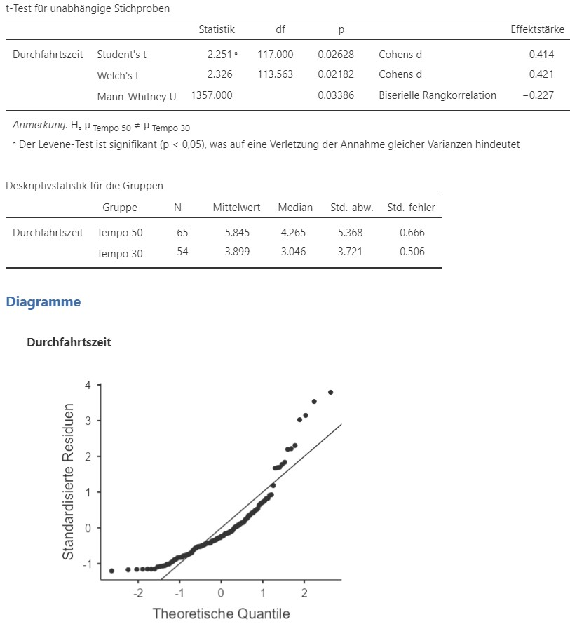
```

Damit können die Teilfragen beantwortet werden.

a)  Die Durchfahrtszeit ist ein intervallskaliertes Merkmal. Ob die
    Beobachtungen einer Zufallsstichprobe entstammen oder nicht muss
    beim Versuchsaufbau berücksichtigt werden und kann nicht im
    Nachhinein aus den Daten gelesen werden. Es sind mehr als $30$
    Beobachtungen pro Gruppe vorhanden. Damit sind alle Voraussetzungen
    für den Welch Test gegeben und es könnte hier auch ein Welch Test
    durchgeführt werden.
b)  Die Population sind alle Autos die durch die betroffene Strasse
    fahren. Das Merkmal ist die Durchfahrtszeit von Autos in Minuten.
c)  Es soll getestet werden, ob sich die medianen Durchfahrtszeiten
    unterscheiden. Die Hypothesen für den $U$-Test sind also zweiseitig
    formuliert $H_0: \mu_\text{Tempo 30} = \mu_\text{Tempo 50}$ und
    $H_1: \mu_\text{Tempo 30} \neq \mu_\text{Tempo 50}$. Das
    Testergebnis kann aus Jamovi abgelesen werden und wird wie folgt
    berichtet und interpretiert:

> Ein zweiseitiger $U$-Test nach Mann und Whitney ergibt, dass sich die
> mediane Durchfahrtszeit durch Köniz bei Tempo 30
> ($\text{Mdn}= 3.05 \text{Min}, N =54$) und Tempo 50
> ($\text{Mdn}=4.27 \text{Min}, N = 65$) signifikant unterscheidet,
> $U = 1357, p = .034, r = -0.227$. Der Effekt ist als mittel
> einzustufen.
:::

::: {#warteschlangen .exercise}
```{=html}
<!-- 
Ziel: 
- Anwendung U-Test mit Jamovi zweiseitig
-->
```

```{r exr-warteschlangen}
gen_exr_warteschlangen <- function(){
  set.seed(23)
  n1 <- 51
  n2 <- 107
  var_name <- "Wartezeit"

  file_name <- '07-exr-warteschlangen.sav'
  dd <- tibble(!!var_name := c(rexp(n1, 1/5),
                               rexp(n2, 1/7)),
         Gruppe = c(rep("Konzept 1", n1), rep("Konzept 2", n2))) %>%
  write_sav(file_name)

  jmv_res <- dd %>%
    jmv::ttestIS(formula = as.formula(str_c(var_name, "~Gruppe")),
                 qq = TRUE,
                 norm = TRUE,
                  desc = TRUE,
                 welchs = TRUE,
                 mann = TRUE,
                 effectSize = TRUE)
  return(mget(ls()))
}
exr_warteschlangen <- gen_exr_warteschlangen()
```

Ein Flughafen nimmt ein neues Terminal in betrieb. Um den Betrieb für
die Zukunft zu optimieren und die Wartezeit der Gäste möglichst kurz zu
halten, werden zwei Warteschlangenkonzepte getestet. Gäste werden dabei
per Kamera getrackt und ihre Wartezeit in Minuten wird im Datensatz
`r inline_code(exr_warteschlangen$file_name)` festgehalten.

a)  Prüfen Sie, ob die Testvoraussetzung für einen Welch Test gegeben
    ist.
b)  Beschreiben Sie die Population und das Merkmal.
c)  Testen Sie mit einem $U$-Test bei Signifikanzniveau $5\%$, ob sich
    die medianen Wartezeiten der beiden Gruppen in der Population
    unterscheiden. Berichten Sie das Resultat und interpretieren Sie die
    Effektstärke.
:::

::: solution
Zuerst wird der Datensatz mit `Jamovi` eingelesen und die
Analyseparameter werden gesetzt, siehe Abbildung
\@ref(fig:sol-warteschlangen-input).

```{r sol-warteschlangen-input, out.width='100%', fig.cap='Jamovi Eingabe.'}
knitr::include_graphics("figures/07-exr-warteschlangen-jmv-input.jpg")
```

Dies produziert das Analyseergebnis in Abbildung
\@ref(fig:sol-warteschlangen-output).

```{r sol-warteschlangen-output, out.width='100%', fig.cap='Jamovi Ausgabe.'}
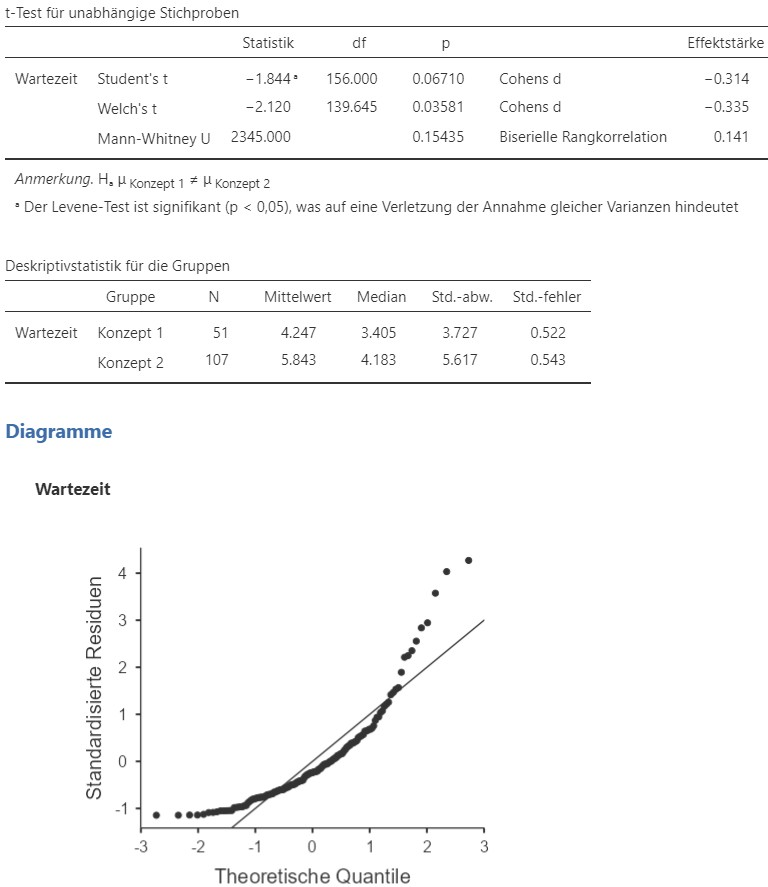
```

Damit können die Teilfragen beantwortet werden.

a)  Die Wartezeit ist ein intervallskaliertes Merkmal. Ob die
    Beobachtungen einer Zufallsstichprobe entstammen oder nicht muss
    beim Versuchsaufbau berücksichtigt werden und kann nicht im
    Nachhinein aus den Daten gelesen werden. Es sind mehr als $30$
    Beobachtungen pro Gruppe vorhanden. Damit sind alle Voraussetzungen
    für den Welch Test gegeben und es könnte hier auch ein Welch Test
    durchgeführt werden.
b)  Die Population sind alle Gäste, die den neuen Terminal benutzen. Das
    Merkmal ist die Wartezeit der Gäste in Minuten.
c)  Es soll getestet werden, ob sich die medianen Durchfahrtszeiten
    unterscheiden. Die Hypothesen für den $U$-Test sind also zweiseitig
    formuliert $H_0: \mu_\text{Konzept 1} = \mu_\text{Konzept 2}$ und
    $H_1: \mu_\text{Konzept 1} \neq \mu_\text{Konzept 2}$. Das
    Testergebnis kann aus `Jamovi` abgelesen werden und wird wie folgt
    berichtet und interpretiert:

> Ein zweiseitiger $U$-Test nach Mann und Whitney ergibt, dass sich die
> mediane Wartezeit am neuen Terminal bei Konzept 1
> ($\text{Mdn}= 3.41 \text{Min}, N =51$) und Konzept 2
> ($\text{Mdn}=4.18 \text{Min}, N = 107$) nicht signifikant
> unterscheidet, $U = 2345, p = .154, r = 0.141$. Der Effekt ist als
> klein einzustufen.
:::

::: {#statistik-herausforderung .exercise}
```{=html}
<!--
Ziel:
- Anwendung U-Test mit Jamovi einseitig
-->
```

```{r exr-statistik-herausforderung}
gen_exr_statistik_herausforderung <- function(){
  set.seed(23)
  n1 <- 6
  n2 <- 5
  var_name <- "Herausforderung"

  file_name <- '07-exr-statistik-herausforderung.sav'
  dd <- tibble(!!var_name := c(c(3,4,2,6,2,5),
                               c(9,7,5,10,6)),
         Gruppe = c(rep("Statistik 1", n1), rep("Statistik 2", n2))) %>%
  write_sav(file_name)

  jmv_res <- dd %>%
    jmv::ttestIS(formula = as.formula(str_c(var_name, "~Gruppe")),
                 qq = TRUE, norm = TRUE,
                desc = TRUE,
                 welchs = TRUE,
                 mann = TRUE,
                 effectSize = TRUE)
  return(mget(ls()))
}
exr_statistik_herausforderung <- gen_exr_statistik_herausforderung()
```

Studierende der Kurse Statistik $1$ und $2$ sollen auf einer Skala von
$1$ bis $10$ bewerten ($1=$ gar nicht herausfordernd, $10 =$ äusserst
herausfordernd), wie herausfordernd der Statistikunterricht für sie ist.
Wird von allen Studierenden der Kurs Statistik $2$ durchschnittlich als
herausfordernder betrachtet als Statistik $1$?

a)  Stellen Sie die Testhypothesen auf.
b)  Weshalb wird hier ein $U$-Test gegenüber einem Welch Test bevorzugt?
c)  Führen Sie einen $U$-Test durch mit Signifikanzniveau $5\%$,
    berichten Sie das Ergebnis in einem Satz und interpretieren Sie die
    Effektstärke. Die Daten sind unter
    `r inline_code(exr_statistik_herausforderung$file_name)` verfügbar.
    (Beispiel frei erfunden.)
:::

::: solution
Zuerst wird der Datensatz mit `Jamovi` eingelesen und die
Analyseparameter werden gesetzt, siehe Abbildung
\@ref(fig:sol-statistik-herausforderung-input).

```{r sol-statistik-herausforderung-input, out.width='100%', fig.cap='Jamovi Eingabe.'}

```

Dies produziert das Analyseergebnis in Abbildung
\@ref(fig:sol-statistik-herausforderung-output).

```{r sol-statistik-herausforderung-output, out.width='100%', fig.cap='Jamovi Ausgabe.'}
knitr::include_graphics("figures/07-exr-statistik-herausforderung-jmv-output.jpg")
```

Damit können die Teilfragen beantwortet werden.

a)  Die Frage "Wird von allen Studierenden der Kurs Statistik $2$
    durchschnittlich als herausfordernder betrachtet als Statistik $1$"
    ist einseitig formuliert. Es soll getestet werden, ob
    $H_1: \mu_\text{Statistik 1} < \mu_\text{Statistik 2}$. Dies
    entspricht der Nullhypothese
    $H_0: \mu_\text{Statistik 1} \geq \mu_\text{Statistik 2}$
b)  Hier wird ein $U$-Test verwendet, da das Merkmal auf einem einzigen
    Likert-skaliertem Merkmal beruht. Dieses ist demnach
    ordinalskaliert. Ein Welch Test eignet sich nur für
    intervallskalierte Merkmale.
c)  Das Testergebnis kann aus `Jamovi` abgelesen werden und wird wie
    folgt berichtet und interpretiert:

> Ein einseitiger $U$-Test nach Mann und Whitney ergibt, dass die
> mediane Herausforderung in Statistik 2 ($\text{Mdn}=7, N = 5$)
> signifikant grösser ist als in Statistik 1 ($\text{Mdn}= 3.5, N =6$),
> $U = 2, p = .011, r = 0.867$. Der Effekt ist als gross einzustufen.
:::

::: {#depression-ecstasy .exercise}
```{r exr-depression-ecstasy}
gen_exr_depression_ecstasy <- function(){
  set.seed(23)
  n1 <- 10
  n2 <- 10
  var_name <- "bdi"

  file_name <- '07-exr-depression-ecstasy.sav'
  dd <- tibble(!!var_name := c(c(15, 35, 16, 18, 19, 17, 27, 16, 13, 20), 
                               c(16, 15, 20, 15, 16, 13, 14, 19, 18, 18)),
         Gruppe = c(rep("Ecstasy", n1), rep("Alkohol", n2))) %>% 
  write_sav(file_name)

  jmv_res <- dd %>%
    jmv::ttestIS(formula = as.formula(str_c(var_name, "~Gruppe")),
                 qq = TRUE, norm = TRUE,
                desc = TRUE,
                 welchs = TRUE, 
                 mann = TRUE, 
                 effectSize = TRUE)
  return(mget(ls()))
}
exr_depression_ecstasy <- gen_exr_depression_ecstasy()
```

Eine Neurologin sammelt Daten, um die depressive Wirkung bestimmter
Freizeitdrogen zu untersuchen. Sie schickt dazu $20$ männliche
Clubgänger unter kontrollierten Bedingungen während vier Stunden in ein
Tanzlokal. Zehn Testpersonen nehmen eine Ecstasy Pille ein, die zehn
anderen trinken einen Liter Bier. Der Grad der Depression wird mit dem
Beck Depression Inventory (BDI) zwölf Stunden nach dem Verlassen des
Tanzlokals gemessen. Die Daten sind unter
`r inline_code(exr_depression_ecstasy$file_name)` verfügbar. Ist die
durchschnittliche Schwere der Nachtanzdepression bei der Ecstasy-Gruppe
schlimmer als bei der Alkohol-Gruppe? Testen Sie mit einem $U$-Test,
berichten Sie das Testresultat und schätzen sie die Effektstärke ein.
:::

::: solution
Zuerst wird der Datensatz mit `Jamovi` eingelesen und die
Analyseparameter werden gesetzt, siehe Abbildung
\@ref(fig:sol-depression-ecstasy-input).

```{r sol-depression-ecstasy-input, out.width='100%', fig.cap='Jamovi Eingabe.'}

```

Dies produziert das Analyseergebnis in Abbildung
\@ref(fig:sol-depression-ecstasy-output).

```{r sol-depression-ecstasy-output, out.width='100%', fig.cap='Jamovi Ausgabe.'}
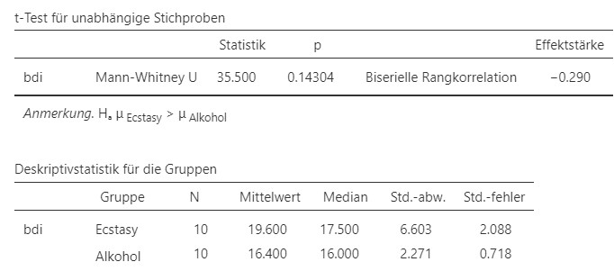
```

Damit kann die Frage nun beantwortet werden:

> Ein einseitiger $U$-Test nach Mann und Whitney ergibt, dass die
> mediane Nachtanzdepression in der Ecstasy-Gruppe
> ($\text{Mdn}=17.5, N = 10$) nicht signifikant grösser ist als in der
> Alkohol-Gruppe ($\text{Mdn}= 16, N =10$),
> $U = 35.5, p = .143, r = -0.290$. Der Effekt ist als mittel
> einzustufen.
:::

## Test

TODO.

<!--chapter:end:src/07-u_test.Rmd-->

# (PART) Zusammenhang zweier Merkmale {.unnumbered}

# Korrelation

Bislang wurde immer ein Merkmal separat betrachtet und manchmal wurden Untergruppen verglichen. Dabei ging es um die Frage, wo der Erwartungswert des Merkmals liegt und ob er einem gewissen Wert entspricht respektive für zwei Gruppen identisch ist. Wird jetzt noch ein zweites Merkmal beobachtet stellt sich die Frage, wie sich die Merkmale zueinander verhalten.

::: {#zahlungsbereitschaft .example name="Zahlungsbereitschaft"}
```{r exm-zahlungsbereitschaft}
gen_exm_zahlungsbereitschaft <- function(){
  set.seed(23)
  n <- 375

  file_name <- '08-exm-zahlungsbereitschaft.sav'
  dd <- tibble(
    Einkommen = rnorm(n, 80, 10),
    Alter = runif(n, 18, 50),
    Anzahl_spiele = rexp(n, 1/10),
    Preis = (Einkommen / 80) *10 - (Anzahl_spiele-10) *0.2 + rnorm(n, 10, 1)) %>% 
  write_sav(file_name)
  jmv_corr <- jmv::corrMatrix(dd)$matrix$asDF %>% 
    rename_with(~.x %>% str_replace_all("\\.|]", "") %>% str_replace_all("\\[","_"))
  jmv_pos <- jmv::corrMatrix(dd, hypothesis = "pos")$matrix$asDF %>% 
    rename_with(~.x %>% str_replace_all("\\.|]", "") %>% str_replace_all("\\[","_"))
  jmv_neg <- jmv::corrMatrix(dd, hypothesis = "neg")$matrix$asDF %>% 
    rename_with(~.x %>% str_replace_all("\\.|]", "") %>% str_replace_all("\\[","_"))
  corr_mat <- dd %>% cor()
  dd %>% ggplot()+geom_point(aes(y = Preis, x = Einkommen))
  scatterplot <- dd %>% 
    pivot_longer(cols = c(1:3), names_to = "Variable", values_to = "Wert") %>%
    ggplot()+
    geom_point(aes(y = Preis, x = Wert))+
    facet_wrap(~Variable,nrow = 1, scales = "free_x")+
    labs(x = "")+ 
    theme(aspect.ratio=1)
  # jmv_res <- dd 
  return(mget(ls()))
}
exm_zahlungsbereitschaft <- gen_exm_zahlungsbereitschaft()
```

Eine Firma will eine Kickstarteridee für ein Kinderspielzeug auf den Markt bringen. Dazu muss sie herausfinden wie viel die Konsumierenden bereit sind für das Spielzeug zu bezahlen. Es werden $`r exm_zahlungsbereitschaft$n`$ Konsumierende gefragt, wie viel sie für das Spielzeug zahlen würden. Zusätzlich wurde auch nach dem Jahreseinkommen in CHF und der Anzahl Spielzeuge im Haushalt gefragt.
:::

[Um den Zusammenhang zwischen zwei intervallskalierten Merkmalen aufzuzeigen wird ein sogenanntes **Streudiagramm** verwendet.]{#customdef-streudiagramm .customdef} Um den Zusammenhang zwischen zwei intervallskalierten Merkmalen aufzuzeigen wird ein sogenanntes Streudiagramm verwendet. Dabei wird ein Koordinatensystem erstellt mit einem Merkmal auf der x-Achse und dem anderen Merkmal auf der y-Achse. Danach wird für jede Beobachtung ein Punkt bei den entsprechenden Werten für die beiden betrachteten Merkmale in dieses Koordinatensystem eingezeichnet.

```{r exm-zahlungsbereitschaft-streudiagramm, fig.cap="Die drei Streudiagramme zeigen jeweils die Zahlungsbereitschaft (Preis in CHF) auf der y-Achse und das Alter in Jahren, die Anzahl Spiele im Haushalt und das Jahreseinkommen in 1'000 CHF respektive auf der x-Achse."}
exm_zahlungsbereitschaft$scatterplot
```

In Abbildung \@ref(fig:exm-zahlungsbereitschaft-streudiagramm) sind drei Streudiagramme aufgezeichnet. Sie setzen jeweils die Zahlungsbereitschaft (Preis) mit dem Alter in Jahren, der Anzahl vorhandener Spiele im Haushalt und dem Einkommen respektive in Bezug. Es kann beobachtet werden, dass die Zahlungsbereitschaft unabhängig vom Alter immer ungefähr ähnlich hoch ist. Es ist des Weiteren klar zu sehen, dass die Zahlungsbereitschaft mit der Anzahl im Haushalt vorhandener Spiele sinkt. Ein bisschen weniger klar ist die Beobachtung, dass die Zahlungsbereitschaft mit dem Jahreseinkommen ansteigt.

[Diese drei Beobachtungen können mit der sogenannten **Korrelation** digitalisiert werden.]{#customdef-korrelation .customdef} Die Korrelation ist eine Zahl zwischen $-1$ und $+1$. Negative Zahlen bedeuten, dass es einen gegenläufigen Zusammenhang gibt. [**Gegenläufig** bedeutet je mehr von Merkmal A, desto weniger von Merkmal B.]{#customdef-gegenlaeufig .customdef} Positive Zahlen bedeuten, dass es einen gleichläufigen Zusammenhang gibt. [**Gleichläufig** bedeutet je mehr von Merkmal A, desto mehr von Merkmal B.]{#customdef-gleichlaeufig .customdef} Eine Korrelation von $0$ schliesslich bedeutet, dass es keinen Zusammenhang zwischen den beiden Merkmalen gibt. Je weiter weg von $0$ die Korrelation liegt, desto eindeutiger ist ein Zusammenhang auf dem Streudiagramm erkennbar. Die Korrelationen für die in der Abbildung gezeigten Zusammenhänge liegen bei $-0.002$ für Alter und Zahlungsbereitschaft, $-0.770$ für die Anzahl Spiele im Haushalt und Zahlungsbereitschaft und $0.484$ für das Einkommen und die Zahlungsbereitschaft.

Die Korrelation erfasst nur lineare Zusammenhänge, also nur wenn Punkte entlang einer Linie streuen im Streudiagramm. Je weiter weg die Korrelation von $0$ ist, desto weniger streuen die Punkte entlang einer Linie, siehe erste und zweite Zeile der Abbildung \@ref(fig:correlation-examples). Die Korrelation sagt lediglich, ob die Linie steigt oder fällt, jedoch nicht wie stark. Nicht lineare Zusammenhänge wie in der dritten Zeile von Abbildung \@ref(fig:correlation-examples) können mit der Korrelation nicht richtig erfasst werden und gängige Korrelationsberechnungen geben zufällige Resultate.

```{r correlation-examples, out.width='100%', fig.cap='Streudiagramme und dazugehörige Korrelation.'}
knitr::include_graphics("figures/08-correlations-wikipedia.jpg")
```

Liegt eine Korrelation vor bedeutet dies, dass die Merkmale sich gemeinsam verändern. In Beispiel \@ref(exm:zahlungsbereitschaft) scheint intuitiv klar, dass das Einkommen und die Anzahl vorhandene Spiele pro Haushalt die Zahlungsbereitschaft beeinflussen. Das Einkommen und die Anzahl Spiele sind also ursächlich. Dass die Zahlungsbereitschaft ursächlich wäre und zum Beispiel das Einkommen beeinflusst ist eher unwahrscheinlich. Welches von zwei Merkmalen ursächlich ist, bzw. wie die Merkmale kausal zusammenhängen, lässt sich jedoch nicht immer einfach beantworten, wie das folgende Beispiel zeigt.

::: {#depression-alkohol-angst .example name="Depression, Angststörungen und Alkohol"}
```{r exm-depression-alkohol-angst}
gen_exm_depression_alkohol_angst <- function(){
  set.seed(23)
  n <- 375
  # alcoholism, Depression (0-63), Angst
  Sigma <- diag(3)
  diag(Sigma) <- c(4,5,7.8)
  Sigma[1,2] <- 1.3
  Sigma[2,3] <- 3.25
  Sigma[1,3] <- 0.3
  Sigma[lower.tri(Sigma)] <- Sigma[upper.tri(Sigma)]
  
  x = mvtnorm::rmvnorm(n, c(15, 19, 43.2), sigma = Sigma)
  colnames(x) <-  c("Alkohol", "Depression", "Angst")
  x <- x %>% as_tibble() 
  file_name <- '08-exm-depression-alkohol-angst.sav'
  dd <- x %>% 
    write_sav(file_name)
  file_name1 <- '08-exm-depressiondiagnose-alkohol-angst.sav'
  dd1 <- x %>% 
    mutate(depressionsdiagnose = ifelse(Depression >= 20, "schwer", "leicht")) %>% 
    write_sav(file_name1)
  desc_1gr <- (dd1 %>% 
                 jmv::descriptives())$descriptives$asDF %>% 
    rename_with(~.x %>% 
                  str_replace_all("\\.|]", "") %>% 
                  str_replace_all("\\[","_"))
  desc_2gr <- (dd1 %>% 
                 jmv::descriptives(splitBy = "depressionsdiagnose"))$descriptives$asDF %>% 
    rename_with(~.x %>% 
                  str_replace_all("\\.|]", "") %>% 
                  str_replace_all("\\[","_"))
  jmv_corr <- jmv::corrMatrix(dd)$matrix$asDF %>% 
    rename_with(~.x %>% str_replace_all("\\.|]", "") %>% str_replace_all("\\[","_"))
  jmv_partcorr <- (dd %>% 
    jmv::corrPart(vars = c('Angst', 'Alkohol'),controls = "Depression"))$matrix$asDF%>%
    rename_with(~.x %>% str_replace_all("\\.|]", "") %>% str_replace_all("\\[","_"))
  corr_mat <- dd %>% cor()
  scatter1 <- dd %>% ggplot()+geom_point(aes(y = Alkohol, x = Depression))
  scatter2 <- dd %>% ggplot()+geom_point(aes(y = Alkohol, x = Angst))
  scatter3 <- dd %>% ggplot()+geom_point(aes(y = Depression, x = Angst))
  
  return(mget(ls()))
}
exm_depression_alkohol_angst <- gen_exm_depression_alkohol_angst()
```

In der Psychotherapie ist aufgefallen, dass sich Alkoholabhängigkeit, Angststörungen und Depression in der Tendenz wechselwirkend positiv beeinflussen [@schuckit1996]. Dies soll mit den fiktiven Daten in `r inline_code(exm_depression_alkohol_angst$file_name)` illustriert werden. Für die Messung der Schwere der drei Merkmale Alkoholismus, Angststörung und Depression wurden die folgenden Messinstrumente verwendet: Das Beck Depression Inventory *BDI* für die Depression [@beck1988], das state trait anxiety inventory *STAI* für die Angststörungen [@spielberger1983manual] und das alcohol use inventory für den Alkoholismus [@skinner1982].
:::

Streudiagramme aller möglicher bivariaten Zusammenhänge sind in Abbildung \@ref(fig:exm-depression-alkohol-angst-scatter) dargestellt. Während der lineare Zusammenhang zwischen Alkoholismus und Angststörung kaum erkennbar ist, so kann zwischen Depression und Alkoholismus ein leichter und zwischen Depression und Angststörung ein deutlich gleichläufiger linearer Zusammenhang festgestellt werden. Die geschätzten Korrelationen sind $`r round(exm_depression_alkohol_angst$corr_mat['Alkohol', 'Depression'],2)`$ zwischen Alkoholismus und Depression, $`r round(exm_depression_alkohol_angst$corr_mat['Alkohol', 'Angst'],2)`$ zwischen Alkoholismus und Angststörung und $`r round(exm_depression_alkohol_angst$corr_mat['Depression', 'Angst'],2)`$ zwischen Depression und Angststörung.

```{r exm-depression-alkohol-angst-scatter, fig.cap="Wiederholte Stichprobenziehung bei gleichbleibender Population mit eher hohen Angst-Werten.", echo = FALSE}
plots <- with(exm_depression_alkohol_angst, 
              list(scatter1, scatter2, scatter3)) %>% 
  map(~ .x + theme(aspect.ratio=1))
do.call(grid.arrange, c(plots, ncol = 3))
```

In diesem Fall ist unklar, ob jemand mit Alkoholismus eher eine Angststörung entwickelt, oder jemand mit Angststörung eher eine Alkoholabhängigkeit entwickelt. Die Korrelation gibt nur einen Anhaltspunkt über die Art des Zusammenhangs, nicht aber über die Ursächlichkeit der Variablen. Es könnte auch sein, dass die beiden Merkmale eigentlich unabhängig voneinander sind, aber ein drittes Merkmal die beiden Merkmale beeinflusst. Dazu später mehr unter \@ref(stoerfaktor).

Für die genaue Berechnung der Korrelation gibt es verschiedene Möglichkeiten, wovon auf einige im Verlauf dieses Kapitels eingegangen wird.

## Wie stark ist der Zusammenhang zwischen zwei intervallskalierten und normalverteilten Variablen?

Wenn die beiden Merkmale je intervallskaliert sind und deren Beobachtungen $x_1, \ldots, x_n$ und $y_1,\ldots, y_n$ einer normalverteilten Population entstammen, dann ist wird Korrelation mit dem [**Korrelationskoeffizient nach Person**]{#customdef-pearson-korrelation .customdef}, auch [**Produkt-Moment-Korrelation**]{#customdef-podukt-moment-korrelation .customdef} genannt,

$$
r = \frac{\frac{1}{n-1} \sum_{i=1}^n (x_i - \bar{x})(y_i - \bar{y})}{\sqrt{\frac{1}{n-1}\sum_{i=1}^n (x_i - \bar{x})^2}\cdot \sqrt{\frac{1}{n-1}\sum_{i=1}^n (y_i - \bar{y})^2}}
$$ 

geschätzt. Im Zähler steht dabei die sogenannte Kovarianz. Diese misst mit Wert der Summanden, wie stark ein Punkt vom Durchschnitt abweicht und mit dem Vorzeichen der Summanden, ob beide Merkmale in dieselbe Richtung vom Durchschnitt abweichen oder nicht. Der Wert der Kovarianz hängt von der Einheit der Merkmale ab. Um dies zu vermeiden wird die Korrelation durch das Produkt der Standardabweichungen der beiden Merkmale geteilt. So wird $-1<r<1$ erreicht.

Die oben in den Beispielen angegebenen Korrelationen wurden mit dem Korrelationskoeffizient nach Pearson basierende auf einer Zufallsstichprobe geschätzt. Der so berechnetet Wert gilt deshalb für die Stichprobe und ist die beste Schätzung für die Korrelation in der Population. Aufgrund der Überlegungen aus Kapitel \@ref(stichprobenziehung) ist diese Schätzung jedoch mit Unsicherheit behaftet. Diese Unsicherheit kann mit einem Konfidenzintervall abgeschätzt werden. Die genaue Berechnung davon wird hier nicht erläutert.

Wichtig für die Beurteilung der Korrelation ist die Frage, ob eine Korrelation besteht oder nicht. Die Korrelation in der Population wird mit $\rho$, sprich 'rho' bezeichnet. Es wird also gefragt, ob $H_1: \rho \neq 0$, $H_1: \rho > 0$ oder $H_1: \rho < 0$ ist. Diese Fragestellungen können mit einem zweiseitigen respektive einseitigen statistischen Test getestet werden. Da getestet wird, ob die Korrelation sich von $0$ unterscheidet wird dieser Test [**Absicherung gegen Null**]{#customdef-podukt-moment-absichern-null .customdef} genannt.

Die Teststatistik für die Absicherung gegen Null der Korrelation nach Pearson ist

\begin{equation}
t = r\cdot \sqrt{\frac{n-2}{1-r^2}}.
(\#eq:absichern-pearson)
\end{equation}

Wenn wiederholt Stichproben gezogen werden und immer wieder die Teststatistik berechnet wird, kann beobachtet werden, dass die Teststatistik $t$-verteilt bei $n-2$ Freiheitsgraden ist.

In `Jamovi` wird die Korrelation nach Pearson unter `Analysen > Regression > Korrelationsmatrix` und `Korrelationskoeffizienten: Pearson` geschätzt und mit der Zusatzoption `Zusätzliche Optionen: Signifikanzniveau` gegen Null abgesichert. Angenommen, es gäbe kein Vorwissen über die Richtung des Zusammenhangs zwischen den Merkmalen Alkoholismus, Depression und Angst. In diesem Fall werden zweiseitige Tests berechnet und wie folgt berichtet:

> Die zweiseitige Absicherung gegen Null des Korrelationskoeffizienten nach Pearson ergibt, dass sich die Korrelation zwischen Alkoholismus und Depression ($r = `r round(exm_depression_alkohol_angst$corr_mat['Alkohol', 'Depression'],2)`$) signifikant von $0$ unterscheidet, `r absichern_pearson(exm_depression_alkohol_angst$corr_mat['Alkohol', 'Depression'], exm_depression_alkohol_angst$n)`, $`r exm_depression_alkohol_angst$jmv_corr %>% filter(name_r == "Depression") %>% pull(Alkohol_rp) %>% as.numeric() %>% report_p(3)`$.
>
> Die zweiseitige Absicherung gegen Null des Korrelationskoeffizienten nach Pearson ergibt, dass sich die Korrelation zwischen Alkoholismus und Angststörung ($r = `r round(exm_depression_alkohol_angst$corr_mat['Alkohol', 'Angst'],2)`$) nicht signifikant von $0$ unterscheidet, `r absichern_pearson(exm_depression_alkohol_angst$corr_mat['Alkohol', 'Angst'], exm_depression_alkohol_angst$n)`, $`r exm_depression_alkohol_angst$jmv_corr %>% filter(name_r == "Angst") %>% pull(Alkohol_rp) %>% as.numeric() %>% report_p(3)`$.

Ist eine klare Hypothese über die Richtung des linearen Zusammenhangs vorhanden, zum Beispiel Leute mit mehr Geld kaufen mehr Geld für Spielzeuge ausgeben wollen, so kann auch einseitig getestet werden: $H_0: \rho \leq 0$ und $H_1: \rho > 0$ und

> Die einseitige Absicherung gegen Null des Korrelationskoeffizienten nach Pearson ergibt, dass die Korrelation zwischen Kaufbereitschaft und Einkommen ($r = `r round(exm_zahlungsbereitschaft$corr_mat['Preis', 'Einkommen'],2)`$) signifikant grösser ist als $0$, `r absichern_pearson(exm_zahlungsbereitschaft$corr_mat['Preis', 'Einkommen'], exm_zahlungsbereitschaft$n)`, $`r exm_zahlungsbereitschaft$jmv_pos %>% filter(name_r == "Preis") %>% pull(Einkommen_rp) %>% as.numeric() %>% report_p(3)`$.

Da die Teststatistik nicht von `Jamovi` direkt ausgegeben wird, muss diese händisch berechnet werden.

## Wie stark ist der Zusammenhang zwischen zwei mindestens ordinalskalierten Merkmalen?

Manchmal ist ein Merkmal oder beide Merkmale nicht intervallskaliert und normalverteilt. Sind die Daten beider Merkmale dennoch mindestens ordinalskaliert, so kann die [**Korrelation nach Spearman**]{#customdef-spearman-korrelation .customdef}, auch **Spearmans Korrelationskoeffizient** genannt, verwendet werden.

::: {#fb-life .example name="Facebook und Lebenszufriedenheit."}

```{r exm-fb-life}
gen_exm_fb_life <- function(){
  set.seed(23)
  n <- 73
  Sigma <- diag(2)
  Sigma[1,2] <- - 0.43
  Sigma[lower.tri(Sigma)] <- Sigma[upper.tri(Sigma)]
  
  x = mvtnorm::rmvnorm(n, c(0,0), sigma = Sigma)
  colnames(x) <-  c("life_satisfaction", "fb_intensity")
  x <- x %>% as_tibble() %>% 
    mutate(life_satisfaction = round((5+life_satisfaction * 2)),
           fb_intensity = fb_intensity + rexp(n,1/3),
           fb_intensity = case_when(fb_intensity > 7 ~ 7,
                                    fb_intensity < 1 ~ 1,
                                    TRUE ~fb_intensity) %>% round())
  
  file_name <- '08-exm-fb-life.sav'
  dd <- x %>% 
    write_sav(file_name)
  jmv_corr <- jmv::corrMatrix(dd, pearson = FALSE, spearman = TRUE)$matrix$asDF %>%
    rename_with(~.x %>% str_replace_all("\\.|]", "") %>% str_replace_all("\\[","_"))
  corr_mat <- dd %>% cor()
  # scatter1 <- dd %>% ggplot()+geom_point(aes(y = Alkohol, x = Depression))
  # scatter2 <- dd %>% ggplot()+geom_point(aes(y = Alkohol, x = Angst))
  # scatter3 <- dd %>% ggplot()+geom_point(aes(y = Depression, x = Angst))
  return(mget(ls()))
}
exm_fb_life <- gen_exm_fb_life()
```

Je intensiver Facebook konsumiert wird, desto tiefer ist die Lebenszufriedenheit [@blachnio2016]. Eine Studie will dieses Resultat reproduzieren. Die Facebook-Nutzungsintensität wurde dafür mit einer Skala von $1$ (keine) bis $7$ (sehr intensive Nutzung) und die Lebenszufriedenheit mit Punkten von $1$ (sehr unzufrieden) bis $10$ (sehr zufrieden) gemessen. Es wurden $`r exm_fb_life$n`$ Personen befragt. Ihre Antworten wurden bereinigt im Datensatz `r inline_code(exm_fb_life$file_name)` abgelegt. Nach der Erhebung wird festgestellt, dass die beiden Merkmale nicht normalverteilt sind.
:::

Wenn die Daten beider Merkmale mindestens ordinalskaliert sind, diese aber nicht die Voraussetzungen für die Korrelation nach Pearson erfüllen, kann die Korrelation nach Spearman angewendet werden. Diese wird berechnet indem den Beobachtungen jedes Merkmals aufsteigende sortiert und entsprechend der Reihenfolge Rangplätze vergeben werden. Die Differenz der Ränge der beiden Merkmale für Beobachtung $i$ wird mit $d_i$ bezeichnet. Die Korrelation nach Spearman ist 

$$r = 1 - \frac{6\cdot \sum_{i = 1}^n d_i^2}{n\cdot (n^2 -1)}.$$

::::{.caution data-latex=""}
::: {.remark}
Exploration der Definition der Spearman'schen Korrelation

1. Alle Punkte sind entlang einer aufsteigenden Linie: In diesem Fall entsprechen sich die Ränge der beiden Merkmale genau und $d_i = 0$ für alle Beobachtungen. Dies führt zu $d_i^2 = 0$ und demnach zu $r = 1$. 
2. $n= 5$ Punkte sind entlang einer absteigenden Linie: In diesem Fall entspricht der kleinste Rang des einen Merkmals dem grössten des anderen Merkmals, der zweitgrösste Rang dem zweitkleinsten, usw. Die Rangdifferenzen sind in dem Fall $d_1 = 5-1=4, d_2 = 4-2=2, d_3 = 3-3 = 0, d_4 = 2-4 = -2, d_5 = 1-5 = -4$. Dies führt zu 
$$r = 1 - \frac{6\cdot (4^2+2^2+0^2+(-2)^2+(-4)^2 )}{5\cdot (5^2 -1)} = 1 - \frac{240}{120} = 1-2 = -1.$$
Die Formel ist also so ausgestaltet, dass bei perfektem gegenläufigem Zusammenhang eine Korrelation von $-1$ erreicht wird.

:::
::::

Die Absicherung gegen Null der Korrelation nach Spearman erfolgt gleich wie bei der Korrelation nach Pearson. Die Teststatistik wird also auch mit Gleichung \@ref(eq:absichern-pearson) berechnet und ist ebenfalls $t$-verteilt bei $n-2$ Freiheitsgraden, wobei $n$ für die Anzahl Beobachtungspaare steht.

In `Jamovi` wird die Korrelation nach Spearman unter `Analysen > Regression > Korrelationsmatrix` und `Korrelationskoeffizienten: Spearman` geschätzt und mit der Zusatzoption `Zusätzliche Optionen: Signifikanzniveau` gegen Null abgesichert. Angenommen, es gäbe kein Vorwissen über die Richtung des Zusammenhangs zwischen den Merkmalen Facebook-Nutzungsintensität und Lebenszufriedenheit. In diesem Fall werden zweiseitige Tests berechnet und wie folgt berichtet:

> Die zweiseitige Absicherung gegen Null des Korrelationskoeffizienten nach Spearman ergibt, dass sich die Korrelation zwischen Facebook-Nutzungsintensität und Lebenszufriedenheit ($r = `r round(exm_fb_life$corr_mat['fb_intensity', 'life_satisfaction'],2)`$) signifikant von $0$ unterscheidet, `r absichern_pearson(exm_fb_life$corr_mat['fb_intensity', 'life_satisfaction'], exm_fb_life$n)`, $`r exm_fb_life$jmv_corr %>% filter(name_rho == "fb_intensity") %>% pull(life_satisfaction_rhop) %>% as.numeric() %>% report_p(3)`$.

## Wie stark ist der Zusammenhang zwischen einem intervallskalierten und normalverteilten Merkmal und einem dichotomen Merkmal?

Ein mit dem BDI gemessener Wert für Depression kann kategorisiert werden in leichte Depression ($1-19$) Punkte und schwere Depression ($20-63$) Punkte. Es folgt also eine neues dichotomes Merkmal Depressionsdiagnose mit Ausprägungen leichte und schwere Depression. Hier kann ebenfalls die Frage gestellt werden, wie stark der Zusammenhang zwischen Depressionsdiagnose und dem intervallskalierten Wert für den Alkoholismus.  [Die **punktbiseriale Korrelation** ist dazu geeignet den Zusammenhang zwischen einer dichotomen und einem intervallskalierten normalverteilten Merkmal zu messen.]{#customdef-punktbiseriale-korrelation .customdef} gemessen. Sie wird berechnet mit

$$ r = \frac{\bar{x}_1- \bar{x}_2}{(n_1+n_2)\cdot s}\sqrt{n_1\cdot n_2},$$
wobei $s$ die Standardabweichung des intervallskalierten Merkmals bezeichnet.

Die Berechnung der punktbiserialen Korrelation ist in Jamovi nicht implementiert. Die Kenngrössen für die Berechnung können jedoch aus der `Erforschung > Deskriptivstatistik` von `Jamovi` abgelesen werden. Dabei ist zu beachten, dass für $\bar{x}_1, n_1, \bar{x}_2, n_2$ die Option `Aufgeteilt nach` mit dem dichotomen Merkmal befüllt sein muss. Für die Berechnung von $s$ muss dieses Feld jedoch leer sein. Im Beispiel ist die punktbiseriale Korrelation

$$ r = \frac{\bar{x}_1- \bar{x}_2}{(n_1+n_2)\cdot s}\sqrt{n_1\cdot n_2}
= \frac{`r round(exm_depression_alkohol_angst$desc_2gr$Alkohol_meanschwer,2)`- `r round(exm_depression_alkohol_angst$desc_2gr$Alkohol_meanleicht,2)`}{(`r exm_depression_alkohol_angst$desc_2gr$Alkohol_nschwer`+`r exm_depression_alkohol_angst$desc_2gr$Alkohol_nleicht`)\cdot `r round(exm_depression_alkohol_angst$desc_1gr$Alkohol_sd,2)`}\sqrt{`r exm_depression_alkohol_angst$desc_2gr$Alkohol_nschwer`\cdot `r exm_depression_alkohol_angst$desc_2gr$Alkohol_nleicht`} = `r round(((round(exm_depression_alkohol_angst$desc_2gr$Alkohol_meanschwer,2) - round(exm_depression_alkohol_angst$desc_2gr$Alkohol_meanleicht,2))/(round(exm_depression_alkohol_angst$desc_1gr$Alkohol_sd,2)*(exm_depression_alkohol_angst$desc_2gr$Alkohol_nschwer+exm_depression_alkohol_angst$desc_2gr$Alkohol_nleicht)))*sqrt(exm_depression_alkohol_angst$desc_2gr$Alkohol_nschwer*exm_depression_alkohol_angst$desc_2gr$Alkohol_nleicht),2)`.$$

Da ein dichotomes Merkmal wie die Depressionsdiagnostik nur zwei Ausprägungen hat, funktioniert die übliche Interpretation dieses gleichläufigen Zusammenhangs mit "je mehr schwere Depression, desto höher der Alkoholismus-Wert" nicht mehr. Stattdessen kann die leicht angepasste Interpretation "je eher eine Person eine schwere Depression hat, desto höher der Alkoholismus-Wert" oder "je höher der Alkoholismus-Wert, desto eher hat eine Person eine schwere Depression" verwendet werden.

Eine genaue Betrachtung dieser Formel lässt eine Ähnlichkeit zur Effektstärke des Zweistichproben-$t$-Tests und Welch Tests erkennen. Tatsächlich kommt die punktbiseriale Korrelation in den gleichen Fällen zur Anwendung wie besagte Tests und ist äquivalent zu deren Effektstärken.

Die punktbiseriale Korrelation wird ähnlich wie die Korrelation nach Pearson abgesichert. Die Teststatistik ist

\begin{equation}
t = r\cdot \sqrt{\frac{n_1 + n_2 -2}{1-r^2}}.
\end{equation}

Sie folgt einer t-Verteilung bei $n_1 + n_2 -2$ Freiheitsgraden. Dieser Wert kann mit der entsprechenden $t$-Verteilung in Abbildung \@ref(fig:t-distribution) verglichen werden. Da die Absicherung nicht in `Jamovi` implementiert ist, wird die Absicherung gegen null der punktbiserialen Korrelation an der Prüfung nicht erwartet. Um die Zufälligkeit des gefundenen Zusammenhangs zu beurteilen, kann behelfsmässig auf das Resultat des Zweistichproben-$t$-Tests resp. Welch Test abgestellt werden.

## Wie stark ist der Zusammenhang zwischen einem mindestens ordinalskalierten Merkmal und einem dichotomen Merkmal?

Genau wie die vorherige Situation äquivalent zum Zweistichproben-$t$-Test und Welch Test war, ist die Situation mit einem mindestens ordinalskaliertem Merkmal und einem dichotomen Merkmal äquivalent zur Effektstärke des U-Tests nach Mann und Whitney. Für die Effektstärke des $U$-Test wurde tatsächlich bereits die biseriale Rangkorrelation definiert und in Abschnitt \@ref(u-test-effect) hinlänglich beschrieben. Für das Beispiel \@ref(exm:depression-alkohol-angst) mit Depressionsdiagnose kann die biseriale Rangkorrelation herausgefunden werden, indem ein $U$-Test und dessen Effektstärke berechnet wird, was $r = 0.357$ ergibt. 

Da auch die Absicherung gegen Null der biserialen Rangkorrelation nicht in `Jamovi` implementiert ist, wird dies an der Prüfung nicht erwartet. Um die Zufälligkeit des gefundenen Zusammenhangs zu beurteilen, kann behelfsmässig auf das Resultat des $U$-Tests abgestellt werden.

## Was ist eine Störfaktor und wie wird damit umgegangen? {#stoerfaktor}

Im Beispiel \@ref(exm:depression-alkohol-angst) wurde festgestellt, dass es einen Zusammenhang schwachen Zusammenhang zwischen Alkoholismus und Angststörung gibt. Je stärker der Alkoholismus ausgeprägt ist, desto höher ist auch der Wert für die Angststörung. Dies ist im oberen Teil der Abbildung  \@ref(fig:exm-depression-alkohol-angst-stoervardiagramm) abstrahiert dargestellt.

Es wurde jedoch auch festgestellt, dass die Merkmale Angst und Alkoholismus jeweils mit dem Merkmal Depression korrelieren. Es könnte also sein, dass der Zusammenhang zwischen Alkoholismus und Angststörung lediglich darauf beruht, dass Menschen mit schwerer Depression zu höherem Alkoholismus und ebenfalls zu mehr Angststörungen neigen. Die Angststörung und der Alkoholismus könnten schwächer korreliert oder gar unabhängig voneinander sein. Wenn ein drittes Merkmal den Zusammenhang zweier Merkmale auf irgendeine Weise verfälsch, wird dieses Merkmal [**Störfaktor**]{#customdef-stoerfaktor .customdef} oder **Störvariable** genannt.

Um den Einfluss einer Störvariable $X_3$ auf den Zusammenhang zweier Merkmale $X_1$ und $X_2$ zu beurteilen, kann die [**partielle Korrelation**]{#customdef-partielle-korrelation .customdef} 
$$r_{12.3} = \frac{r_{12}- r_{23}\cdot r_{13}}{\sqrt{(1-r_{23}^2)\cdot(1-r_{13}^2)}}$$
berechnet werden. Die $r$ stehen dabei für die Korrelation nach Pearson zwischen den zwei indexierten Merkmalen. 

::::{.caution data-latex=""}
::: {.remark}
Exploration der Formel der partiellen Korrelation: 

1. Das dritte Merkmal korreliert nicht mit den ersten beiden $r_{23} = r_{13} = 0$. In diesem Fall ist $r_{12.3} = r_{12}$.
2. Das dritte Merkmal korreliert sehr schwach mit den ersten beiden $r_{23} = r_{13} = 0.01$. In diesem Fall ist $r_{12.3} \approx r_{12}$.
:::
::::

Die partielle Korrelation kann in `Jamovi` unter `Analysen > Regression > Partielle Korrelation` berechnet werden und beträgt $r = -0.05$. Unter Berücksichtigung der Störvariable Depression, ist der Zusammenhang zwischen Alkoholismus und Angststörung also nicht nur kleiner geworden, sondern hat sich sogar in einen gegenläufigen Zusammenhang gewandelt. Dies ist abstrahiert im
unteren Teil der Abbildung \@ref(fig:exm-depression-alkohol-angst-stoervardiagramm)  dargestellt. Wird die partielle Korrelation unter Berücksichtigung einer Störvariable angegeben, spricht man auch von es wurde für die Störvariable **kontrolliert**.

```{r exm-depression-alkohol-angst-stoervardiagramm,fig.show = 'hold', out.height='50%', fig.cap="Zusammenhang zwischen Angst und Alkoholismus ohne (oben) und mit (unten) Berücksichtigung der Störvariable."}
grViz("
digraph G {
  rankdir=LR;
  node [shape=box, style=filled, fillcolor=lightblue, fontsize=18];

  Alkoholismus;
  Angst;
  
  Angst -> Alkoholismus [penwidth=2, dir=both, label = 'r = 0.10'];
}
")
grViz("
digraph G {
  rankdir=LR;
  node [shape=box, style=filled, fillcolor=lightblue, fontsize=18];

  Alkoholismus;
  Angst;
  Depression;

  Depression -> Angst [penwidth=2, label = 'r = 0.46'];
  Depression -> Alkoholismus [penwidth=2, label = 'r = 0.32'];
  Angst -> Alkoholismus [penwidth=2, dir=both, label = 'Partielle r = -0.05', color = red];
}
")
```


Die Absicherung gegen Null der partiellen Korrelation erfolgt ähnlich wie bei der Korrelation nach Pearson. Die Teststatistik wird mit

\begin{equation}
t = r\cdot \sqrt{\frac{n-3}{1-r^2}}.
(\#eq:absichern-partial)
\end{equation}

berechnet und ist $t$-verteilt bei $n-3$ Freiheitsgraden, wobei $n$ für die Anzahl Beobachtungstripel steht. Die Teststatistik wird von `Jamovi` nicht berechnet und muss händisch eruiert werden.

> Die zweiseitige Absicherung gegen Null der partiellen Korrelation ergibt, dass sich die Korrelation zwischen Alkoholismus und Angststörung unter Berücksichtigung der Depression als Störfaktor ($r = `r round(exm_depression_alkohol_angst$jmv_partcorr %>% filter(name_r == "Alkohol") %>% pull("Angst_r") %>% as.numeric(),2)`$) nicht signifikant von $0$ unterscheidet, `r absichern_partiell(exm_depression_alkohol_angst$jmv_partcorr %>% filter(name_r == "Alkohol") %>% pull("Angst_r") %>% as.numeric(), exm_depression_alkohol_angst$n)`, $`r exm_depression_alkohol_angst$jmv_partcorr %>% filter(name_r == "Alkohol") %>% pull(Angst_rp) %>% as.numeric() %>% report_p(3)`$. Die Korrelation ist als schwach einzustufen.

In diesem Beispiel wurde die Angst arbiträr als Störfaktor gehandelt. Die selben Überlegungen und Berechnungen wären aber auch zum Beispiel für den Alkoholismus als Störfaktor für den Zusammenhang zwischen Angst und Depression zulässig. Die Identifikation von Störvariablen muss also theoriegeleitet erfolgen.


## Übungen

::: {#depression-alkohol-angst-berichten .exercise}
```{=html}
<!-- 
Ziel: 
- Korrelation mit Jamovi berechnen und zweiseitig gegen 0 absichern.
-->
```

Sichern Sie die Korrelation nach Pearson zwischen Angststörung und Depression in Beispiel \@ref(exm:depression-alkohol-angst) mit dem Datensatz `r inline_code(exm_depression_alkohol_angst$file_name)` zweiseitig gegen Null ab, berichten Sie das Ergebnis und interpretieren Sie die Stärke des Zusammenhangs.
:::

::: solution
> Die zweiseitige Absicherung gegen Null des Korrelationskoeffizienten nach Pearson ergibt, dass sich die Korrelation zwischen Depression und Angststörung ($r = `r round(exm_depression_alkohol_angst$corr_mat['Depression', 'Angst'],2)`$) sich signifikant von $0$ unterscheidet, `r absichern_pearson(exm_depression_alkohol_angst$corr_mat['Depression', 'Angst'], exm_depression_alkohol_angst$n)`, $`r exm_depression_alkohol_angst$jmv_corr %>% filter(name_r == "Angst") %>% pull(Depression_rp) %>% as.numeric() %>% report_p(3)`$. Die Korrelation deutet auf einen starken Zusammenhang der Art je mehr Depression desto grösser die Angststörung hin.
:::

::: {#zahlungsbereitschaft-berichten .exercise}
```{=html}
<!-- 
Ziel: 
- Korrelation mit Jamovi berechnen und einseitig gegen 0 absichern.
-->
```

Testen Sie mit dem Datensatz `r inline_code(exm_zahlungsbereitschaft$file_name)` aus Beispiel \@ref(exm:zahlungsbereitschaft), ob die Korrelation nach Pearson zwischen der Zahlungsbereitschaft `Preis` und Alter positiv und ob die Korrelation zwischen der Zahlungsbereitschaft und der Anzahl Spiele im Haushalt negativ ist. Berichten Sie das Ergebnis und interpretieren Sie die Stärke des Zusammenhangs.
:::

::: solution
> Die einseitige Absicherung gegen Null des Korrelationskoeffizienten nach Pearson ergibt, dass die Korrelation zwischen Kaufbereitschaft und Alter ($r = `r round(exm_zahlungsbereitschaft$corr_mat['Preis', 'Alter'],2)`$) nicht signifikant grösser ist als $0$, `r absichern_pearson(exm_zahlungsbereitschaft$corr_mat['Preis', 'Alter'], exm_zahlungsbereitschaft$n)`, $`r exm_zahlungsbereitschaft$jmv_pos %>% filter(name_r == "Preis") %>% pull(Alter_rp) %>% as.numeric() %>% report_p(3)`$. Der Zusammenhang ist so schwach, dass keine Richtung des Zusammenhangs aus dem Korrelationskoeffizenten abgelesen werden kann.
>
> Die einseitige Absicherung gegen Null des Korrelationskoeffizienten nach Pearson ergibt, dass die Korrelation zwischen Kaufbereitschaft und Anzahl Spiele ($r = `r round(exm_zahlungsbereitschaft$corr_mat['Preis', 'Anzahl_spiele'],2)`$) signifikant kleiner ist als $0$,`r absichern_pearson(exm_zahlungsbereitschaft$corr_mat['Preis', 'Anzahl_spiele'], exm_zahlungsbereitschaft$n)`, $`r exm_zahlungsbereitschaft$jmv_neg %>% filter(name_r == "Preis") %>% pull(Anzahl_spiele_rp) %>% as.numeric() %>% report_p(3)`$. Der Zusammenhang der Art je höher die Kaufbereitschaft, desto tiefer die Anzahl Spiele im Haushalt, ist stark.
:::

::: {#big-five-cor .exercise}
```{=html}
<!-- 
Ziel: Psychologische Anwendung.
- 
-->
```

Im Rahmen einer Studie wurde die Big-5-Persönlichkeitszüge von $500$ psychologie Studierenden abgefragt [@dolan2009]. Der Datensatz ist unter `Jamovi > Öffnen > Datenbibliothek > Big 5 (Dolan, Oort, Stoel & Wicherts, 2009)` verfügbar. Die Merkmale Neuroticism, Extraversion, Openness, Agreeableness und Conscientiousness stehen für Neurotizismus, Extraversion, Offenheit, Verträglichkeit und Gewissenhaftikeit respektive.

a)  Berechnen Sie paarweise die Korrelation nach Pearson zwischen allen fünf Merkmalen. Erklären und interpretieren Sie die stärkste negative, die stärkste positive Korrelation und die schwächste Korrelation.
b)  Zeichnen Sie die Korrelationsmatrix als Diagramm, inklusive Variablendichte und Statistiken und erklären Sie, was für Diagrammtypen Sie sehen.
c)  Testen Sie, ob die Korrelationen von Null abweichen und berichten Sie das Ergebnis für die stärkste negative, die stärkste positive Korrelation und die schwächste Korrelation.
:::

::: solution
Zuerst wird der Datensatz mit `Jamovi` eingelesen und die Analyseparameter werden gesetzt, siehe Abbildung \@ref(fig:sol-big-five-cor-input).

```{r sol-big-five-cor-input, out.width='100%', fig.cap='Jamovi Eingabe.'}
knitr::include_graphics("figures/08-exr-big-five-cor-jmv-input.jpg")
```

Dies produziert das Analyseergebnis in Abbildungen \@ref(fig:sol-big-five-cor-output-koorelationsmatrix) und \@ref(fig:sol-big-five-cor-output-koorelationsmatrixdiagramm).

```{r sol-big-five-cor-output-koorelationsmatrix, out.width='100%', fig.cap='Jamovi Ausgabe.'}
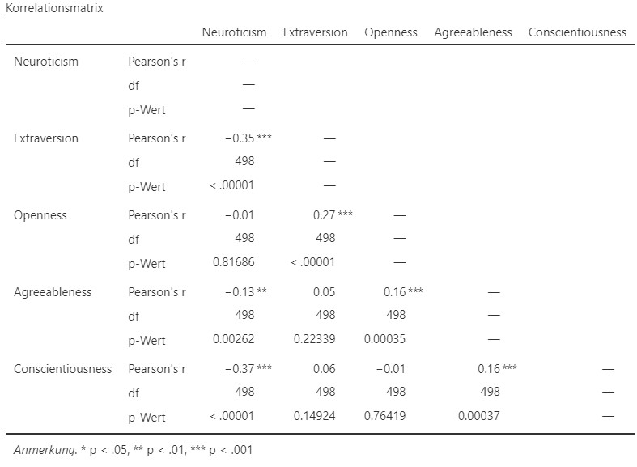
```

```{r sol-big-five-cor-output-koorelationsmatrixdiagramm, out.width='100%', fig.cap='Jamovi Ausgabe.'}
knitr::include_graphics("figures/08-exr-big-five-cor-jmv-output-korrelationsmatrixdiagramm.jpg")
```

Damit können die Teilfragen beantwortet werden.

a)  Die Korrelationen können direkt aus Abbildung \@ref(fig:sol-big-five-cor-output-koorelationsmatrix) entnommen werden. Die stärkste positive Korrelation beschreibt den Zusammenhang zwischen Extraversion und Openness ($r = 0.267$). Diese Korrelation ist als mittel einzustufen und bedeutet je extravertierter eine Person ist desto höhere Werte hat sie tendenziell auch bei der Offenheit. Die stärkste negative Korrelation beschreibt den Zusammenhang zwischen Neuroticism und Conscientiousness ($r = -0.368$). Dies ist ebenfalls eine mittlere Korrelation. Sie bedeutet je neurotischer jemand ist, desto tiefere Werte für Conscientiousness hat die Person. Die schwächste Korrelation beschreibt den Zusammenhang zwischen Neuroticism und Openness ($r = -0.010$). Es handelt sich um einen schwachen Zusammenhang. Da die Korrelation quasi Null ist, bedeutet dies, dass Neuroticism und Openness unabhängig voneinander sind. Das Vorzeichen der Korrelation deutet darauf hin, dass je höhere Neuroticism-Werte jemand hat, desto tiefere Openness-Werte hat die Person tendenziell.
b)  Die Korrelationsmatrix als Diagramm in Abbildung \@ref(fig:sol-big-five-cor-output-koorelationsmatrixdiagramm) hat folgende Bestandteile: Auf der Diagonalen befinden sich die geschätzten Verteilungen der Merkmale. Je höher die Linie bei einem gewissen Wert, desto wahrscheinlicher ist eine Beobachtung an diesem Punkt. Im oberen Dreieck sind die paarweise Korrelationen abgetragen. Die Sterne stehen für den $p$-Wert der Absicherung gegen Null, wobei ein Stern einer Korrelation entspricht, welche bei Signifikanzniveau $5\%$ signifikant anders ist als Null. Im unteren Dreieck sind paarweise Streudiagramme aufgeführt und eine sogenannte Regressionsgerade, welche die Punkte am besten linear abbildet. Hier können Korrelationen grafisch erkannt werde und Anomalien wie zum Beispiel Aussreisser oder nicht lineare Zusammenhänge erkannt werden.
c) Die entsprechenden Zusammenhänge wurden bereits in a) identifiziert.
> Die zweiseitige Absicherung gegen Null des Korrelationskoeffizienten nach Pearson ergibt, dass sich die Korrelation zwischen Openness und Extraversion ($r = 0.267$) signifikant von $0$ unterscheidet, `r absichern_pearson(0.267, 500)`, $`r 0.000001 %>% report_p(3)`$.
> Die zweiseitige Absicherung gegen Null des Korrelationskoeffizienten nach Pearson ergibt, dass sich die Korrelation zwischen Neuroticism und Conscientiousness ($r = -0.368$) signifikant von $0$ unterscheidet, `r absichern_pearson(-0.368, 500)`, $`r 0.000001 %>% report_p(3)`$.
> Die zweiseitige Absicherung gegen Null des Korrelationskoeffizienten nach Pearson ergibt, dass sich die Korrelation zwischen Neuroticism und Openness ($r = -0.010$) nicht signifikant von $0$ unterscheidet, `r absichern_pearson(-0.010, 500)`, $`r 0.81686 %>% report_p(3)`$.
:::

::: {#hairloss-sex .exercise}
```{=html}
<!-- 
Ziel: 
- Starke Korrelation gegen Null absichern
-->
```

```{r exr-hairloss-sex}
gen_exr_hairloss_sex <- function(){
  n <- 375
  mu <- 
  sigma <- 
  Omega <- matrix(c(1, 0.2, 0.45,
                  0.2, 1, 0.5,
                  0.45, 0.5, 1), nrow = 3)
  
  dd = rcorrelated(n, 
                   mu = c(4,18,30),
                   sds = c(1.5,5,6),
                   Omega = Omega,
                   colnames = c("hns", "ases", "age"))
  dd <- dd %>% 
    mutate(hns = hns %>% round(),
           hns = case_when(hns > 7 ~7,
                           hns < 1 ~1,
                           TRUE~hns),
           ases = ases %>% round(1),
           ases = case_when(ases < 5 ~ 5,
                            ases > 30 ~ 30,
                            TRUE~ ases),
           age = age %>% round(1))
    
  file_name <- '08-exr-haarausfall-sex.sav'
  dd %>% write_sav(file_name)
  corr_mat_pearson <- dd %>% cor()
  corr_mat_spearman <- dd %>% cor(method = "spearman")
  jmv_corr <- jmv::corrMatrix(dd, spearman = TRUE)$matrix$asDF %>%
    rename_with(~.x %>% str_replace_all("\\.|]", "") %>% str_replace_all("\\[","_"))
  jmv_partcorr <- (dd %>% 
    jmv::corrPart(vars = c('hns', 'ases'),controls = "age"))$matrix$asDF%>%
    rename_with(~.x %>% str_replace_all("\\.|]", "") %>% str_replace_all("\\[","_"))
  return(mget(ls()))
}
exr_hairloss_sex <- gen_exr_hairloss_sex()
```

Mit einer Studie soll der Zusammenhang zwischen Haarausfall und erfülltem Sexualleben bei männlichen Patienten eruiert werden [@tas2018]. Die Schwere des Haarausfalls wird mit der Hamilton-Norwood-Schema HNS ganzzahlig von $1$ bis $7$ gemessen, wobei jede höhere Zahl für ein neues zunehmendes Haarausfallstadium steht[@hamilton1951]. Die Dysfunktionalität des Sexuallebens wird mit der Arizona Sexual Experience Scale ASES von $5$ bis $30$ Punkten gemessen, wobei höhere Zahlen auf eine sexuelle Dysfunktion hindeuten [@mcgahuey2016]. Bei diesem Instrument führen mehrere Likert-skalierte Items zum Endpunkteergebnis. Es wurden Daten erhoben, welche unter `r inline_code(exr_hairloss_sex$file_name)` verfügbar sind.

a) Welcher Korrelationskoeffizient ist hier am ehesten angebracht?
b) Berechnen Sie die Korrelation nach Spearman, sichern Sie diese zweiseitig gegen Null ab und interpretieren Sie die Stärke des Zusammenhangs.
c) Angenommen alle Merkmale wären intervallskaliert und normalverteilt. Berechnen Sie die partielle Korrelation zwischen Haarausfall und der Dysfunktionalität des Sexlebens unter Berücksichtigung des Störfaktor Alter, sichern sie diese gegen Null ab und interpretieren Sie die Stärke des Zusammenhangs vor und nach dem Herausrechnen des Störfaktors.
:::

::: solution
a) Die Messung mit der ASES ist intervallskaliert. Die Messung des Haarausfalls dagegen kann sowohl als ordinalskaliert oder intervallskaliert betrachtet werden. Einerseits entsprechen die Zahlen auf der HNS verschiedenen abgegrenzten und klassifizierten Stadien der Progression des Haarausfalls. Dies deutet auf eine ordinalskaliertes Merkmal hin. Andererseits braucht es hier keine grosse Vorstellungskraft, sich eine $3.23$ vorzustellen. Das wäre wie Stadium $3$ mit ein wenig zusätzlichem Haarausfall. Aufgrund dieser Überlegung wäre hier sowohl der Korrelationskoeffizient nach Pearson wie der nach Spearman angebracht. Für letzteren müsste noch die Normalverteilung überprüft werden, was hier nicht gemacht wird.
b) Zuerst wird der Datensatz mit `Jamovi` eingelesen und die Analyseparameter werden gesetzt, siehe Abbildung \@ref(fig:sol-hairloss-sex-input-spearman).

```{r sol-hairloss-sex-input-spearman, out.width='100%', fig.cap='Jamovi Eingabe.'}
knitr::include_graphics("figures/08-exr-hairloss-sex-jmv-input-spearman.jpg")
```

Dies produziert das Analyseergebnis in Abbildung \@ref(fig:sol-hairloss-sex-output-spearman)

```{r sol-hairloss-sex-output-spearman, out.width='50%', fig.cap='Jamovi Ausgabe.'}
knitr::include_graphics("figures/08-exr-hairloss-sex-jmv-output-spearman.jpg")
```

> Die zweiseitige Absicherung gegen Null des Korrelationskoeffizienten nach Spearman ergibt, dass sich die Korrelation zwischen Haarausfall und Dysfunktion der Sexualität ($r = `r round(exr_hairloss_sex$corr_mat_spearman['hns', 'ases'],2)`$) signifikant von $0$ unterscheidet, `r absichern_pearson(exr_hairloss_sex$corr_mat_spearman['hns', 'ases'], exr_hairloss_sex$n)`, $`r exr_hairloss_sex$jmv_corr %>% filter(name_rho == "ases") %>% pull(hns_rhop) %>% as.numeric() %>% report_p(3)`$. Die Korrelation ist als mittel einzustufen.

c) Zuerst wird der Datensatz mit `Jamovi` eingelesen und die Analyseparameter werden gesetzt, siehe Abbildung \@ref(fig:sol-hairloss-sex-input-partiell).

```{r sol-hairloss-sex-input-partiell, out.width='100%', fig.cap='Jamovi Eingabe.'}
knitr::include_graphics("figures/08-exr-hairloss-sex-jmv-input-partiell.jpg")
```

Dies produziert das Analyseergebnis in Abbildung \@ref(fig:sol-hairloss-sex-output-partiell)

```{r sol-hairloss-sex-output-partiell, out.width='50%', fig.cap='Jamovi Ausgabe.'}
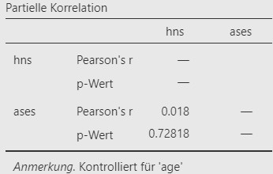
```

> Die zweiseitige Absicherung gegen Null der partiellen Korrelation ergibt, dass sich die Korrelation zwischen Haarausfall und Dysfunktion der Sexualität unter Berücksichtigung des Alters als Störfaktor ($r = `r round(exr_hairloss_sex$jmv_partcorr %>% filter(name_r == "ases") %>% pull("hns_r") %>% as.numeric(),2)`$) nicht signifikant von $0$ unterscheidet, `r absichern_partiell(exr_hairloss_sex$jmv_partcorr %>% filter(name_r == "ases") %>% pull("hns_r") %>% as.numeric(), exr_hairloss_sex$n)`, $`r exr_hairloss_sex$jmv_partcorr %>% filter(name_r == "ases") %>% pull(hns_rp) %>% as.numeric() %>% report_p(3)`$. Die Korrelation ist als schwach einzustufen.
:::


::: {#ehe-burnout-correlation .exercise}
```{=html}
<!-- 
Ziel: 
- 
-->
```

Berechnen Sie (a) Punktbiseriale Korrelation und (b) die biserielle Rangkorrelation für die Übung \@ref(exr:ehe-burnout), wo das Burnout-Risiko von verheirateten und unverheirateten Ärztinnen analysiert wird und interpretieren Sie die Werte.
:::

:::{.solution}

a) Zuerst wird der Datensatz mit `Jamovi` eingelesen und die Analyseparameter werden gesetzt, siehe Abbildung \@ref(fig:sol-ehe-burnout-pointcorrelation-input).

```{r sol-ehe-burnout-pointcorrelation-input, fig.show = 'hold', out.height='50%', fig.cap='Jamovi Eingabe.'}

knitr::include_graphics("figures/08-exr-ehe-burnout-pointcorrelation-jmv-input2.jpg")
```

Dies produziert das Analyseergebnis in Abbildung \@ref(fig:sol-ehe-burnout-pointcorrelation-output)

```{r sol-ehe-burnout-pointcorrelation-output, fig.show = 'hold', out.height='50%', fig.cap='Jamovi Ausgabe.'}
knitr::include_graphics("figures/08-exr-ehe-burnout-pointcorrelation-jmv-output1.jpg")
knitr::include_graphics("figures/08-exr-ehe-burnout-pointcorrelation-jmv-output2.jpg")
```

Daraus ergibt sich
$$ r = \frac{10.99- 10.15}{(51+61)\cdot 2.01}\sqrt{51\cdot 61} = `r round( (10.99-10.15)/((51+61)*2.01)*sqrt(51*61),2)`.$$
Hier wurden die Zwischenresultate mit zwei Nachkommastellen aus `Jamovi` gezogen. Je eher eine Ärztin unverheiratet ist, desto höher ist der Burnout-Wert. Der Zusammenhang ist als mittel einzustufen.

b) Die Analyseparameter in `Jamovi` werden nun geändert, siehe Abbildung \@ref(fig:sol-ehe-burnout-rankcorrelation-input).

```{r sol-ehe-burnout-rankcorrelation-input, fig.cap='Jamovi Eingabe.'}

```

Dies produziert das Analyseergebnis in Abbildung \@ref(fig:sol-ehe-burnout-rankcorrelation-output)

```{r sol-ehe-burnout-rankcorrelation-output, fig.cap='Jamovi Ausgabe.'}
knitr::include_graphics("figures/08-exr-ehe-burnout-pointcorrelation-jmv-output3.jpg")
```

Die biseriale Rangkorrelation ist also $r = -0.212$. Je eher eine Ärztin verheiratet ist, desto tiefer ist der Burnout-Wert. Der Zusammenhang ist als mittel einzustufen. Achtung das Vorzeichen der biserialen Rangkorrelation hängt einzig davon ab, welche Gruppe (verheiratet/unverheiratet) als erste Gruppe in `Jamovi` hinterlegt ist. In diesem Datensatz ist dies, sofern nichts geändert wird die unverheiratete Gruppe.
:::


::: {.exercise  #test-preparation}
<!-- 
Ziel: 
- 
-->

```{r exr-test-preparation}
gen_exr_test_preparation <- function(){
  n <- 170
  Omega <- matrix(c(1, -0.23, -0.27,
                  -0.23, 1, 0.41,
                  -0.27, 0.41, 1), nrow = 3)
  
  dd = rcorrelated(n, 
                   mu = c(47.9, 72.1, 5),
                   sds = c(10, 10, 2),
                   Omega = Omega,
                   colnames = c("Prüfungsangst", "Prüfungsresultat", "Vorbereitung"))
  dd <- dd %>%
    mutate(Prüfungsangst = Prüfungsangst %>% round(),
           Prüfungsangst = case_when(Prüfungsangst > 75 ~75,
                           Prüfungsangst < 1 ~1,
                           TRUE~Prüfungsangst),
           Prüfungsresultat = Prüfungsresultat %>% round(1),
           Prüfungsresultat = case_when(Prüfungsresultat > 100 ~100,
                           Prüfungsangst < 1 ~1,
                           TRUE~Prüfungsresultat),
           Vorbereitung = case_when(Vorbereitung < 0 ~ 0,
                            Vorbereitung > 10 ~ 10,
                            TRUE~ Vorbereitung),
           Vorbereitung = Vorbereitung %>% round())
    
  file_name <- '08-exr-test-preparation.sav'
  dd %>% write_sav(file_name)
  corr_mat_pearson <- dd %>% cor()
  jmv_corr <- jmv::corrMatrix(dd, spearman = FALSE)$matrix$asDF %>%
    rename_with(~.x %>% str_replace_all("\\.|]", "") %>% str_replace_all("\\[","_"))
  jmv_partcorr <- (dd %>%
    jmv::corrPart(vars = c('Prüfungsangst', 'Prüfungsresultat'),controls = "Vorbereitung"))$matrix$asDF%>%
    rename_with(~.x %>% str_replace_all("\\.|]", "") %>% str_replace_all("\\[","_"))
  return(mget(ls()))
}
exr_test_preparation <- gen_exr_test_preparation()
```


Es ist bekannt, dass Prüfungsangst zu schlechterern Prüfungsergebnissen führt. In einer Studie soll herausgefunden werden, wie dieser Zusammenhang durch die Vorbereitung beeinflusst wird [@yusefzadeh2019]. Dafür wurde die Prüfungsangst mit dem test anxiety inventory TAI (von $0-75$), das Prüfungsergebnis (von $0-100$ Punkte) und die Vorbereitung (von $0-10$) gemessen. Letztere beruhte darauf, wie viele Prüfungsvorbereitungsgelegenheiten wahrgenommen wurde.

a) Berechnen Sie die Korrelation zwischen Prüfungsangst und Prüfungsergebnis und sichern Sie diese zweiseitig gegen Null ab. Berichten Sie das Ergebnis.
b) Berechnen Sie die partielle Korrelation indem Sie für die Vorbereitung kontrollieren und sichern Sie diese zweiseitig gegen Null ab. Berichten Sie das Ergebnis.
:::

:::{.solution}
Die Analyseparameter in `Jamovi` werden nun geändert, siehe Abbildung \@ref(fig:sol-test-preparation-input).

```{r sol-test-preparation-input, fig.cap='Jamovi Eingabe.', fig.show='hold', out.width='50%'}
knitr::include_graphics("figures/08-exr-test-preparation-jmv-input1.jpg")
knitr::include_graphics("figures/08-exr-test-preparation-jmv-input2.jpg")
```

Dies produziert das Analyseergebnis in Abbildung \@ref(fig:sol-test-preparation-output)

```{r sol-test-preparation-output, fig.cap='Jamovi Ausgabe.', fig.show='hold', out.width='50%'}
knitr::include_graphics("figures/08-exr-test-preparation-jmv-output1.jpg")
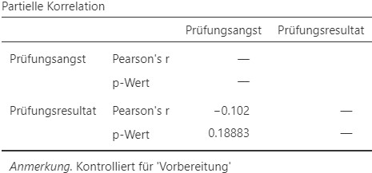
```

a) 
> Die zweiseitige Absicherung gegen Null des Korrelationskoeffizienten nach Pearson ergibt, dass sich die Korrelation zwischen Prüfungsangst und Prüfungsresultat ($r = `r round(exr_test_preparation$corr_mat['Prüfungsangst', 'Prüfungsresultat'],2)`$) signifikant von $0$ unterscheidet, `r absichern_pearson(exr_test_preparation$corr_mat['Prüfungsangst', 'Prüfungsresultat'], exr_test_preparation$n)`, $`r exr_test_preparation$jmv_corr %>% filter(name_r == "Prüfungsresultat") %>% pull(Prüfungsangst_rp) %>% as.numeric() %>% report_p(3)`$. Die Korrelation deutet auf einen schwachen Zusammenhang der Art je mehr Prüfungsangst desto schlechter das Prüfungsresultat.

b)
> Die zweiseitige Absicherung gegen Null der partiellen Korrelation ergibt, dass sich die Korrelation zwischen Prüfungsangst und Prüfungsresultat unter Berücksichtigung der Vorbereitung als Störfaktor ($r = `r round(exr_test_preparation$jmv_partcorr %>% filter(name_r == "Prüfungsresultat") %>% pull("Prüfungsangst_r") %>% as.numeric(),2)`$) nicht signifikant von $0$ unterscheidet, `r absichern_partiell(exr_test_preparation$jmv_partcorr %>% filter(name_r == "Prüfungsresultat") %>% pull("Prüfungsangst_r") %>% as.numeric(), exr_test_preparation$n)`, $`r exr_test_preparation$jmv_partcorr %>% filter(name_r == "Prüfungsresultat") %>% pull(Prüfungsangst_rp) %>% as.numeric() %>% report_p(3)`$. Die partielle Korrelation deutet auf einen schwachen Zusammenhang der Art je mehr Prüfungsangst desto schlechter das Prüfungsresultat.

:::


## Test

::: {.exercise  #test-theorie-korrelation}
Welche der folgenden Aussagen zum Zusammenhang zwischen zwei Merkmalen sind wahr, welche falsch?

a) Eine Korrelation von $r = -0.23$ deutet auf einen mittleren Zusammenhang der Art je mehr desto weniger hin.
b) Ein Grund für eine Korrelation von $r=0$ kann sein, dass der Zusammenhang nicht linear ist.
c) Je weiter die Korrelation von $0$ weg ist, desto eher ist der Zusammenhang von der Stichprobe auf die Grundgesamtheit übertragbar.
d) Eine Korrelation von $r = 0.2$ bedeutet, dass das erste Merkmal ursächlich für den Zusammenhang ist.
:::

:::{.solution}
a) Richtig
b) Richtig
c) Richtig
d) Falsch
:::

::: {.exercise  #test-theorie-korrelation1}
Welche der folgenden Aussagen zum Zusammenhang zwischen zwei Merkmalen sind wahr, welche falsch?

a) Um den Zusammenhang zwischen Gästezufriedenheit (Likert $1$ bis $5$) und der Zimmerart (basic oder superior) zu ermitteln, kann die Korrelation nach Spearman verwendet werden.
b) Um den Zusammenhang zwischen Anzahl Konflikten um Wasserrechte (intervallskaliert, nicht normalverteilt) und dem Wohlstand der beiden Gemeinden (intervallskaliert, normalverteilt) zu ermitteln, kann die Korrelation nach Pearson verwendet werden.
c) Um den Zusammenhang zwischen Alphabetisierungsrate (intervallskaliert,  normalverteilt) und Bruttoinslansprodukt (intervallskaliert, normalverteilt) von Ländern zu ermitteln, kann die Korrelation nach Pearson verwendet werden.
d) Die partielle Korrelation ist immer weniger oder gleich stark, als die direkt gemessene Korrelation.
:::

:::{.solution}
a) Falsch
b) Falsch
c) Richtig
d) Falsch
:::

::: {#test-spearman .exercise}
```{=html}
<!-- 
Ziel: 
- Starke Korrelation gegen Null absichern
-->
```

```{r exr-test-spearman}
gen_exr_test_spearman <- function(){
  n <- 122
  dd <- tibble(wartezeit = rexp(n, 1/10),
         wartezeit_jittered = wartezeit + rnorm(n, 1, 3),
         zufriedenheit = case_when(
           wartezeit_jittered > 2 ~ 4,
           wartezeit_jittered > 5 ~ 3,
           wartezeit_jittered > 10 ~ 2,
           wartezeit_jittered > 15 ~ 1,
           TRUE~5))
    
  file_name <- 'tests/08-test-spearman.sav'
  dd %>% write_sav(file_name)
  return(mget(ls()))
}
exr_test_spearman <- gen_exr_test_spearman()
```

Im folgenden wird eine Korrelation zwischen der Wartezeit am Flughafen und der Gästezufriedenheit berechnet. Dabei wird festgestellt, dass beide Merkmale intervallskaliert aber nicht normalverteilt sind. `Jamovi` liefert die Ausgabe in Abbildung \@ref(fig:sol-test-spearman-output).


```{r sol-test-spearman-output, fig.cap='Jamovi Eingabe.', fig.show='hold', out.width='50%'}
knitr::include_graphics("figures/08-exr-test-spearman-jmv-output.jpg")
```

Welche der folgenden Aussagen sind wahr welche falsch?

a) Es ist richtig die Korrelation hier mit dem Korrelationskoeffiizienten nach Pearson zu berechnen.
b) Die Korrelation sagt aus, dass die Gäste mit höherer Zufriedenheit weniger lange warten.
c) Der Zusammenhang ist schwach.
d) Es wurden $120$ Personen befragt.
e) Die Nullhypothese, dass die Korrelation in der Population bei $-0.302$ liegt, kann aufgrund des vorliegenden Testreultats abgelehnt werden.
f) Die Korrelation unterscheidet sich signifikant von $0$.
:::


:::{.solution}
a) Falsch
b) Richtig
c) Falsch
d) Falsch
e) Falsch
f) Richtig

:::

<!--chapter:end:src/08-korrelation.Rmd-->

---
editor_options: 
  markdown: 
    wrap: 72
---

# Zusammenhang dichotomer Merkmale

## Zusammenhang dichotomer Merkmale beschreiben

::: {#alcohol-edu .example name="Alkohol und Bildung"}
```{r exm-alcohol-edu}
gen_exm_alcohol_edu <- function(){
  set.seed(212123)
  file_name <- '09-exm-alcohol-edu.sav'
  n <- 1000
  no_risk_tert <- 0.184
  no_risk_other <- 0.234

  p_tert <- round(2313/(2313+2916+892),3)
  
  dd <- tibble(bildung = c(rep("tertiär", p_tert*n),rep("andere", (1-p_tert)*n)),
       alkoholkonsum = c(rep("oft", round((1-no_risk_tert)*n*p_tert,0)), 
                         rep("selten", round(no_risk_tert*n*p_tert, 0)), 
                         rep("oft", round((1-no_risk_other)*n*(1-p_tert))), 
                         rep("selten", round((no_risk_other)*n*(1-p_tert))))) %>% 
    slice_sample(n=nrow(.)) %>% 
    write_sav(file_name)
  jmv_output <- jmv::contTables(
    dd,
    "alkoholkonsum",
    "bildung",
    chiSqCorr = TRUE,
    odds = TRUE,
    relRisk = TRUE,
    diffProp = TRUE,
    pcCol = TRUE,
    compare = 'columns'
  )
  jmv_output_freq <- jmv_output$freqs$asDF %>%
    clean_jmv_colnames()
  jmv_output_odds <- jmv_output$odds$asDF %>%
    clean_jmv_colnames()
  jmv_output_test <- jmv_output$chiSq$asDF %>% 
    clean_jmv_colnames()
  return(mget(ls()))
}
exm_alcohol_edu <- gen_exm_alcohol_edu()
```

Vom Bundesamt für Statistik BFS werden regelmässig Daten zum
Alkoholkonsum in der Schweiz erhoben. Dabei wird ermittelt, welcher
Anteil der Bevölkerung weniger als einmal pro Woche und welcher Anteil
mehr als einmal pro Woche Alkohol konsumiert. Diese Anteile werden
anschliessen für verschiedene Untergruppen ausgewiesen, zum Beispiel für
Leute mit Tertiärbildung und anderem Bildungsabschluss. Es werden hier
also zwei dichotome Merkmale (Bildung: Tertiär/nicht Tertiär und
Alkoholkonsum: mind. 1x / Woche, weniger als 1x / Woche) und deren
Zusammenhang betrachtet. Um diese Anteile abzuschätzen werden
$`r exm_alcohol_edu$n`$ Personen befragt. Der Datensatz ist als `r inline_code(exm_alcohol_edu$file_name)` verfügbar.
:::

Im Datensatz wird für jede Person eine Zeile ausgewiesen, siehe
Abbildung \@ref(fig:exm-alcohol-edu-data-view).

```{r exm-alcohol-edu-data-view, out.width='50%', fig.cap='Daten Alkoholkonsum und Bildung.'}
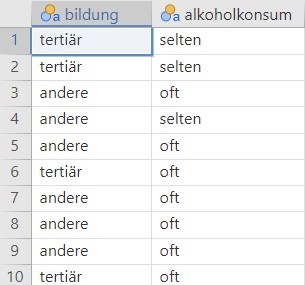
```

Da der Mensch nicht besonders gut darin ist unzählige Zeilen eine
Tabelle zu absorbieren, werden die Daten oft in einer Vierfeldertafel
zusammengefasst. [Die **Vierfeldertafel** ist eine Kreuztabelle bei
welcher die Ausprägungen des einen Merkmals als Spalten und des anderen
als Zeilen fungieren.]{#customdef-vierfeldertafel
.customdef} Die Zellen werden dann mit der Anzahl Beobachtungen befüllt,
für welche die Ausprägungskombination im Datensatz zutrifft, siehe
Abbildung \@ref(fig:exm-alcohol-edu-data-view).

```{r exm-alcohol-edu-aggdata-view, out.width='50%', fig.cap='Vierfeldertafel Alkoholkonsum und Bildung..'}
knitr::include_graphics("figures/09-exm-alcohol-edu-aggdata-view.jpg")
```

Im psychologischen und medizinischen Kontext bezieht sich ein Merkmal
oft auf einen schädlichen und einen nicht schädlichen Ausgang. Im
Beispiel ist es der Alkoholkonsum. [Dieses Merkmal wird
**Risikovariable** genannt.]{#customdef-risikovariable
.customdef} In der Vierfeldertafel kann die Risikovariable die Zeilen
oder die Spalten bestimmen. Die Risikovariable wird durch andere
Merkmale sogenannte ursächliche Variablen erklärt. Im breiteren
statistischen Kontext wird die Risikovariable abhängige Variable und die
ursächliche Variable als unabhängige Variable bezeichnet.

[Mit **Risiko** wird die Wahrscheinlichkeit benannt den schädlichen
Ausgang zu erleiden und wird mit dem Anteil des schädlichen Ausgangs an
der Gesamtzahl berechnet.]{#customdef-risiko .customdef}
Das Risiko kann je nach Ausprägung der ursächlichen Variable
unterschiedlich hoch sein. Das Risiko mehr als 1x pro Woche Alkohol zu
konsumieren ist demnach
$308/378 = `r round(308/378,3)` = `r round(100*308/378,1)`\%$ für
Menschen mit tertiärer Ausbildung und
$476/622 = `r round(476/622,3)` = `r round(100*476/622,1)`\%$ für
Menschen mit anderer Ausbildung. Das Risiko kann in `Jamovi` unter
`Zellen > Prozentsätze` und dann `Zeile` (wenn das ursächliche Merkmal
die Zeilen bestimmt) oder `Spalte` (wenn das ursächliche Merkmal die
Spalte bestimmt) angezeigt werden.

Die Risiken für die tertiär und andere Ausbildungen können nun
verglichen werden. [Dazu kann die Differenz der beiden Risiken
sogenannte **Risikodifferenz** (in `Jamovi` unter
`Statistiken > Unterschiede in den Proportionen`) betrachtet
werden.]{#customdef-risikodifferenz .customdef} Wenn die
Risiken der beiden Gruppen mit $p_1$ und $p_2$ bezeichnet werden,
entspricht dies schlicht
$$p_1 - p_2 = `r round(308/378,3)` - `r round(476/622,3)`=`r round(308/378,3)- round(476/622,3)`.$$
Das Risiko mehr als $1$x pro Woche Alkohol zu konsumieren ist also
$`r round(308/378,3)- round(476/622,3)` = `r 100*(round(308/378,3)- round(476/622,3))`\%$
höher für Personen mit einem tertiären Bildungsabschluss. Da die Risiken
immer Werte zwischen $0$ und $1$ sind, muss dieser Formel nach die
Differenz der Risiken zwischen $-1$ und $1$ liegen. Wenn die Differenz
der beiden Risiken $0$ ist, bedeutet dies, dass die Risiken in beiden
Gruppen gleich gross sind. Je weiter die Differenz der Risiken von $0$
weg ist, desto unterschiedlicher sind die Risiken in den zwei Gruppen.

Eine andere Art die Risiken zu vergleichen ist sie ins Verhältnis zu
setzen. [Dies wird **relatives
Risiko**]{#customdef-tagname .customdef}
$$\text{RR} = \frac{p_1}{p_2} = \frac{`r round(308/378,3)`}{ `r round(476/622,3)`}=`r round(round(308/378,3)/ round(476/622,3),3)`$$
genannt. Das Risiko mehr als $1$x pro Woche Alkohol zu konsumieren ist
für Personen mit tertiärer Ausbildung also
$`r round(round(308/378,3)/ round(476/622,3),3)`$ mal so gross wie für
Personen mit anderer Ausbildung. Sind $p_1$ und $p_2$ gleich gross, so
ist das relative Risiko bei $1$. Ist $p_1$ kleiner als $p_2$, so ist das
relative Risiko kleiner als $1$. Ist $p_1$ grösser als $p_2$, so ist das
relative Risiko grösser als $1$. Insgesamt ist das relative Risiko immer
eine Zahl zwischen $0$ und $+\infty$. Das Tauschen der
Gruppennummerierung führt zu einer Umkehr des Wertes rund um $1$. Wenn
im Beispiel also die andere Bildung als Gruppe $1$ bezeichnet würde, so
ist das relative Risiko
$$\text{RR} = \frac{p_1}{p_2} = \frac{`r round(476/622,3)`}{ `r  round(308/378,3)`}=`r round(  round(476/622,3)/round(308/378,3),3)`$$

:::: {.caution data-latex=""}
::: remark
Das hier die relativen Risiken für die Gruppenneunummerierung fast
gleich weit von $1$ entfernt liegen ist im Normalfall nicht so. Dies
kann an folgendem Zahlenbeispiel gesehen werden: $0.75 / 0.25 = 3$ und
umgekehrt $0.25/0.75 = 0.333$.
:::
::::

Das relative Risiko sagt im Gegensatz zu Risikodifferenz nichts mehr
über das absolute Risiko aus. Wenn ein Medikament, zum Beispiel das
Risiko einer Psychose von $1$ aus $5000$ auf $1$ aus $10000$ reduziert,
so ist die Risikodifferenz bei $0.0001 - 0.0002 = -0.01\%$. Das relative
Risiko ist in dem Fall jedoch $0.0001/0.0002 = 50\%$. Wird nun nur das
relative Risiko berichtet, könnten Lesende von einem zu grossen Nutzen
des Medikaments ausgehen. Es wird deshalb empfohlen immer die
Risikodifferenz und das relative Risiko zu berichten.

Die Risikodifferenz und das relative Risiko können nur berechnet werden,
wenn die gesamt Anzahl Fälle repräsentativ für die Population ist. Dies
ist bei Fall-Kontroll Studien nicht der Fall, wie folgendes Beispiel
zeigt. Für solche Studien können weder die Risikodifferenz noch das
relative Risiko sinnvoll berechnet werden.

::: {#dog-cancer .example name="Krebs bei Hunden"}
```{r exm-dog-cancer}
gen_exm_dog_cancer <- function(){
  set.seed(23)
  
  n <- 375

  file_name <- '09-exm-dog-cancer.sav'
  dd <- tibble(Hund = c("Tumor", "Kein Tumor", "Tumor", "Kein Tumor"),
               Herbizid = c("Angewendet", "Angewendet", "Nicht Angewendet", "Nicht Angewendet"),
               Anzahl = c(191,304,300,641)) %>% 
  write_sav(file_name)
  return(mget(ls()))
}
exm_dog_cancer <- gen_exm_dog_cancer()
```

@hayes1991 haben sich für den Zusammenhang zwischen malignen Lymphomen
bei Hunden (ugs. bösartiger Lymphdrüsenkrebs) und der Anwendung des
Herbizids $2, 4$-Dichlorphenoxyessigsäure in Hausgärten interessiert.
Dabei haben Sie in einer Fall-Kontroll Studie (case-control study) die
Zahlen im Datensatz `r inline_code(exm_dog_cancer$file_name)` ermittelt.
:::

Die Daten sind hier bereits in aggregierten Fallzahlen präsentiert,
siehe Abbildung \@ref(fig:exm-dog-cancer-data-view).

```{r exm-dog-cancer-data-view, out.width='50%', fig.cap='Daten Malignes Lymphoma bei Hunden.'}
knitr::include_graphics("figures/09-exm-dog-cancer-data-view.jpg")
```

Um diese Daten korrekt in `Jamovi` einzulesen, kann unter
`Analysen > Häufigkeiten > Kreuztabellen > Unabhängige Stichproben` die
Anzahl Fälle bei `Anzahl (optional)` eingelesen werden. Dies resultiert
in der Vierfeldertafel in Abbildung
\@ref(fig:exm-dog-cancer-aggdata-view).

```{r exm-dog-cancer-aggdata-view, out.width='50%', fig.cap='Vierfeldertafel Malignes Lymphoma bei Hunden.'}
knitr::include_graphics("figures/09-exm-dog-cancer-aggdata-view.jpg")
```

Case-control bedeutet, dass Hunde mit Tumor (Fall/case) in einer
Tierklinik gegeben waren. Dazu wurde eine gewisse Anzahl (normalerweise
zwischen $1$ bis $4$ mal so viele wie kranke) gesunde Hunde
(Kontroll/control) zufällig ausgewählt. Bei allen Hunden wurde
anschliessend ermittelt, ob die Hunde auf einem mit dem entsprechenden
Herbizid belasteten Garten Zeit verbracht haben. Da von den
Studienautoren bestimmt wurde, wie viele gesunde Hunde ermittelt werden,
kann der Anteil der kranken Hunde nicht als Mass für das Vorkommen der
Erkrankung in der jeweiligen Gruppe dienen. Es ist hier also nicht
aussagekräftig den Anteil kranker Hunde pro Gruppe oder das daraus
folgende relative Risiko zu bestimmen.

[Stattdessen wird in diesen Fällen das **Chancenverhältnis** (eng. odds
ratio)]{#customdef-odds-ratio .customdef}\
$$OR = \frac{a\cdot d}{b\cdot c} = \frac{191\cdot 300}{304\cdot 300} = 1.34$$
berechnet, wobei $a, b, c$ und $d$ den Anzahl Fällen in der
Vierfeldertafel von oben nach unten und von links nach rechts
entsprechen. [Die **Chance** (eng. odds) ist dabei eine Art
Wahrscheinlichkeit auszudrücken.]{#customdef-odds
.customdef} Sie ist definiert als Wahrscheinlichkeit, dass ein Ereignis
eintrifft geteilt durch die Wahrscheinlichkeit, dass das Ereignis nicht
eintrifft. Für die Herbizid belasteten Hunde ist die Chance ein Tumor zu
haben also $a/c=191/304=0.63$ und für die anderen Hunde
$b/d=300/641=0.47$. Es gilt, je höher die Chance desto höher die
Eintreffwahrscheinlichkeit. Ein Chancenverhältnis von $1.34$
schliesslich bedeutet, dass die Chance einen Tumor zu entwickeln für
einen Herbizid belasteten Hund $1.34$ mal so hoch ist wie für einen
nicht Herbizid belasteten.

:::: {.caution data-latex=""}
::: remark
-   Es kann festgestellt werden, dass das Chancenverhältnis unabhängig
    von der Wahl der ursächlichen und Risikovariable ist
    $$ OR = \frac{a\cdot d}{b\cdot c} = \frac{a\cdot d}{c\cdot b}.$$
-   Für kleine Fallzahlen (Risiko $<10\%$) liegt das Chancenverhältnis
    nahe am relativen Risiko.
:::
::::

## Zusammenhang dichotomer Merkmale testen

In `Jamovi > Kreuztabellen > Statistiken > Tests` stehen verschiedene
Tests zur Verfügung, um zu testen, ob ein in einer Zufallsstichprobe
gefundener Zusammenhang zwischen den Risiken $p_1$ und $p_2$ auf die
Risiken in der Population $\pi_1$ und $\pi_2$ (sprich 'pi') übertragen
werden darf.

### $z$-Test für den Unterschied zwischen den zwei Anteilen

Wenn die Merkmale unabhängig voneinander sind, dann sollte das Risiko in
beiden Gruppen ungefähr gleich gross sein. Dies impliziert auch, dass
die Risikodifferenz $0$ ist. Beim
$z$-Test für den Unterschied zwischen den zwei Anteilen wird also
$H_0: \pi_1 - \pi_2 = 0$ und damit äquivalent $H_0: \pi_1 = \pi_2$
getestet. Wird die Nullhypothese verworfen, wird fortan an die
Alternativhypothese $H_1: \pi_1 \neq \pi_2$ geglaubt. Aus Platzgründen
werden hier nur die zweiseitigen Hypothesenstellungen erwähnt. Die
einseitigen Hypothesenstellungen funktionieren aber anaolg zu den bisher
gesehen Tests.

Die Teststatistik für den $z$-Test der Risikodifferenz ist

$$z = \frac{p_1-p_2}{\sqrt{\frac{p_1(1-p_1)}{n_1}+\frac{p_2(1-p_2)}{n_2}}} = -1.85,$$

wobei $n_1$ und $n_2$ der Anzahl vom Risiko betroffene bzw. nicht
betroffene Beobachtungen darstellen. Wenn die Nullhypothese wahr ist,
ist diese Teststatistik ist standardnormalverteilt. Dies entspricht der
Normalverteilung in Abbildung \@ref(fig:t-distribution). Je grösser die
Differenz der beiden Risiken, desto weiter weg von $0$ ist die
Teststatistik und desto unwahrscheinlicher ist es, dass die berechnete
Teststatistik aufgrund der Zufallsstichprobenziehung zustande kommt. Der genaue $p$-Wert kann mit `Jamovi` unter `Tests > z-Test für den Unterschied zwischen den zwei Anteilen` ermittelt werden. Mit $p = .0649$ kann die Nullhypothese knapp nicht verworfen werden. Die beiden Anteile $\pi_1$ und $\pi_2$ könnten also gleich sein.

> Ein zweiseitiger $z$-Test für den Unterschied zwischen den zwei Anteilen ergibt, dass der Anteil der mehr als einmal pro Woche alkoholkonsumierenden Personen mit Tertiärbildung ($p_1 = 81.5\%$), nicht signifikant von ebendiesem Anteil der Personen mit anderer Bildung ($p_2 = 76.5\%$) unterscheidet, $z = -1.85, p = .0649$.

### $\chi^2$-Test

[Der **$\chi^2$-Test** (sprich 'chi-quadrat-test') ist eine zweite allgemeinere Variante, um den Zusammenhang zwischen zwei dichotomen Merkmalen zu testen.]{.customdef #customdef-chisq-test} Die Nullhypothese ist wiederum, dass die beiden Merkmale unabhängig voneinander sind.

Um nun die Teststatistik näher verstehen zu können, muss ein kurzer
Exkurs in Wahrscheinlichkeitslehre unternommen werden. Diese besagt
nämlich, dass wenn zwei Ereignisse A und B unabhängig voneinander
auftreten, dann ist die Auftretenswahrscheinlichkeit genau gleich dem
Produkt der Wahrscheinlichkeiten der jeweiligen Ereignisse. In Formeln
ausgedrückt
$$p(A \text{ und }B) \overset{\text{unabhängig}}{=} p(A) \cdot p(B).$$

Auf das Beispiel \@ref(exm:alcohol-edu) bezogen bedeutet dies, dass wenn
Alkoholkonsum und die Ausbildungsart unabhängig voneinander sind, dann
entspricht die Wahrscheinlichkeit mehr als $1$x pro Woche Alkohol zu
konsumieren und eine tertiäre Ausbildung genossen zu haben

$$
p(\text{[alkohol > 1x pro Woche] und tertiär}) = \frac{`r exm_alcohol_edu$jmv_output_freq %>% filter(alkoholkonsum == "oft") %>% pull(all_of("1_count"))`}{`r exm_alcohol_edu$jmv_output_freq %>% filter(alkoholkonsum == "oft") %>% pull(all_of("total_count"))`} = `r round((exm_alcohol_edu$jmv_output_freq %>% filter(alkoholkonsum == "oft") %>% pull(all_of("1_count")))/(exm_alcohol_edu$jmv_output_freq %>% filter(alkoholkonsum == "oft") %>% pull(all_of("total_count"))),5)`
$$

genau

$$
p(\text{[alkohol > 1x pro Woche]}) \cdot p(\text{tertiär}) = \frac{`r exm_alcohol_edu$jmv_output_freq %>% filter(alkoholkonsum == "oft") %>% pull(all_of("total_count"))`}{`r exm_alcohol_edu$jmv_output_freq %>% filter(alkoholkonsum == "Total") %>% pull(all_of("total_count"))`}\cdot \frac{`r exm_alcohol_edu$jmv_output_freq %>% filter(alkoholkonsum == "Total") %>% pull(all_of("1_count"))`}{`r exm_alcohol_edu$jmv_output_freq %>% filter(alkoholkonsum == "Total") %>% pull(all_of("total_count"))`} = `r round((exm_alcohol_edu$jmv_output_freq %>% filter(alkoholkonsum == "oft") %>% pull(all_of("total_count"))/ exm_alcohol_edu$jmv_output_freq %>% filter(alkoholkonsum == "Total") %>% pull(all_of("total_count")))* (exm_alcohol_edu$jmv_output_freq %>% filter(alkoholkonsum == "Total") %>% pull(all_of("1_count"))/exm_alcohol_edu$jmv_output_freq %>% filter(alkoholkonsum == "Total") %>% pull(all_of("total_count"))),5)`
$$

entsprechen. Die Zahlen zeigen an, dass dies für diese Stichprobe klar nicht gegeben ist. Die beobachtete Differenz könnte sich aber auch aus der Zufallsstichprobenziehung ergeben haben. Der $\chi^2$-Vierfeldertest vergleicht nun in jeder Zelle $i$ der Vierfeldertafel die tatsächlich beobachteten Beobachtungen $o_i$ (observed) mit den erwarteten Beobachtungen $e_i$ (expected), wenn die Unabhängigkeit gegeben wäre. Letztere berechnet sich durch $p(A) \cdot p(B) \cdot n$, wobei $n$ die Gesamtanzahl Beobachtungen ist. Im Beispiel

$$e_1 = p(\text{[alkohol > 1x pro Woche]}) \cdot p(\text{tertiär}) \cdot n =`r round(((exm_alcohol_edu$jmv_output_freq %>% filter(alkoholkonsum == "oft") %>% pull(all_of("total_count"))/ exm_alcohol_edu$jmv_output_freq %>% filter(alkoholkonsum == "Total") %>% pull(all_of("total_count")))* (exm_alcohol_edu$jmv_output_freq %>% filter(alkoholkonsum == "Total") %>% pull(all_of("1_count"))/exm_alcohol_edu$jmv_output_freq %>% filter(alkoholkonsum == "Total") %>% pull(all_of("total_count")))),5)` \cdot  `r exm_alcohol_edu$jmv_output_freq %>% filter(alkoholkonsum == "Total") %>% pull(all_of("total_count"))` = `r round(((exm_alcohol_edu$jmv_output_freq %>% filter(alkoholkonsum == "oft") %>% pull(all_of("total_count"))/ exm_alcohol_edu$jmv_output_freq %>% filter(alkoholkonsum == "Total") %>% pull(all_of("total_count")))* (exm_alcohol_edu$jmv_output_freq %>% filter(alkoholkonsum == "Total") %>% pull(all_of("1_count"))/exm_alcohol_edu$jmv_output_freq %>% filter(alkoholkonsum == "Total") %>% pull(all_of("total_count")))* exm_alcohol_edu$jmv_output_freq %>% filter(alkoholkonsum == "Total") %>% pull(all_of("total_count"))),5)` $$
Je weiter diese Zahl von der beobachteten Zahl abweicht, desto unwahrscheinlicher ist die Unabhängigkeit. Der $\chi^2$ trägt dem Rechnung, indem die Teststatistik

$$\chi^2 = \sum_{i = 1}^k \frac{(o_i - e_i)^2}{e_i} = `r round(exm_alcohol_edu$jmv_output_test$value_chiSq,2)`,$$
wobei $k$ hier für die Anzahl Zellen steht. Eine grosse Teststatistik spricht also gegen die Unabhängigkeit.

Wenn die Stichprobenziehung oft wiederholt wird, kann festgestellt werden, dass diese Teststatistik einer bekannten Verteilung, der $\chi^2$-Verteilung bei $df = 1$ Freiheitsgraden folgt. [Die **$\chi^2$-Verteilung** ist für verschiedene Freiheitsgrade in Abbildung \@ref(fig:chisq-distribution) dargestellt.]{.customdef #customdef-chisq-distribution} 
 Die Teststatistik des $\chi^2$-Vierfeldertests $`r round(exm_alcohol_edu$jmv_output_test$value_chiSq,2)`$ wird also mit der roten Verteilung in der Abbildung verglichen. Die Werte rechts auf der Abbildung sind seltener und der beobachtete Wert liegt so, dass er zu den $`r report_p(exm_alcohol_edu$jmv_output_test$p_chiSq)`$ seltensten Beobachtungen zählt, sofern die Unabhängigkeit gilt. Dies reicht hier gerade nicht, um die Nullhypothese bei Signifikanzniveau $\alpha = 5\%$ zu verwerfen.


```{r chisq-distribution, fig.cap="Chiquadrat-Verteilungen mit 1, 4 und 9 Freiheitsgraden."}
tibble(x = seq(0, 20, by = 0.01),
       chisq_1 = dchisq(x, 2-1),
       chisq_4 = dchisq(x, 5-1),
       chisq_9 = dchisq(x, 10-1)) %>%
  pivot_longer(cols = 2:4, names_to = "Verteilung_df", values_to="Wahrscheinlichkeitsdichte") %>% 
  ggplot(aes(x=x))+
  geom_line(aes(y=Wahrscheinlichkeitsdichte, color = Verteilung_df))+
  labs(x="")+
  ylim(c(0,0.25))
```

Um die Effektstärke des $\chi^2$-Tests anzugeben kann Cramérs $\phi$ 

$$\phi = \sqrt{\frac{\chi^2}{n}} = \sqrt{\frac{`r round(exm_alcohol_edu$jmv_output_test$value_chiSq,2)`}{`r exm_alcohol_edu$n`}} = `r round(sqrt(round(exm_alcohol_edu$jmv_output_test$value_chiSq,2) / exm_alcohol_edu$n),2)`$$

Cramérs $\phi$ immer grösser als $0$ und kleiner als $1$. Je weiter $\phi$ von $0$ weg ist, desto stärker sind die Merkmale voneinander abhängig. Da dies auch als Zusammenhangsmass gesehen werden kann wird Cramérs $\phi$ auch Vierfelderkorrelation genannt. Die Interpretation als Effektstärke erfolgt dabei wir für die Korrelation. Ein Wert von $0.06$ wird demnach als schwach eingestuft.

> Ein $\chi^2$-Test ergibt, dass der Alkoholkonsum (mehr/weniger als 1x pro Woche) und Bildung (Tertiär/andere Bildung) nicht signifikant abhängig voneinander sind, $\chi^2 (1) = `r round(exm_alcohol_edu$jmv_output_test$value_chiSq,2)`, p = .0649, \phi = 0.06$.

Der $\chi^2$ Test hat für die Vierfeldervariante immer den gleichen $p$-Wert wie der Test der Risikodifferenz auf $0$. Beide Tests basieren auf dem zentralen Grenzwertsatz und dürfen deshalb nur angewendet werden, wenn gewisse Voraussetzungen erfüllt sind. Die Voraussetzung ist, dass insgesamt $40$ oder mehr Beobachtungen vorliegen müssen. [Ist dies nicht der Fall, aber in jeder Zelle ist die Anzahl der erwarteten Beobachtungen bei $5$ oder grösser, so kann der **$\chi^2$-Test mit Kontinuitätskorrektur** oder Yates-Korrektur verwendet werden]{.customdef #customdef-chisq-corrected} 
$$\chi^2_{Yates} = \sum_{i = 1}^k \frac{(|o_i - e_i| -0.5)^2}{e_i}.$$

In Beispiel sind mit $n = 1000$ genügend Beobachtungen vorhanden, um ohne die Kontinuitätskorrektur auszukommen. Der Bericht des Tests ist genau gleich wie der Bericht des $\chi^2$-Test ausser, dass der Name des Verfahrens geändert wird:

> Ein $\chi^2$-Test mit Kontinuitätskorrektur ergibt, dass der Alkoholkonsum ...

### Exakter Test nach Fisher und Yates

Wenn die erwarteten Beobachtungen in mindestens einer Zelle kleiner als $5$ sind, dann ist die Approximation der Verteilung der Teststatistik durch den $\chi^2$-Test sogar mit Kontinuitätskorrektur zu ungenau. 

:::{.example #red-white-wine name="Wette: Unterscheiden von Rot- und Weisswein"}

```{r exm-red-white-wine}
file_name <- '09-exm-red-white-wine.sav'
dd <- tibble(ist = c("rotwein", "rotwein", "weisswein", "weisswein"),
       sagt = c("rotwein", "weisswein", "rotwein", "weisswein"),
       anzahl = c(4, 1, 1, 3)) %>% 
  write_sav(file_name)
file_name <- '09-exm-red-white-wine-alternative.sav'
dd <- tibble(ist = c("rotwein", "rotwein", "weisswein", "weisswein"),
       sagt = c("rotwein", "weisswein", "rotwein", "weisswein"),
       anzahl = c(5, 0, 0, 4)) %>% 
  write_sav(file_name)
```

Nina behauptet, sie kann Rotwein von Weisswein am Geschmack unterscheiden. Sie bereiten ein Experiment vor, um dies zu testen verbinden Nina die Augen. Als Statistiklernende wissen sie, dass es nicht genügt, dass Nina einmal die richtige Weinsorte wählt - dies könnte ja zufällig richtig sein. Stattdessen werden $5$ Gläser Rotwein und $4$ Gläser Weisswein vorbereitet und Nina in zufälliger Reihenfolge zum Probieren angeboten. Das Experiment endet mi den Zahlen in Abbildung \@ref(fig:exm-red-white-wine-aggdata-view).

```{r exm-red-white-wine-aggdata-view, fig.cap = "Vierfeldertafel Wette Unterschied Rot- und Weisswein."}
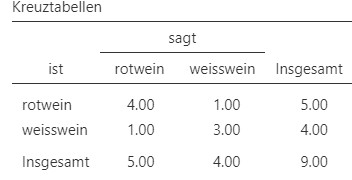
```
:::

Da nur wenige Beobachtungen gemacht wurden, kann die Wahrscheinlichkeit eines Ausgangs des Experiments mit Hilfe der hypergeometrischen-Verteilung genau berechnet werden. Die Wahrscheinlichkeit für den Experimentausgang in Abbildung \@ref(fig:exm-red-white-wine-aggdata-view) entspricht $p_0 = 0.159$.

Der $p$-Wert eines Tests ist bekannterweise die Wahrscheinlichkeit die berechnetet Teststatistik zu beobachten _oder eine unwahrscheinlichere Situation im Sinne der Alternativhypothese_. Um dem zweiten Teil dieser Definition gerecht zu werden, werden nun andere, unwahrscheinlichere Experimentausgänge bewertet. Um dies zu erreichen, wird hier angenommen, dass in jedem Fall die Randsummen immer gleichbleiben (also $5$ für ist Rotwein, $4$ für ist Weisswein, $5$ für sagt Rotwein und $4$ für sagt Weisswein). Wenn ist und sagt unabhängig voneinander ist und Nina also die Weinfarben nicht auseinanderhalten kann, dann wäre es unwahrscheinlicher, wenn sie alle $5$ Rotweine als solche erkannt hätte. Wenn die Randsummen gleich gehalten werden, entspricht dies der Situation in Abbildung \@ref(fig:exm-red-white-wine-aggdata-view-alt). Die Wahrscheinlichkeit für diese Situation ist $p_1 = 0.008$. 

```{r exm-red-white-wine-aggdata-view-alt, fig.cap = "Vierfeldertafel Wette Unterschied Rot- und Weisswein."}
knitr::include_graphics("figures/09-exm-red-white-wine-aggdata-view-alt.jpg")
```

Grundsätzlich können hier noch weitere Situationen aufgezählt werden. Im Beispiel sind mit der eben beschriebenen Situation und der ursprünglichen Situation jedoch die Alternativen erschöpft: Es kann nicht sein, dass Nina $6$-mal Rotwein richtig voraussagt, wenn sie insgesamt nur $5$-mal Rotwein sagt. 

Nun werden die Wahrscheinlichkeiten aller Situation aufsummiert, $p = p_0 + p_1 + \ldots = 0.159+0.008 =0.167$. Da mit diesem Vorgehen genau der Definition des $p$-Wertes gefolgt wurde, stellt dieses $p$ nun auch einen $p$-Wert dar. [Der dazugehörige Test wird **exakter Test nach Fisher und Yates** oder einfach Fisher-Yates-Test genannt.]{.customdef #customdef-fisher-yates}

> Ein exakter Test nach Fisher und Yates ergibt, dass das Ansagen der Weinsorte von Nina nicht signifikant von der tatsächlichen Weinsorte abhängt, $p = .167$.

::::{.caution data-latex=""}
::: {.remark}

- Der Test ist exakt, weil hier die Wahrscheinlichkeiten genau bestimmt wurden. Bei allen anderen bislang gesehenen Tests wird die Wahrscheinlichkeit über eine Verteilung angenähert. Diese Annäherung ist theoretisch nur richtig, wenn unendlich viele Beobachtungen gemacht werden, weshalb diese Art Test auch **asymptotisch** genannt wird. In der Praxis wird jedoch festgestellt, dass asymptotische Tests bereits für eine kleine Anzahl Beobachtungen (z. B. $50$ für den Einstichproben-$t$-Test) hinreichend genau sind.
- Da für den exakten Test nach Fisher und Yates die Wahrscheinlichkeiten direkt berechnet werden, wird keine Teststatistik verwendet.
:::
::::


## Übungen

::: {#autism-epilepsy .exercise}
```{=html}
<!-- 
Ziel: 
-
-->
```

```{r exr-autism-epilepsy}
gen_exr_autism_epilepsy <- function(){
  n <- 5185
  n1 <- 2500
  n2 <- n- n1
  p1 <- 0.12
  p2 <- 0.26
  n21 <- p1*n1
  n22 <- (1-p1)*n1
  n11 <- round(p2*n2)
  n12 <- round((1-p2)*n2)
  n <- n11+n12+n21+n22
  dd <- tibble(epilepsy = c(rep("ja",n11),
                        rep("nein",n12),
                        rep("ja",n21),
                        rep("nein",n22)),
         alter = c(rep("jugendlich",n11),
                      rep("jugendlich",n12),
                      rep("kind",n21),
                      rep("kind",n22))) %>% 
    slice_sample(prop = 1)
  n <- dd %>% nrow()
  jmv_output <- jmv::contTables(
    dd,
    "epilepsy",
    "alter",
    chiSqCorr = TRUE,
    odds = TRUE,
    relRisk = TRUE,
    diffProp = TRUE, 
    pcCol = TRUE, 
    compare = 'columns'
  )
  jmv_output_freq <- jmv_output$freqs$asDF %>% 
    clean_jmv_colnames()
  jmv_output_odds <- jmv_output$odds$asDF %>% 
    clean_jmv_colnames()
  file_name <- '09-exr-autism-epilepsy.sav'
  dd %>% write_sav(file_name)
  
  return(mget(ls()))
}
exr_autism_epilepsy <- gen_exr_autism_epilepsy()
```

@viscidi2013 wollten herausfinden wie sich das Alter (Kind bis $10$
Jahre / Jugendlich älter als $10$ Jahre) auf das Auftreten von Epilepsie
bei Menschen mit einer Autismus-Spektrum-Störung auswirkt. Dafür wurden
zufällig `r exr_autism_epilepsy$n` Menschen mit
Autismus-Spektrum-Störung zu ihrem Alter und dem Auftreten von Epilepsie
befragt. Simulierte Daten befinden sich im Datensatz
`r inline_code(exr_autism_epilepsy$file_name)`.

a)  Lässt das Studiendesign das Berechnen des relativen Risikos zu?
b)  Berechnen Sie die Risikodifferenz, das relative Risiko und das
    Chancenverhältnis.
c)  Sichern Sie die Risikodifferenz zweiseitig gegen Null ab und
    berichten Sie das Ergebnis.
d)  Testen Sie den Zusammenhang mit einem Vierfeldertest und berichten
    Sie das Ergebnis. Welcher Test kommt zur Anwendung?
:::

::: solution
TODO
:::

::: {#depression-training .exercise}
```{=html}
<!-- 
Ziel: 
- Vierfelder Testentscheidung
- Vierfeldertest
- Zusammenhangsmasse
-->
```

```{r exr-depression-training}
gen_exr_depression_training <- function(){
  n11 <- 22
  n12 <- 25
  n21 <- 23
  n22 <- 7
  dd <- tibble(depression = c(rep("depressiv",n11),
                        rep("depressiv",n12),
                        rep("nicht_depressiv",n21),
                        rep("nicht_depressiv",n22)),
         training = c(rep("oft",n11),
                      rep("selten",n12),
                      rep("oft",n21),
                      rep("selten",n22)))
  n <- dd %>% nrow()
  jmv_output <- jmv::contTables(
    dd,
    "depression",
    "training",
    chiSqCorr = TRUE,
    odds = TRUE,
    relRisk = TRUE,
    diffProp = TRUE, 
    pcCol = TRUE, 
    compare = 'columns'
  )
  jmv_output_freq <- jmv_output$freqs$asDF %>% 
    clean_jmv_colnames()
  jmv_output_odds <- jmv_output$odds$asDF %>% 
    clean_jmv_colnames()
  file_name <- '09-exr-depression-training.sav'
  dd %>% write_sav(file_name)
  
  return(mget(ls()))
}
exr_depression_training <- gen_exr_depression_training()
```

<!-- TODO: Ausschöpfen odds ratio, etc -->

Eine Psychologin hat versucht herauszufinden, wie sich das
Trainingsverhalten (oft/selten) auf depressive Stimmungen auswirkt. Dazu
hat sie in einem Experiment
$`r exr_depression_training$n`$ zufällige Leute befragt und die Resultate in Datensatz `r inline_code(exr_depression_training$file_name)` erhalten.

a)  Welches ist die Risikovariable?
b)  Wie gross sind die Risiken in den beiden Gruppen? Wie gross ist die
    Risikodifferenz, das relative Risiko und das Chancenverhältnis?
    Welche Wirkung hat das Trainingsverhalten auf das Risiko eine
    Depression zu erleiden?
c)  Sind die Variablen Depression und Trainingsverhalten voneinander
    abhängig, wenn bei $\alpha = 5\%$ getestet wird?
d)  Wie gross ist der Unterschied zwischen der Prüfgrösse mit und ohne
    Yates-Korrektur hier?
e)  Wie gross ist die Vierfelderkorrelation zwischen den beiden
    Variablen? Interpretieren Sie den Zusammenhang.
:::

::: solution
a)  Die Risikovariable ist hier eine Depression zu haben oder nicht.
b)  Das Risiko beträgt
    $p_1 = `r round(exr_depression_training$jmv_output_freq %>% filter(depression == "depressiv") %>%slice(1) %>% pull(all_of("1_pcCol"))*100,1)`%$ in der oft trainierenden Gruppe. In der anderen Gruppe liegt das Risiko bei $p_2 =`r     round(exr_depression_training$jmv_output_freq %>% filter(depression == "depressiv") %>% slice(1) %>%  pull(all_of("2_pcCol"))*100,1)` \%$.
    Die Risikodifferenz liegt bei
    $`r round(100* exr_depression_training$jmv_output_odds$v_dp, 1)`\%$,
    das relative Risiko bei
    $`r round(exr_depression_training$jmv_output_odds$v_rr, 3)`$ und das
    Chancenverhältnis bei
    $`r round(exr_depression_training$jmv_output_odds$v_o, 3)`$. Oft zu
    trainineren hat einen protektive Wirkung auf das Risiko an einer
    Depression zu erkranken.
c)  TODO
d)  TODO
e)  TODO
:::

::: {#cancer-smoking .exercise}
```{=html}
<!-- 
https://pubmed.ncbi.nlm.nih.gov/9857993/
Ziel: 
- Vierfelder Testentscheidung
- Vierfeldertest
- Zusammenhangsmasse
-->
```

```{r exr-cancer-smoking}
gen_exr_cancer_smoking <- function(){
  dd <- tibble(lung = c("cancer", "cancer", "no_cancer", "no_cancer"),
               habit = c("smoking", "no_smoking", "smoking", "no_smoking"),
               counts = c(150,50,100,297))
  n <- dd %>% pull(counts) %>% sum()
    
  file_name <- '09-exr-cancer-smoking.sav'
  dd %>% write_sav(file_name)
  return(mget(ls()))
}
exr_cancer_smoking <- gen_exr_cancer_smoking()
```

Um den Zusammenhang zwischen Rauchen und Lungenkrebs zu analysieren
haben Forschende in einer Studie $200$ an Lungenkrebs erkrankte und $397$
nicht an Lungenkrebs erkrankte Menschen zu ihrem Rauchverhalten (rauchen
ja oder nein) befragt. Die Forschenden haben die Daten im Datensatz
`r inline_code(exr_cancer_smoking$file_name)` aggregiert zur Verfügung
gestellt. Lose nach @matos1998.

a)  Handelt es sich um eine Fall-Kontroll (case-control) Studie.
b)  Identifizieren Sie abhängige und unabhängige Variable. Wie gross ist
    das Risiko an Lungenkrebs zu erkranken für rauchende und nicht
    rauchende Menschen? Können hier die Risikodifferenz, das *RR* und
    der *OR* verwendet werden, um den Zusammenhang zu beschreiben?
c)  Wie gross ist das Chancenverhältnis und was heisst das für die
    rauchenden Menschen?
d)  Ist der Zusammenhang von der Stichprobe auf alle Menschen
    übertragbar?
:::

::: solution
a)  Ja. Die Forschenden haben bestimmt wie viele erkrankte und gesunde
    Personen sie für die Studie anschreiben.
b)  Die abhängige Variable oder Risikovariable ist hier die Erkrankung an
    Lungenkrebs. Die ursächliche oder unabhängige Variable ist das
    Rauchverhalten. Da in der Studie der Anteil gesunder und erkrankter
    Menschen im Vorherein festgelegt wurde, ist eine Berechnung des
    Risikos nicht sinnvoll. Daraus folgend ist auch die Risikodifferenz
    oder das relative Risiko nicht sinnvoll. Der OR kann immer verwendet
    werden, um den Zusammenhang zu beschreiben.
c)  Das Chancenverhältnis liegt bei $8.91$. Das bedeutet für die
    rauchenden Leute ist die Chance an Lungenkrebs zu erkanken $8.91$-mal so hoch wie für nicht rauchende.
d)  TODO.
:::

::: {#bio-milch .exercise}
```{=html}
<!-- 
Ziel: 
- Daten als einzelne Beobachtungen
- Vierfelder Testentscheidung
- Vierfeldertest
- Zusammenhangsmasse
-->
```

```{r exr-bio-milch}
gen_exr_bio_milch <- function(){
  n11 <- 7
  n12 <- 3
  n21 <- 2
  n22 <- 3
  dd <- tibble(behauptet = c(rep("bio",n11),
                        rep("bio",n12),
                        rep("nicht_bio",n21),
                        rep("nicht_bio",n22)),
         ist = c(rep("bio",n11),
                      rep("nicht_bio",n12),
                      rep("bio",n21),
                      rep("nicht_bio",n22)))
    
  file_name <- '09-exr-bio-milch.sav'
  dd %>% write_sav(file_name)
  return(mget(ls()))
}
exr_bio_milch <- gen_exr_bio_milch()
```

<!-- TODO: Ausschöpfen odds ratio, etc -->

Eine Freundin von Ihnen behauptet, dass Sie Bio-Milch und nicht
Bio-Milch am Geschmack unterscheiden kann. Sie geben ihr $9$-mal
Bio-Milch zu trinken und $6$-mal nicht Bio-Milch zu trinken bei einem
doppel-blind Test. Es entstehen die Daten in
`r inline_code(exr_bio_milch$file_name)`.

a)  Welcher Test ist bei dieser Datenlage angebracht, um zu testen, ob
    die Freundin tatsächlich Bio und nicht Bio-Milch am Geschmack
    unterschieden kann?
b)  Konnte die Freundin ihre Behauptung im Experiment nachweisen? Führen
    Sie den angebrachten Test durch und berichten Sie das Resultat
    inklusive Effektstärke.
:::

::: solution
TODO
:::

::: {#covid-sterblichkeit .exercise}
```{=html}
<!-- 
Ziel: 
- Starke Korrelation gegen Null absichern
-->
```

```{r exr-covid-sterblichkeit}
gen_exr_covid_sterblichkeit <- function(){
  n11 <- 29
  n12 <- 671
  n21 <- 25
  n22 <- 345
  dd <- tibble(geschlecht = c(rep("weiblich",n11),
                        rep("weiblich",n12),
                        rep("maennlich",n21),
                        rep("maennlich",n22)),
         covid = c(rep("gestorben",n11),
                      rep("genesen",n12),
                      rep("gestorben",n21),
                      rep("genesen",n22)))
    
  file_name <- '09-exr-covid-sterblichkeit.sav'
  dd %>% write_sav(file_name)
  return(mget(ls()))
}
exr_covid_sterblichkeit <- gen_exr_covid_sterblichkeit()
```

<!-- TODO: Ausschöpfen odds ratio, etc -->

Im Zusammenhang mit Covid-19 wurden Daten zu den Todesfällen publiziert
(fiktive Zahlen, siehe Daten in
`r inline_code(exr_covid_sterblichkeit$file_name)`). Wie gross sind die
Risiken, die Risikodifferenz, das relative Risiko und der odds ratio und
wie werden diese Grössen interpretiert? Was sind UV und AV?
:::

::: solution
TODO
:::

## Test

<!--chapter:end:src/09-vierfelder.Rmd-->

# Begriffsverzeichnis {-}

- [Ablehnungsbereich](#customdef-ablehnungsbereich)
- [Alternativhypothese](#customdef-alternativhypothese)
- [arithmetische Mittel](#customdef-arithmetisches-mittel)
- [Chance](#customdef-odds)
- [Chancenverhältnis](#customdef-odds-ratio)
- [Cohens $d$ für den Welch-Test](#customdef-welch-cohens-d)
- [Cohens $d$ für Zweistichproben-t-Test](#customdef-cohens-d)
- [einseitige Hypothese](#customdef-einseitige-hypothese)
- [Einstichproben-$t$-Test](#customdef-t-test)
- [Erwartungswert](#customdef-erwartungswert)
- [Freiheitsgrade](#customdef-freiheitsgrade)
- [Glass $\Delta$](#customdef-glass-delta)
- [Grundgesamtheit](#customdef-grundgesamtheit)
- [Hedges $g$](#customdef-hedges-g)
- [Hypothese](#customdef-hypothese)
- [Interquartilabstand](#customdef-iqr)
- [Intervalls](#customdef-interval)
- [intervallskaliert](#customdef-intervallskaliert)
- [Irrtumswahrscheinlichkeit](#customdef-erring-level)
- [Konfidenzintervall](#customdef-confidence-interval)
- [Median](#customdef-median)
- [Modus](#customdef-modus)
- [nicht signifikant](#customdef-signifikanz)
- [Normalverteilung](#customdef-normalverteilung)
- [Nullhypothese](#customdef-nullhypothese)
- [Perzentil](#customdef-perzentil)
- [Population](#customdef-population)
- [relatives Risiko](#customdef-tagname)
- [Risiko](#customdef-risiko)
- [Risikodifferenz](#customdef-risikodifferenz)
- [Risikovariable](#customdef-risikovariable)
- [Signifikanzniveau](#customdef-signifikanzniveau)
- [Spannweite](#customdef-spannweite)
- [Standardabweichung](#customdef-std)
- [Stichprobe](#customdef-stichprobe)
- [Stichprobenziehung](#customdef-stichprobenziehung)
- [Student-$t$-Verteilung](#customdef-student-verteilung)
- [Teststatistik](#customdef-teststatistik)
- [Vertrauenswahrscheinlichkeit](#customdef-confidence-level)
- [Vierfeldertafel](#customdef-vierfeldertafel)
- [Welch-Test](#customdef-welch-test)
- [Zentraler Grenzwertsatz](#customdef-zentraler-grenzwertsatz)
- [Zufallsstichprobe](#customdef-zufallsstichprobe)
- [zweiseitige Hypothese](#customdef-zweiseitige-hypothese)
- [Zweistichproben-$t$-Test](#customdef-twosample-t-test)

# Literaturverzeichnis {-}

<!--chapter:end:src/98-glossary.Rmd-->

