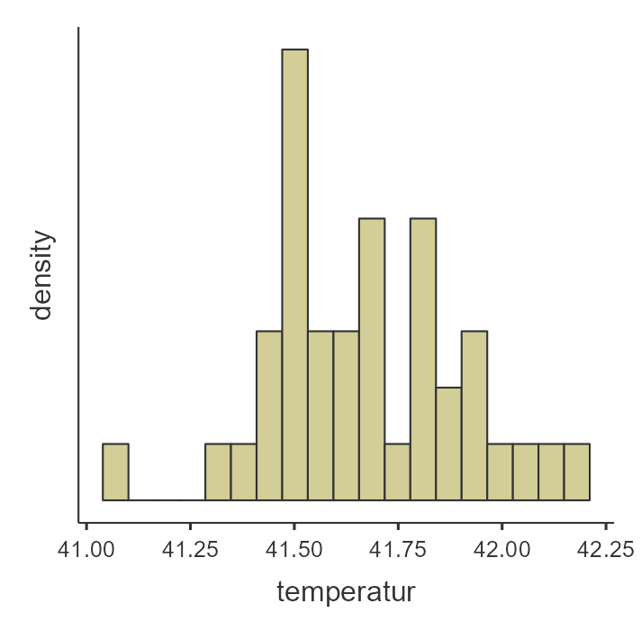

# Vorwort {-}

Dieses Buch ist im Rahmen meiner Lehrtätigkeit an der FHNW entstanden und frei verfügbar.

```{r eval=FALSE, include=FALSE}
bookdown::serve_book()
```

```{r include=FALSE}
# automatically create a bib database for R packages
library(tidyverse)
knitr::write_bib(c(
  .packages(), 'bookdown', 'knitr', 'rmarkdown', 'jmv'
), 'packages.bib')
```

<!--chapter:end:index.Rmd-->

# Einleitung

## Worum geht es?

## Inhaltlicher Aufbau

Dieses Buch umfasst die untenstehenden Inhalte. Die Inhalte wurden hier nach Zwecken sortiert angeordnet:

Stichprobe beschreiben (__deskriptive Statistik__):

-	Arithmetisches Mittel
-	Median
-	Quantile
-	Anteil
-	Odds Ratio
-	Relatives Risiko

Population beschreiben (__Wahrscheinlichkeitslehre__):

-	Zufallsvariable
-	Erwartungswert
-	Standardabweichung
-	Varianz
-	Wahrscheinlichkeitsdichte
-	Wahrscheinlichkeitsverteilung
-	Verteilungen

Populationsparameter aus Stichproben schätzen (__Konfidenzintervalle__ + Stichprobengrösse):

-	Mittelwert
-	Standardabweichung
-	Anteil
-	Berichten
-	Darstellen


Aussagen auf die Population aufgrund von Stichproben machen (Test-Theorie):

-	Effektstärke
-	Berichten
-	T-Test (1 Stichprobe)
-	T-Test (2 Stichproben), Welch-Test
-	Welch Test
-	U-Test
-	Korrelation absichern gegen 0
-	Vierfelder/Mehrfeldertest

Zusammenhänge beschreiben (Zusammenhangsmasse):

-	Pearsons r
-	Spearmans rho
-	Vierfelderkorrelation / Phi
-	Punktbiseriale Korrelation
-	Kontingenzkoeffizient
-	Cramérs V

Die Inhalte nach Zweck zu gruppieren ist eine Option, die andere ist die Verfahren der Skalierung der Variablen folgend aufzubauen. Bei dieser Gruppierung ist der Zweck nicht direkt ersichtlich, dafür ist einfacher zu begreiffen welches Verfahren für welche Ausgangslage geeignet ist. Diese Gruppierung wurde für die präsentation der Inhalte in diesem Buch gewählt.

## Wie soll ich dieses Buch lesen?

Dieses Buch enthält zu jedem Thema eine kurze Beschreibung der Theorie, Beispiele und Übungen. Das selbstständige Lösen der Übungen ist unerlässlich für das Verständnis und die emanzipation im korrekten Umgang mit Daten. Ohne Übungen fehlt die Auseinandersetzung mit dem Unterrichtsstoff und ohne diese fällt es den allermeisten schwer sogar einfachste Zusammenhänge zu begreiffen. Es wird deshalb empfohlen, dass die Übungen zum jeweiligen Thema zeitnah zur Theorie gelöst werden. Damit überprüft werden kann, ob die Übungen richtig gelöst wurden, ist zu jeder Übung eine kurze Lösung hinterlegt. Wer beim ersten selbstständigen Versuch der Übungslösung scheitert - was garantiert den meisten Lesenden hier ein oder mehrmals passieren wird -, kann die Übung mit Hilfe der Lösung lösen und zu einem späteren Zeitpunkt die Übung selbstständig nochmal machen ohne Lösung. Für die Statistik ist es also **nicht** genug den Stoff einmal auswendig zu lernen, übung ist unerlässlich.

## Formeln

Die Statistik bedient sich der universellen Sprache der Formeln. Es ist deshalb unerlässlich einige Formeln zu verstehen. Das Verständnis von Formeln ist für ungeübte Lesende verwirrend und schwierig. Deshalb wird dieses Verständnis in diesem Buch nach und nach aufgebaut. Dazu werden Teilformeln isoliert und erklärt und die Einflüsse der verschiedenen Kenngrössen in der Formel exploriert.

## Software

Für die Lösung der Übungen wird oft die freie Software Jamovi verwendet. Dem Leser wird deshalb empfohlen diese Software zu installieren. Für die Erstellung dieses Buches wurden ferner die folgenden Softwareprodukte verwendet:

- Jamovi software (Version 2.3.21.0)
- Jamovi R-package [@R-jmv]
- R [@R-base]
- Tidyverse [@tidyverse2019]
- Bookdown [@bookdown2016]


<!--chapter:end:src/01-einleitung.Rmd-->

# (PART) Eine intervallskaliertes Merkmal {-}

# Intervallskalierte Merkmale

## Was ist ein intervallskaliertes Merkmal?

Ein Merkmal ist dann intervallskaliert, wenn die einzelnen Beobachtungen in eine natürliche Reihenfolge gebracht werden können und zwischen dem tiefsten und höchsten möglichen Wert, alle erdenklichen Zwischenwerte möglich sind. 

Ein Beispiel für ein intervallskaliertes Merkmal ist die Körpertemperatur. Beobachtungen der Körpertemperatur einer lebenden Person sind Werte zwischen ungefähr 10°C und 42°C. Es ist möglich zu sagen, dass eine Person mit 40°C Körpertemperatur eine höhere Temperatur hat als eine mit 38°C Körpertemperatur. Ausserdem sind alle erdenklichen Zwischenwerte möglich, so auch dass bei einer Person eine Körpertemperatur von 37.821239°C gemessen wird. 

Ein weiteres Beispiel für ein intervallskaliertes Merkmal ist der Intelligenzquotient _IQ_. Der IQ bewegt sich normalerweise zwischen 50 und 150, eine Person mit einem IQ von 105 hat einen höheren IQ als eine Person mit einem IQ von 103. Ausserdem sind IQ-Werte von 103.12 oder 118.9182 durchaus möglich.

<details>
  <summary>Klicke hier, falls dir verhältnisskalierte Merkmale bekannt sind</summary>
    Die folgende Diskussion ist auch auf verhältnisskalierte Merkmale anwendbar. Letztere sind intervallskalierte Merkmale, welche einen absoluten Nullpunkt aufweisen.
</details> 


## Wie kann eine intervallskaliertes Merkmal beschrieben werden?

```{r, echo=FALSE}
set.seed(11242)
n <- 40
x <- round(rnorm(n, 41.1+(42.2-41.1)/2, (42.2-41.1)/4), 2)
tibble(temperatur = x) %>% 
  haven::write_sav('data/Enten_n40.sav')
```

Eine Veterinärin möchte herausfinden, welche Körpertemperatur Enten aufweisen. Dazu untersucht sie `r n` Enten und misst die Körpertemperaturen `r paste(x, collapse = ", ")`.

Für einen Menschen ist es ziemlich schwierig direkt aus der Sichtung dieser Zahlen zu begreifen, welche Körpertemperatur Enten haben. Ein Mensch kann sich jedoch helfen, indem er die Zahlen zusammenfasst.

### Verteilung

Um die Zahlen zusammenzufassen, kann die Veterinärin zum Beispiel Temperaturabschnitte von $0.2$°C betrachten und zählen wie viele Beobachtungen sie in den jeweiligen Abschnitten gemacht hat. Diese Zähldaten können tabellarisch oder grafisch mit einem Balkendiagramm dargestellt werden. Letzteres wird ein __Histogramm__ genannt.

```{r, echo = FALSE}
tibble(temperatur = x) %>% 
  ggplot()+
  geom_histogram(aes(x=temperatur, colour = 'blue'),
                 binwidth=0.2)+
  labs(title = "Histogramm Körpertemperatur Enten", y= "Häufigkeit", x = "Temperatur")+
  theme(legend.position = "none")+
  scale_y_continuous(breaks=c(0:17))

counts_x <- table(x)
mode_x <- counts_x[counts_x == max(counts_x)]
```

Aufgrund dieser Darstellung kann die Veterinärin nun sehen, wie häufig welche Körpertemperature sind. Dies wird die __Verteilung__ des Merkmals genannt. Sie bemerkt zum Beispiel, dass Beobachtungen der Körpertemperatur rund um 41.6°C am häufigsten sind und tiefere und höhere Temperaturen seltener vorkommen. Auf einen Blick sieht sie auch, dass die Temperatur aller Enten zwischen 41°C und 42.2°C war.

Die Verteilung eines Merkmals zu kennen ist hilfreich, jedoch in vielen Situationen (z. B. in der Kommunikation) noch zu komplex. Einfacher ist es die Komplexität einer Verteilung auf zwei Faktoren herunterzubrechen: Die Zentralität und die Variabilität einse Merkmals. 

### Zentralität

Mit der Zentralität ist ein Wert gemeint, welcher die zentrale Tendenz des Merkmals abbildet. Um die Zentralität zu messen gibt es drei Möglichkeiten:

- Der __Modus__ ist der am häufigsten vorkommende Wert. Im Beispiel ist das der Wert `r names(mode_x)`, welcher `r unname(mode_x)` mal und damit am häufigsten vorkommt.
- Wenn die Werte des Merkmals aufsteigend sortiert werden und der Wert betrachtet wird, welcher die Beobachtungen in eine tiefere und eine höhere Hälfte teilt, dann wird dieser Wert als __Median__ bezeichnet. Bei einer geraden Anzahl Beobachtungen, wird in der Regel der Durchschnittswert der beiden mittigsten Beobachtungen verwendet. Im Beispiel haben wir `r n` Beobachtugen. Der Median entspricht also dem Durchschnittswert zwischen dem 20. und dem 21. der aufsteigend sortierten Werte `r paste(sort(x), collapse = ", ")`, also `r median(x)`.
- Das __arithmetische Mittel__ bezeichnet, was gemeinhin mit Durchschnitt gemeint ist. Wenn wir die erste von insgesamt $n$ Beobachtung mit $x_1$ und die letzte Beobachtung mit $x_n$ bezeichnen, so ist das aritmethische Mittel
$$\bar{x} = \frac{1}{n}\sum^n_{i=1} x_i$$
Im Beispiel ist das arithmetische Mittel der Körpertemperaturen `r mean(x)`. 

:::: {.caution  data-latex=""}

::: {.remark}

_Erklärung der Formel_: Hier wird zum ersten Mal eine Formel verwendet. $\sum$ steht für die Summe von allen Beobachtungen $x_i$, wenn der Index $i$ in $1$-Schritten von der Zahl unter dem Summenzeichen $i=1$ bis zu der Zahl oben am Summenzeichen $i=n$ läuft. In unserem Beispiel ist $n=`r n`$, also ist $i = 1, 2, 3, 4, \ldots, `r n-1`, `r n`$. Der Teil $\sum^n_{i=1} x_i$ bedeutet also nichts anderes als $x_1 + x_2 + \ldots + x_{`r n-1`} + x_{`r n`}$, also die Summe aller Beobachtungen. $\frac{1}{n}$ bedeutet, dass wir diese Summe jetzt noch durch die Anzahl Beobachtungen teilen. 

_Welchen Einfluss haben die verschiedenen Einflussgrössen_: Dies wird in Übung \@ref(exr:theorie-mdn-mean) erklärt.
:::

::::

Jedes dieser Masse für die Zentralität hat Vor- und Nachteile und sie werden dementsprechend in unterschiedlichen Situationen eingesetzt, siehe Übungen.

### Variabilität


## Übungen

::: {.exercise  #enten-hist-mean-sd}
  (a) Versuch selbst ein Histogramm der Daten oben (*Enten_n40.sav*) mit Jamovi zu erstellen und begründe, weshalb es nicht gleich aussieht wie das Histogramm oben. 
  (b) Berechne zusätzlich das arithmetische Mittel und die Standardabweichung des Merkmals.
:::

:::{.solution}
  ```{r enten-hist-mean-sd, echo=FALSE, fig.cap="Links: Jamovi-Anleitung zur Erstellung des Histogramms; rechts: Histogramm der Temperatur.", fig.show="hold", out.width="50%"}
  knitr::include_graphics("figures/Enten_n40_instr_histogramm.jpg")
  
  ```
  (a) Das Histogramm, siehe Abbildung \@ref(fig:enten-hist-mean-sd) sieht nicht gleich aus, da Jamovi die Temperaturabschnitte kürzer gewählt hat nämlich bei 0.125°C statt 0.2°C wie oben im Text. In Jamovi gibt es aktuell keine Möglichkeit die Abschnittsweite anzupassen. Ein Histogramm sieht immer anders aus je nach ausgewählter Abschnittsweite. 
  
  (b) TODO
:::

::: {.exercise #theorie-mdn-mean}
  (a) TODO
  (b) TODO
:::


:::{.solution}
Text..
:::

<!--chapter:end:src/02-1-was_ist_eine_intervallskalierte_variable.Rmd-->

# Stichprobenziehung

## Was ist das Problem der Stichprobenziehung?

## Wie kann man Aussagen über die Grundgesamtheit machen?

## Übungen

<!--chapter:end:src/03-1-stichprobenziehung.Rmd-->

# Durchschnitt und Standardabweichung schätzen

## Wo liegt der Durchschnitt der Grundgesamtheit?

## Wo liegt der Durchschnitt der Standardabweichung?

## Übungen

<!--chapter:end:src/04-1-durchschnitt_und_standardabweichung_schätzen.Rmd-->

# Durchschnitt testen

## Entspricht der Durchschnitt der Grundgesamtheit einem gewissen Wert?

## Weicht der gefundene Durchschnitt stark vom hypothetischen Wert ab?

## Übungen

<!--chapter:end:src/05-1-durchschnitt_testen.Rmd-->

# (PART) Gruppenvergleich einer intervallskalierten Variable {-}

# Gruppenvergleich einer intervallskalierten Variable

## Zwei Gruppen vergleichen 

## Was ist das Problem der Stichprobenziehung?

## Wie kann man Aussagen über die Grundgesamtheit machen?

## Übungen

<!--chapter:end:src/06-2-gruppenvergleich_intervallskalierte_variablen.Rmd-->

# Welch-Test

## Zwei Gruppen vergleichen 

## Sind die Durchschnitte der beiden Gruppen in der Grundgesamtheit gleich?

## Wie stark unterscheiden sich die Durchschnitte?

## Übungen

<!--chapter:end:src/07-2-welch_test.Rmd-->

